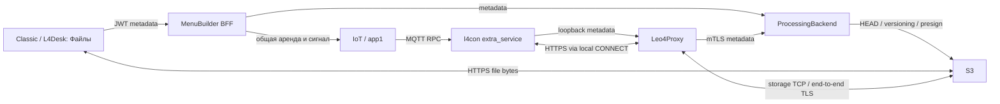

# FM: удалённые файлы Windows — архитектура и реализация

Обновлено: 2026-10-05. Статус: **серверная часть развёрнута в production; l4tools 1.12.1 подписан и опубликован, установка и живой FM terminal E2E не подтверждены**.
Пакет и контрольные суммы: [publication record](../artifacts/l4tools/1.12.1.json).
Фактические версии, проверки и ограничения: [production handoff](../.agent-context/tasks/active/2026-10-05-file-manager-production.md).
Исходная ветка etranprocessing: `feat/rpc7011-renewal`, baseline `d8719971fa143cd2e5b8a191adb43681a3f23aba`.
IoT сверён с `origin/master` (`8c2be80`); изменения изолированы в ветке `feature/file-manager`,
checkout `D:/work/iot.leo4.ru/iot-rpc-rest-app-fm`. Исходный dirty checkout не изменялся.

Документ заменяет ранний Proposed-план фактическим контрактом первой версии и планом выпуска.
Пользователь подтвердил `tools/l4con` и тип MQTT-клиента `extra_service`.

## 1. Инварианты и границы

1. FM занимает **ту же монопольную сессию IoT**, что console/stream/input/view.
   Исключение для одного пользователя или другой вкладки отсутствует. PB не создаёт отдельную аренду.
2. Начало, продление, остановка, listing, transfer и cancel идут к терминалу через MQTT/IoT.
   HTTPS-опрос результатов не заменяет сигнализацию.
3. Агент получает параметры и отправляет metadata/results по mTLS HTTPS **в PB**, не app1.
4. Содержимое ходит только **agent ↔ S3 ↔ browser**. PB/MB/IoT не принимают файл,
   не скачивают его для hash и не предоставляют relay/fallback, включая аварийные маршруты.
5. Ошибка управления, доставки или SHA-256 завершает операцию и сеанс.
   Повторение — явная новая попытка с нуля. Pause/resume/MPU отсутствуют.
6. Запись на терминале не заменяет существующий файл. Неизвестный результат commit
   сохраняется для сверки receipt; UI не объявляет его успехом или безопасным повторением.

Первая версия: listing разрешённого каталога, загрузка нового файла на терминал,
скачивание файла в браузер; один transfer на устройство, **0–64 МиБ**, single PUT.
Удаление, переименование существующих файлов, mkdir, большие файлы и сохранение download window
после окончания сеанса в эту версию не входят. Ранний план MPU/500 МиБ/SSE-C не является реализованным контрактом.

## 2. Владельцы и взаимодействие

| Стек | Реализованная ответственность |
|---|---|
| IoT Python | Единственный common lease registry: files scope, конфликты, revoke/drain, атомарное Redis renew, MQTT tasks |
| PB Python | Проверенная terminal identity, heartbeat/capabilities, operation state, grants, HEAD/checksum/version, commit fence и receipt reconciliation |
| Shared/Alembic | Только декларативные `fm_agents`/`fm_operations`; миграция `031 → 032` принадлежит PB |
| MB Python | JWT, tenant/device access, browser-view owner, metadata BFF, orchestration старта/отмены |
| React/TypeScript | Отдельный `/files` в обоих профилях, preflight, listing и одна операция, прямой S3 fetch, SHA-256 worker |
| Native C/Win32 | MQTT consumer, отдельный FM worker, WinHTTP, BCrypt SHA-256, paths/handles, watchdog, no-overwrite commit и receipt |

Платёжные endpoints PB не используются для FM. Новые маршруты имеют отдельные prefixes;
S3 SDK выполняет только control calls в threadpool, metadata timeout ограничен.
На терминале весь HTTP проходит через Leo4Proxy. S3 CONNECT разрешён только для host/port из
проверенной PB policy; TLS до S3 проверяется WinHTTP без terminal cert. Общий MQTT/RTP/FM deny
закрывает FM metadata route и active storage socket. Отсутствующий/устаревший endpoint запрещает FM.
Resource/latency влияние на payment должно быть измерено при canary, локальные тесты этого не доказывают.

## 3. Общая сессия и доставка

IoT `/api/internal/v1/file-manager` закрыт обязательным service key и actor headers
`X-Org-Id`, `X-User-Id`, `X-Session-Id`, `X-Role`.
`POST /devices/{device_id}/sessions` резервирует files lease на 60 секунд (допустимо 30–90),
**без** отправки start до регистрации metadata в PB. Затем MB вызывает
`POST /sessions/{lease_id}/signals` с `action=start`.

До активации UI ждёт authenticated agent ACK в PB. Продление каждые 15 секунд:
IoT touch → MQTT renew → PB ticket с новым случайным grant_id → агент применяет deadline →
PB active ACK именно этого grant_id. Нет ACK за ограниченное ожидание — весь сеанс прекращается.
Старая команда или ACK не продлевают новую generation. Операции привязаны к agent instance UUID
и cert serial; restart/смена сертификата отклоняют старые action tickets.

| RPC | Action | MQTT metadata |
|---|---|---|
| 7020 | list | session_id, operation_id, expires_at, ttl_sec |
| 7021 | transfer | то же; направление и путь агент получает из PB |
| 7022 | cancel | то же; отменяет операцию и всю files lease |
| 7023 | start / renew / stop | session_id, expires_at, ttl_sec; operation_id запрещён |

Используется существующая доставка task/response MQTT. Payload не содержит URL, пути, hash или bytes.
Результаты FS хранятся в PB; MQTT task result подтверждает обработку команды, а не целостность файла.
Существующая `extra_service` presence сохраняется: retained `dev/{SN}/svc = svc_online/svc_offline`,
Will задан до CONNECT, online после CONNACK, offline перед нормальным DISCONNECT.

Revoked/истёкшая files lease блокирует повторный acquire **до первоначального expires_at + 5 секунд**.
Это консервативное drain-окно, не обещание мгновенного release по stop ACK.
Redis touch проверяет active key и hash в одной WATCH transaction; старый cache не воскрешает files lease.
Generic remote-input endpoints не могут создать, upgrade или keepalive files lease.
Native проверяет deadline монотонными часами с запасом 2 секунды; MQTT loop вызывает watchdog
независимо от worker, disconnect/stop/cancel прерывают WinHTTP через CancelSynchronousIo.
Фактическую достаточность 5 секунд для всех поддержанных Windows необходимо подтвердить fault E2E.

## 4. Identity, preflight и API

PB agent prefix: `/api/file-manager/v1/agent`. Nginx требует клиентский TLS-сертификат,
перезаписывает identity headers, ограничивает metadata body 64 КиБ и исключает fallback в legacy.
PB проверяет leaf, подпись закреплённого CA, сроки, SN и текущий сохранённый serial;
`X-FM-Agent-Instance-Id` обязателен и соответствует hello/current instance.
Legacy cert без новой CA не включает FM. Service key не передаётся браузеру или агенту.

Agent hello каждые 15 секунд объявляет protocol_version=1, instance UUID, version,
filesystem_ready и capabilities `fs.session`, `fs.list`, `fs.read`, `fs.write`, `fs.cancel`.
Исправление suite1.12.1 требует также `fs.proxy`: агент1.11.1 использует исключительно локальный Leo4Proxy1.8.3+.
Агент проверяет ready/SN и `fm_transport` локального профиля до hello. Прежний прямой HTTP агент несовместим.
Readiness проверяет tenant, active terminal, cert, capabilities, heartbeat моложе 45 секунд,
настройки PB и текущую MQTT service availability в IoT. UI показывает причину отказа **до старта**.
Freshness UI рассчитывает длительность относительно server_time, а не синхронность часов браузера.
Конфигурационная readiness не доказывает доступность самого S3: фактический PUT/HEAD может завершиться отказом.

PB internal prefix `/api/internal/file-manager/v1` закрыт отдельным `X-File-Manager-Service-Key`;
публичный nginx его запрещает. MB public BFF prefix `/api/file-manager/v1` требует JWT,
tenant/device policy и UUID `X-FM-View-Id`. Actor session включает browser view,
поэтому соседняя вкладка не становится тем же владельцем. Viewer не управляет FM.
Classic использует свою existing device policy, без обязательного L4Desk enrollment;
L4Desk сохраняет собственную subscription/active-terminal policy.

Основные endpoints:

| PB agent | Назначение |
|---|---|
| POST /hello | heartbeat/capabilities |
| GET /operations/{id}/ticket | bounded FS parameters и remaining_sec, session grant_id |
| POST /operations/{id}/result | listing / ACK / terminal state |
| POST /operations/{id}/manifest | immutable size/hash для terminal→browser |
| POST /operations/{id}/source-complete | HEAD/checksum/version verification |
| GET /operations/{id}/download | version-pinned grant для browser→terminal |
| POST /operations/{id}/commit | разрешение только для verified upload, fence против отмены |
| POST /operations/{id}/reconcile | сверка receipt после expiry/restart; не возобновляет transfer |

Все FM router responses отмечены `Cache-Control: no-store`. URL выдаётся непосредственно участнику
через metadata response, в operation DB не хранится. Auth headers, URLs и содержимое не должны попадать в логи.

## 5. Целостность и состояния

| Направление | Последовательность |
|---|---|
| Browser → terminal | SHA-256 worker → immutable manifest → signed PUT в S3 → PB HEAD/checksum/VersionId → MQTT transfer → агент GET именно VersionId → size/hash/flush partial → PB commit permission → atomic no-overwrite rename → completed/receipt |
| Terminal → browser | MQTT transfer → locked source file → SHA-256 → manifest → signed PUT → PB HEAD/checksum/VersionId → verifying → browser GET именно VersionId → bounded size/hash check → PB received → локальная ссылка скачивания |

S3 bucket **обязательно versioned**. PUT подписан с ContentLength и ChecksumSHA256;
после HEAD PB сохраняет непустой VersionId, отличающийся от `null`. GET привязан к этой версии:
поздний PUT по ещё действующему URL не меняет проверяемый получателем объект.
ETag/пользовательская metadata не заменяют SHA-256. PB не вызывает GetObject и не читает Body.
Grants живут максимум 45 секунд и не дольше оставшегося lease с запасом 3 секунды.

Состояния PB: created/running/verifying/committing/completed/failed/cancelled;
active применяется к session, cancelling зарезервирован constraint.
Partial unique index не допускает второй незавершённый transfer на терминал.
При новой общей сессии старые некоммитящие операции завершаются ошибкой lease_expired;
`committing` сохраняется до reconciliation, блокируя новые transfer.

Cancel до commit переводит operation в cancelled; после commit permission сохраняет
неизвестный результат (`commit_outcome_unknown`) до receipt. Commit receipt содержит
operation UUID, size/hash, идентификатор файла/volume и итог; хранится с защищённой DACL.
Сверка проверяет file identity после rename. Она сообщает факт, не повторяет запись.
Browser received означает verified bytes в памяти браузера, **не** подтверждение сохранения файла ОС.
Браузер хранит максимум один файл 64 МиБ плюс chunk/hash overhead; native поток — 64 КиБ.

## 6. Windows safety и UI

Native разрешает только заранее настроенный локальный absolute drive root, совпадающий с PB roots.
UNC/device paths, ADS, dot segments, trailing dots/spaces, reparse/junction и alias запрещены.
Все ancestors открываются handles без FILE_SHARE_DELETE и проверяются по final canonical path;
source открыт без WRITE/DELETE sharing, reparse и hardlinks отклоняются.
Private/system/credential names скрыты/запрещены. Deny-list дополняет, но не заменяет allow-root.

Upload staging создаётся рядом с destination через CREATE_NEW, hidden, write-through,
DACL только SYSTEM/Administrators. После size/hash/flush агент получает PB commit permission и
делает SetFileInformationByHandle(FileRenameInfo, ReplaceIfExists=FALSE), удерживая ancestor handles.
Existing destination сохраняется при гонке. Штатный failure закрывает и удаляет partial.

В Classic и L4Desk есть отдельный пункт «Файлы»: выбор терминала, версия/готовность агента,
явное начало/завершение, объяснение монополии, разрешённые roots, путь, listing с paging,
upload/download и отмена. До ACK файловые действия закрыты. Во время операции выбор устройства
и параллельные действия заблокированы. Потеря управления завершает весь сеанс с понятным отказом.
Unmount/смена tenant отменяют запросы и отправляют stop; поздний ответ не меняет новую UI generation.

## 7. Настройки и обязательные условия включения

Серверные значения только из env/секрет-хранилища; defaults пустые. Не помещать реальные URLs/keys в tracked files.
На терминале адрес API определяется автоматически через локальный Leo4Proxy; установщик создаёт защищённый
`C:\l4tools\fm`. Ручная настройка FM при обычной установке не требуется.

| Компонент | Переменные |
|---|---|
| PB | FILE_MANAGER_SERVICE_KEY, FILE_MANAGER_IOT_URL/KEY, FILE_MANAGER_S3_ENDPOINT/REGION/BUCKET/ACCESS_KEY/SECRET_KEY, FILE_MANAGER_READ_ROOTS/WRITE_ROOTS (JSON lists) |
| MB | FILE_MANAGER_PB_URL, FILE_MANAGER_SERVICE_KEY; существующие IoT settings |
| l4con | L4FM_API_URL больше не используется; L4FM_ROOT — только необязательный admin override, default C:\l4tools\fm; --proxy-port из существующего профиля |
| IoT | Существующий mandatory internal service key и shared Redis lease registry |

Пустые настройки запрещают start. Только read roots допускают read-only UI;
запись разрешается лишь при соответствующем write root. Root должен быть специально выделен под FM,
не Windows/Crypto/credential directory. Runtime service identity должна иметь доступ к защищённому staging.

S3 gate: HTTPS, SigV4, exact signed checksum/length enforcement, zero-byte object,
Versioning Enabled, HEAD ChecksumMode, exact-version GET, CORS для разрешённых UI origins/headers,
TLS совместимый с целевыми Windows. Bucket policy закрывает public listing/access.
**Очистка S3 объектов пока зависит от настроенного lifecycle**, включая noncurrent versions под `fm/`:
собственного delete/retry worker в этой версии нет. Presigned PUT не мгновенно отзывается,
поздняя запись также должна удаляться lifecycle. Retention должен быть согласован до canary.

## 8. Пошаговый план реализации и выпуска по стекам

| Шаг | Стек и результат | Состояние / следующий критерий |
|---|---|---|
| F0 | Контракты, common lease, actor, MQTT codes, safe roots | Код producer/consumer сверён; зафиксировать release revisions и canary device/tenant |
| F1 | S3 integration | Код grants/HEAD/version реализован; проверить реальный provider, CORS, checksum, zero-byte, lifecycle |
| F2 | IoT | Files lease, Redis CAS/drain, MQTT dispatch реализованы; отдельный release, проверить старые console/video/input entrypoints в многопроцессном runtime |
| F3 | Shared/PB migration | Declarative models + additive 032 + snapshot/provenance; применить 031→032 на disposable PostgreSQL 18, затем штатным release flow |
| F4 | PB | mTLS hello/ticket, state, signed grants, integrity, commit/reconcile реализованы; nginx -t и живой mTLS ingress/tenant mismatch tests |
| F5 | Native | Worker/path safety/streaming/watchdog/receipt; x86+x64 собраны и локальные Win32 tests; подписать/упаковать существующим suite pipeline, тест Win7/POSReady и Win10/11 |
| F6 | MB backend | BFF, RBAC, view ownership, preflight, orchestration; quality/unit tests; совместимый schema consumer до migration и rollout на 032 |
| F7 | React | Standalone Classic/L4Desk UI, worker hash, direct S3, fail-fast; build/unit и mocked browser tests; живые transfer/error tests |
| F8 | Canary/ops | Реальный FM/console/video fault matrix, payment latency/resources, lifecycle и rollback evidence; ещё не выполнялось |

Порядок: provider gates → совместимые consumers/migration 032 при закрытом FM → IoT files conflicts →
PB ingress/control → MB → подписанный агент с roots → включение canary → F8 → постепенное расширение.
Проверить MB schema guard: текущий кандидат требует 032; запуск на 031 запрещён.
Старые consumers, принимающие только 031, требуют coordinated rollout/bridge до production migration.
Не публиковать native unsigned локальные build artifacts как release.

Rollback: закрыть новые starts настройками, MQTT stop/revoke, выдержать drain и reconcile.
Не откатывать IoT на версию без files conflicts, пока есть files leases.
Оставить additive schema и receipt endpoints, не удалять пользовательские terminal files автоматически.

## 9. Проверки и незакрытые gates

Локальные результаты и точные команды: [implementation handoff](../.agent-context/tasks/active/2026-10-05-file-manager-implementation.md).
Unit/mock browser/локальный Win32 результат не доказывает живой S3 или MQTT E2E.

| Fault gate | Ожидаемый результат |
|---|---|
| Same-owner FM + console/video/input, две вкладки/worker | Общий отказ busy, lease не превращается в другой scope |
| Broker disconnect, потеря start/renew/stop, PB 5xx, истёкший grant | Остановка всей операции, без автоматического restart; новый acquire только после drain |
| Wrong tenant/view/cert/instance, replay old task | Нет action ticket или доступа к operation |
| Corrupt body, wrong size/hash, unversioned provider, late PUT | Нет terminal commit/verified browser download; exact-version isolation |
| Junction/ADS/alias/hardlink, existing target race | Отказ, existing file без изменения |
| Crash до rename / после rename до ACK | Нет resume; protected receipt даёт достоверный outcome, неизвестное остаётся blocked |
| Browser close/reload/JWT expiry | UI abort/stop, watchdog ограничивает незавершённую работу |
| Payment traffic + FM | Не превышает согласованный latency/resource budget |

Provider probe проверил checksum rejection, zero-byte и pinned VersionId GET; versioning/CORS/lifecycle настроены.
Миграция 031→032 проверена на disposable PostgreSQL 18 и применена в production; nginx -t и ingress gates проверены.
Незакрытые условия: живой agent mTLS/MQTT transfer/error E2E, Win7/POSReady, подписанная distribution,
фактическое истечение lifecycle и нагрузка. Подробности и границы доказательств — в production handoff.
Crash до сохранения receipt может оставить staging partial; автоматическая безопасная уборка таких
orphans пока не реализована. Нельзя считать это завершённым crash-cleanup: до широкого выпуска нужен
отдельный reviewed cleanup или регламент уборки выделенного FM root. Неизвестный committing без
доказуемого receipt требует расследования, а не автоматического unlock/retry.

## 10. Источники и подтверждённый контекст

- [PB identity](../ProcessingBackend/backend/app/dependencies.py), [policy route](../ProcessingBackend/backend/app/routers/leo4proxy.py), [transport policy](../ProcessingBackend/backend/app/services/leo4proxy_policy.py), [terminal ingress](../ProcessingBackend/nginx-mutual-legacy/nginx-configs/legacy_ssl.conf) — действующие границы identity/ingress.
- [MB session policy](../MenuBuilder/backend/app/services/remote_session_policy.py), [IoT client](../MenuBuilder/backend/app/services/iot_client.py), [console UI](../MenuBuilder/frontend/src/routes/devices/DeviceConsoleTab.tsx) — выборочно проверенные места общего lease flow.
- [Общая монопольная сессия](etran_arch-remote-input-control.md), [console specification](ops_run-remote-console-diagnostics.md), [MQTT matrix](../.agent-context/contracts/mqtt-topic-matrix.md), [DB ownership](etran_data-database-ownership.md) — действующие контракты и границы.
- [Microsoft GetFinalPathNameByHandleW](https://learn.microsoft.com/en-us/windows/win32/api/fileapi/nf-fileapi-getfinalpathnamebyhandlew), [reparse points](https://learn.microsoft.com/en-us/windows/win32/fileio/reparse-points) — handle path resolution и перенаправления; не доказательство всей защиты от гонок.
- [Cloud.ru multipart API](https://cloud.ru/docs/s3e/ug/topics/api__methods-multipart) — Create/Upload/Complete/Abort/List документированы; checksum/limits требуют F1.
- [AWS presigned URLs](https://docs.aws.amazon.com/AmazonS3/latest/userguide/using-presigned-url.html), [multipart integrity](https://docs.aws.amazon.com/AmazonS3/latest/userguide/checking-object-integrity-upload.html) — модель угроз повторных URL и checksum semantics; не подтверждение cloud.ru runtime.

Внешние первичные источники просмотрены 2026-10-05. Runtime, app1/native source audit и E2E в этой документационной задаче не выполнялись.
