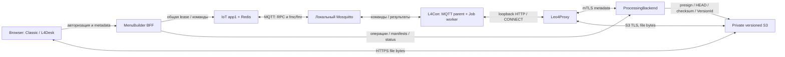

# L4FM: итоговая архитектура и развитие

Актуально на 2026-10-05. **FM v2 выпущен**, общий раздел «Файлы» доступен в
Classic/L4Desk. Suite **1.13.1** подписана, опубликована и установлена на 1000007
через l4mcp; L4Con **1.12.1**. Этот документ описывает итог реализации.
[Исходный v1-контракт](history/2026-10-05-file-manager-v1.md) сохранён как история;
[ревью](etran_arch-l4fm-review-and-improvement-plan.md) — исходные находки, а не список
всё ещё невыполненных работ. Детальные проверки: [handoff](../.agent-context/tasks/active/2026-10-05-l4fm-improvements.md).

## 1. Границы и инварианты

- FM монопольно занимает **общую IoT-сессию** с console/video/input/view.
  Один пользователь, соседняя вкладка и повторный acquire не дают исключения.
- Пограничные команды идут через MQTT. HTTPS agent metadata — только через
  **Leo4Proxy в PB**, не в app1. PB не дублирует владельца общей lease.
- Файловые байты: **browser ↔ S3 ↔ agent**. На терминале соединение с S3 тоже
  проходит через Leo4Proxy. Ни PB, ни MB, ни IoT не принимают/ретранслируют файл
  и не скачивают Body для проверки hash. Серверных резервных маршрутов нет.
- Поддерживается только **FM protocol v2**. Старые list/cancel/stop не используются
  как fallback. HTTP prefix `/v1` и имя очереди `fm_result_v1` не означают поддержку v1.
- При неопределённой доставке/целостности допускается отказ и завершение сеанса.
  Повторение — новая явная попытка; resume, pause, automatic transfer retry отсутствуют.
- Upload на терминал — только обычный, неповышенный desktop token, без перезаписи.
  Download может применить разрешённое политикой **read-only** служебное чтение.
- Одна передача на терминал, размер **0–64 МиБ**, single PUT. Delete/mkdir/rename
  существующих файлов, multipart и большие файлы в текущий выпуск не входят.

## 2. Владельцы и транспорт

| Компонент | Ответственность |
|---|---|
| IoT/app1 | Единственная lease/owner/scope, конфликты, revoke/drain; RPC start/renew/transfer; корреляция fmc/fmr через Redis между workers |
| PB | Terminal mTLS identity, agent hello/readiness, authoritative operation state, immutable manifests, grants/HEAD/version, commit fence и receipt reconciliation |
| Shared DB / Alembic | Декларативные `fm_agents`, `fm_operations`, ограничения/индексы; миграция 032 принадлежит PB |
| MB BFF | Пользовательская и tenant/device policy, UUID `X-FM-View-Id`, координация PB/IoT; metadata API без file relay |
| Frontend | Explorer, владение сеансом/отмена устаревших ответов, SHA-256 worker, прямой S3 fetch и локальное сохранение |
| L4Con | `extra_service` MQTT parent, отдельный FM worker, локальная policy/token/path enforcement, hash/commit/receipt |
| Leo4Proxy | Автообнаруживаемый endpoint PB, mTLS, разрешённый S3 CONNECT, общая policy-блокировка MQTT/RTP/FM |
| l4setup / l4superv | Согласованный контракт Mosquitto, безопасная миграция config/ACL, размещение/запуск компонентов suite |

Платёжные endpoints PB не используются. Это снижает связанность, но не доказывает
отсутствие ресурсного влияния FM на payment: нагрузочная изоляция требует измерений.

## 3. Readiness, идентичность и монопольный сеанс

PB hello объявляет version/instance UUID/protocol 2/capabilities каждые 15 с.
Readiness учитывает текущий cert serial, active terminal, tenant, heartbeat <45 с,
`filesystem_ready`, настройки PB и MQTT service availability. Обязательны
`fs.session`, `fs.list`, `fs.read`, `fs.write`, `fs.cancel`, `fs.proxy`,
`fs.mqtt_navigation`, `fs.write_user`, `fs.drives`.
Агент также проверяет SN/готовность локального Leo4Proxy и `fm_transport`.
Readiness позволяет отказать **до acquire**, но не гарантирует будущий PUT/GET
или доступ пользователя к каждому каталогу.

MB public `/api/file-manager/v1` требует пользовательскую авторизацию, device
policy и browser view UUID; соседняя вкладка — другой owner. Viewer не управляет FM.
Classic и L4Desk сохраняют свои правила доступа/enrollment/subscription.
PB agent `/api/file-manager/v1/agent` требует новой CA, SN/current serial и
`X-FM-Agent-Instance-Id`; смена cert или instance закрывает старые tickets.
Internal BFF/PB/IoT endpoints используют сервисную авторизацию и actor context,
которые не передаются браузеру или агенту как пользовательские credentials.

Start: IoT reserve files lease → PB session metadata → MQTT 7023/start → agent
PB ticket → применение локального deadline → PB ACK → UI active. Один лишь
HTTP 200 или MQTT PUBACK не равен активному FM. Типовая lease 60 с, серверный
диапазон 30–90 с. Каждые 15 с UI инициирует renew и проверяет применённый агентом
срок через PB status (окно UI-проверки ACK 6 с). Grant/instance/deadline и текущая
UI generation защищают от позднего ответа предыдущего сеанса.

Close/cancel: сначала закрывается право новых действий, затем подтверждается
остановка worker. Только подтверждённый stop позволяет раннее освобождение
files slot. Без ACK сохраняется безопасное ожидание исходного deadline +5 с;
при потерянном renew UI учитывает худшую возможную границу продлённой lease.
Новый acquire после revoke не должен «воскресить» старый owner. Redis CAS
защищает и active key, и lease hash; compare-delete не удаляет чужую новую lease.

## 4. Отдельный MQTT-канал и полный путь конфигурации

| Операция | Транспорт к терминалу | Подтверждение |
|---|---|---|
| start / renew | RPC 7023 по существующему tsk/req/rsp/res/cmt | PB ticket и применённый grant/deadline ACK |
| transfer | RPC 7021, operation UUID | PB operation state + checksum/version/commit, не один RES |
| list | `srv/{SN}/fmc`, `v=2`, action=list, command_id, lease_id, path, offset, expires_at | `dev/{SN}/fmr`: completed/failed, entries, has_more, error_code |
| stop / cancel session | `srv/{SN}/fmc`, action=stop | fmr только после фактического завершения дочернего процесса |
| presence | существующий `dev/{SN}/svc` | retained svc_online/svc_offline, LWT; отдельной FM presence нет |

RPC 7020, 7022 и action=stop в 7023 отклоняются. Console `out` сохранён для
консоли: монополия позволяла переиспользовать его, но отдельный канал изолирует
схемы, TTL, лимиты и обработку ошибок важного FM flow.

На fmc/fmr — no retain, QoS 1 на агенте/bridge; команды/ответы коррелированы UUID.
App1 публикует через `amq.topic` routing key `srv.<SN>.fmc`; ответная binding
`dev.*.fmr` ведёт в очередь `fm_result_v1`. Suffix/queue настраиваются в app1
`core/config.py`, topology — `core/topologys/declare.py`.
Pending SN+lease регистрируется в Redis **до publish**; первый валидный ответ
с `SET NX` побеждает, UUID/версия/SN/lease/размер проверяются. Чужие, поздние,
повторные и невалидные ответы не принимаются за результат новой команды.

Навигация реализована как **ограниченный HTTP request/reply BFF → IoT**, который
ждёт результат MQTT через Redis (опрос 100 мс, окно 7 с, Redis pending/guard 10 с).
Это не WebSocket и не очередь повторов. Максимум страницы — 64 entries / 24 КиБ;
частичные страницы не выдаются. List и stop имеют разные guards, поэтому
зависший listing не блокирует запрос остановки. Листинг не создаёт PB operation,
не запрашивает PB ticket на каждый переход; start/renew и передачи сохраняют PB.

Mosquitto **topic contract 3**, только явные маршруты своего SN:

| Направление bridge | Суффиксы, QoS 1 |
|---|---|
| `dev/{SN}/... out` | app, svc, evt, req, res, out, ctl, fmr |
| `srv/{SN}/... in` | tsk, rsp, eva, cmt, ctl, fmc |

Wildcard `dev/{SN}/# out 1` удалён. Известный старый wildcard принимается только
как вход мигратора; результат — 14 неперекрывающихся маршрутов. Unknown/foreign-SN
и remapping не превращаются в новые разрешения: миграция отказывает, сохраняя
исходник. Проверка активного config требует реальные routes, не комментарии.
Setup использует общий с supervisor генератор/валидатор и сохраняет существующие
terminal `mosquitto.conf`/`acl.conf` при staging. Ошибки migration/start/critical
health upgrade вызывают предусмотренный rollback; это не гарантия при любом power loss.

## 5. Агент, Windows-права и границы устойчивости

FM работает дочерним процессом `--fm-worker`, принадлежащим Windows Job L4Con.
MQTT parent обменивается ограниченными IPC-сообщениями; блокирующий filesystem/
WinHTTP в worker не должен удерживать основной MQTT loop. Stop завершает Job и
ждёт выход процесса; неудачный terminate/ожидание не возвращает ложный ACK и не
снимает локальную блокировку. Это существенно для всей suite: supervisor не
должен восстанавливать конфликтующий worker поверх незавершённого старого.

Агент фиксирует desktop session и authentication LUID. Используется обычный
пользовательский token, у elevated admin — допустимый limited token; разрешённый
SYSTEM/admin service token не подставляется для upload. Смена пользователя/сессии
или отсутствие допустимого token — отказ. Заблокированный desktop и отсутствие
user token не следует считать одним и тем же состоянием.

Navigation выполняется с пользовательскими правами. При download AccessDenied
и `privileged_read=true` возможен read-only SYSTEM fallback открытия файла/предков.
Он не меняет ACL исходника, не обходит sharing locks и не разрешает служебную запись.
Upload CREATE_NEW и commit выполняются под пользовательской impersonation.
Защищённый receipt журнал — отдельная служебная metadata, а не пользовательский upload.

При `FILE_MANAGER_LOCAL_DRIVES=true` агент сообщает локальные fixed/removable
диски. Это не доступ к любому пути Windows: остаются ACL, root policy, запреты
UNC/device/ADS/dot segments, reparse/junction, credential/private paths, aliases
и небезопасных hardlinks. Ancestor handles удерживаются с проверкой canonical
path. Download source открыт без WRITE/DELETE sharing; запись не подменяет уже
существующее назначение. Прежний безусловный допуск fm.root исправлен: действует
полученная policy. `C:\l4tools\fm` остаётся удобной папкой, а не единственным диском.

L4Con 1.12.1 сортирует **весь перечисленный каталог до pagination**: папки, затем
файлы, естественное сравнение имён Windows (`2` перед `10`), deterministic tie-break.
Лимит — 65 536 видимых entries (~39 МиБ структуры); превышение/ошибка выделения/
сканирования возвращает отказ, не частично отсортированный список. Каждый новый
запрос перечисляет каталог заново: snapshot между страницами не гарантирован.

## 6. Целостность, commit и локальное сохранение

| Направление | Доказуемая последовательность |
|---|---|
| Browser → terminal | SHA-256 worker → immutable manifest → S3 signed PUT → PB HEAD/checksum/VersionId → MQTT transfer → agent GET точной версии → size/hash/flush → PB commit fence → atomic no-overwrite rename → receipt/completed |
| Terminal → browser | source handle/hash → manifest → S3 PUT → PB HEAD/checksum/VersionId → browser GET точной версии → size/hash → PB received → локальное сохранение |

Versioning обязательно: GET закреплён за непустым конкретным `VersionId`, поэтому
повторный PUT по неистёкшему URL не подменяет уже проверенную версию. ETag и
пользовательская metadata не заменяют SHA-256. PUT ограничен signed checksum/
length; grant не дольше 45 с и оставшейся lease с запасом 3 с. Ответы no-store,
URL не хранится в operation DB. Browser→S3 не несёт portal auth/cookies;
agent→S3 не несёт terminal certificate. Все agent HTTP идут через Leo4Proxy;
CONNECT разрешён только к authority из verified policy. Общий MQTT/RTP/FM deny
блокирует FM metadata и закрывает активный storage tunnel. `L4FM_API_URL` не нужен.

PB состояния: created/running/verifying/committing/completed/failed/cancelled,
active для session; partial unique index исключает вторую незавершённую передачу.
После commit permission потеря ACK **не доказывает отсутствие файла**. Receipt
в защищённом `C:\l4tools\fm-state` сохраняет operation/hash/size/file identity;
reconciliation сообщает факт и не повторяет запись. Unknown commit удерживает
запрет новой передачи до сверки. Cleanup crash-orphan staging ещё требует доработки.
S3 cleanup зависит от provider lifecycle, включая noncurrent versions; отдельного
delete/retry worker нет, поздний PUT по живому grant тоже должен попасть под lifecycle.

«Скачать» открывает системный Save As непосредственно из пользовательского click,
до сетевых await. После выбора действует modal transfer; write/close выбранного
файла начинается только после проверки bytes. Missing API / SecurityError /
NotAllowedError / NotSupportedError дают обычное browser download. AbortError
считается отменой, включая отказ браузера от чувствительного target; fallback
при этом не запускается. Ошибка записи/close не переключает место сохранения.
PB received подтверждает **проверенные bytes у браузера**, а не запись ОС;
обычный browser download не даёт приложению подтверждения физического сохранения.

## 7. UI/UX и владение асинхронной работой

- Общая страница `/files` в Classic/L4Desk. Начальное выделение — **«Обзор парка»**,
  без автоматического acquire первого устройства. Обзор закрывает текущий сеанс
  и обновляет онлайн-парк, оставаясь первым узлом той же колонки.
- Слева только терминалы по номеру → диски. Выбор терминала открывает его roots;
  выбор диска — каталог. Переключение терминала ждёт закрытия/guard предыдущего.
- Справа папки/файлы: double click или Enter для папки, путь, назад/вперёд/вверх,
  refresh, upload/download. Отдельная кнопка «Открыть сеанс» не требуется.
- Upload после подтверждённого commit обновляет каталог автоматически; если
  обновление списка не удалось, UI сообщает, что файл записан, и не предлагает
  повторно загрузить его как будто первая попытка не состоялась.
- Передача/проверка/сохранение модальны: навигация недоступна до финала либо
  явного принятия сообщения о неопределённом результате. Начальный file picker
  не расходует 90-секундный transfer timeout; renew сеанса продолжается.
- Desktop-колонка устройств 232 px с gutter, готовность — компактный индикатор,
  адрес из terminal settings мелкой строкой с отступом/ellipsis/tooltip.
  Неготовность остаётся объяснимой. Таблица до 560 px; folder cursor — pointer.
- Один владелец teardown: cancel уже закрывает lease, второй stop не дублируется.
  AbortController, identity/generation guards и refs отсекают stale callbacks,
  unmount/смену tenant и параллельный renew. `beforeunload` не заменяет server TTL.

## 8. Найденные проблемы и принятые решения

| Наблюдение / риск | Решение и практическая граница |
|---|---|
| Первый start 503, затем «занят FM» | Устранён MB/PB row-lock cycle: NO KEY UPDATE admission вместо конфликта с FK KEY SHARE. Ошибка закрывает/revokes lease, UI показывает drain |
| Навигация через PB тяжела и приводит к неясному connection lost | fmc/fmr request/reply без per-list PB; доменная ошибка сохраняется вместо её замены общим сообщением |
| Неподтверждённый stop / acquire race | ACK только после worker exit; mandatory confirmed close; Redis WATCH active+lease, никакого same-owner reacquire |
| Заблокированный worker способен затронуть агент/suite | Отдельный process/Job, bounded IPC и принудительное завершение с проверкой выхода |
| Privilege mismatch и недоступная стартовая папка | Desktop-token write, policy-bound read fallback, roots/drives; setup настраивает доступ к стартовой fm-папке |
| Перекрытие Mosquitto wildcard и новых каналов | Явный contract 3, миграция/валидация и сохранение terminal config/ACL |
| Ручной L4FM_API_URL и обход proxy | Автоматический endpoint из Leo4Proxy, обязательный fs.proxy и единый policy deny |
| Неясный UI, случайный терминал, stale список | Fleet home, tree terminal→disk, Explorer справа, modal transfer и autorefresh |
| Нельзя обновить L4Con его же дочерним процессом | Независимая SYSTEM-задача запускает подписанный l4setup после проверки пакета |

## 9. Выпуск и уровень доказательств

| Контур | Фактическая версия / проверка |
|---|---|
| PB + MB backend | production revision `b8c609effd9c39ef3fa124b6a515a7c3a349f1b9`; schema 032; health verified |
| app1 | production revision `6209faf870d9d05028255c9e92f30017a33be781`; fmr binding, 2 consumers/0 backlog наблюдались при выпуске |
| Frontend | production revision `09b22e8bf867db1bf4bcbd70559b585d93dccfcb`; served FM chunk проверен после выпуска Save As/compact UI |
| tools | [1.13.1](../artifacts/l4tools/1.13.1.json), L4Con 1.12.1; 19 timestamped signatures, 128 embedded files; installed ready/0 на 1000007 |
| Серверные проверки реализации | PB 269 passed/1 skipped; MB итоговый rerun 707 passed/22 skipped; IoT Windows 545 passed/7 skipped; builder gates passed |
| UI/native | 88 frontend unit tests; browser fixtures Classic/L4Desk, picker/fallback/cancel; x86/x64 builds и native/setup regressions passed |
| Live FM на 1.13.0 | Start, C:/D:/G: roots, navigation/parent, upload/autorefresh, download SHA256, home/close/reopen, последующая console admission |
| Live upgrade 1.13.1 | l4mcp → S3/proxy → signed installer → SYSTEM task; versions/services/config/fresh PB hello verified; desktop locked, interactive sorting/Save As повторно не проверены |

Это evidence конкретных запусков, не полный fault/soak/security acceptance.
Отдельные промежуточные тесты падали (MB WS timing, Edge newContext, fixture
window.closed); причины и успешные повторные проверки сохранены в handoff.
Новый docs commit на main/master **не меняет** revision уже работающего контейнера.

[Повторяемое обновление suite через l4mcp](ops_run-l4tools-update-via-l4mcp.md)
содержит точный промпт, grant/подпись, отдельную задачу, reconcile и cleanup.
Подпись/публикация/установка — разные этапы; опубликованный semver неизменяем.

## 10. Краткий план развития

| Приоритет / владелец | Следующий результат | Критерий приёмки |
|---|---|---|
| P0 — native + PB | Crash staging cleanup и полный unknown-commit recovery | Разрывы до/после flush/rename/receipt, kill/restart/power-loss fixtures; нет повторной записи или ложного успеха |
| P0 — IoT + native + QA | Сквозная fault/soak matrix | Lost/duplicate/late ACK, broker/Redis reconnect, process restart, policy deny mid-transfer, lease conflicts; измеренные сроки освобождения и стабильность suite |
| P0 — Windows + UI | Матрица пользовательских прав | Standard/admin-limited, locked/logoff/switch-user, removable/offline drives, protected read; доказать отсутствие privileged upload и показать точную причину отказа |
| P1 — PB + operations | Управляемая уборка S3 и наблюдаемость | Lifecycle/version retention проверены; orphan-age metrics, latency/error/lease-drain correlation без grants/secrets; при необходимости отдельный delete worker |
| P1 — native + frontend | Большие каталоги и UX | Live приёмка сортировки/Save As; snapshot/cursor вместо изменчивого offset, bounded enumeration; доступные ошибки, режим privileged read в UI |
| P1 — frontend + MB + IoT | Снижение стоимости status/ожидания | Сначала latency/load measurements; затем при необходимости push/WS и pooling, сохраняя TTL, owner и ACK semantics |
| P2 — отдельное согласование | Новые операции/большие файлы | Threat model и протокол для mkdir/delete/rename/multipart; не вводить серверный relay или незаметный resume |

## 11. Навигация по исходникам и истории

- PB: `ProcessingBackend/backend/app/services/file_manager*.py`, schemas/routes,
  `shared/etranprocessing_db/file_manager.py`, Alembic 032.
- MB: `MenuBuilder/backend/app` FM BFF и `services/iot_client.py`;
  `MenuBuilder/frontend/src/routes/files/`, `src/api/fileManager.ts`.
- Native: `tools/l4con/src/file_manager.c`, `fm_process.c`, `mqtt_client.c`;
  `tools/leo4proxy/src/fm_connect.h`, policy; setup/supervisor Mosquitto contract.
- app1 (смежный репозиторий): `app-service/core/file_manager_navigation.py`,
  remote-input lease registry, FM internal router, config/topology/subscriber.
- [Краткий контракт](../.agent-context/contracts/file-manager.md),
  [MQTT matrix](../.agent-context/contracts/mqtt-topic-matrix.md),
  [review findings](etran_arch-l4fm-review-and-improvement-plan.md),
  [implementation/release evidence](../.agent-context/tasks/active/2026-10-05-l4fm-improvements.md).

При финализации документации новых terminal/broker/server probes и деплоя не было.
План выше не объявлен реализованным; синхронизация Git не заменяет runtime validation.
