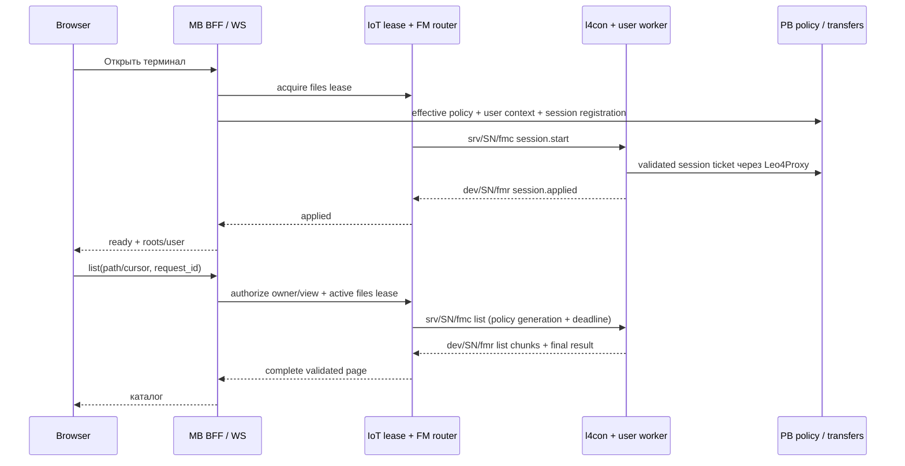
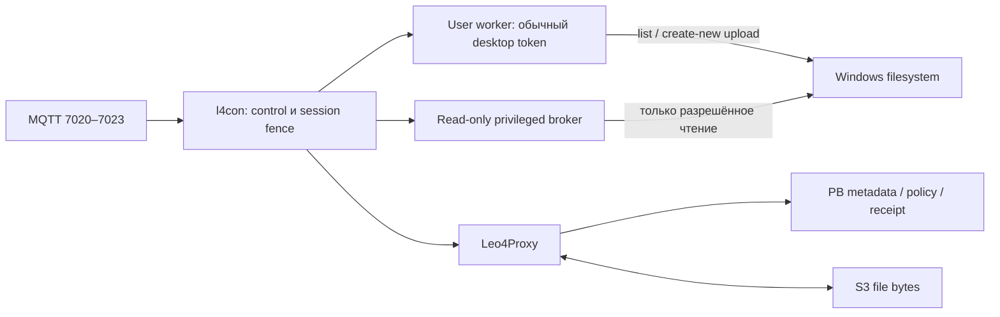

# L4FM: сквозное ревью и план улучшения

Дата исходного ревью: 2026-10-05. **Исторический аудит до реализации v2**.
Большая часть предложенных ниже изменений уже выпущена; формулировки findings
сохранены для трассировки решений. Текущий статус, закрытые проблемы, ограничения
и оставшийся roadmap — в [итоговой архитектуре](etran_arch-file-manager-remote-windows.md).
Не использовать этот исторический список как текущий release gate.

## 1. Вывод и актуальные требования

Разделение ответственности сохранять: IoT/app1 владеет общей монопольной арендой и MQTT-командами,
PB — авторитетными metadata, разрешениями и результатами; MB — пользовательской авторизацией и UI.
На терминале HTTP проходит через Leo4Proxy. Файловые байты — только browser ↔ S3 ↔ agent,
без PB/MB/IoT relay или резервных серверных маршрутов.

Транспортный фундамент выбран правильно, но управление завершением, диагностика ошибок,
изоляция файлового worker и пользовательская модель доступа требуют доработки до расширения FM.
Работающая передача маленького файла не подтверждает устойчивость при зависшем диске, смене
Windows-сессии, потере renew, аварии процесса или полном каталоге.

Уточнения пользователя в этом ревью:

1. Начальный экран — explorer-style список **онлайн-терминалов по номеру**, без случайного выбора SN.
2. Открытие терминала должно сразу показывать файловую навигацию; отдельная кнопка «Открыть» после старта не нужна.
3. После загрузки файл появляется автоматически; нужны дерево, диски, папки и привычная навигация.
4. Навигация/обычная работа соответствует пользователю Windows desktop, а не сервисному SYSTEM.
5. **Upload на терминал — исключительно с обычными, неповышенными правами пользователя desktop.**
6. Download адаптивен: обычное чтение, при отказе — разрешённое политикой служебное чтение SYSTEM/admin.
   Это не разрешение на служебную запись, смену ACL исходника или снятие блокировки другого приложения.
7. Неопределённость доставки/целостности по-прежнему завершает операцию и сеанс; повтор только вручную с нуля.
8. Пользователь предложил MQTT для navigation/list вместо тяжёлого PB HTTPS и разрешил как
   переиспользование console out, так и отдельные FM topics. Рекомендуемый вариант — отдельный
   versioned FM канал; сравнение и переход описаны в §5.1–5.3.

## 2. Intake и границы доказательств

- Тип: cross-stack audit, live UI reproduction, план; production-код и настройки не менялись.
- Область: MB frontend/backend, PB, shared FM models, app1, l4con, Leo4Proxy, l4setup, l4superv;
  выборочно существующие remote-input/console механизмы для сравнения.
- Владелец lease: app1; owner/view: MB; operation/grants: PB; миграции: PB; локальные handles/token: native worker.
- Producer → consumer: browser → MB → app1 → MQTT RPC → l4con; l4con → Leo4Proxy → PB;
  transfer через S3 в обе стороны.
- Инварианты: общий files/console/video/input/view slot, tenant/view/cert/instance binding,
  MQTT extra_service, HTTPS через proxy, S3-only bytes, no-overwrite, bounded fail-closed.
- Минимальный контекст: repo-intake-and-routing, cross-stack-contract-audit,
  performance-and-resilience-risk-analysis, file-manager/lease contracts, исходники из §11.
- Валидация: read-only production metadata/logs, Playwright CLI с разрешённым тестовым аккаунтом,
  терминал 1000007; исторические записи 773. Отказоустойчивость production авариями не испытывалась.
- MCP Ops отсутствует: `[MCP Ops Readiness: UNAVAILABLE]`; использован SSH.
  Preflight: доступная RAM 2069 MiB, диск 49%, load 0.27; это разовый снимок, не нагрузочный тест.
- Локальный etranprocessing: `93a07fba56a205be76e4d9836fd8e8634ef6af39`.
- IoT checkout: `D:/work/iot.leo4.ru/iot-rpc-rest-app-fm`, `c4293c99ea15c7e51910652c547ba52b1a259fec`.
  Проверенные FM/lease/task/remote-input файлы не отличаются от принятого production
  `f4cd4128e4f0caa33788918692f97603c6061687` (`git diff` пуст).
- Подтверждены running images: MB `99b88b0f…`, PB `3a747c4b…`, app1 `1547da7c…`;
  полный inventory остаётся в [production handoff](../.agent-context/tasks/active/2026-10-05-file-manager-production.md)
  и [start correction](../.agent-context/tasks/active/2026-10-05-fm-start-lock.md).
- Unit/quality/build не запускались: задача изменяет только документацию; предыдущие зелёные suite не выдаются за проверки этого ревью.

## 3. Подтверждённые наблюдения

### 3.1. «Связь потеряна» после перехода вверх — неверная классификация отказа

773, 17:32:33–17:32:35 UTC: операция `00224f26-0e67-4dca-94b5-2823d8ef850f`
запросила `C:\l4tools`, получила `failed / fm_control_or_path_failed`.
Агент допускает только `C:\l4tools\fm` и вложенные каталоги.
Cancel прошёл 200, отозвал lease; следующий stop получил 409 при проверке уже отозванной lease.
UI заменил исходную ошибку текстом о потере связи и неизвестной записи, хотя выполнялся list.

1000007, 17:58:24–17:58:29 UTC: воспроизведено через реальный UI.
Start → active, list корня → completed, запрос родителя → failed,
cancel 200 → stop 409 → тот же текст. Lease `f2fc1956-3069-4866-8cba-d561b894d9b1`,
ошибочная list `f5e16448-a38b-45ba-879a-778ca5543fcf`.
Это подтверждённая цепочка ошибки приложения, а не свидетельство обрыва MQTT.
Двойное отображение сообщения из пользовательского наблюдения отдельно не воспроизведено.

### 3.2. UX после старта и upload

На 1000007 start показывает активную сессию, но каталог не запрашивает; пустая таблица выглядит
как пустой каталог, upload отключён до «Открыть». Номер вторичен по отношению к SN.
После успешной загрузки 48-байтового тестового файла UI показывает «Файл проверен и передан»,
но сохраняет «Нет данных». После ручного «Открыть» файл появляется.
Download этого файла прошёл; SHA-256 исходника и сохранённого результата совпал:
`af7607fb1d1f736d33d0724d9062c95aed6004f4f681328f576544ead0933a23`.

### 3.3. Есть отдельный недиагностируемый отказ upload

Первая попытка на 1000007, 17:56:39–17:56:44 UTC,
`386e50ac-9021-4693-83ff-5cc6e3378c6a`: browser PUT/HEAD verification прошли,
agent ticket и download-grant вернули 200, запрос commit не поступил,
agent result — `fm_control_or_path_failed`. Следующая ручная попытка того же тестового файла
после новой сессии завершилась успешно. Поэтому нельзя объявлять причиной ACL или постоянную
неработоспособность CONNECT. Область отказа: native S3 GET / write / hash / flush / receipt до commit.
Текущий агент не возвращает этап, HTTP status или Win32 error — корневая причина первой попытки остаётся открытой.

Дополнительный read-only probe через обычную консоль и **локальный Leo4Proxy** получил HTTP400
на неподписанный HEAD корня S3. Это подтверждает достижимость HTTP endpoint через proxy в момент probe,
но не корректность signed GET и не SLA транспорта. Прямой обход proxy не использовался.

### 3.4. Монополия и соседние сервисы

В 17:59:16 UTC console на 1000007 отказала в аренде во время FM drain;
в 17:59:39 после интервала подключилась. Read-only команда завершилась exit0.
Windows 10 build 18363; разовый снимок working set: l4con 10.5 MiB, Leo4Proxy 13 MiB,
l4superv 8.8 MiB, Mosquitto 4.8 MiB. Это подтверждает живость после FM-отказа,
но не отсутствие утечек, зависаний или влияния на платёжную задержку.

## 4. Результаты ревью по приоритету

P0 — опасная гонка полномочий/жизненного цикла; P1 — существенный отказ или блокирование suite;
P2 — usability/наблюдаемость/масштабирование. «Код» не означает воспроизведение в runtime.

| ID | Приоритет / evidence | Проблема и условие | Исправление / проверка |
|---|---|---|---|
| R01 | P1, runtime + код | `TenantFiles.end`: cancel уже закрывает всю lease, затем stop закономерно получает 409; любой отказ stop называется потерей связи и затирает первопричину | Один идемпотентный close с optional operation_id; повтор close возвращает прежнее состояние/drain. Отдельно primary error и cleanup outcome; list не сообщает неизвестную запись |
| R02 | P0, код | Redis `acquire` того же owner/session WATCH-ит active key, но не hash. FM revoke меняет hash и сохраняет active key. Acquire может записать старый `revoked_reason=''` поверх revoke | CAS/Lua на обоих ключах для всех мутаций; повтор acquire files не должен неявно продлевать lease. Двухклиентный race-test с барьерами |
| R03 | P1, код | `fm_shutdown` ждёт worker `INFINITE` до штатного 15s бюджета console worker. FM-зависание способно удержать весь l4con в STOP_PENDING; l4superv проверяет SCM running, а не прогресс FM | Ограниченный shutdown и отдельный файловый процесс в Job; завершать только этот процесс, не MQTT/console. Worker liveness и circuit breaker; fault I/O test |
| R04 | P1, код | Hello, reconcile и FS работают в одном worker. Reconcile до 64 receipts × HTTP; list не обслуживает pending renew; pending slot всего один | Приоритетный control scheduler, независимый heartbeat, bounded reconciliation вне критического пути; коалесцирование renew; операции в отдельном worker |
| R05 | P1, runtime + код | l4setup ставит protected SYSTEM/BA ACL каталогу; upload создаёт hidden SYSTEM/BA partial и переименовывает без нормализации ACL/атрибутов | Обычный desktop token для upload; пользовательский destination и наследуемый ACL финального файла; protected receipt хранить отдельно. Старый root мигрировать адресно, не открывать весь tools |
| R06 | P1, код | `services_ensure_all_registered` прекращает регистрацию **всего suite**, если не удалось подготовить необязательный FM root. Repair повторно принуждает его ACL | Ошибка FM отключает FM с диагностикой; proxy/MQTT/console продолжают установку/repair. Проверить root absent/readonly/reparse и нестандартный installation dir |
| R07 | P1, код | Stop/cancel отвечает `fm_stop_requested` после сброса lease/CancelSynchronousIo, не после завершения всех I/O. Нет доказанного верхнего предела остановки дискового вызова; 5s drain пока предположение | Разделить stop_requested и worker_stopped; удерживать slot по безопасному барьеру, не по PUBACK. Cancellable async HTTP, bounded Job shutdown, terminal fencing generation |
| R08 | P1, код | PB commit permission → rename → receipt имеет crash-окна. При crash до rename outcome=0 и target отсутствует; reconcile такой receipt не разрешает, committing может блокировать transfer бессрочно | Durable intent/outcome journal, сверка source/target identity и partial; доказуемое not_applied отдельно от unknown. Без автоматического повторения записи или произвольного unlock |
| R09 | P1, код | Сессия/операция не связана с Windows desktop session/SID. Права SYSTEM у текущего FS worker не соответствуют новым требованиям; старый `sp_select_target_token` даже при best-effort пытается elevated linked token | Явный non-elevated user token policy; SID/logon/session generation в grants. Не использовать helper l4desk выбора elevated token без адаптации |
| R10 | P1, runtime + код | `fm_control_or_path_failed` объединяет отказ пути, TLS, hash, disk и receipt; MQTT RES также общий `fm_failed` | Типизированные phase/code/os_error/http_status + correlation IDs; не логировать URL grants, auth или содержимое. Закрыть первый отказ 48-byte upload отдельным canary |
| R11 | P2, runtime + код | Случайный первый terminal, SN-first label, пустой каталог после старта, ручное обновление после upload, нет Up/Back/Forward/breadcrumbs | Explorer workflow из §8, переиспользовать online-first terminal list и presentation helpers |
| R12 | P2, код | Две пагинации: agent page64, Ant Table page50; нет сортировки/снимка каталога, offset может пропускать/дублировать при изменениях | Один cursor/snapshot paging contract, явный truncate/limit, folders-first стабильная сортировка; 0/64/65/128+ entries и mutation tests |
| R13 | P1 при нагрузке, код | `owned_operation` берёт FOR UPDATE даже для status, удерживает его через IoT HTTP до5s; MB дублирует lease GET; на каждый hop новый AsyncClient | Read-only status без row lock; короткие conditional updates; pooled clients; единая owner/device проверка. Не возвращать исправленный FOR UPDATE terminal lock |
| R14 | P2, код | Readiness «ready» не учитывает console/transfer busy, конкретный effective root, desktop user, реальные S3 reachability/permissions | Разделить compatible/transport_ready/session_busy/read_available/write_available, причины и freshness; дешёвый batch snapshot, authoritative recheck при start |
| R15 | P2, код | PB session остаётся `active` после закрытия; expires_at строки не отражает renew, ACK лежит в data; после lease expiry пользователь не может запросить исход операции | Отдельные session lifecycle/outcome, tenant/owner-bound read-only history после close; unknown commit остаётся отдельным outcome |
| R16 | P1, код | Renew in-flight может после локального stop вновь записать lease/deadline до отказа PB ACK; pending control не имеет cancel generation. `fm_expires_at` разобран, но execute использует свежий PB ticket | Монотонный local generation/fence до/после каждого ожидания; стоп имеет приоритет, поздние start/renew не оживляют worker; bounded deadline от времени начала ticket |
| R17 | P2, код | S3 single PUT/GET ограничен45s и TCP tunnel45s; заявленные64MiB ненадёжны на медленной линии. UI общий90s не согласован с обеими фазами и hash | Явный byte/time budget, admission по возможностям; точная причина timeout. Не добавлять relay или автоматический resume |
| R18 | P1 для нового MQTT flow, код | Console OUT ориентирован на volatile text: bridge special out0, q_out non-durable, schema extra=ignore, local unbounded Queue/seen_seqs. Нельзя выдать этот тракт за готовую надёжную доставку directory pages | Отдельный FM schema/queue/dispatcher, bounded chunks, полный ответ до публикации в UI, cross-worker routing, TTL и failure policy |
| R19 | P1 для миграции, runtime + код | l4setup сохраняет старый mosquitto.conf; l4superv проверяет только bridge/SN. Native log «Subscribed» не означает SUBACK; исходящие QoS1 PUBACK не отслеживаются | Config contract revision + semantic route validation; SUBACK/PUBACK budget; ready только после всех обязательных подтверждений |

### R02: точное допустимое чередование

1. A: повторный acquire files той же browser view читает active lease с `revoked_reason=None`; WATCH только active key.
2. B: revoke HSET-ит hash `revoked_reason=fm_user_closed`; active key files не удаляется.
3. A: EXEC успешен: watched key не изменился; HSET всего `_lease_to_dict(existing)` возвращает пустой revoked_reason.
4. Сессия снова active. Исправленный `touch` WATCH-ит hash и защищён от этой последовательности;
   переносить его гарантию на все acquire/revoke нельзя. Существующий тест проверяет revoke → acquire последовательно, не это пересечение.

### Ограничения надёжности commit

Receipt не должен доказывать нынешнюю неизменность файла одним file ID: после rename файл может
быть изменён другим процессом. Нужно различать «атомарная публикация была выполнена» и «текущий файл имеет прежний hash».
Crash-cleanup partial до receipt не реализован. Запретить бесконечное накопление, но удалять только
доказанно принадлежащие FM staging artifacts по journal/identity, не по одному wildcard имени.

## 5. Сигнализация и сравнение с существующими средствами

| Направление / владелец | Канал / schema | QoS / retain | Duplicate / ACK | Timeout / замечание |
|---|---|---|---|---|
| UI → MB → IoT | sessions/signals; view UUID, actor, lease UUID | HTTPS, N/A | POST signals создаёт новый task; semantic idempotency key отсутствует | UI10s, MB upstream8s; start включает несколько последовательных hops |
| IoT → l4con | `srv/{SN}/tsk` → `dev/{SN}/req` → `srv/{SN}/rsp`; 7020–7023, singleton dt | TSK/RSP QoS1, no retain; REQ фактически QoS0 | task UUID/correlationData; recent cache64 у агента | task ttl=1 **минута**, payload ttl_sec30–90; это разные таймеры |
| l4con → IoT | `dev/{SN}/res`; task UUID/result_uid/status_code | QoS1, no retain | прикладной результат команды; сервер CMT, но l4con подписан только tsk/rsp | Отрицательный RES не превращается непосредственно в UI FM status |
| l4con → PB через Leo4Proxy | ticket / result, protocol1, instance/cert binding, grant_id | HTTPS mTLS на proxy | active ACK привязан к ticket grant_id; lease authority остаётся IoT | WinHTTP phase2s, nominal metadata5s; PB IoT timeout5s |
| UI → MB → PB | status poll | HTTPS, no-store | PB operation state; повторное чтение | list/transfer polling700ms, renew500ms в течение6s |
| l4con → PB | hello каждые15s, fs.* | HTTPS | instance heartbeat, не terminal applied ACK | freshness45s; worker starvation влияет на доступность |
| browser ↔ S3 ↔ agent | signed PUT / version-pinned GET, checksum/size | HTTPS; bytes вне серверов | SHA256 + HEAD + VersionId + receiver receipt | grant≤45s; native CONNECT один,45s/70MiB wire на направление |

**Что стоит сохранить:** действующие task RPC и топики; extra_service presence; общий lease registry;
PB ticket/instance/cert fences; независимый от terminal wall clock monotonic watchdog;
проверку SHA256/VersionId, single transfer index, no-overwrite rename, policy-bound CONNECT.

**Где есть функциональное отставание от уже доступных средств:**

- app1 remote-input уже имеет pending command registry, `wait_ack`, `terminal_applied/nack/timeout`,
  correlation и audit. FM возвращает command_id, но MB/UI его фактически не используют;
  результат ищется в PB polling, а immediate MQTT NACK способен остаться лишь в task history.
- MB video имеет `SessionLifecycleCoordinator` с generation и единым teardown. FM заново реализует
  похожую логику в компоненте и допускает двойной close. Переиспользовать lifecycle primitives,
  **не** переносить video auto-recovery/три retries в fail-fast FM.
- Suite умеет запускать ограниченный session process в Job, валидировать SID/session, проверять
  выход процесса. FM встроен в l4con и не использует эту изоляцию; выбор token в существующем helper
  ориентирован на elevated input и требует отдельного non-elevated режима.
- Terminal UI уже имеет online-first таблицу, номера, фильтры и статусы; FM подменяет её простым select.

Сам выбор MQTT task RPC **не является деградацией**, но для интерактивной навигации текущая цепочка
дороже необходимого. Не смешивать FM с `ctl`/l4desk/svc_desk. С учётом последнего требования пользователя
целевой вариант — отдельная пара FM topics с общими pending/ACK/lease primitives (§5.1).
FM v1 выведен из целевого контракта по решению пользователя: старый агент incompatible до acquire.
7021 (transfer) и 7023 (start/renew) сохраняются; listing и подтверждённый stop идут только fmc/fmr.
PB остаётся авторитетом verified/committed transfer результата; MQTT событие не заменяет доказательство целостности.

Close должен принимать уже revoked lease **того же owner**, возвращать drained/closing и deadline,
а не обходить проверку ownership. Только доказанный worker_stopped позволяет рассматривать сокращение
ожидания; текущий `fm_stop_requested` для этого недостаточен. На первом исправлении оставить безопасный drain.

### 5.1. Варианты вывода каталогов

| Вариант | Что выигрываем | Цена / ограничение | Решение |
|---|---|---|---|
| Сохранить PB ticket/result + UI polling | Минимум protocol delta, persisted metadata | HTTP round trips, DB rows/locks на navigation, polling latency и трудно читаемые ошибки | Исключено: поддержка FM v1 не требуется |
| FM envelope поверх `dev/{SN}/out` | Уже есть SN routing и путь до app1; монополия исключает штатную одновременную console/FM работу одного устройства | Нужны demux до console parser, новая bounded assembly, routing между workers, аудит bridge QoS. Console logs других устройств всё равно разделяют очередь. Late frames прежней сессии остаются возможны | Допустимо, но экономия лишь на названии топика/части plumbing |
| `srv/{SN}/fmc` + `dev/{SN}/fmr` | Независимая schema, TTL/limits/metrics/queue priority; не затрагивает console output parser; легче изолировать flow | Новые bindings/ACL/subscriptions, capability negotiation, server-first release | **Рекомендуется для целевой версии FM** |

Пользователь выбрал отдельный канал. Names соответствуют правилам IoT: три уровня,
трёхсимвольные prefix/suffix, SN из identity: **fmc = file-manager command**, **fmr = file-manager response**.
AMQP routing keys: `srv.{SN}.fmc`, `dev.{SN}.fmr`. Двухсимвольный вариант `fm` исключён после сверки
`docs/mqtt_topic_rules.md`. Перед реализацией зарегистрировать расширение topic matrix, ACL и
канонической FM спецификации. Дополнительный MQTT client/presence не нужен — l4con остаётся extra_service.

Проверка OUT consumer: `core/diagnostics/mqtt_bridge.py` декодирует только DeviceOutputEnvelope
и вызывает `sessions.route_output`; неизвестную сессию отбрасывает. Active silencing, заявленный
в описании console, в этой прочитанной цепочке кода не найден — не выдавать его за runtime факт.
`DeviceOutputEnvelope.extra=ignore` может молча потерять новые FM поля при неверном включении в старый тракт.
`RedisDiagnosticsSessionRegistry` восстанавливает metadata сессии, но создаёт новую **локальную** Queue;
это не cross-worker delivery к WebSocket. Прямое копирование этого механизма в FM неприемлемо.

`tools/l4superv/src/mosquitto_conf.c` генерирует `dev/{SN}/out out 0` и перекрывающий `dev/{SN}/# out 1`.
Нельзя предполагать нужную семантику перекрывающихся правил или QoS1 end-to-end без проверки template
и реального bridge. Новый FM путь должен получить однозначные правила и wire-level тест.
На1000007 read-only console probe18:14:50 UTC подтвердил эти четыре topic rules,
`bridge_protocol_version mqttv50`, `cleansession true`, `persistence false`, loopback listener и
`allow_anonymous true`; `acl_file` среди активных директив не найден.

### 5.2. Предлагаемый лёгкий navigation flow



List/roots/stat, read-only navigation errors и applied/stopped/renewed могут идти по MQTT;
на каждый переход папки **не создавать PB operation row, не получать PB ticket и не POST-ить PB listing**.
PB выдаёт ограниченный session policy snapshot один раз и обновляет его при согласованной generation.
IoT авторизует каждую команду общей lease; агент проверяет local deadline, identity/user generation
и policy. Изменение/отзыв policy закрывает старую generation. До внедрения такого отзыва нельзя
просто закэшировать PB allow навсегда и убрать его проверки.

Это намеренное изменение v1 «MQTT только IDs»: в новом navigation envelope разрешены path/cursor
и bounded listing metadata. Credentials, presigned URLs и file contents в MQTT не передаются.
Глобальная монополия не заменяет tenant/owner/lease/generation проверки.

PB остаётся в transfer flow: source manifest, S3 presign, HEAD/hash/version, commit fence, receipt/history.
S3 URL агент получает по HTTPS только через Leo4Proxy, браузер — через MB metadata API.
PB разрешения не передаются через shell. Платёжные HTTP маршруты не затрагиваются.

Для живого UI использовать отдельный FM WebSocket endpoint MB с существующими auth/origin/tenant
primitives. Серверный dispatch между app1 workers и владельцем WS — ограниченный Redis stream
или существующий общий distributor с доказанной cross-worker доставкой. Не создавать поток без
лимитов и не восстанавливать файловые операции автоматически после reconnect.

### 5.3. Минимальный контракт нового канала

- Оба направления QoS1, **retain=false**. `dev/{SN}/svc` и его LWT сохраняются.
- Envelope v2: type, command_id, lease_id, session_generation, agent_instance_id,
  policy_revision, deadline; operation_id для transfer. SN/tenant подтверждаются routing/registry,
  не произвольными полями body. navigation request_id коррелируется с command_id.
- Команды: start/renew/stop/cancel/list/roots/stat; ответы: applied/renewed/stopped,
  listing_chunk/listing_end, typed nack, bounded transfer progress. Последние два не объявляют commit.
- proposed limits: chunk≤8KiB **с envelope**, page≤64KiB сериализованных данных, ограниченные entries/chunks,
  одна navigation request в полёте на сессию; bounded memory per session/device и общий budget.
  Текущий native publish buffer32KiB: целую64KiB страницу одним publish отправить нельзя.
- Seq, request_id, page/cursor, final count/bytes и hash сериализованной страницы.
  Duplicate chunk идемпотентен, conflicting duplicate/пропуск/oversize/stale generation — отказ.
  UI применяет страницу только после валидного final; частичные данные не выдаёт за полный каталог.
- PUBACK означает принятие брокером; applied ACK означает применение агентом;
  worker_stopped означает отсутствие работающего FS worker/handles. Три факта не смешиваются.
- Команды/ответы имеют transport expiry и application deadline; очередь bounded, overflow и потеря
  consumer видимы как failure. Никакой бесконечной повторной публикации poison messages.
- После недоказанной доставки/целостности отказ всей операции/сеанса и ручной новый старт.
  QoS duplicates не запускают новую FS операцию; короткий bounded dedup по generation+command_id.
- Для heartbeat/readiness рассмотреть MQTT FM health snapshot в app1 с bounded cache;
  PB hello сохраняет certificate/instance registration. Снизить частоту PB upserts можно только
  после определения единственного authority freshness и миграции producer/consumer.
- Rollout server-first: bindings/ACL/schema/consumer/WS → native capability `fs.mqtt_navigation`
  → canary → UI use. Требуется protocol_version=2 и обязательные capabilities; старый агент
  несовместим. HTTP navigation через PB удалён; fallback/replay отсутствует.

Дополнительные этапы Q0/Q1/Q4/Q6/Q7 должны включить новый MQTT channel. Первый исправляющий
Совместимость Q1–Q3 с FM v1 исключена; Explorer принимает только FM v2 с MQTT navigation.
Нагрузочный критерий: один list → одна bounded command и одна собранная страница через WS,
**ноль PB HTTP/DB round trips на успешный navigation request** после активации policy snapshot.
Измерить до/после p95 list/renew, requests/DB transactions, broker queue depth и MB/IoT memory.

### 5.4. Полная цепочка конфигурации выбранного FM-канала

| Слой | Проверенное текущее поведение | Обязательная работа и приёмка |
|---|---|---|
| Именование | IoT topic rules требуют `direction/SN/3-char-suffix`; RoutingKey отображает уровни в dotted key | Зарегистрировать fmc/fmr, schema и владельца; не использовать новые уровни `/fm/list` и не занимать ctl/out |
| l4con | Подписки tsk/rsp QoS1; incoming dispatcher принимает только эти два topic; publish buffer32KiB; presence svc | Subscribe fmc с подтверждённым SUBACK; отдельный dispatcher/envelope, publish fmr QoS1/no-retain, bounded chunks, outbound PUBACK/application ACK budgets. Ready только после подписки и проверки generation |
| mosquitto.conf | Общие `dev/{SN}/# out1` и `srv/{SN}/# in1` уже покрывают fmr/fmc, special out0/rsp1 пересекаются с ними | Не добавлять дублирующие exact rules поверх покрывающего wildcard вслепую. Один согласованный набор эффективных правил, тест no duplicate/loop/QoS downgrade/other-SN leakage |
| l4superv generator | `mosquitto_conf_generate_active` имеет встроенный template и custom `%SN%/%BASE_PATH%/%PORT%` template | Обновить оба маршрута; canonical template contract revision, проверка effective route coverage и loopback bridge через Leo4Proxy; custom template с отсутствующим FM выдаёт понятный unavailable |
| l4superv repair | `mosquitto_conf_is_active_with_sn` проверяет лишь bridge и `remote_clientid`, содержимое topics не проверяет | Semantic validation требуемых маршрутов/версии, atomic config replacement + проверка до restart; standby→active, смена SN/cert, repair idempotency; не restart-loop при custom config |
| l4setup update | `unpack.c` сохраняет mosquitto.conf до swap и восстанавливает после; свежий binary не мигрирует старую config | Явная backward-compatible migration managed block/version; сохранять пользовательские параметры, backup/rollback, не считать сохранённый config актуальным автоматически |
| l4setup/l4install fresh | installer_main создаёт standby только если config отсутствует; active генерация — superv | Fresh install и upgrade должны сходиться к одному contract; отсутствие cert — local-only standby, без remote FM route |
| Suite packaging | pack_zip копирует mosquitto dir и удаляет mosquitto.conf/bak; рядом лежит старый acl.conf с конкретным SN | Не паковать device-specific ACL как универсальный. Проверить manifest/staging, template version и installer behavior. Обновление native пакета подписать обычным pipeline |
| Local ACL | Проверенный default anonymous loopback listener не ссылается на acl.conf; repository acl.conf для extra_service разрешает лишь evt и содержит SN773 | Не считать этот файл действующей защитой. Если custom profile включает ACL — генерировать scoped read srv/SN/fmc и write dev/SN/fmr вместе с прежними tsk/rsp/res/svc; client_id не считать сам по себе аутентификацией |
| Leo4Proxy | MQTT bridge идёт через локальный mTLS tunnel; common policy закрывает MQTT/RTP/FM, payload topics не маршрутизируются HTTP proxy | Сохранить mTLS CN/SN binding, policy deny и отсутствие прямого broker bypass; новый FM канал автоматически теряет управление при закрытии tunnel |
| RabbitMQ auth | rmq_admin_api `_topic_permission_payload`: write `^dev\.{username}\..*$`, read `^srv\.{username}\..*$`; username=cert identity | Эти patterns уже разрешают собственные fmr/fmc. Проверить actual provision/reconcile/definitions и негативный other-SN/direction тест; не расширять до глобального `.*` |
| RabbitMQ topology | amq.topic; q_out volatile/defaultTTL600000ms, q_ctl TTL15000ms; subscribers разных worker competing | Отдельный FM ingress queue/binding `dev.*.fmr`, ограничение bytes/messages/TTL и overflow policy; необходимые publisher confirms; metrics/drop/DLX policy без бесконечного retry. Не переобъявлять out/ctl несовместимыми аргументами |
| app1 config/declare | suffix/routing/queue settings в core/config.py; очереди/bindings в topologys/declare.py; consumer в fs_queues.py | FM constants/schema/consumer/publisher, validate SN/lease/instance/generation, bounded assembler; IPC между workers к нужному WS; отдельный pending registry для FM без console schema |
| app1 auth/API | Service-auth file-manager endpoints и общий lease registry уже есть | REST/WS authorize owner/view/tenant, pre-register pending до publish, atomic revoke, typed NACK, safe stop/drain. FSM не полагается на sticky routing одного process |
| MB/PB | MB владеет browser auth, PB policy/transfer authority | MB FM WS auth/origin и generation guards, PB effective policy once per session; navigation metadata не записывается в PB на каждом клике; transfer commit остаётся PB |

Runtime RabbitMQ проверен read-only: permissions1000007 совпадают с шаблонами выше;
out/ctl/req/res имели0 ready,0 unacked и **по2 consumers**. Это делает проверку multi-worker delivery
не только гипотетической задачей. Новый FM binding/queue ещё не создавались; broker не перезапускался.
Файл rmq definitions целиком не выгружался (может содержать password hashes); сверены producer permissions
и фактический broker output, без просмотра credentials.

Native MQTT сейчас обрабатывает incoming PUBLISH/PINGRESP, но не хранит состояние outbound PUBACK/SUBACK.
Приём нового FM канала требует явно проверяемой доставки/подписки или своевременного отказа, а не
лога после `send()`. После reconnect новый start вручную; накопленные до disconnect команды не выполняются.

Migration gates: old/custom config → update → repair → certificate/SN rotation → rollback;
проверить реальные `.conf` после каждого шага, agent SUBACK, publisher/application ACK и broker
route до нужного tenant WS. Тестировать чужой SN, неверное направление, retained command,
дубликат/пропуск/oversize page, producer/consumer restart, two workers и отсутствие console side effects.
Broker changes только additive/reconciled deployment из репозитория, без пересоздания RabbitMQ.

### 5.5. Автоматическая миграция Mosquitto новым l4setup

Подтверждённое требование пользователя: **новый l4setup автоматически разворачивает актуальную
конфигурацию вместо старой**, без ручного удаления `mosquitto.conf` или дописывания FM topics.
Сохранение старого файла как окончательного результата upgrade больше не допускается.

1. Версию контракта конфигурации и единый генератор/шаблон использовать совместно в l4setup
   и l4superv. Установщик инициирует миграцию и проверяет её результат; repair проверяет тот же
   контракт, чтобы после установки не вернуть старые routes.
2. До переключения собрать effective профиль терминала: SN, cert/key references, локальные порты,
   bridge через Leo4Proxy и поддерживаемые custom параметры. Секреты не выводить в логи.
   Известные legacy templates переводить автоматически; несовместимые custom directives выявлять
   до изменения работающего брокера, с конкретной диагностикой, без молчаливого пропуска миграции.
3. Создать защищённую резервную копию и candidate config. Сформировать актуальный managed набор
   routes, включая fmc/fmr, без перекрывающих дубликатов; проверить SN, направления, QoS,
   loopback binding, certificate references и запрет прямого обхода proxy. Проверку синтаксиса
   реализовать поддерживаемым конкретной версией Mosquitto способом, не предполагать наличие CLI-флага.
4. Переключать при остановленных зависимых клиентах в штатном suite update; активную FM-сессию
   сначала завершить с подтверждённой остановкой worker либо дождаться безопасного drain.
   Атомарно заменить config, выполнить ограниченный по времени запуск и health verification.
   Не перезапускать Mosquitto при каждой проверке уже актуальной конфигурации.
5. При неудаче вернуть предыдущую config и восстановить службы; отметить upgrade конфигурации
   как неуспешный, FM v2 unavailable. Не выдавать rollback за успешное обновление и не выполнять
   FM-команды через резервный старый канал. Ограничить повторные попытки, исключить restart loop.
6. Без cert оставить актуальный local-only standby. После issuance supervisor автоматически
   генерирует active config той же версии. Без сети локальную миграцию отличать от ещё не
   подтверждённой broker readiness: FM становится ready только после connection/SUBACK проверки.

Приёмка: upgrade установленного старого пакета без ручных действий; fresh install; повторный
setup без лишнего restart; managed/custom config; повреждённый candidate; недоступный broker;
нет cert; смена SN; прерывание питания между заменой и health check; rollback. Проверить x86/x64,
сохранность существующих console/presence/video routes и недопустимость исполнения старых FM-команд.
Работу включить в native channel release до canary, вместе с packaging и l4superv repair.

## 6. Бюджеты стабильности и ресурсов

| Участок | Расчёт по текущему коду | Следствие |
|---|---|---|
| Renew | период15s, подтверждение6s, lease60s | Задержка worker >6s вызывает отказ задолго до lease expiry. Увеличение TTL само это не исправляет |
| Reconcile | до64 sequential API calls; nominal5s каждый | Порядок сотен секунд до обслуживания pending command возможен; phase timeout не строгий wall-clock deadline |
| Listing | 64 результата, но offset до1M и перечисление от начала | Долгое scanning блокирует renew, поскольку list проверяет alive, но не transfer_alive |
| Max transfer | 64MiB ×8 /45s ≈11.93Mbit/s полезной скорости | С TLS/latency/hash запас нужен выше. Лимит64MiB не означает работоспособность на произвольной линии |
| Polling | 1/0.7≈1.43 status/s на операцию; каждый status вызывает два IoT lease GET | При100 активных ожиданий ≈143 BFF status/s и286 IoT GET/s только для этого polling, плюс renew/readiness |
| Idle hello | 86400/15=5760 PB upserts/сутки на подключённый агент | При1000 агентов 5.76M upserts/сутки; readiness storage и индексы нужно оценивать нагрузочно |
| Active renew tasks | 5760 tasks/сутки на постоянно открытую FM-сессию | Использовать retention существующей task history и метрики; отсутствие файловых bytes не означает нулевую нагрузку |
| Native memory | streaming buffers64KiB, metadata≤64KiB; процессы и TLS добавляют расход | Мало file-buffer памяти; stack и private bytes/handles требуют soak x86/x64, не только working set снимка |
| Browser download | chunks + Blob + hash slices | Пиковая память может заметно превышать размер файла; измерять на64MiB, не обещать ровно64MiB |
| Lease barrier | server deadline+5s; native remaining_sec−2 от получения ticket | Нужно учитывать возраст ответа и зависшие FS calls. 5s не доказанный hard-stop budget |

`CancelSynchronousIo` — запрос отмены pending synchronous I/O, а не подтверждение завершения worker.
Документация Microsoft не даёт оснований считать его универсальным прерыванием синхронного WinHTTP.
Для WinHTTP предусмотрен cancellation через handle для **асинхронного** запроса с управлением callback lifetime.
См. [WinHTTP concurrency](https://learn.microsoft.com/en-us/windows/win32/winhttp/concurrency-in-winhttp)
и [WinHttpCloseHandle](https://learn.microsoft.com/en-us/windows/win32/api/winhttp/nf-winhttp-winhttpclosehandle).
Не заменять текущую отмену небезопасным закрытием synchronous handle из другого потока.

Предлагаемые canary SLO, ещё не измеренные: start/list/renew p95≤2s и p99≤5s на согласованной сети;
stop requested≤1s, worker stopped≤5s либо доказанное завершение Job; отсутствие роста private bytes/handles
после100 циклов; контроль p95/p99 payment до/во время FM, целевой рост≤10% с согласованным baseline.
Это критерии приёмки, не опубликованные гарантии или расчёт вероятности без статистики.

## 7. Целевая модель Windows-доступа и изоляции



Worker — отдельный ограниченный процесс, возможно режим подписанного l4con binary; отдельный MQTT-клиент
и новый retained topic не нужны. Не создавать новую службу ради каждой FM-сессии.
Локальный IPC допускает bounded streaming/handles и требует ACL, session/operation/generation binding;
привилегированные handles нельзя передавать пользовательскому процессу как универсальный доступ.

### Навигация и upload

- PB session ticket фиксирует выбранную Windows session, SID/logon generation, capabilities и policy revision.
  UI показывает пользователя; при смене desktop/logoff незавершённая запись останавливается.
- Получить **неповышенный** token реального пользователя. Для split-token admin выбрать limited token,
  не linked elevated. Medium integrity сам по себе не доказывает отсутствие административных привилегий.
  При невозможности получить обычный token upload недоступен; SYSTEM fallback отсутствует.
- Create staging, hash/flush, проверка destination и atomic CREATE_NEW publish выполняются тем же user worker.
  Destination не создаётся службой предварительно и не открывается ею с повышенными правами «для помощи».
- Финальный файл имеет ожидаемое наследование destination ACL и обычные атрибуты; не оставлять hidden
  и service-only DACL от staging. Повышенный token не используется даже при AccessDenied.
- Защищённый журнал/receipt службы хранить вне пользовательского дерева; это служебные metadata,
  не разрешение службе записывать пользовательский destination.
- Начальная рабочая папка — доступная папка профиля пользователя; `C:\l4tools\fm` может оставаться
  совместимым shortcut. Для старого root адресная миграция ACL выбранного SID/проверенных FM-файлов,
  без рекурсивного открытия `C:\l4tools` и без предоставления Everyone Full Control.

### Адаптивный download

1. Resolve path и проверить policy, tenant, operation, Windows session context.
2. Попытка открыть read handle обычным user token.
3. Только при ожидаемом AccessDenied до начала transfer — разрешённый read-only broker SYSTEM/admin.
   Это выбор access mode одной операции, не автоматический повтор transfer после потери связи/hash.
4. Отдельная capability/permission для privileged read; точный mode входит в audit и виден пользователю.
   Не менять ACL, не take-ownership, не запускать произвольную shell-команду для чтения.
5. Открытый handle, идентичность/размер/изменение источника и hash проверяются тем же контрактом integrity.
   EFS, exclusive sharing locks, устройства и нестабильные live files могут быть недоступны и для SYSTEM.
   Возвращать `file_locked`, `access_denied`, `source_changed`, а не обещать универсальное скачивание.
6. VSS/backup-mode для действительно locked системных файлов — отдельная будущая capability и отдельная
   оценка ресурсов; не часть первого исправления. Credential stores/private keys не становятся доступны
   только потому, что добавлено служебное чтение.

### Диски и папки

Виртуальный корень «Терминал1000007» → диски / профиль пользователя / доступные shortcuts.
Добавить `fs.drives`, `fs.user_context`, `fs.read_privileged`, `fs.write_user` как согласованные capabilities.
Сегодня `valid_path` отвергает `C:\`, служба допускает ровно один root, PB возвращает глобальные roots,
не их пересечение с агентом: одной сменой env на `C:\` это не реализовать.

PB возвращает **effective** roots/actions конкретного агента и пользователя; drives перечисляются лениво.
Показать local/removable/offline drives, недоступные папки с объяснением. UNC, mapped network drives,
junction/symlink traversal — отдельные capabilities, а не молчаливое ослабление текущих проверок.
Сохранить handle-based canonical checks/ADS/alias protections и согласовать разрешённые reparse сценарии
для обычного Explorer отдельно. Read policy шире user-write policy; каталог может быть read-only.

## 8. Целевой UI/UX

Первый экран — «Онлайн-терминалы»: номер, название, доступность FM, совместимость, занятость,
пользователь desktop. Поиск по номеру/названию; SN в деталях. Нет выбранного «первого попавшегося».
Offline можно показать переключателем; не нужно N start-попыток для выяснения совместимости.

Двойной клик / Enter на терминале: acquire → MQTT start → applied ACK → **автоматическое** открытие
корня. При конфликте понятно, чем занят терминал и когда закончится drain. Список терминалов сам аренду не берёт.

```text
Онлайн-терминалы / 1000007 / Диск C: / Пользователи / user / Загрузки
← Назад   → Вперёд   ↑ Вверх   ⟳ Обновить        Загрузить файл
┌ Терминалы и папки ────┬ Имя             Размер   Изменён   Доступ ┐
│ 1000007               │ 📁 Reports                         Чтение │
│   Этот компьютер     │ report.txt       48 Б              Чтение │
│     C:                │                                          │
│     D:                │                                          │
│   Загрузки            │                                          │
└───────────────────────┴──────────────────────────────────────────┘
Пользователь: user · FM занимает терминал           Завершить сеанс
```

- Один адрес/breadcrumbs, history и Up; у виртуального корня Up возвращает в список терминалов
  через нормальный close, не отправляет запрещённый путь.
- Double click folder / Enter открывает сразу; Refresh действительно обновляет, а не начинает просмотр.
- После upload confirmed commit: invalidate/list текущего каталога, выделить новый файл, сохранить scroll/selection.
  Если запись подтверждена, а refresh не прошёл, показать именно «Файл записан, список не обновлён».
- При download показать read mode; при upload — пользователя и destination. Read-only папки видны,
  кнопка upload отключена с понятной причиной. Не предлагать повышение записи.
- Один список и одна пагинация/подгрузка; размер, modified time, file type, доступные действия.
- Progress различает hash, отправку в S3, получение агентом, проверку, commit, обновление каталога.
  Не объявлять100% при завершении только первого PUT.
- Ошибки: обычный отказ пути/прав, транспортный timeout, отказ policy, integrity, unknown commit — разные сообщения.
  Локальная валидация запрещённого перехода не отправляет команду; доказанный AccessDenied не является потерей связи.
  Сохранение сессии после такого доменного NACK — явное уточнение контракта, не скрытый retry.
- Closing/Draining/Closed — видимые состояния. Несколько click/эффектов вызывают один teardown;
  stale ответы прежней generation не меняют выбранный terminal или сообщение.
- Смена маршрута/вкладки/организации, reload и скрытие вкладки имеют согласованное поведение;
  browser timers не являются гарантией keepalive в фоне.

## 9. Пошаговый план реализации по стекам

| Этап | Владелец / работа | Проверяемый результат и зависимость |
|---|---|---|
| Q0 | Контракт PB/IoT/MB/native: session states, command ID, generation, close idempotency, error codes, Windows user/read modes | Утверждённые payload/compatibility matrix; текущие byte routes неизменны; отдельные доказательства requested/applied/stopped |
| Q1 | IoT/app1: CAS acquire+touch+revoke по hash/active; запрещён implicit renew через acquire; owned close для revoked/expired сессий | Redis multi-client deterministic races, same-owner FM/console/video конфликт; late renew не оживляет lease. Без early drain unlock |
| Q2 | PB: типизированные outcomes, owner/device binding каждого endpoint, read-only status/history без row lock, conditional state updates, command correlation, reusable HTTP pools | Cancel/commit/reconcile гонки; preserved FK lock fix; исходный результат доступен после stop без нового права на FS |
| Q3 | MB backend + UI: единый close, primary vs cleanup error, новый терминальный список, autolist, upload refresh, единая pagination | Реальная 1000007 parent-path ошибка не называется потерей связи; upload появляется; повторclose идемпотентен. Совместимо с текущим native |
| Q4 | l4con/native: отдельный FS worker Job, control/hello отдельно, cancellable HTTP, typed native errors, bounded renew/stop/shutdown, durable receipt/partial cleanup | Fault tests на зависшем disk/network; l4con/console живы, worker stopping подтверждён, нет late rename/restart; x86+x64 |
| Q5 | Windows user context + l4superv/l4setup: ordinary-token worker; read-only service broker; optional FM setup не ломает suite; migration root/file ACL | Upload обычным user SID, включая split-token admin; protected destination отказ без elevation; download approved admin-only file работает без ACL changes |
| Q6 | PB/schema/capabilities + native drives: effective roots/user session/access modes/policy generation, fs.drives и local drive navigation | Старый агент incompatible для FM целиком; full drive mode не включается через старые fs.write/fs.read |
| Q7 | React explorer: tree/breadcrumbs/back-forward-up, lazy drives, keyboard, conflict states, progress/outcome, terminal availability | Classic и L4Desk общий компонент с сохранением tenancy/profile admission; empty/offline/busy/user-logoff сценарии |
| Q8 | Canary/ops: signed suite, production coherent rollout, fault matrix, 100-cycle soak, throughput/payment budgets | Release evidence включает реальные сбои, user ACL, cleanup и compatibility; затем расширение rollout |

Q1/Q2/Q3 — первое исправление текущего контура. Не ждать полной drive navigation, чтобы устранить
ложные ошибки и lifecycle гонку. Q4/Q5 — обязательная основа для безопасной новой модели доступа;
полные диски Q6/Q7 выпускать после неё.

Порядок релиза: additive PB/schema при необходимости → совместимый app1 → MB → подписанный native →
canary capabilities → новый Explorer. IoT release отдельно из принятого master через штатный builder.
Не откатывать на IoT без files barriers при живых leases; сохранять receipt/history endpoints.
Стандартный l4tools pipeline, x86/x64 и ручная подпись; существующие подписанные артефакты этим ревью не пересобирались.

## 10. Приёмочная матрица

| Область | Обязательные сценарии |
|---|---|
| app1 | acquire/revoke и renew/revoke пересечения, duplicate start/close, two workers, restart Redis/client, lost PUB/RES, task TTL vs lease TTL, wrong owner/view/tenant, FM↔console/video/input/view |
| PB/MB | start partial failure, operation create без доставленного MQTT, lease unavailable, typed NACK, slow status без lock starvation, stale cert/instance, cross-device operation ID, closed-session result access |
| Native | stop во всех стадиях open/read/write/hash/flush/rename/receipt, queued renew, stale task, one slow directory,64receipts, crash before/after rename, orphan partial, restart suite |
| Права | ordinary user, split-token admin, UAC disabled/no limited token, no desktop session, logoff/session switch, readonly directory, admin-only download, EFS/file lock, final file owner/ACL/hidden flag |
| FS | C:\ drive root, local/removable unavailable, unicode/long paths, junction/reparse, ADS/reserved names, source changes, hardlinks, existing target race, folder mutation during paging |
| S3 | 0B/48B/1MiB/64MiB, slow line, wrong hash/length/version, expired URL, one-tunnel contention, policy deny mid-transfer, version lifecycle; никаких fallback bytes через backend |
| UI | online list без автоселекции, autoopen, navigation history, upload refresh, refresh failure after confirmed commit, read-mode label, close/unmount/reload/background, keyboard/mobile, Classic/L4Desk |
| Suite | FM root inaccessible не ломает setup/repair, no hidden elevation, diagnostics/PIN renewal после FM stop, SCM stop budget, no l4con crash-loop, memory/handles soak, payment latency |

Существующие шесть FM browser scenarios используют fake REST и не покрывают реальное cancel→revoke→stop409;
один тест даже требует два вызова cancel+stop. Эти mocks нужно заменить согласованной state machine,
а не закреплять ошибочную последовательность дополнительными assertions.

## 11. Навигация по исходникам

- [MB FilesPage](../MenuBuilder/frontend/src/routes/files/FilesPage.tsx): end, start, operate, renew effect, Select/Table.
- [MB FM API](../MenuBuilder/frontend/src/api/fileManager.ts): fmError, timeouts, direct S3 fetch.
- [MB lifecycle coordinator](../MenuBuilder/frontend/src/utils/sessionLifecycle.ts): reuse primitives, не video recovery policy.
- [MB FM router](../MenuBuilder/backend/app/routers/file_manager.py): upstream, start, signal, status.
- [PB FM router](../ProcessingBackend/backend/app/routers/file_manager.py): owned_operation, ticket/result, commit/reconcile.
- [PB readiness](../ProcessingBackend/backend/app/services/file_manager_readiness.py),
  [S3 control](../ProcessingBackend/backend/app/services/file_manager_storage.py),
  [lease client](../ProcessingBackend/backend/app/services/file_manager_control.py),
  [shared models](../shared/etranprocessing_db/file_manager.py).
- [l4con FM](../tools/l4con/src/file_manager.c): worker, fm_enqueue, execute, fm_shutdown,
  storage_io, transfer, reconcile_receipts, open_directory.
- [l4con MQTT](../tools/l4con/src/mqtt_client.c), [RPC parser](../tools/l4con/src/rpc_contract.c).
- [Leo4Proxy CONNECT](../tools/leo4proxy/src/fm_connect.h), [policy](../tools/leo4proxy/src/policy.c),
  [HTTP workers](../tools/leo4proxy/src/http_proxy.c).
- [l4setup root ACL](../tools/l4setup/src/fm_root.h), [service registration](../tools/l4setup/src/services.c).
- [l4superv orchestration](../tools/l4superv/src/orchestrator.c), [session process/token](../tools/l4superv/src/session_proc.c).
- В проверенном IoT checkout: `app-service/api/internal_v1/file_manager.py`,
  `core/remote_input/{leases,service}.py`, `core/services/{device_tasks,device_task_processing}.py`,
  `core/crud/dev_tasks_repo.py`, `tests/core/remote_input/test_file_manager_leases.py`.

Непроверенное: Windows7/POSReady runtime, adversarial races/fault injection, большие/locked файлы,
живое privileged read/user-only write (новый контракт), нагрузка и фактическое истечение S3 lifecycle.
Состояние тестовых ресурсов и завершения проверки — в [handoff](../.agent-context/tasks/active/2026-10-05-l4fm-full-stack-review.md).
