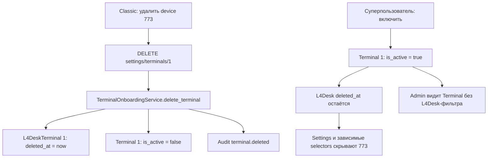

# Лицензии, подписки и блокировки: архитектурный анализ

Дата: 2026-10-05. Редакция 6: **согласованное разделение внедрено в production** — schema031,52Classic/4L4Desk, адресное исключение dev773, неизменяемый продукт и единая тарифная проверка сертификатов. Актуальные контракты, матрицы, тайминги и ограничения проверки приведены в §20–21; §1–19 сохраняют исходный аудит и промежуточные решения. Серверного Classic grace нет, три дня принадлежат терминалу.

## 0. Канонические требования и замечания владельца

### 0.1. Принятые факты

1. `licensebilling` — legacy-интерфейс **только для Classic**. Он никогда не участвует в пуле L4Desk. Отсутствие Classic-лицензии у чистого L4Desk-терминала не является дефектом и не должно препятствовать L4Desk-операциям.
2. Серверный `licensebilling` проверяет срок Classic-лицензии и общую административную блокировку **без grace**. Терминальная сторона сама реализует трёхдневную отсрочку и последующее отключение. Добавлять эти три дня к разрешению сервера нельзя.
3. Интерфейс подключения терминала должен использовать нейтральные название и тексты: «Мастер подключения терминала», без указания Classic/L4Desk в заголовке и объяснении регистрации. Контекст уже задан открытым разделом.
4. Пользователь наблюдает один административный флаг в двух представлениях: «Отключить/включить» в L4Desk меняет «Активен/Отключен» в Classic → Настройки → Терминалы. Код подтверждает запись/чтение общего `Terminal.is_active`.
5. Новое направление владельца: полностью закрыть пользователям Classic доступ к разделам L4Desk. Для указанного сценария роли 3 это означает запрет L4Desk-навигации, прямых URL и продуктовых API независимо от `site_mode=both` и двух включённых флагов лицензий организации. Это требование к будущей реализации, не выполненное изменение production.

Оборванное правило про существующие/создаваемые вручную Classic-терминалы **не учитывается**, согласно последующему указанию владельца. Из запрета пользователю открывать раздел нельзя автоматически вывести запрет миграции конкретного устройства между продуктами или разрешение такой миграции.

Окончательное уточнение владельца: **отключение Classic через три дня определяет сам терминал**. Отсутствие grace в Python `licensebilling` соответствует распределению ответственности и не является дефектом. Код терминального приложения в этом аудите не исследовался; точные локальные таймеры, восстановление после перезапуска и реакция на разные причины `state=error` здесь не утверждаются. Различие с серверным grace L4Desk описано в §5.1.1.

### 0.2. Замечания владельца, включённые в проверку

- Classic, роль 3, «Настройки → Терминалы → Удалить» сообщает о переносе бесплатной льготы, хотя это не относится к Classic.
- После удаления терминала 773 (внутренний `Terminal.id=1`, организация 1) и последующего включения через администрирование терминал отсутствует в части пользовательских списков, но доступен суперпользователю и в управлении устройствами.
- Требуется объяснить цепочку «Активен/Отключен» до моделей и отличие от удаления.
- Форма подключения, открытая в Classic, называется «Мастер подключения терминала L4Desk» и содержит несоответствующий контексту текст.

Разбор реализации и новый runtime-снимок находятся в §6.1–6.5. Предыдущие снимки §4 относятся к более раннему времени и сохранены как baseline до пользовательского удаления.

## 1. Вывод

В системе одновременно существуют две действующие модели коммерческих прав — Classic и подписки L4Desk — и сохранённая прежняя финансовая модель L4Desk. Дополнительно работают независимые ограничения административной активности, сертификата, IoT-безопасности, пользовательских прав и технической аренды удалённой сессии.

Главный конфликт состоит в неявном выборе модели: `Org.l4desk_licenses_enabled` открывает страницу, но фактическое включение подписочной проверки определяется существованием `L4DeskTenantProfile`. Профиль с настройкой часового пояса тем самым становится переключателем политики доступа для **всех** терминалов организации. Технические записи `L4DeskTerminal`, создаваемые ради учёта удалённых сессий, при появлении профиля начинают участвовать в коммерческой модели.

Ошибка `/api/subscriptions` для организации 1 подтверждена. Аналогичная ситуация есть у 339, хотя её интерфейс по умолчанию — L4Desk. Простое создание профилей опасно: при текущем выключенном платёжном режиме оно изменит результат подписочной проверки для 43 активных терминалов организации 1 и 1328 активных терминалов организации 339. Это расчёт по данным, а не выполненное переключение и не количество одновременно подключённых устройств.

Рекомендуется сохранить независимые продукты, ввести явное подключение терминала к продукту и согласовать решения по конкретным возможностям. `licensebilling` остаётся исключительно Classic; подписочные формулы L4Desk не добавляются в этот endpoint. Наличие профиля, строк технического учёта и доступность страницы не должны неявно назначать платные обязательства. Прежде чем расширять коммерческое использование Classic, необходимо отдельно закрыть обнаруженный путь подтверждения оплаты через `MockPaymentProvider`.

Новый подтверждённый конфликт — жизненный цикл терминала: Classic DELETE устанавливает L4Desk `deleted_at`, а административное включение возвращает только `Terminal.is_active`. Поэтому 773 сейчас активен, но скрыт общим фильтром портала. Это дефект смешения удаления, активности и продуктового учёта, который не исправляется переименованием кнопки.

## 2. Область, владельцы и доказательства

Исследованы `shared/etranprocessing_db`, MenuBuilder backend/frontend, ProcessingBackend, соответствующие документы и механика IoT-блокировок в отдельном `iot-rpc-rest-app`. Владельцы: MB — пользовательские лицензии/подписки, платежи и admission удалённых сессий; PB — терминальная аутентификация, `licensebilling`, transport policy и все миграции общей БД; IoT — устройство, брокерные блокировки и lease. Shared остаётся декларативным ORM.

Исходная ревизия etranprocessing: `2d0bfafed03f79262bf08e9aea3b65079f2447e9`; IoT: база `8c2be800567f074b079bc0c61e993e98184bd897`. Работа ограничена анализом и документацией. Каталоги legacy-приложений и нативный код утилит в этой задаче не исследовались.

Окно исходных серверных наблюдений: 2026-10-05, примерно 07:38–07:45 UTC. Повторная адресная проверка 773 после пользовательского удаления: 08:53:31 UTC. Запросы к двум БД выполнялись через существующие контейнеры в транзакциях `SET TRANSACTION READ ONLY`, с `statement_timeout=10s` и завершением rollback. Также вызваны читающие функции текущих образов для расчёта Classic state, subscription allowance и policy. Это проверка работающего серверного кода на реальных данных, **не HTTP/MQTT/hardware E2E**. Снимки разных сервисов не являются одной распределённой транзакцией.

`[MCP Ops Readiness: UNAVAILABLE]`: callable Ops-инструментов нет; штатный SSH доступен. Preflight: доступно 2149 MiB RAM, корневой диск 45%, load average 0.13/0.18/0.17. Полные env, JWT, PIN, клиентские сертификаты и персональные сведения не извлекались в отчёт.

Проверены идентификаторы работающих образов:

| Компонент | Image ID |
|---|---|
| PB | `sha256:6a17f70ff84c7ea590cea7aedfde52f4ed85da780db76c2905c6b5bacb8146db` |
| MB backend | `sha256:6fab3cb0832f58ab370535c25d5d713df16add511c349f90cd376bdd8917fc3a` |
| IoT app1 | `sha256:0b51e5b174ce37087cd4f6b1a89291ae72361e2b65c0fe9c73052fe700085d74` |

В тексте различаются: **код** — прослеженный путь реализации; **runtime** — прочитанные данные/вычисление текущим образом; **риск** — возможный сценарий, который не воспроизводился мутациями; **предложение** — будущий контракт.

## 3. Сущности и разные значения слова «лицензия»

| Сущность | Назначение и значимые поля | Действующая роль |
|---|---|---|
| `Org` | `site_mode`, `default_site`, `classic_licenses_enabled`, `l4desk_licenses_enabled`, `is_active`, числовой `status` | Навигация/доступность разделов и административные сведения. Флаги лицензий не читаются вычислителями подписки и PB policy |
| `OrgStatus` | Отдельный строковый `status` | PB Classic явно запрещает только значение `blocked`; отсутствие строки трактуется разрешающе |
| `Terminal` | Внутренний `id`, внешний `device_id`, `sn`, `org_id`, `is_active`, поля сертификата | Каноническое устройство и административная доступность. Идентификаторы имеют разные значения |
| `License` / `licenses` | `terminal_id`, `org_id`, `license_type`, `expires_at`, `balance`, период и цена | Classic: срок права, читаемый `licensebilling`; `balance` не равен балансу архивного ledger и не равен сроку подписки |
| `OrgBillingSettings` | `billing_mode`, месячная цена, периоды, отдельный тариф сертификата/PIN | Расчёт Classic-корзины и выдачи обычного PIN. Не управляет ценой L4Desk-подписки |
| `BillingOrder`, `BillingOrderItem` | Classic-заказ, строки лицензии/PIN, рассчитанный будущий срок | Действующий `/api/billing`; отдельный от `FinPayment` путь подтверждения |
| `L4DeskTenantProfile` | Tenant, timezone, отложенная смена timezone | По структуре — профиль; фактически ещё и глобальный признак включения новой подписочной политики |
| `L4DeskTerminal` | `terminal_id`, `runtime_terminal_id`, `ordinal`, provisioning, `deleted_at`, `paid_until` | Одновременно onboarding, FK для технических сессий и носитель оплаченного срока |
| `L4DeskMembership` | Принадлежность пользователя/владельца с ролью 5 | Не заменяет product enrollment или срок подписки |
| `FinPayment` + `L4DeskAuditEvent` | Заказ с purpose=subscription, снимок корзины, подтверждение, `subscription.terms` | Действующая новая подписка; audit хранит также устойчивую границу grace и используется для уведомлений |
| `FinBillingProfile`, ledger, `FinBalanceProjection`, тарифы/циклы | Прежние tenant-wide entitlement, баланс, usage charges | Денежная логика заморожена; сохранённые `active`/баланс не дают новых подписочных прав |
| `L4DeskRemoteSession`, `FinUsageDaily` | Сессия, provider epoch, cursor, длительность, stop/retry | Технический учёт продолжает работать; длительность новых сессий не списывает деньги |
| `CertificatePin`, сертификат терминала | Получение/продление криптографической идентичности | Независимы от срока лицензии; RPC7011 дополнительно проверяет актуальные права |
| IoT `DeviceConnection` | `is_blocked`, `violation_type`, presence/check result | Блокировка устройства по безопасности; не синхронизирована с Classic-сроком или подпиской |

В `License` нет ограничения уникальности `terminal_id`, хотя несколько consumers используют `scalar_one_or_none()` без выбора `license_type`. Следовательно, произвольное добавление второй строки «для L4Desk» в эту таблицу способно сломать Classic-чтение. У трёх исследованных tenants дубликаты не найдены. Новая модель L4Desk сейчас не является вторым `license_type` в `licenses`.

## 4. Фактические состояния tenants

### 4.1. Организации и коммерческие настройки

| Параметр | 1 | 339 | 10000 |
|---|---:|---:|---:|
| `Org.is_active`; числовой `status` | true; 1 | true; 1 | true; 1 |
| `OrgStatus.status` | active | active | active |
| `site_mode` | both | both | both |
| `default_site` | NULL | l4desk | NULL |
| Classic / L4Desk разделы лицензий | true / true | true / true | true / true |
| `L4DeskTenantProfile` | отсутствует | отсутствует | есть |
| `billing_mode` Classic | standard | master | prepaid |
| Classic месячная базовая цена, коп. | 300000 | 0 | 0 |
| Тариф сертификата | per_operation | none | none |
| Выпуск обычного PIN разрешён tenant | true | true | true |
| `/subscriptions` — вычисление текущим MB | 403 | 403 | список состояний |

В обоих backend `YOOKASSA_ENABLED=false`. Интервал subscription worker в MB — 60 секунд. У всех выбранных `L4DeskTerminal.paid_until=NULL`; событий `subscription.order`, `subscription.applied`, `subscription.terms` для этих трёх tenants на момент проверки нет.

Флаги видов лицензий действительно включены у организации 1. Предыдущее объяснение «организация ограничена Classic» было неверным. Отказ вызван отдельным отсутствующим профилем. При этом Classic-интерфейс не исчез: `/billing` использует `BillingPage`, `/licenses` — `TerminalSubscriptionsPage`; соответствующие guards в `App.tsx` различаются.

### 4.2. Размер выборок и охват моделей

| Показатель | 1 | 339 | 10000 |
|---|---:|---:|---:|
| Терминалы PB/MB | 134 | 1345 | 6 |
| Административно активны | 44 | 1329 | 2 |
| Строки Classic `License` | 112 | 1345 | 2 |
| Из них срок ещё действует, независимо от активности | 93 | 30 | 2 |
| Активны и срок Classic действует | 42 | 29 | 0 |
| Активны, Classic-лицензии нет либо срок истёк | 2 | 1300 | 2 |
| Строки `L4DeskTerminal`, включая удалённые | 8 | 2 | 6 |
| Неудалённые `L4DeskTerminal` | 5 | 2 | 5 |
| PB-терминалы без связанной строки `L4DeskTerminal` | 126 | 1343 | 0 |
| Устройства, привязанные к tenant в IoT | 21 | 71 | 6 |
| IoT `is_blocked=true` | 0 | 2 | 0 |

Разный размер PB и IoT-выборок не доказывает потерю данных: это разные реестры и история подключения. Автоматическая сверка с импортом не выполнялась и не предлагается без отдельного плана миграции. Заполненная будущая дата сертификата найдена у 3/52/5 терминалов соответственно; NULL у остальных не равен доказанному истечению сертификата.

### 4.3. Показательные терминалы

| Tenant / device_id | Внутренний ID | Admin active | Classic state PB | Подписка / policy | IoT block |
|---|---:|---|---|---|---|
| 1 / 773 | 1 | true | ok | Профиля нет → allowance=true → MQTT/RTP разрешены | false |
| 1 / 4624 | 3703 | false | error | Allowance=true, но admin AND даёт запрет MQTT/RTP | false |
| 339 / 6487 | 3063 | true | error | Профиля нет → MQTT/RTP разрешены | false |
| 339 / 6489 | 3065 | true | error | Профиля нет → MQTT/RTP разрешены | false |
| 10000 / 1000007 | 3722 | true | error | Первый неудалённый, `free` → MQTT/RTP разрешены | false |
| 10000 / 1000009 | 3724 | true | error | Дополнительный, `payments_disabled` → MQTT/RTP запрещены | false |

Это серверные решения, а не наблюдение фактического транспорта. Например, в IoT для 1000009 в снимке присутствует положительный connection check/svc presence, хотя PB policy запрещает транспорт. Возможны задержка опроса policy, устаревшая телеметрия или другой клиент; причины требуют отдельной runtime-диагностики. Считать этот снимок доказанным обходом policy нельзя.

У tenant 10000 две действующие Classic-лицензии принадлежат административно выключенным 1000006 и 1000011. Старый `FinBillingProfile.entitlement=active` и баланс 1000 коп. сохранены, но не разрешают дополнительный 1000009. У tenant 1 архивная balance projection равна 0; у 339 её нет. Это ожидаемое следствие заморозки предыдущей денежной модели, которое UI должен объяснять.

У 339 устройства 6209 и 6305 заблокированы IoT с причиной `SN_COLLISION`. Снятие коммерческого ограничения не должно снимать такой запрет. Их PB policy отдельно не вычислялась.

### 4.4. Последствия простого создания профиля

Текущая формула при выключенной оплате оставляет доступным только первый неудалённый L4Desk terminal при его административной активности. SQL-проекция без изменения данных дала:

| Tenant | Сейчас admin-active | Было бы разрешено по новой подписочной ветке | Было бы запрещено из admin-active |
|---|---:|---:|---:|
| 1 | 44 | 1 | 43 |
| 339 | 1329 | 1 | 1328 |
| 10000 — уже подключён | 2 | 1 | 1 |

Для 1 бесплатное место занимает device 10000000, `ordinal=1`, `provisioning_state=failed`, `deleted_at=NULL`; 773 имеет `ordinal=7`. Для 339 первым является 6487; 6489 стал бы дополнительным неоплаченным. Отсутствующие L4Desk-строки дают отказ, а не Classic fallback, как только профиль существует.

Эта проекция учитывает admin + подписочную формулу при нынешних настройках; она не добавляет оценку TLS, IoT-блокировок, сети или реально работающих клиентов. Профили не создавались.

## 5. Механика вычисления прав

### 5.1. Classic

**Текущее поведение кода**, после успешной терминальной аутентификации `get_terminal_license_state()`:

```text
classic_ok = Terminal.is_active
             AND OrgStatus.status != 'blocked'  (отсутствие строки разрешено)
             AND License существует
             AND License.expires_at >= now
```

**Каноническое распределение ответственности**, уточнённое владельцем:

```text
classic_licensebilling_ok = NOT common_administrative_block
                           AND classic_license_exists
                           AND classic_license_not_expired(now)
# Сервер не добавляет три дня к expires_at.
# Отсрочку и отключение через три дня определяет Classic-терминал.
# L4Desk profile, pool, paid_until и free ordinal в формуле отсутствуют.
```

`licensebilling` возвращает XML `state=ok/error`, включая balance. После истечения срока сервер сообщает `error`; это не означает немедленного фактического отключения терминального приложения, которое применяет собственную трёхдневную отсрочку. Серверный grace не требуется. На точной границе времени текущий PB использует `< now`, тогда как MB классифицирует `expires_at <= now` как lapsed: это отдельная пограничная семантика, не трёхдневный период. Серверное состояние лицензии, состояние UI и локальное решение терминала следует различать.

`billing_mode=master` и `cert_linked` в MB обнуляют стоимость лицензии; `master` также обнуляет цену обычного PIN. PB не читает эти тарифные режимы в Classic-проверке: нулевая цена сама по себе не создаёт бессрочное право. У 339 это видно на 1300 активных терминалах с Classic error. Прежде чем считать это дефектом, требуется определить, означает ли master бесплатное продление или безусловное право.

Срок сертификата и срок лицензии независимы. Название `cert_linked` не доказывает автоматическую синхронизацию сроков: в исследованном PB-пути выпуска не найдено продление `License` по факту выдачи сертификата.

Вариативность тарифного режима Classic также реализована неоднородно:

| Режим | Что действительно меняется | Что не следует из названия |
|---|---|---|
| `standard` | Цена организации или override терминала, периоды, расчёт даты продления; после lapse новый срок от текущего момента | Не задаёт продукт L4Desk и его free/grace |
| `post_factum` | Frontend по умолчанию выбирает просроченные строки (`only_lapsed`), меняет представление покупки | В просмотренной backend-математике нет отдельного разрешения работать после expiry; PB всё равно проверяет срок |
| `cert_linked` | Нулевая стоимость Classic-лицензии, отдельное представление корзины и сертификатный тариф | Не доказана автоматическая связка `License.expires_at` со сроком сертификата |
| `master` | Нулевая цена Classic-лицензии и обычного PIN; исключения в предложениях оплаты | Не отменяет PB-проверку срока и не даёт L4Desk paid_until |
| `prepaid` — реально хранится у 10000 | Проходит как произвольная строка backend; вне специальных master/cert_linked ветвей используется общий расчёт | Отсутствует в TypeScript union billing API и списке четырёх режимов UI; отдельной нормативной семантики в изученном пути нет |

Backend DTO принимает `billing_mode: str`, а модель БД не ограничивает его перечислением. `validate_order_item_periods()` получает режим аргументом, но не ветвится по нему. Это оставляет возможность сохранять неизвестные режимы и получать обычную математику без явной ошибки. Нужны реестр значений и согласованная нормализация старых данных; заменять `prepaid` у 10000 автоматически по предположению нельзя.

#### 5.1.1. Терминальная отсрочка Classic и серверный grace L4Desk

Проверены текущие PB/MB/shared, документы Classic и доступная Git-история PB `dependencies.py`/`licensebilling.py` по всем локальным refs. Найдено:

| Источник | Реальная формула / содержание | Отношение к Classic |
|---|---|---|
| PB `5a7bac7`, 2026-08-14, первая версия зависимости | `license_.expires_at < datetime.now(timezone.utc)` → отказ | Соответствует отсутствию серверного grace Classic |
| PB `6758328`, 2026-08-18, введение `get_terminal_license_state` | `expires_at < now` → `state=error` | Нет добавления трёх дней |
| PB `94083c6`, унификация активности | Меняет admin/License flags; прямое сравнение expiry сохраняет | Добавлять серверную отсрочку при унификации не требуется |
| Текущий `test_licensebilling_contract.py` | Просрочка на один день моделируется как `state=error` | Согласуется с серверным ответом без grace; тест с mock state не проверяет фактическую терминальную отсрочку |
| Исторический план `billing-implementation-plan-2026-08-19.md`, `compute_terminal_state` | Комментарий «within grace (not yet disabled)», но код возвращает overdue без deadline | Подтверждает идею grace, не рабочую трёхдневную реализацию |
| Новые подписки MB/PB, `8bb0359`, 2026-10-03 | `paid_until` в timezone + 3 календарных дня, затем обратно UTC; `now < grace_until` | Рабочая текущая формула **L4Desk**, не Classic `expires_at` |
| Архивный `financial_core/cycles.py` | `starts_at` нового billing cycle + 3 календарных дня | Прежний L4Desk ledger, иной якорь и не Classic gate |

Результат поиска согласуется с окончательным уточнением: трёхдневной Classic-формулы на сервере быть не должно. Ранее сделанный вывод о «потерянном серверном grace» и предложение восстановить его в PB отозваны. Найденные формулы `paid_until`/cycle относятся к L4Desk и не переносятся в Classic.

Граница ответственности: PB своевременно сообщает серверное состояние срока и административной блокировки; Classic-терминал самостоятельно определяет отсрочку и отключение. Проверка локального счётчика, точки отсчёта и поведения при потере сети/перезапуске требует отдельного анализа терминального приложения. Нельзя незаметно добавить серверные три дня поверх уже существующей терминальной отсрочки.

### 5.2. L4Desk

Последовательность `subscription_status()`:

```text
deleted → admin_disabled → free → payments_disabled
        → unpaid → active → grace → expired
```

Первый неудалённый определяется минимальным `ordinal`, без фильтра provisioning или административной активности. Отключённый первый терминал не передаёт бесплатное место следующему; удалённый передаёт. Это действующее правило, которое нужно явно показывать пользователю. Старые технические записи также участвуют в выборе, если появился tenant profile.

Дополнительному терминалу нужен `paid_until`, работающий коммерческий флаг и время до конца grace. Grace — три календарных дня в timezone профиля; `subscription.terms` сохраняет фактически выданную границу, чтобы последующая смена timezone не передвигала её. Оплата добавляет 1/3/6/12 месяцев от `max(captured_at, текущий paid_until)`. Административный запрет оплата не снимает.

Реальная квота создания: до **трёх** неудалённых терминалов без активной платной подписки; четвёртый и далее требуют хотя бы один дополнительный `state=active`. Grace для этого не подходит. Текст [документа подписок](menu_bill-terminal-subscription.md) про «создание третьего и следующих» расходится с кодом и текстом самой ошибки квоты.

### 5.3. Transport policy, сертификат и lease

PB policy сейчас:

```text
mqtt_rtp_allowed = Terminal.is_active
                   AND subscription_allowance
                   AND NOT known_certificate_expired
outgoing_https_allowed = true
```

`subscription_allowance=true`, если tenant profile отсутствует. При наличии профиля проверяются L4Desk-строка, удаление, бесплатный ordinal, коммерческий флаг и оплаченный срок с grace. Срок Classic, `OrgStatus`, site flags и IoT `is_blocked` здесь не участвуют.

Policy объединяет MQTT и RTP в один флаг. Подписочный запрет поэтому касается и канала команд/телеметрии через этот proxy, а не только видео. Это действующая семантика, которую следует учитывать при назначении продукта смешанным терминалам.

По документации терминального контракта опрос policy выполняется каждые 10 минут; недоступность сервиса допускает прежний 72-часовой offline grace при действующем сертификате. Полученный явный запрет применяется без этой отсрочки. В принятом выпуске 1.11.0 локальная невалидность/истечение сертификата закрывает MQTT/RTP независимо от доступности policy. Эти клиентские утверждения опираются на предыдущий handoff, без повторной проверки нативного кода в данном аудите.

Lease остаётся отдельной технической защитой: срок аренды и watchdog ограничивают жизнь сессии, но не заменяют коммерческую проверку. Stop должен адресовать текущий provider epoch, не затрагивая новую сессию после гонки.

## 6. Матрица блокировок по точкам применения

Таблица описывает **текущий серверный код**, включая расхождение с новым запретом L4Desk для Classic-пользователей. Трёхдневная отсрочка Classic исполняется на терминале и не входит в серверные решения таблицы.

| Факт / запрет | Classic licensebilling | Новый remote start MB | PB MQTT/RTP policy | Продление RPC7011 | Что восстанавливает |
|---|---|---|---|---|---|
| `Terminal.is_active=false` | error | отказ | deny | отказ MB/PB | Явное административное включение |
| `OrgStatus='blocked'` | error | В исследованных admission-функциях не проверяется | Не проверяется | Не входит в подписочную проверку | Отдельное изменение статуса организации |
| `Org.is_active=false` | Само поле не читается этой функцией | Не читается проверкой подписки | Не читается | Не заменяет terminal admission | Нужен согласованный смысл org-wide disable |
| `OrgStatus='inactive'` | Не эквивалентен `blocked` | Нет общего deny | Нет общего deny | Нет общего deny | Устранение различия статусов |
| Нет/истекла Classic-лицензия | error | Не запрещает автоматически | Не запрещает автоматически | Не является самостоятельным запретом | Classic-продление, если требуется этому продукту |
| L4Desk unpaid/expired/deleted | Не меняет Classic-срок | отказ | deny | отказ | Подписка / допустимое подключение, не оплата admin disable |
| Выключена YooKassa | Не отключает Classic mock path | Дополнительный L4Desk запрещён даже с сохранённым сроком | То же | Дополнительный L4Desk запрещён | Согласованное коммерческое включение обоих backend |
| Скрыт вид лицензий site flag | Не влияет | Сам по себе не влияет | Не влияет | Сам по себе не влияет | Изменение UI-доступности, не выдача права |
| Истёк сертификат | Аутентификация/транспорт — отдельный барьер | Подписочный state не отражает TLS | PB известная дата + локальная защита | Authenticated renew требует живого сертификата | Отдельный допустимый bootstrap/reissue flow |
| IoT security block | Не меняет Classic state | IoT/broker ограничивают выполнение; единый MB subscription state этого не отражает | Нет связи с IoT block | BFF проверяет connection.is_blocked при постановке | Специальный security unblock |
| Нет роли/permission, чужой tenant | Пользовательский JWT здесь неприменим | Отказ по auth/tenant/permission | Терминальная mTLS identity | Проверки BFF/PB identity | Корректная авторизация, не оплата |
| Занята/истекла lease | Не влияет | Busy/recovery/expiry по техническому контракту | Не является подпиской | RPC имеет собственные ограничения | Завершение старой/новая разрешённая операция |

По принятому правилу `licensebilling` обслуживает исключительно Classic. Для чистого L4Desk его `state=error` не является конфликтом прав: сравнение в §4 показывает независимость двух вычислений и не предлагает включать L4Desk в legacy gate. Дефектами остаются неявное переключение продукта, смешение его жизненного цикла с другим продуктом и представление всех ограничений одним «заблокирован».

Важное расхождение org-wide disable: admin update организации записывает `OrgStatus='inactive'`, а PB Classic проверяет только `'blocked'`. Изменение `Org.is_active` не следует трактовать как доказанную остановку терминалов. В данном анализе организации не отключались.

`get_current_terminal()` сейчас отвечает за аутентификацию и намеренно не проверяет `Terminal.is_active`. Изученный `/api/payment` использует эту зависимость без общего license guard. Поэтому утверждение старого [Classic-документа, §3](etran_bill-licensing-architecture.md) о проверке лицензии в `get_current_terminal` не соответствует коду. Полный запрет всех payment/menu операций этим аудитом не доказан; массовое добавление guard без уточнения протокола также недопустимо.

### 6.1. Удаление 773 из Classic: фактическая цепочка

`TerminalsSettingsPage.handleDelete(record)` передаёт **внутренний** `record.id` в `deleteTerminal()`. Для видимого номера 773 это ID 1; поэтому DELETE `/api/settings/terminals/1` и device 773 относятся к одному терминалу, а не к разным объектам.



Сервис удаления ищет `L4DeskTerminal` по `terminal_id`. Если такой строки нет, вернётся 404, даже если сам `Terminal` существует. У Classic-терминала возможность удаления поэтому может зависеть от того, создалась ли техническая L4Desk-строка при прежнем открытии удалённой сессии.

Далее сервис проверяет tenant, берёт блокировку строки организации, запрещает удаление при незавершённых **подписочных** заказах, повторно читает L4Desk-строку и выполняет:

| Данные | Изменение при текущем DELETE |
|---|---|
| `L4DeskTerminal.deleted_at` | Текущее UTC-время |
| Связанный `Terminal.is_active` | false |
| Audit | `terminal.deleted`, tenant, внутренний terminal ID, ordinal, outcome |
| Выбор бесплатного | После commit вычисляет первый оставшийся неудалённый ordinal; отдельный флаг льготы не переносится записью |
| `Terminal` | Физически не удаляется |
| Classic `License`, certificate identity, `paid_until` | В этом use case не удаляются и не переписываются |
| IoT registry/broker user | Этот use case не вызывает удаления/блокировки в IoT |
| Активная сессия | В показанном пути нет проверки/завершения, аналогичной activity endpoint |

DELETE не проверяет, находится ли пользователь в Classic, есть ли tenant profile и относится ли терминал к коммерческому L4Desk-пулу. Поэтому текст о льготе отражает не только ошибку copywriting: за кнопкой действительно вызвана модель L4Desk lifecycle.

### 6.2. Текущее состояние 773 после повторного включения

Read-only снимок 2026-10-05 08:53:31 UTC:

| Поле / проверка | Значение |
|---|---|
| `Terminal.id / device_id / org_id` | 1 / 773 / 1 |
| `Terminal.is_active` | true |
| `show_in_monitoring` | true |
| `Terminal.updated_at` | 08:47:43.512453 UTC |
| `L4DeskTerminal.deleted_at` | 08:45:30.841728 UTC |
| Audit `terminal.deleted` | 08:45:30.829904 UTC, success |
| Tenant profile | отсутствует |
| Classic `License.expires_at` | 2026-10-06 21:00:00 UTC |
| Результат `_visible_terminals_query(1)` для device 773 | пустой список |

Это подтверждает сохранённую запись удаления и восстановленную административную активность. Сообщение владельца о включении согласуется с `updated_at`, но отдельный audit-факт этой кнопки данным SELECT не устанавливался.

Общий settings-фильтр исключает любой `Terminal`, для которого существует строка `L4DeskTerminal` с тем же tenant/внутренним ID и ненулевым `deleted_at`. Фильтр применяется **без проверки Classic/L4Desk scope и без проверки наличия profile**.

| Представление | Откуда берёт выборку | Следствие для текущего 773 |
|---|---|---|
| Classic → Настройки → Терминалы | `_visible_terminals_query` | Исключён из свежего ответа |
| L4Desk → Терминалы | Тот же settings API | Исключён |
| Console/Video selector | IoT devices пересекаются с видимыми активными settings terminals через `selectableDevices` | Исключён из выбора |
| Администрирование → Терминалы | `Terminal` + org/type, без такого `deleted_at` фильтра | Видим суперпользователю |
| Управление → Устройства | IoT-реестр; DELETE settings его не меняет | Наблюдаемая владельцем видимость объяснима независимостью реестра |
| PB policy для tenant без profile | Проверяет admin, сертификат; subscription allowance пропускается | Soft-delete сам по себе не мешает разрешить транспорт после is_active=true; это вывод по коду, без повторного hardware E2E |

Первые слова владельца «после удаления из списка не исчез» не подтверждаются текущим свежим серверным запросом: сейчас 773 исключён. Причина кратковременного отображения сразу после DELETE неизвестна. `fetchTerminals()` повторно вызывается, но в Classic-странице нет защиты от позднего ответа предыдущего списка; гонка запросов является гипотезой, а не установленным объяснением.

### 6.3. «Удалить», «Отключить» и «Включить» не эквивалентны

| Действие | Записываемые данные | Восстановление видимости после удаления |
|---|---|---|
| L4Desk → Отключить/включить | PATCH activity → `Terminal.is_active`, `updated_at`; отключение запрещено при незавершённой сессии | Нет; endpoint сам ищет только видимые терминалы |
| Classic → статус «Активен/Отключен» | Ничего не записывает: прямое отображение `Terminal.is_active` из settings DTO | Не является восстановлением |
| Classic → Удалить | `L4DeskTerminal.deleted_at` + `Terminal.is_active=false` + audit | Отдельный штатный undelete в исследованном API не найден |
| Superuser → set-status / редактирование active | `Terminal.is_active`; также может создать/скорректировать Classic license expiry | Не очищает `L4DeskTerminal.deleted_at` |
| Classic billing → enable | `Terminal.is_active=true`; отсутствующую лицензию создаёт, просроченную поднимает до now | Не очищает `deleted_at` |

Таким образом, наблюдение «выключил в L4Desk — увидел Отключен в Classic» соответствует общей административной модели. Статус «Активен» означает только административную активность; он не удостоверяет оплату, grace, сертификат, online, отсутствие IoT block или видимость после soft-delete.

Особенность admin enable: `set-status` при отсутствующей лицензии создаёт срок `now`, а общий PATCH admin при создании отсутствующей лицензии может дать default `now+365 days`. Оба пути следует учесть при консолидации жизненного цикла: одинаковое действие «включить» сейчас способно иметь разные коммерческие побочные эффекты.

### 6.4. Общий мастер подключения

Classic-страница использует `OnboardingWizardModal`. Фактические строки: «Мастер подключения терминала L4Desk», «Зарегистрируйте новый компьютер в системе L4Desk», «Скачать Агент L4Desk». Кроме мастера, в Classic-списке есть колонка «Тариф / Льгота», показывающая бесплатный ordinal без проверки коммерческого profile. Эти элементы смешивают scope в пользовательском интерфейсе.

Принятый текстовый контракт: «Мастер подключения терминала»; «Зарегистрируйте терминал. Получите одноразовый PIN-код для установки и подключения агента»; «Скачать агент». Объяснение бесплатного места показывать только в действительно применимом L4Desk-пуле, не всем Classic-терминалам с технической строкой.

Одного переименования недостаточно для backend: текущий onboarding создаёт `Terminal` и `L4DeskTerminal`, а payload мастера не содержит самостоятельного продуктового назначения. Нужен проверяемый сервером контекст создания и явное различие технической регистрации и подключения к продукту. Оборванное требование о вручную создаваемых терминалах исключено из рассмотрения по указанию владельца.

### 6.5. Требования к исправлению жизненного цикла — предложение

- Определить одну общую административную активность терминала и явно назвать её в обоих интерфейсах. Коммерческий срок не должен незаметно выдаваться кнопкой admin enable.
- Разделить удаление/архивирование устройства, отключение общей активности и исключение из продуктового пула. Удаление из Classic не должно запускать перенос бесплатного L4Desk-места только потому, что существует техническая строка сессий.
- Если удаление обратимо, предусмотреть отдельное «Восстановить» с аудитом и проверками scope, уникальности, заказов и зависимостей. «Включить» не должно сообщать о полном восстановлении при оставшемся `deleted_at`.
- Предложить для текущего 773 адресное восстановление согласованным use case после определения требуемого lifecycle. В этой документационной задаче `deleted_at` не очищался, данные и службы не менялись.
- Не делать видимость единственной проверкой доступа: согласовать direct API admission, policy и selectors, чтобы скрытый soft-deleted терминал не оставался операционно доступным непреднамеренно.
- Проверить delete/disable/restore одновременно с сессией и pending оплатой; сохранить историю лицензий, сертификата и команд. Глобальное восстановление всех исторических удалённых записей недопустимо.

### 6.6. Полное закрытие разделов L4Desk для пользователей Classic

Сейчас `isProfileAllowed()` запрещает Classic для роли 5, но симметричного запрета L4Desk для роли 3 нет. При `site_mode=both` роль 3 получает Classic только как default: URL `?profile=l4desk` и сохранённый выбор читаются до этого default. `SiteRoute` допускает разрешённый организацией профиль. Поэтому доступ в L4Desk является текущим поведением кода, а не случайным отображением меню.

Предлагаемая реализация нового направления:

| Контур | Требование |
|---|---|
| Пользователь с effective scope Classic, в том числе роль 3 | Только Classic-разделы; tenant `both` не даёт переключения в L4Desk |
| L4Desk-пользователь, роль 5 | Сохраняется L4Desk-контур; Classic запрещён |
| Superuser | Администрирование и диагностика обоих контуров через явные административные права; impersonation должен иметь однозначный effective scope |
| Роли 2/4 | Зафиксировать effective product scope и разрешения чтения; не вводить новый доступ по умолчанию из-за старого `site_mode=both` |
| UI | Убрать L4Desk-switch/ссылки у Classic, игнорировать старый localStorage и URL override, защитить прямые `/terminals` и `/licenses` |
| Backend | Отдельный product authorization для L4Desk-specific subscriptions/enrollment/покупок; Classic direct request получает предсказуемый отказ по роли/scope |
| Общие API | Settings, нейтральное подключение, сертификаты и remote console/video классифицировать по use case, а не блокировать целиком по имени Python-сервиса |
| Организация | Два включённых вида лицензий задают доступные организации продукты, но не доступ каждого пользователя к обоим интерфейсам |

Следствие для исходного 403: у роли 3 запрос `/subscriptions` после реализации должен вообще исчезнуть из штатного Classic UI; прямой запрос запрещается по product scope. Для уполномоченного L4Desk-пользователя/администратора отсутствие enrollment — отдельное состояние, не ошибка авторизации, замаскированная тем же сообщением.

Закрытие разделов не требует прекращать уже существующую Classic-диагностику. Право Classic на console/video/renew следует явно сохранить или изменить отдельным продуктовым решением; в данном отчёте не предполагается автоматическая отмена этих возможностей.

## 7. Конфликты и приоритеты

| ID | Наблюдение | Уровень / влияние | Рекомендация |
|---|---|---|---|
| C1 | UI flags и tenant profile дают разные ответы о доступности подписок | Runtime; P1, воспроизводимые 403 у 1 и 339 | Явный статус подключения продукта и описание доступного действия |
| C2 | Создание профиля меняет admission всех терминалов; технические строки становятся подписками | Код + данные; P0 для миграции, массовое ограничение | Запрет неявного enrollment; предварительная матрица изменений по каждому терминалу |
| C3 | Classic использует `MockPaymentProvider`, всегда возвращающий success; router подключён | Runtime класса + код; P0 перед коммерческим применением | Fail-closed production configuration, реальная верификация/контролируемое ручное зачисление, регрессия отрицательного подтверждения |
| C4 | `Org.is_active`, `OrgStatus inactive/blocked`, terminal active и IoT block имеют разные потребители | Код; P1, административный запрет может не охватить ожидаемые каналы | Явные scopes и приоритеты запретов; owner + reason + effective time |
| C5 | Подписочный deny сериализуется в PB как `stop_facts=['terminal_inactive']`, даже при active=true | Runtime 1000009; P1 диагностики | Разделить admin и subscription reasons в совместимом контракте policy |
| C6 | `YOOKASSA_ENABLED` одновременно выключает покупки и уже оплаченный доступ | Код; P1 доступности | Разделить «принимать платежи» и «исполнять выданные права»; текущее правило менять только согласованно |
| C7 | Два метода admin disable: settings проверяет сессии под terminal lock; billing пишет флаг напрямую | Код; P1 гонок/активных сессий | Один use case административного перехода для обоих UI/API |
| C8 | Classic confirm не блокирует order/license и присваивает срок из старого снимка | Код; P1 финансовой целостности при конкуренции | Atomic/idempotent apply, повторная сверка срока, согласованный порядок locks |
| C9 | Отсутствует уникальность Classic license; разные readers предполагают одну строку | Код; P1 при расширении модели | Явная cardinality продукта, аудит до ограничений; не добавлять вторую лицензию «по названию типа» |
| C10 | Технический `ensure_l4desk_terminal` записывает `device_id=terminal_id` и выдаёт ordinal | Runtime + код; P2 данных и будущего бесплатного места | Разделить technical record и enrollment; исправлять идентичность адресно после аудита |
| C11 | MB и PB отдельно реализуют paid/grace/free; источники времени/timezone и настройки могут разойтись | Код; P1 при следующем изменении | Один нормативный evaluator/контракт и общие fixture-векторы, без бизнес-логики в ORM |
| C12 | Старое entitlement=active воспринимается как действующее право; одинаковые слова «лицензия/подписка/баланс» | Runtime 10000; P2 UX/эксплуатации | Маркировать архивную модель; показывать продукт и причину решения |
| C13 | `/subscriptions` и `quote` не используют тот же billing:view guard, что Classic; site flags только UI | Код; P2, неодинаковая модель чтения | Зафиксировать роли для просмотра/покупки и отдельно семантику visibility flags |
| C14 | Superuser scope: subscription read допускает target org; remote access допускает superuser вне активного tenant | Код; P1 при консолидации API | Разделить admin API и tenant API, явный целевой tenant и аудит; не переносить исключение в обычные routes |
| C15 | Документы расходятся с кодом по quota, guard, старому аргументу policy и названиям frozen finance | Код + документы; P2 | Актуализировать авторитетные разделы после утверждения семантики |
| C16 | Реальный `billing_mode=prepaid` у10000 отсутствует в UI-типах; post_factum/cert_linked названия обещают больше, чем явно реализуют gates | Runtime + код; P1 для изменения тарифов | Нормативный реестр режимов, явная математика/права каждого, миграция неизвестных значений после решения |
| C17 | Classic DELETE использует L4Desk soft-delete; admin enable его не отменяет | Runtime 773 + код; P1, активное устройство скрыто из портала | Раздельный lifecycle/restore, единые фильтры и admission; адресный recovery после определения контракта |
| C18 | Classic UI показывает L4Desk-льготу и мастер; backend обогащает technical records free ordinal | Код + сообщение владельца; P1 product scope | Нейтральный мастер, отсутствие L4Desk-коммерческих текстов в Classic, явный product scope |
| C19 | Роль 3 может перейти в L4Desk через выбор профиля/URL при tenant both | Код; P1, противоречие новому направлению владельца | Симметричный frontend/backend product deny; сохранить разрешённые общие use cases |

**C20 снят в редакции 3:** отсутствие серверного Classic grace корректно. Три дня реализует терминал; исправление PB по этому основанию не требуется.

P0 здесь обозначает первоочередной риск при эксплуатации/переключении, а не заявление о произошедшем инциденте. Mock-платёж не создавался и не подтверждался. В Classic уже есть pending orders (у 1 — два, у 339 — один) и paid order у 1; это не доказывает нарушение оплаты, но усиливает необходимость проверки происхождения и режима провайдера.

C10 подтверждён примерами: `L4DeskTerminal.device_id=1` соответствует runtime device 773; 820 — device 70; 3063 — device 6487; 3065 — device 6489. `runtime_terminal_id` во всех исследованных связанных строках совпадает с `terminal_id`; текущий subscriptions UI берёт внешний номер из runtime, поэтому этот дефект не обязательно виден пользователю. Схема не гарантирует вечное равенство двух внутренних полей, хотя PB allowance и MB check_terminal опираются на него.

Дополнительный риск checkout L4Desk: endpoint берёт email из `user.email` либо username, тогда как обычный `get_current_user()` не возвращает email. Пользователь с логином без `@` может получить 422 при покупке, даже если email сохранён в профиле. На действующей выключенной оплате коммерческий E2E этого пути не проверялся.

## 8. Транзакции, время реакции и отказоустойчивость

### 8.1. Что реализовано устойчиво

- Новая подписка сохраняет заказ до provider IO; сетевой вызов не удерживает tenant lock. Повтор использует ключ идемпотентности и проверяет назначение, tenant, сумму, валюту, metadata и capture.
- Применение оплаты блокирует организацию, платёж и строки подписок; повтор подтверждения не продлевает срок второй раз.
- Удаление блокируется при незавершённом подписочном заказе; это защищает состав корзины и выбор первого бесплатного терминала.
- Stop worker повторно проверяет право и provider epoch. После продления старый subscription stop не должен остановить восстановленную или заменившую её сессию.
- Результат `paid`/`succeeded`, административный флаг и успешная установка сертификата сохраняют отдельные значения. Отчёт о длительности не выдаёт оплаченные месяцы.

### 8.2. Границы задержек

| Изменение | Когда учитывается | Ограничение доказательства |
|---|---|---|
| Начало новой сессии после expiry/admin disable | Следующий admission-запрос читает БД | Старый открытый socket сам по себе не является новым admission |
| Истечение Classic-лицензии | Серверный licensebilling сообщает error без grace; терминал сам определяет отключение через три дня | Терминальный код/таймер в этом аудите не проверен; время серверного ответа не равно времени физического отключения |
| Истечение подписки при активной сессии | Subscription worker: завершение текущего tick + sleep 60 s + обход tenants/provider IO | 60 s — интервал сна, не гарантированный deadline остановки |
| Явный transport deny | Следующий успешный опрос policy, номинально 10 min | Реакция зависит от сети/клиента; hardware timing в этой задаче не измерялся |
| Policy недоступна | Прежний offline grace до 72 h при valid cert | Это сознательная доступность при потере контроля, не мгновенная серверная блокировка |
| Истечение сертификата | PB на запросе и локальная проверка клиента | В новом authenticated renew просроченный сертификат уже не подходит |
| IoT security block | DB фиксация + удаление RMQ user/закрытие соединений; повтор при reconciliation | Между БД и RMQ нет одной транзакции; возможен временный разрыв |
| Подтверждение оплаты | Webhook, кнопка либо worker; worker берёт до 50 pending orders с курсором | Provider outage/много заказов увеличивают задержку; pending не равен оплачено |
| Истечение lease | Lease/watchdog по техническому протоколу | Не подменять коммерческими таймерами и не продлевать локально без авторизованного renew |

### 8.3. Риски нагрузки и конкуренции

| Точка | Наблюдаемый механизм | Риск и мера |
|---|---|---|
| Подписочный worker | Последовательный обход всех profiles, затем запросы/stop/notify | Время tick растёт с числом tenants, denied terminals и сетевых ошибок. Нужны duration/lag метрики, batch/cursor и ограниченный IO budget |
| `subscription_terms` для списка | Загружает историю всех terms tenant, выбирает последнее в Python | Рост стоимости с историей. Позже — выбор latest per terminal в SQL/проекция grace и соответствующий индекс |
| PB policy | На дополнительный терминал несколько чтений: profile, enrollment, free ordinal, latest terms | При 1345 терминалах равномерный опрос 10 min — около 2.24 policy requests/s, но рестарт создаёт burst; не добавлять частый глобальный DB polling |
| Stop worker | Может держать DB transaction, пока ожидает IoT/media | Ограниченные HTTP timeout уже полезны; следующий этап — короткий claim и IO вне долгой транзакции, epoch recheck при apply |
| `ensure_l4desk_terminal` | `MAX(ordinal)+1`; start сериализован по терминалу, не обязательно по tenant | Параллельные первые сессии разных терминалов могут столкнуться по unique ordinal; требуется отдельная concurrency-проверка |
| Разные mutation paths | Start/settings lock runtime terminal; payments lock org/payment/enrollment; Classic иначе | Не объявлять deadlock-free. Составить единый lock order и проверить пары start/delete/pay/disable/correction |
| Несколько MB workers | Worker создаётся в lifespan каждого процесса | Нельзя считать singleton по умолчанию; проверить конкуренцию stop/notify и применение claim/advisory leadership при масштабировании |
| UI | Незавершённый заказ обновляется каждые 15 s, есть явные кнопки | Ограничить параллельные запросы и показывать pending; отсутствие profile не должно порождать бессмысленные повторы |

Статистическая вероятность надёжности не вычислялась: нет распределений отказов и нагрузочного прогона. Указаны детерминированные ветви, известные интервалы и условия возможного рассогласования.

## 9. Матрица вариантов поведения

| Вариант | Сейчас | Требуемая ясность / риск |
|---|---|---|
| Оба раздела включены, profile нет | UI допускает `/licenses`, API 403; remote/policy обходят подписочную проверку | Точный статус «продукт ещё не подключён», доступное enrollment-действие |
| Profile есть, terminal enrollment нет | Remote/PB subscription deny | Для смешанного tenant это может быть обычный Classic terminal, а не ошибка |
| Есть technical record без profile | Учитываются сессии, подписки не применяются | Открытие консоли не должно оформлять продукт |
| Есть profile и failed provisioning на первом ordinal | Бесплатное место занято этой строкой | Определить eligibility бесплатного места и recovery/удаление |
| Бесплатный terminal admin-disabled | Недоступен; следующий не становится бесплатным | Объяснить различие выключения и удаления |
| Additional paid, provider временно выключен | Сейчас payments_disabled | Предлагается сохранить уже выданное право и запретить только новые оплаты |
| Classic expired, remote allowed | Возможно и подтверждено у 339 | Независимые возможности; legacy gate только Classic, его ответ без grace; трёхдневное отключение определяет терминал |
| Classic active, L4Desk unpaid | Classic state может быть ok, transport deny от подписки | Общий MQTT-транспорт создаёт межпродуктовое влияние |
| Archived entitlement active, paid_until NULL | Новый additional denied | Не конвертировать старый баланс автоматически |
| Admin disable во время оплаты | Paid term обновляется; доступ остаётся закрыт | Сохранить приоритет административного запрета |
| Payment пришёл одновременно со stop retry | Recheck способен отменить устаревший subscription stop | Проверить race на реальном PostgreSQL/provider epoch |
| Удаление первого при pending order | Запрет удаления | Сохранить согласованность корзины и ordinal |
| IoT security block + оплаченная подписка | Брокер не должен допускать устройство | Оплата не снимает SN_COLLISION |
| Certificate expired + paid/free | Транспорт закрывается; authenticated renew невозможен | Отдельный подтверждённый recovery-путь, без отключения проверки identity |
| Policy outage + admin disable в БД | Старый клиентский allow может жить offline grace | Для срочного security deny нужна отдельная адресная брокерная мера |
| Две Classic confirm одновременно | Нет достаточной сериализации в просмотренном пути | Не считать безопасным без исправления/конкурентного теста |
| Профиль есть, флаг L4Desk UI выключен | Подписочная политика продолжает действовать | Разделять видимость, подключение продукта и выданные права |

## 10. Варианты целевой архитектуры

| Вариант | Преимущество | Цена / недостаток | Оценка |
|---|---|---|---|
| A. Статус-кво + понятная обработка 403 | Быстро исправляет UX | Сохраняет опасный скрытый profile switch, две несогласованные политики | Только временная стабилизация |
| B. Включать подписки созданием profile при `l4desk_licenses_enabled=true` | Мало нового кода | Массовый deny, влияние technical ordinals, фактическая миграция всего tenant без явного выбора | Отклонить для существующих 1/339 |
| C. Разделить продукты и явное enrollment терминала, согласовать контракт решения по capability | Поддерживает Classic, L4Desk и смешанные tenants с разными правами пользователей; сохраняет историю | Нужны DTO, product authorization, контролируемое подключение и матрица миграции | Рекомендуется; legacy licensebilling остаётся только Classic |
| D. Свести всё в универсальную таблицу лицензий/тарифный движок | Единый механизм в будущем | Большая миграция платежей, периодов, free/grace, крипто-flow и legacy gate; риск ошибочного OR прав | Не нужен для ближайшего исправления |

### Рекомендуемый вариант C

Уточнение редакции 4: новые L4Desk и Classic обособлены по требованиям владельца. Смешанное подключение не является целевой функцией; исторические `both` сначала классифицируются адресно. Вопросы ниже не дают разрешения на создание универсального смешанного биллинга. Актуальный план — §15.

Разделить пять понятий: доступность раздела портала; доступность продукта организации; подключение конкретного терминала к продукту; выданное коммерческое право; административные/безопасностные запреты.

Ввести явное состояние подключения к L4Desk, которое не возникает от technical session record. Допустимо начать с расширения существующей модели enrollment, если это сохраняет её технические FK; отдельная таблица не самоцель. Возможность одного терминала иметь оба продукта остаётся проектным вопросом, а не утверждённым фактом. Общая организация с двумя видами лицензий уже существует; это не даёт пользователю Classic доступ к L4Desk и не включает `licensebilling` в L4Desk-пул.

Общий **предлагаемый**, ещё не существующий контракт решения должен содержать продукт, возможность, tenant/terminal identity, `allowed`, список причин и их владельцев, время вычисления, ближайшую границу изменения и версию политики. Например, отдельно оценивать Classic processing, remote console/video/input, transport и certificate renewal. Нельзя автоматически сводить лицензии в `classic_valid OR l4desk_valid`: одна оплата не обязана открывать другой продукт. Нельзя и безусловно делать AND всех сроков: чистый L4Desk тогда зависел бы от ненужной Classic-лицензии.

Составитель решения применяет только запреты, scope которых включает данную возможность. Admin/security запрет имеет приоритет над бесплатностью и оплатой. Право остановить сессию, прочитать диагноз и выполнить разрешённое восстановление сохраняется по отдельным правилам. Scope общих MQTT/RTP каналов согласуется явно, поскольку они используются несколькими функциями терминала.

Бизнес-логика не переносится в декларативный ORM. Возможны: отдельный чистый доменный модуль с версиями и общими fixture-векторами либо MB-владелец решения с локальной версионированной проекцией для PB. Обязательный синхронный вызов MB на каждый PB policy poll увеличил бы связанность отказов; для текущего масштаба предпочтительнее локальное вычисление из согласованных фактов и единые контрактные тесты.

## 11. Применение к трём tenants

- **1:** для пользователя Classic показать только Classic, несмотря на оба включённых флага; администратору объяснить отдельное состояние L4Desk enrollment. Сначала разрешить lifecycle-конфликт 773 (`active=true`, `deleted_at` заполнен), затем отдельно рассматривать продукты. Предварительно разобрать failed record 10000000 и technical records до выбора бесплатного L4Desk-терминала. 773 нельзя переводить в unpaid только из-за включения страницы. Кандидаты подключения оформляются адресно, с before/after решением по transport и remote.
- **339:** учесть `master`, 1345 PB-терминалов, 71 IoT binding и default L4Desk. Сначала определить семантику master: цена 0, право без срока или иной договор. Не делать массовое enrollment ради устранения 403. IoT SN_COLLISION для 6209/6305 сохраняет отдельного владельца и процедуру снятия.
- **10000:** использовать как уже подключённый пример: первый 1000007 бесплатен, 1000009 — дополнительный без подписки; admin-disabled не включаются оплатой. Старые 10 рублей и `entitlement=active` остаются историей. Наличие тестовой истории не делает tenant безопасной песочницей для произвольных платежей/отключений.

## 12. Первоначальный порядок реализации — заменён детальным планом §15

1. **Архитектурный контракт:** закрепить Classic-only licensebilling без серверного grace и самостоятельную трёхдневную отсрочку терминала, product deny для Classic-пользователей в L4Desk и нейтральный мастер. Доуточнить lifecycle delete/disable/restore, scope org disable/master, бесплатное место и политику уже оплаченных прав при выключенных новых платежах. Зафиксировать матрицу для 1/339/10000 и отдельный снимок удалённого/включённого 773.
2. **Shared / PB migration owner:** добавить минимальное явное enrollment-состояние и совместимые поля/constraints после аудита текущих данных. Expand-only, без перевода technical records в коммерческие. Выдать фактический schema contract следующему стеку.
3. **MenuBuilder backend:** реализовать enrollment/status DTO, единый admin transition и отдельный restore; развести Classic lifecycle и L4Desk pool deletion, проверить active-session races. Добавить product authorization для пользователей Classic на L4Desk-specific API; устранить production mock confirmation Classic и гонки apply. Отделить архивную финансовую модель. Выдать фактический API contract и fixture-решения.
4. **ProcessingBackend:** сохранить Classic legacy gate без серверного grace и без L4Desk-зависимостей; применять согласованный продуктовый scope transport policy и точные причины запретов. Сохранить XML-совместимость. Не подключать весь tenant к подпискам по наличию timezone profile. Проверить новые readers до переключения данных.
5. **IoT и клиентский контракт:** согласовать только необходимые сведения о security block, причины/версии policy и обратную совместимость. Проверить эффективное отключение MQTT/RTP, renew и lease-stop при потерях сети. Не расширять MQTT-топики ради финансовой модели.
6. **MenuBuilder frontend:** использовать фактически выпущенный DTO и effective scope пользователя; Classic-пользователю запретить L4Desk switch/URL/разделы, независимо от tenant both. Нейтрализовать тексты мастера, убрать L4Desk-льготы из Classic, различать оплатить/включить/удалить/восстановить/security unblock. Поддержать pending/retry без ложного объявления успеха и поздних ответов списка.
7. **Адресная миграция и приёмка:** предварительный dry-run со списком изменяющихся решений, выбранные терминалы, сохранение старых сроков/заказов, наблюдение реакций. После приёмки — следующая группа. Удаление compatibility-кода отдельным этапом.

Rollback: отключить новый selector и вернуться к совместимым readers, сохраняя выданные сроки, audit и новые additive данные. Не удалять оплаченные права, не запускать замороженные денежные workers. Изменение org-wide scope нельзя откатывать слепым восстановлением прежнего `is_active` для всех терминалов.

## 13. Проверки для следующей реализации

Нужны контрактные векторы по осям: profile/enrollment отсутствует или есть; Classic/L4Desk/both; роли 1/3/4/5; admin active/inactive; free/additional/deleted/provisioning failed; paid future/exact expiry/grace boundary/past; payments ON/OFF; сертификат valid/expired/unknown; IoT block; действующая/истекшая lease; нормальная/потерянная сеть.

Проверять не механическое произведение всех значений, а все изменяющие решение ветви и критические пары: profile creation × historical records, admin disable × payment, expiry × keepalive, payment × stop retry, delete first × pending order, two confirms × term change, two first sessions × ordinal, policy outage × certificate expiry. Временные границы — `T−ε`, `T`, `T+ε`; месяцы — 28/29/30/31, timezone/DST, сохранённый grace после смены timezone.

Критерии приёмки: Classic-пользователи 1/339 не вызывают L4Desk API из штатного UI, прямые обращения получают scope deny, старый localStorage/URL его не обходят. Уполномоченный L4Desk-контекст отличает отсутствие enrollment от запрета роли. 773 после согласованного restore виден во всех положенных представлениях без выдачи новых коммерческих прав. Серверный `licensebilling` возвращает состояние срока без трёхдневной добавки, учитывает административный запрет и не зависит от L4Desk profile/free/paid_until; самостоятельная отсрочка терминала не дублируется сервером. Её фактическая проверка при необходимости проводится отдельно на терминальном приложении. 10000 сохраняет free/admin/payment precedence; срок Classic не уменьшается от позднего callback; mock не подтверждает production money; tenant/role checks обязательны на API; stop не затрагивает новую epoch; повторы не дают двойной срок и не снимают admin/security block.

В текущей задаче выполнены чтение кода/документов, SELECT-аудит и вызовы читающих функций текущих образов. Мутационные проверки, checkout/confirm, блокировки, миграции, MQTT-публикации и E2E не выполнялись. Backend/frontend tests и linters не запускались: изменена только документация, в соответствии с AGENTS.md.

## 14. Источники для реализации

- [Модель организаций](../shared/etranprocessing_db/models/org.py), [терминалов и Classic-лицензий](../shared/etranprocessing_db/models/terminal.py), [L4Desk](../shared/etranprocessing_db/models/l4desk.py), [финансов](../shared/etranprocessing_db/models/finance.py).
- [MB подписки](../MenuBuilder/backend/app/services/subscriptions.py), [оплата](../MenuBuilder/backend/app/services/subscription_payments.py), [worker](../MenuBuilder/backend/app/services/subscription_worker.py), [router](../MenuBuilder/backend/app/routers/subscriptions.py).
- [Classic billing routes](../MenuBuilder/backend/app/routers/billing.py), [математика](../MenuBuilder/backend/app/services/billing.py), [payment provider](../MenuBuilder/backend/app/services/payment_provider.py).
- [PB dependencies](../ProcessingBackend/backend/app/dependencies.py), [licensebilling](../ProcessingBackend/backend/app/routers/licensebilling.py), [policy](../ProcessingBackend/backend/app/services/leo4proxy_policy.py), [payment entry](../ProcessingBackend/backend/app/routers/payment.py).
- [Администрирование организации](../MenuBuilder/backend/app/routers/admin_organizations.py), [активность терминала](../MenuBuilder/backend/app/routers/settings.py), [onboarding/delete](../MenuBuilder/backend/app/services/terminal_onboarding_service.py).
- [Remote use case](../MenuBuilder/backend/app/services/remote_session_use_case.py), [admission policy](../MenuBuilder/backend/app/services/remote_session_policy.py), [stop/retry](../MenuBuilder/backend/app/services/remote_session_stop.py), [technical records](../MenuBuilder/backend/app/repositories/l4desk_repository.py).
- [Frontend routes](../MenuBuilder/frontend/src/App.tsx), [подписки UI](../MenuBuilder/frontend/src/routes/licenses/LicensesPage.tsx), [MB certificate renewal](../MenuBuilder/backend/app/routers/certificate_renewal.py).
- [Выбор navigation profile](../MenuBuilder/frontend/src/utils/navigationProfile.ts), [Classic terminal settings](../MenuBuilder/frontend/src/routes/settings/TerminalsSettingsPage.tsx), [L4Desk terminal page](../MenuBuilder/frontend/src/routes/l4desk/L4DeskTerminalsPage.tsx), [общий мастер](../MenuBuilder/frontend/src/components/OnboardingWizardModal.tsx), [admin terminal API](../MenuBuilder/backend/app/routers/admin_terminals.py), [device selector](../MenuBuilder/frontend/src/utils/terminalPresentation.ts).
- [Исторический план Classic с упоминанием grace](history/planning-and-research/billing-implementation-plan-2026-08-19.md), [текущие licensebilling contract tests](../ProcessingBackend/backend/tests/test_licensebilling_contract.py), [архивная формула cycle grace L4Desk](../MenuBuilder/backend/app/services/financial_core/cycles.py).
- [Владение данными](etran_data-database-ownership.md), [Classic billing](etran_bill-licensing-architecture.md), [подписки](menu_bill-terminal-subscription.md), [policy и offline grace](term_arch-leo4proxy-server-permission.md), [принятая матрица RPC7011](term_arch-rpc7011-flow-matrix.md).
- В отдельном `iot-rpc-rest-app`: `app-service/core/models/devices.py`, `core/services/devices.py`, `core/crud/device_repo.py`, `core/integrations/rmq_admin_api.py`. Исследованы установка/снятие `is_blocked`, SN_COLLISION и применение блокировки в RMQ; проверка всей IoT-платформы вне этой задачи.

Канонические правила владельца из §0 являются входными требованиями. Предложенные DTO, миграции, восстановление 773 и изменения production этим отчётом не выполняются. Перед реализацией остаётся согласовать конкретные lifecycle-переходы и параметры, помеченные открытыми.

## 15. Детальный план внедрения: обособленные продукты, общий механизм решений

Дата дополнения: 2026-10-05. Статус: **план; реализация не начата**. Этот раздел уточняет вариант C и заменяет последовательность §12. Поддержка смешанного продукта для новых tenants не является целью. Исторические `both` требуют адресного решения, а не развития универсального тарифного конструктора.

### 15.1. Intake и границы решения

- Тип задачи: документационное планирование; локальная сверка фактических producer/consumer. Нового production-аудита в этом дополнении нет.
- Новые самозарегистрированные tenants и терминалы L4Desk обособлены от Classic: Classic-лицензии, billing и UI им не нужны. Classic не принимает подписки, бесплатный ordinal, billing-блокировки и UI L4Desk.
- Владелец пользовательских операций, оплаты и регистрации — MB; `licensebilling` и transport policy — PB; identity/security/lease — IoT; ORM — shared, миграции — только PB.
- Единство механизма означает общий порядок «идентичность → продукт → применимые запреты → коммерческое право → решение», единое значение фактов и проверяемую матрицу. Разные сроки и формулы продуктов сохраняются. Поля DTO и название модуля ниже не назначаются как уже существующий контракт.
- Предпочтение — минимальный чистый доменный модуль вне ORM с локальным вычислением в MB/PB. Выбор упаковки делается после карты зависимостей; синхронная зависимость каждого policy-запроса от MB не нужна. Это предложение, не принятое API.
- Модели/таблицы не удалять. Архивный денежный учёт заморозить; технический учёт активных сессий продолжает работать. Принадлежность модели к `financial_core` сама по себе не доказывает, что все её writers можно выключить.
- Не менять XML Classic, сертификатную идентичность, RPC, MQTT, TTL и lease safety. Не добавлять серверные три дня Classic. Не вводить суммарное OR/AND прав двух продуктов.
- Проверка плана: ссылки, diff, конечные математические модели. Backend/frontend тесты и деплой в этой документационной задаче не выполняются.

### 15.2. Решения, перед которыми останавливаем соответствующую ветвь

| Gate | Фактическая причина | Что нужно решить | До решения |
|---|---|---|---|
| G1: классификация всех tenants | Владелец подтвердил: наличие признаков Classic означает только Classic, почти все организации Classic; L4Desk — несколько опытных/тестовых и новые саморегистрации | Направление закрыто; составить полный реестр признаков и исключений по §16, а не только 1/339 | Не определять признак по любому общему/default-полю; противоречивые факты предъявить владельцу до переключения |
| G2: административная блокировка | `licensebilling` читает `status=blocked`, admin выключение org пишет `inactive`, policy не читает этот статус | Охват общего запрета: processing, transport, start/keepalive, renew, диагностика и cleanup; смысл inactive/blocked | Сохранить фактические формулы; не добавлять новый AND автоматически |
| G3: жизненный цикл | DELETE и enable затрагивают разные поля; 773 active и soft-deleted | Семантика Classic delete/restore и действие при активной сессии; адресное восстановление 773 | Не считать enable восстановлением, не очищать deleted_at массово |
| G4: коммерческие нюансы | `master`, payments OFF, free ordinal, failed provisioning уже влияют на решения | Изменять их только отдельным согласованным решением; исходный план сохраняет действующие формулы | Нулевая цена не превращается в бессрочное право; payments OFF не теряет влияние; free winner не пересчитывается самовольно |
| G5: новые факторы | При реализации может обнаружиться дополнительный reader/writer, иной timer или реальная оплата, не учтённые аудитом | Зафиксировать источник, контрпример before/after и варианты; получить решение владельца | Остановить зависимый шаг до изменения схемы/формулы/данных |

G1 уточнён владельцем в редакции 5 (§16); G2 остаётся открытым. G3 должен быть закрыт до шага 5. G6 закрыт решением владельца: платный RPC7011 связан с оплатой, эмуляция оплаты разрешена только суперпользователю (§16.4). Контракт реализации ещё предстоит выпустить. Остальные шаги допустимы только в части, не зависящей от открытого решения. Отсутствие ответа не означает согласование.

### 15.3. Правило контрактного перехода

Каждый шаг завершается пакетом `K<n>`: фактическая ревизия producer; использованные schema/API и примеры ответов без секретов; точные изменённые поля и причины; таблица совместимости старого/нового consumer; выполненные проверки и пропуски; команды/условия отката. `K<n>` — имя артефакта передачи работ, **не новое wire-поле или operation_id**.

Следующий стек сначала читает выпущенный пакет и сверяет исходники/схему. Планируемые поля не заменяют фактический контракт. Если предыдущий шаг не завершён, зависимый шаг не начинает реализацию с догадками. После каждого шага обновляется этот отчёт и handoff; выпуск не означает автоматическое включение новых правил.

### 15.4. Целостные этапы по стекам

| Шаг / один стек | Вход и законченный результат | Проверка / выход следующему шагу |
|---|---|---|
| **0. Архитектурный baseline** | Применить правило G1 ко всем организациям, закрыть G2 и G6; составить полную карту tenant/user/terminal → продукт, перечень общих возможностей, карту readers/writers включая workers и restore. Обновить read-only baseline всех организаций; 1/339/10000 оставить контрольными примерами. Зафиксировать ошибки отдельно от намеренных изменений | **K0:** утверждённые формулы и таблицы переходов; список разрешённых дельт и исключений. Ни `site_mode`, ни role, ни profile не назначаются единственным источником без сверки |
| **1. PB — безопасность Classic-границы** | По K0 закрепить неизменность XML и expiry/admin semantics, отделить аутентификацию от решения лицензии. Здесь не переносить Classic expiry в MQTT/RTP | Контрактные векторы missing/future/exact/past/admin; независимость от L4Desk. **K1:** фактический legacy-контракт и baseline policy |
| **2. MB backend — безопасность подтверждения Classic-оплаты** | По K1 разобрать production mock, сериализацию confirm, повторы и поздние callback. Не выбирать нового provider самовольно. Если реального авторитетного подтверждения нет — остановить выбор коммерческого поведения и согласовать, а не объявить платёж успешным | Двойной confirm не даёт двойного продления; поздний confirm не укорачивает срок; tenant/amount/order checks. **K2:** реальный payment contract, состояния и незакрытые коммерческие gates |
| **3. Shared schema / PB Alembic** | По K0–K2 выбрать минимальное представление продукта; сначала проверить пригодность существующих полей. Если нужно расширение — additive migration, без массовой классификации. Развести техническую связь session и коммерческое членство, сохранив FK и историю | Старые readers/writers работают на расширенной схеме; null/unknown не превращается в новый deny или paid enrollment при выключенном rollout. **K3:** фактические ORM/DDL, constraints, ревизия и dry-run классификации |
| **4. MB backend — доменное решение и новые writers** | По K3 ввести общий способ получения решения с адаптерами двух продуктов; L4Desk саморегистрация/onboarding создают только нужные права, Classic создание не назначает L4Desk-подписку. Не включать старые tenants автоматически. Закрепить tenant/user scope на API; инвентаризировать общие remote/cert endpoints до guard | Повтор регистрации не дублирует tenant/терминал; сбой IoT reservation не создаёт чужую identity; роль/URL не обходят scope. **K4:** фактические DTO и ошибки, пакет общего вычисления/фикстур, writer compatibility |
| **5. MB backend — lifecycle и фоновые процессы** | После G3 согласовать delete/disable/restore; Classic списки не должны зависеть от L4Desk soft-delete. Исправить конкурентность lifecycle/payment/session. Workers обрабатывают только соответствующий продукт. Заморозить архивные денежные writers, сохранив необходимые session stop/retry и историю | Оплата не снимает admin/security deny; delete первого не теряет действующие права соседей; stop старой epoch не завершает новую. **K5:** реальные transition/API/worker contracts и список замороженных writers |
| **6. PB — consumer общего решения** | По фактическим K4/K5 подключить совместимое локальное вычисление к policy и сохранить Classic-only licensebilling. Убрать зависимость выбора продукта от наличия timezone profile. Не расширять `stop_facts`, пока схема и все потребители не принимают новые значения | Сравнить MB/PB на одинаковых фактах и одном now; разрешены только дельты K0. Проверить совместимость текущих клиентов. **K6:** фактические policy schema/ответы, deadlines и карта различий |
| **7. IoT — проверка границы безопасности и lease** | По K6 сверить работающий provider contract security block/lease/stop/retry. Это шаг проверки; изменение IoT допустимо только если доказан необходимый разрыв и согласован scope | SN_COLLISION не снимается оплатой; deny не ломает cleanup; просроченная lease не возобновляется; повтор stop безопасен. **K7:** подтверждённый producer/consumer контракт либо конкретный блокер, без выдуманного нового протокола |
| **8. MB frontend — разделение продуктов** | Использовать выпущенные K4/K5/K6/K7. Classic не показывает L4Desk разделы/льготы/подписки; прямые URL согласованы с API. L4Desk не показывает Classic. Нейтральный мастер; статусы оплаты, активности и удаления различимы; restore соответствует реальному endpoint | Роли, deep link, localStorage, повтор/поздний ответ, смена tenant, потеря сети; доказать отсутствие фоновых запросов в чужой продукт. **K8:** UI/API матрица и browser evidence |
| **9. PB migration owner — адресное переключение данных** | Повторный dry-run после всех consumers. Запуск идемпотентного переключения только утверждённых tenants/терминалов; исторические сроки, заказы и audit сохраняются. 773 — отдельный утверждённый lifecycle-переход | Полный diff решений до/после, число затронутых строк, отсутствие новых deny вне K0, повтор скрипта без дельты. **K9:** применённая миграция, контрольные выборки и обратимое переключение |
| **10. MB backend — окончательная заморозка рудиментов** | После окна наблюдения убрать недостижимые старые вызовы/ветки и регистрацию ненужных workers. Модели, таблицы, история остаются; не отключать общий reconciliation по имени модуля | Матрица входов подтверждает отсутствие живых consumers; денежные архивные writes отсутствуют, технические необходимые работают. **K10:** список frozen models/writers/readers и итоговый handoff |

Этапы 2, 4 и 5 разделены намеренно: коммерческая целостность, выбор продукта и lifecycle имеют разные критерии завершения. Закрытый этап не должен требовать незавершённого frontend для безопасности API. Реализацию доменного модуля нельзя положить в тонкий `etranprocessing_db`; его размещение фиксируется K4 и передаётся PB как реальный версионируемый dependency.

### 15.5. Математическая проверка текущих ветвлений

Это модель **прочитанных функций**, а не доказательство production/E2E. Все комбинации конечных моделей ниже перебраны отдельным Python-расчётом при подготовке документа; исходные функции приложения этим расчётом не запускались. Связанные/невозможные состояния обозначаются отдельно: абстрактный перебор не доказывает достижимость состояния в БД.

**Classic server:** `C = A ∧ ¬B ∧ L ∧ V`, где A = Terminal.is_active, B = существующий OrgStatus со значением blocked, L = строка License существует, V = expires_at ≥ now. Это ровно текущее сравнение `< now` в PB; на равенстве сервер ещё возвращает ok. UI с `<= now` остаётся отдельным известным расхождением, его нельзя незаметно исправить в рефакторинге.

Из `2⁴=16` абстрактных строк одна даёт ok, 15 — error. V при L=0 недоступно из реальной лицензии: после свёртки таких пар остаётся 12 содержательных строк (1 ok/11 error). Если вместо V брать границы past/exact/future, получается `2×2×(1+3)=16` содержательных строк: 2 ok/14 error. Это разные разбиения пространства, их счётчики не складываются. Изменение L4Desk profile/paid/free при неизменных A/B/L/V не должно менять C.

**L4Desk при подключённом продукте и наличии строки:** обозначим D = deleted, A = admin active, F = текущий free winner, E = payments enabled; период P ∈ {нет paid_until, future, grace, expired}. Приоритет: D → ¬A → F → ¬E → unpaid/active/grace/expired. Коммерческий допуск `S = ¬D ∧ A ∧ (F ∨ (E ∧ (P=future ∨ P=grace)))`.

| Итоговый статус | Число строк из `2⁴×4=64` | allowed |
|---|---:|---|
| deleted | 32 | false |
| admin_disabled | 16 | false |
| free | 8 | true |
| payments_disabled | 4 | false |
| unpaid | 1 | false |
| active | 1 | true |
| grace | 1 | true |
| expired | 1 | false |

Итого 10 allow / 54 deny. Здесь F — результат существующего выбора minimum ordinal, а не независимое право произвольного устройства. В реальном контексте удалённая строка не может быть free winner; абстрактные комбинации D∧F проверяют приоритет deny, а отдельная проверка выборки должна подтвердить их недостижимость. Profile отсутствует и subscription-строка отсутствует — отдельные ветви wrapper, не состояния этой таблицы: текущий PB в первом случае допускает, при profile и отсутствующей строке запрещает. Именно этот selector заменяется только после K0/K3.

**Transport PB:** `T = A ∧ S₀ ∧ ¬X`, где S₀ = результат subscription_allowance, X = известное истечение сертификата. Для cert ∈ {unknown, valid, expired}, A/S₀ ∈ {0,1} имеем 12 строк: 2 allow / 10 deny. Unknown серверного поля не равен доказанной валидности TLS; аутентификация и локальный контроль сертификата независимы. Исходящий HTTPS в текущем DTO true. Org block и Classic expiry не являются аргументами этой функции: добавить их — изменение политики, не исправление арифметики.

**Изоляция продуктов как обязательное свойство будущего selector:** для одинаковых Classic-фактов `decision_Classic(x, l4desk₁) = decision_Classic(x, l4desk₂)`; симметрично для L4Desk при смене Classic expiry/license. Исключение только для явно общих identity/admin/security фактов с согласованным scope. Не предполагается равенство XML processing decision и MQTT decision: это разные возможности.

**Проверка полноты:** сохранить все исходы каждого decision tree, MC/DC для каждого существенного предиката, все комбинации внутри маленьких чистых функций и отдельно достижимость состояний. Парное покрытие используется для окружения, но не заменяет полные проверки тройных условий `admin × payment × deletion`, `profile × technical record × free ordinal`, `expiry × network loss × cached policy`. Проценты надёжности по этим счётчикам не рассчитываются: вероятности событий неизвестны.

### 15.6. События, гонки и временные границы

| Матрица воздействия | Обязательные варианты / ожидаемый инвариант |
|---|---|
| Оплата × disable × restore | Все 6 порядков трёх операций на одном терминале; concurrent schedules проверяются по моментам блокировок/commit. Оплата не включает терминал, restore не выдаёт новый срок |
| Два confirm одного заказа | Оба порядка commit, duplicate callback, ответ потерян после commit, поздний callback после нового заказа. Один эффект на срок, срок не сокращается |
| Delete free × checkout соседнего × callback | Зафиксировать реальную семантику pending и winner до теста; оба порядка commit и rollback каждой операции. Не менять состав оплаченной корзины задним числом |
| Disable × session start/keepalive | Start до/после commit, keepalive до/после deny, stop delivery failed, новая epoch до старого retry. Нужен согласованный G2/G3, автоматическое уничтожение сессии не подразумевается |
| Регистрация × повтор × сбой внешней identity | IoT reservation до/после локального commit, повтор подтверждения, failed provisioning. Не делать техническую запись коммерческим подключением |
| Смена tenant × поздний UI response | Старый ответ не попадает в новый tenant; cached navigation не разрешает чужой продукт; API остаётся авторитетом |
| Product switch × старый worker/readers | Старый MB, новый PB и обратная комбинация до включения; миграция не делает dormant technical row платной; архивный worker не начинает повторное списание |

Для сроков проверяются `T−ε`, `T`, `T+ε`; отдельно paid_until и grace_until, месяцы 28/29/30/31, timezone/DST и сохранённый subscription.terms. Календарные три дня не заменяются 72 часами. Classic терминальные три дня не используются как серверный таймер; фактическая клиентская проверка вынесена за эту реализацию.

Для worker по коду: следующий цикл начинается после `run_tick + interval`, поэтому interval=60 секунд не означает верхнюю границу реакции 60 секунд. При ограниченных длительностях верхняя оценка ожидания следующей проверки конкретного tenant — `R_remaining + interval + R_prefix`, плюс доставка stop и retry; без границ на внешние вызовы конечная гарантия не доказана. На этапе 5 измерить tick/prefix/provider latency и проверить реальные timeouts; найденное отсутствие ограничения — G5, не повод придумать число в контракте.

Для policy при доступной сети оценка доставки нового решения — до интервала опроса плюс latency/обработка, если эти величины ограничены. Документированные 10 минут и offline до 72 часов не являются гарантией немедленного admin deny. При outage отдельно проверяется остаток уже выданного offline deadline; известное локальное истечение сертификата закрывает transport независимо. Lease-stop зависит от её собственного deadline/watchdog, не от коммерческого polling. Объединять эти три таймера нельзя.

Нагрузку оценивать по измерениям: для N активных терминалов и периода P средний policy rate `N/P`, но после reconnect возможен burst N; для worker — число обработанных строк/запросов за tick, а не только interval. Не добавлять новый агрессивный опрос: использовать существующие requests/ticks, bounded queries и индексы после EXPLAIN. P99 не является жёсткой верхней границей тайм-аута.

### 15.7. Переключение, остановка и откат

1. Expand → совместимые readers/writers → shadow comparison → адресный switch → наблюдение → заморозка старых путей. Shadow не выполняет оплату, stop, регистрацию или иные побочные действия.
2. Для каждой разрешённой миграции вычислить `Δ = {identity, capability | old.allowed ≠ new.allowed или изменился deadline/reason}`. Каждая строка Δ должна иметь утверждённое объяснение K0; неизвестная дельта останавливает переключение. Равенство allowed без сравнения сроков/причин недостаточно.
3. Первый rollout — согласованный набор реальных терминалов, затем tenants; 10000 не объявляется тестовой песочницей автоматически. После переключения сверить оплату, visibility, remote start/stop и сертификатный flow, сохранив security deny.
4. Откат — только к reader/selector, совместимому с уже записанной схемой и выданными правами. Не стирать новые платежи, audit, сроки и product assignments ради старого бинарника. Если старый reader больше не умеет интерпретировать данные, использовать совместимый исправленный релиз; безопасность нельзя откатить простым bypass.
5. Готовность: нет несогласованной Δ; обе продуктовые матрицы прошли контрактные и интеграционные проверки; Classic не читает L4Desk billing для допуска; L4Desk не требует Classic License; архивные модели сохранены и не имеют непредусмотренных writers; restore/cleanup доступны в согласованном scope.

### 15.8. Evidence и ограничения планирования

Повторно просмотрены локальные `get_terminal_license_state`, `subscription_status`, `subscription_allowance`, `get_leo4proxy_policy`, worker loop; в registration_service найдено создание `site_mode=l4desk` и tenant profile. Сам факт создания этих строк не доказывает полную изоляцию всех consumers — это предмет шагов 0/4/5. Runtime-снимки в §4/§6 исторические, их обновление обязательно перед миграцией.

Математический перебор выполнен над указанными конечными моделями и дал 16/64/12 строк; это не запуск production-кода и не заменяет будущих проверок реальной БД, конкурентности и доставки. Реальные contracts K0–K10 пока не выпущены. Открытые gates не заполнены предположениями.

## 16. Уточнение охвата Classic и сертификатного биллинга

### 16.1. Принятое направление и полный охват

Владелец уточнил: **все организации с признаками Classic относятся только к Classic**. Это не пилотное правило для 1 и 339; практически все существующие организации Classic, кроме нескольких опытно-тестовых. Новая L4Desk-саморегистрация остаётся обособленной. Фактический перечень исключений и доказательных признаков ещё не снят для всей БД.

В Classic переиспользуются видео и удалённая консоль без отдельной подписки/оплаты L4Desk. Существующий технический учёт можно оставить: запись сессии, её длительность, audit и технический FK не назначают коммерческое право, квоту или списание. Общие identity/admin/security/lease ограничения сохраняются в согласованном scope. Из отсутствия отдельной платы за remote нельзя вывести бесплатность сертификатов или добавление проверки Classic expiry к transport — это разные решения.

Шаг 0 теперь обязан выгрузить **все** организации и связанные признаки: происхождение регистрации, продуктовые настройки, Classic-лицензии/заказы, платежи сертификатов, L4Desk profile/подписки, пользователей/роли и технические записи. Для каждого признака указать writer и происхождение. Наличие строки в общей таблице, default-флага `both`, технического `L4DeskTerminal` или автоматически созданной лицензии не следует без проверки объявлять доказательством фактического использования продукта. Это особенно существенно для опытного 10000, где аудит уже нашёл Classic-строки.

После подтверждения смысла признаков правило применяется ко всему реестру: подтверждённый Classic-признак → Classic; отсутствие такого признака само по себе ещё не доказывает L4Desk. Неопределённые записи предъявляются владельцу; они не получают автоматически новые права или запреты. Если подтверждённый Classic-признак найден у предполагаемого тестового исключения с L4Desk-правами, результат по правилу владельца — Classic, но побочные изменения существующих прав должны быть явно показаны и согласованы до записи данных.

Выход K0: полный manifest классификации со ссылками на доказательства и before/after решения, отдельный список неопределённых записей; покрытие `classified + unresolved = all organizations`, пересечение групп пустое. Пока unresolved не разобраны, они не включаются в миграцию. Число реально классифицированных организаций этим дополнением не утверждается: нового DB-аудита не было.

### 16.2. Сертификатная оплата — самостоятельный контракт Classic

Требование владельца: роль 3 не обязательно получает продление бесплатно — действует настройка платы за сертификаты и существующий Classic payment-flow. Суперпользователю сохраняется действие «Управление устройствами → Паспорт → Заказать продление». Это исключение из пользовательского платёжного ограничения, а не разрешение обходить принадлежность SN, mTLS, IoT security block или требование живого сертификата для authenticated renew.

Повторно проверенные источники:

- [MB cert_billing](../MenuBuilder/backend/app/services/cert_billing.py): `cert_billing_mode`, `cert_price_minor`, флаги оплаты primary/reissue; оплачивается разрешение создать PIN. Тариф сохраняется snapshot в заказе.
- [Classic certificate-pin](../MenuBuilder/backend/app/routers/billing.py): проверяет `tenant_pin_creation_enabled`, допускает существующее исключение `master`; переиспользует действующий setup PIN/незавершённый заказ; при master цена нулевая, иначе применяется тариф операции. Положительная цена ведёт в оплату. Обычный PIN имеет purpose=setup.
- [MB RPC7011 route](../MenuBuilder/backend/app/routers/certificate_renewal.py): `require_tenant_admin` допускает роль 3; admission проверяет активность, subscription allowance и сертификат, но не Classic cert tariff/self-service flag. Запрос в PB передаёт tenant/terminal/SN/pin_id, без подтверждения оплаченного права или различения роли инициатора.
- [PB renewal-pins](../ProcessingBackend/backend/app/routers/certificates.py): проверяет service auth, identity, активность/subscription allowance, живой новый CA; новый purpose=renew PIN создаётся с `payment_required=False`. Тариф Classic не проверяется.

**Новый конфликт C21 / gate G6:** при выполненных технических условиях роль 3 может заказать бесплатный RPC7011 вне проверки платного перевыпуска Classic. Это статически подтверждённое расхождение путей; реальная бесплатная выдача платному tenant в этой задаче не запускалась. Также нельзя автоматически сделать renew платным копированием setup PIN: purpose, получатель и проверяющий роут у них различаются.

Ветка изменения renewal остановлена до решения владельца:

1. Для платного перевыпуска роли 3 закрыть бесплатный RPC7011 и сохранить обычный платный PIN-flow; суперпользователь использует существующий renew.
2. Связать authenticated renew с фактическим Classic paid entitlement: после подтверждённой оплаты выпускать соответствующий renew PIN и ставить 7011. Это дополнительный контракт MB → PB, которого сейчас нет; его нельзя объявлять реализованным или придумывать поля при старте PB-шага.

G6 закрыт ответом владельца: выбран вариант 2, связь RPC7011 с оплатой; mock разрешён только суперпользователю. Тарифная формула, self-service исключение master и прямой доступ суперпользователя сохраняются. P0-риск общего mock payment из §7 остаётся до ограничения его серверными полномочиями; одного `order.status=paid` без происхождения подтверждения недостаточно для нового пути. Детали принятого направления — §16.4.

### 16.3. Матрица сертификатного допуска и изменение этапов

Для **нового заказа**, без переиспользуемого PIN/заказа, обозначим S = проверенное полномочие суперпользователя; U = действующий self-service допуск с учётом существующего master-исключения; B = эффективная плата за reissue положительна. Для роли 3 условие бесплатности — `U ∧ ¬B`. Для суперпользователя сертификатная плата не закрывает указанное владельцем действие. Это коммерческий слой; каждый allow дополнительно требует реальных технических условий конкретного flow.

| S | U | B | Коммерческое решение нового заказа |
|---:|---:|---:|---|
| 1 | любое | любое | Сохранить действие суперпользователя, 4 абстрактные строки |
| 0 | 0 | любое | Нет пользовательского self-service допуска, 2 строки |
| 0 | 1 | 0 | Бесплатная операция разрешена, 1 строка |
| 0 | 1 | 1 | Подтверждение оплаты, затем renew PIN и RPC7011, 1 строка |

Это полное разбиение `2³=8` абстрактных строк коммерческого решения. Оно не выдаёт новый wire-контракт и не утверждает, что текущий RPC7011 его выполняет. Для обычного PIN повтор с ранее оплаченным/действующим PIN — отдельная ветвь, уже предшествующая расчёту нового тарифа; её нельзя превратить в повторное списание. Для renew отдельно проверить pending/used PIN, повтор 7011 и ответ после установки.

Дополнительные воздействия: смена тарифа между order/confirm/queue; запрет self-service после оплаты; роль/tenant переключены до повтора; потеря ответа после enqueue; сертификат истёк до выполнения; administrative/security deny после оплаты. Ветка paid+deny требует отдельного определения судьбы оплаченного права, но не разрешает выдачу сертификата вопреки техническому запрету. При обнаружении такого требования — остановка по G5.

План §15 уточняется без изменения порядка стеков:

- K0 охватывает всех tenants и сохраняет раздельные remote/certificate коммерческие решения.
- Шаг 2 проверяет Classic оплату сертификатов вместе с оплатой лицензий, не смешивая предметы заказа.
- Шаг 4 MB сохраняет общие видео/консоль Classic без L4Desk billing; после G6 выпускает фактический сертификатный admission/API контракт. Технический учёт остаётся доступен обоим продуктам.
- Шаг 6 PB потребляет только выпущенный контракт: при варианте с платным renew проверяет утверждённое право, не доверяет произвольному клиентскому флагу бесплатности. До K4 новый контракт не проектируется как готовый.
- Шаг 8 UI разделяет remote и платные сертификаты; действие суперпользователя остаётся доступным по действующему пути, роль 3 не получает обход тарифа через паспорт/direct API.
- Шаг 9 мигрирует весь согласованный реестр партиями; 1/339/10000 остаются контрольными примерами, не границей задачи.

### 16.4. Принято: платный RPC7011 и эмуляция только суперпользователем

Владелец выбрал связь RPC7011 с оплатой и разрешил суперпользователю эмулировать оплату. G6 как продуктовый выбор закрыт; конкретный контракт подтверждения и передачи права MB → PB ещё не реализован.

Для платного пользовательского заказа последовательность: определить Classic-тариф перевыпуска → создать/переиспользовать заказ с неизменяемым снимком тарифа → получить авторитетное подтверждение оплаты → зафиксировать право на конкретную операцию → выпустить purpose=renew PIN → поставить RPC7011 → сверить установку/использование сертификата. До подтверждения не создавать исполнимую задачу продления. Пользователю не показывать PIN; не заменять renew на setup. Для бесплатной операции и прямого действия суперпользователя сохраняется соответствующий разрешённый путь без искусственной оплаты.

Эмуляция является отдельным привилегированным способом подтверждения, а не глобальным payment provider для всех пользователей. Сервер проверяет действительные полномочия суперпользователя в момент операции; клиентские `mock=true`, role в body, URL, скрытая кнопка или факт прошлого привилегированного доступа не являются разрешением. Если сессия impersonation не содержит проверяемого текущего полномочия, не выводить его из имени/истории пользователя; согласовать этот случай до внедрения. Tenant и заказ должны быть определены и проверены даже для суперпользователя.

Факт эмуляции должен быть отличим от поступления реальных денег в audit и отчётности: инициатор, заказ/tenant, сумма/валюта, время, способ подтверждения. Не подделывать provider transaction и не называть эмуляцию реальным зачислением. Воспользоваться существующими полями/audit, если их достаточно; новый persisted/wire формат определяется в шаге 2 по фактической схеме. Не удалять mock-код безусловно: убрать общедоступный путь и оставить явно защищённую возможность суперпользователя.

| Инициатор / подтверждение | Новый эффект paid entitlement |
|---|---|
| Роль 3 / нет подтверждения, клиент заявил успех | Нет |
| Роль 3 / корректное реальное подтверждение provider | Один эффект после проверки заказа, суммы, валюты и tenant |
| Роль 3 / запрос эмуляции | Запрет, без изменений |
| Суперпользователь / явная серверно авторизованная эмуляция | Один эффект, помеченный как эмуляция |
| Повтор любого уже применённого подтверждения | Без повторного права/списания/продления |
| Реальный callback после эмуляции того же заказа | Без повторного права; сохранить оба факта, реальное поступление сверить отдельно |

Матрица проверки mock: `роль {3, superuser} × способ {provider, simulation} × состояние {pending, applied} × identity {совпадает, чужой/некорректный контекст}` — 16 абстрактных сочетаний. Для provider дополнительно обязательны валидность подтверждения, сумма/валюта и статус; число 16 не покрывает эти проверки. Серверный provider callback аутентифицируется как provider, а не через роль браузера. Не трактовать superuser как разрешение снять terminal/security deny.

Потеря ответа IoT после оплаты не требует новой оплаты: сохранить подтверждённое право и разрешить согласованный повтор постановки той же операции; IoT сам выдаёт task_id, не генерировать его заранее. Сохраняется ранее согласованный предел трёх попыток в форме и предложение повторить через три минуты. Очередь/TTL PIN и подтверждение использования остаются разнесённой операцией; отдельный creation outbox не вводится. Повтор использования права должен ограничиваться той же операцией, а не выдавать бессрочные бесплатные продления — конкретная связь заказа, права и PIN является обязательной частью K2/K4.

Истечение сертификата/административный запрет после оплаты может препятствовать renew. Это не отменяет факт оплаты и не даёт автоматического права на иной способ выдачи. Порядок recovery/судьба неисполненного оплаченного права уточняется при обнаружении такого случая по G5; заранее не назначать возврат, аннулирование или обход проверки сертификата.

Контрактные переходы: шаг 2 MB выпускает фактическое подтверждение права (real/simulated, exactly-once effect); шаг 4 MB связывает его с renewal и retry; шаг 6 PB принимает только утверждённый серверный контракт разрешения; шаг 8 UI показывает оплату/очередь/результат и разрешает эмуляцию только через привилегированный API. Изменений кода, оплаты или выпуска PIN в этой задаче не выполнялось.

## 17. Начало внедрения: фактический реестр и остановка этапа 0

По команде владельца «внедряй» начат этап 0. Новый read-only snapshot `2026-10-05 09:41:51 UTC` охватил все **56** организаций: 46 с Classic-признаками без L4Desk profile, 4 profile tenants3/4/1000/10000 и 6 пустых организаций223/466/482/509/511/513. Manifest и точные проверки находятся в [активном handoff](../.agent-context/tasks/active/2026-10-05-licensing-implementation.md).

Обнаружен существенный фактор классификации: самозарегистрированный тестовый10000 имеет две Classic-лицензии. Admin terminal PATCH/enable по коду может автоматически создать такую строку даже без продуктовой операции. Поэтому «любая License row → Classic» может перевести тестовый L4Desk в Classic с изменением текущего remote/billing допуска. Происхождение конкретных двух строк не доказано; это не основание удалить их или silently исключить из правила.

В соответствии с прямым требованием владельца остановлены зависимые этапы до уточнения классификации. Предложено оставить исключениями3/4/1000/10000, остальные Classic; отдельно запрошено сохранение текущего org block до самостоятельного решения. Никакие данные/сервисы не изменены, K0 пока не выпущен; запроса повторного разрешения на реализацию нет — требуется решение предметной области.

Последующий ответ владельца «оба вопроса — да» закрыл классификацию и org-block gate: утверждены **52 Classic / 4 L4Desk (3,4,1000,10000)**, текущие формулы блокировки сохраняются. Manifest обновлён, DB ещё не переключена. Этап1 PB выполнен локально: уточнён контракт без изменения формулы, 32 actual-dependency/XML matrix cases, вместе с regression70passed, Ruff/Pyright прошли. Фактический K1 передан в [активный handoff](../.agent-context/tasks/active/2026-10-05-licensing-implementation.md).

Доступ суперпользователя к L4Desk tenants сохраняет существующий admin_tenants/switch и tenant JWT: домашняя организация1 не назначает scope всех выбранных tenants. Обычный Classic пользователь остаётся только в Classic. Для dev773 предложено обоим UI использовать ту же identity в org1, а коммерческую L4Desk-проверку выполнять без воздействия; live dual billing требует отдельного выбора одной transport policy. Не создавать вторую identity или org-wide profile ради теста одного терминала.

На этапе2 подтверждено: реального Classic-provider сейчас нет, есть общий mock и отдельный клиент YooKassa другого контура. Выбор переиспользовать YooKassa предложен владельцу до назначения нового подтверждающего контракта. MB code/payment/renewal пока не изменены.

## 18. Утверждённые дополнения и локальный K2

Владелец утвердил live L4Desk transport для dev773 с общим административным отключением, сохранение YooKassa под прежним флагом и административную оплату Classic суперпользователем при flagOFF. Прямое изменение срока через администрирование также сохраняется. Classic delete заменяется отключить/включить без удаления записи или L4Desk free transfer; active-session disable отклоняется; restore773 не меняет лицензию.

Этап2 MB выполнен локально: общий mock заменён административной simulation; при flagON Classic использует существующий YooKassa client. Подтверждение проверяет remote identity/amount/currency/purpose/tenant/order, сериализует применение и не уменьшает существующий срок. Provider provenance сохранена в существующих полях заказа и общем technical audit. Фактический K2 и совместимость переданы в [handoff](../.agent-context/tasks/active/2026-10-05-licensing-implementation.md). MB658passed/20skipped, Ruff/Pyrightpassed; реального provider/PG concurrency/browser E2E не было. Деплой/миграция не выполнялись, полное разделение продуктов ещё не завершено.

**Новый C22/G8 при подготовке следующего шага:** settings PIN и onboarding вызывают служебную `/api/certificates/pins/issue` без Classic tariff/self-service check. PB создаёт payment_required=False и погашает все pending PIN данного терминала, включая другой purpose=renew. Следовательно, обычная setup-выдача может обойти оплату и прервать ожидающий7011. Это статически проверено по producer и consumer; выдача на сервере не запускалась.

В соответствии с требованием владельца зависимый этап остановлен. Предложено распространить Classic cert policy на settings/onboarding с сохранением master/primary/reissue настроек и административной оплаты, а pending setup/renew обрабатывать раздельно. Решение запрошено; изменения этого flow до ответа не выполняются. Для матрицы добавить `PIN purpose × paid entitlement × повтор/новый operation × queued7011`, а не считать разные выдачи независимыми.


## 19. Решения G8/G9 и контракт реализации031

Владелец принял единую Classic tariff проверку для settings PIN, подключения и RPC7011, раздельный жизненный цикл setup/renew. G8 больше не является открытым вопросом. Также согласован запрет обычного cross-product transfer и переносов терминалов с L4Desk enrollment; такие операции требуют самостоятельной миграции истории. Classic→Classic без подписки сохраняется.

K3 реализован локально: terminals.l4desk_subscription_enabled Boolean NOT NULL DEFAULT false, migration031, source schema/manifest v031. Миграция не включает терминалы в подписку; адресная классификация52/4 и dev773 выполняется позднее. Shared65passed; PostgreSQL offline DDL проверен, реального upgrade нет. Общее чистое вычисление вынесено в отдельный etranprocessing-access0.1.0:64ветви с неизменной L4Desk precedence,10allowed; Classic серверный grace не добавляется.

Для выкладки найден технический gate: старый MB guard отвергает031. Обязательный порядок — отдельный old-ORM bridge030/031 → PB migration031 → новые ORM consumers → reviewed classification/enrollment → включение rollout. Новый MB проверяет031 и наличиеколонки. Данные/production ещё не изменены.

MB producer внедряется под выключенным product_scope_split_enabled. При ON technical rows/profile не задают subscription enrollment, unknown tenant product отвергается. Доступ SU к двум UI для773 не переводит остальных терминаловorg1 вL4Desk. Платный renew item имеет snapshot.purpose=renew; PB должен выдатьPIN по подтверждённому item. PIN renew не появляется в browser ответе, retry сохраняет paid order. Точный контракт и ограничения проверки — [активный handoff](../.agent-context/tasks/active/2026-10-05-licensing-implementation.md).

Матрицы локальных проверок:64комбинации L4Desk состояния;32комбинации Classic certificate admission;16комбинаций transfer. Это независимые проекции, не доказательство полной E2E декартовой матрицы. Впереди PB parity на одинаковом now, worker/session races, сроки PIN/queue/operation и browser/network сценарии.


## 20. Завершённая реализация разделения (2026-10-05)

Этот раздел заменяет статусы «не реализовано» предыдущих промежуточных срезов. Production cutover завершён; фактический выпуск и ограничения E2E фиксируются в [handoff](../.agent-context/tasks/active/2026-10-05-licensing-implementation.md#k10--production-завершён-2026-10-05-1224-utc).

### Контракты по стекам

1. PB владеет additive migration031: terminals.l4desk_subscription_enabled NOT NULL DEFAULT false, без backfill. Старый MB bridge030/031 выпущен из main b6772ba; новый MB требует031. ORM содержит только модели, общий pure evaluator расположен в отдельном etranprocessing_access.
2. MB producer выбирает продукт по классифицированному Org.site_mode. Административное создание — Classic, самостоятельная регистрация — L4Desk. Оплата Classic, setup PIN и renew RPC используют единую тарифную проверку. Новые order_item_id/admin_override передаются только доверенным MB→PB service-auth каналом; MQTT payload не изменён.
3. PB consumer проверяет tenant/terminal/purpose/оплату, сериализует выдачу renew PIN блокировкой Terminal, переиспользует действующий оплаченный PIN; использованное/истёкшее право410. Установка serial остаётся исключительной обязанностью certificates?function=setup. Обычный certificates и legacy nginx не изменены.
4. IoT7011 сохраняет dt[1], шестизначный PIN, pin_expires_at и ttl_sec120. task_id создаёт IoT. PIN в браузерном renew-флоу отсутствует. Ошибка очереди сохраняет order_id/pin_id для ручного повтора без новой оплаты.
5. UI обычного Classic не открывает L4Desk подписки. Classic использует общую консоль/видео, отключение меняет только is_active. Оплаченный renew запускается после подтверждения платежа. При YooKassa OFF симуляция доступна только SU; при ON используется реальный провайдер. Технический учёт сессий сохраняется, старый monetary core заморожен без удаления моделей.
6. G10: продукт, default_site и license flags нельзя менять обычным редактированием; попытка409 до записей. Classic-тариф L4Desk заморожен. Межпродуктовый перенос и любой перенос enrolled терминала — отдельная миграция. Изменение имени/контактов/административной активности разрешено.

### Полные пространства решений и границы доказательства

| Матрица | Перебор / проверка | Результат |
| --- | --- | --- |
| Subscription pure decision | 6 бинарных факторов, 64 комбинации + точные paid/grace boundaries | Единственная ветка: deleted32/admin16/free8/paymentsOff4/unpaid1/active1/grace1/expired1; allowed10 |
| PB MQTT/RTP | 64 комбинации subscription/admin/certificate | Общий admin deny и истечение сертификата не обходятся enrollment; outgoing HTTPS сохраняется |
| Classic licensebilling | 32 сочетания admin/org status/expiry | Формула не изменена; серверного grace нет, +3 дня принадлежат терминалу |
| Certificate permission | 32 сочетания purpose/SU/selfservice/master/charge в каждом backend | Classic payment gate, L4Desk без Classic тарифа |
| Transfer | 16 source/target/enrollment/same-tenant | No-op разрешён, прочие enrolled/cross-product409 |
| Admin product edits | 16 product/field/equality + 11 frozen tariff fields | Только канонические значения, запрет до commit |
| Worker stop | 12 admin/commercial/first-or-retry | Общий admin stop сохраняется независимо от коммерческого allow |
| PostgreSQL18 | MB22 проверки + PB1 составная | Concurrent payment применяется один раз; concurrent renew один PIN; migration031/dry-run/idempotency/base/dev checked |
| UI | 78 unit tests + 2 Playwright fake-REST сценария | Classic disable/isolation; paid renew сохраняет заказ при ошибке очереди |

Это исчерпывающий перебор дискретных решений конкретных функций, а не вероятность отсутствия любого сетевого сбоя. PostgreSQL проверки выполнялись в отдельной disposable БД без production данных. Браузерные проверки использовали fake REST; реальная YooKassa оплата и новый paid RPC7011 на терминале ещё не подтверждены E2E.

### Тайминги и конкуренция

Session worker и payment worker разделены TaskGroup: задержка платежного провайдера не задерживает session loop. Interval60s добавляется после работы, поэтому это мягкая периодичность. Каждое внешнее stop ограничено wall45s; при N последовательных stops верхняя оценка внешней части45N секунд плюс DB/notification IO и60s до следующей итерации. Общая жёсткая bound всего цикла отсутствует. Payment batch≤50, HTTP phase timeout15s; это также не общий wall timeout batch.

Renew выдача защищена Terminal FOR UPDATE; повторная оплата защищена BillingOrder FOR UPDATE и повторным чтением статуса. Применение продления монотонно по существующей expiry, административное отключение не отменяется оплатой. PIN expiry ограничивает срок RPC; внешняя очередь может завершиться ошибкой после фактического принятия, поэтому ручные дубли допустимы. IoT/native wire120s не заменяет TTL очереди и не доказывает E2E текущего paid-флоу.

### Production переход и откат

Порядок: bridge old ORM030/031 → PB image/migration031 → новый MB image (оба split OFF) → reviewed classification52/4 + explicit enrollment + repair технического device_id → split ON в обоих backend → profile org1 и восстановление technical deleted_at только dev773 → frontend.

Released PB module app.product_scope_cutover получает approved manifest через stdin, по умолчанию dry-run; --apply атомарен, lock_timeout5s/statement_timeout30s. Отдельный --finalize-dev допускается только при PB split ON. Проверяются полный org census, profile exceptions, runtime/SN/tenant bindings. License, cert_serial, is_active, платежная история не изменяются. Повтор без изменений не создаёт audit event.

Откат после dev-finalize требует сначала удаления только вновь созданного profile org1 отдельной проверенной операцией, затем split OFF; иначе старый selector применит org1 profile ко всем Classic терминалам. Автоматический schema downgrade031 запрещён. Возврат образов выполняется только на совместимые031/bridge030-031. До finalization профиль org1 отсутствует и unenrolled Classic не меняет транспортную формулу.


## 21. Проверенный итог production

Schema031,52Classic/4L4Desk применены, split ON обоих readers, YooKassa OFF. Dev773 восстановлен только в техническом scope, единственный enrollment org1. License/identity checksums до и после совпадают. Смена продукта409; технический enrollment не наследуется всем Classic org1. SU выбранного tenant сохраняет администрирование и switch, обычные Classic users получают403 подписок.

Последний обход закрыл два writer bypass: SU также не пишет Classic billing в L4Desk, административная subscription correction требует same-tenant bound enrolled runtime. Final MB700passed/22skipped, PB234passed/1skipped; matched immutable images и unchanged соседние containers подтверждены. Реальная оплата/новый paid PIN/native7011 остаются границей доказательства, а не завершённым E2E. Тайминги раздела20 остаются мягкими, без обещания общей wall-bound и без выдуманной вероятности надёжности.


Дополнение UI2026-10-05: в L4Desk→Терминалы добавлено действие «Продлить сертификат на терминале» для суперпользователя/владельца. Используется общий CertificateRenewal и прежний server admission; отсутствие действия в предыдущем frontend было недоработкой. Публикация68298fc подтверждена текущим nginx static artifact; четыре новые fakeREST browser проверки дополнили две Classic. Реальный paid/native E2E этим не подтверждается.
