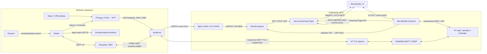
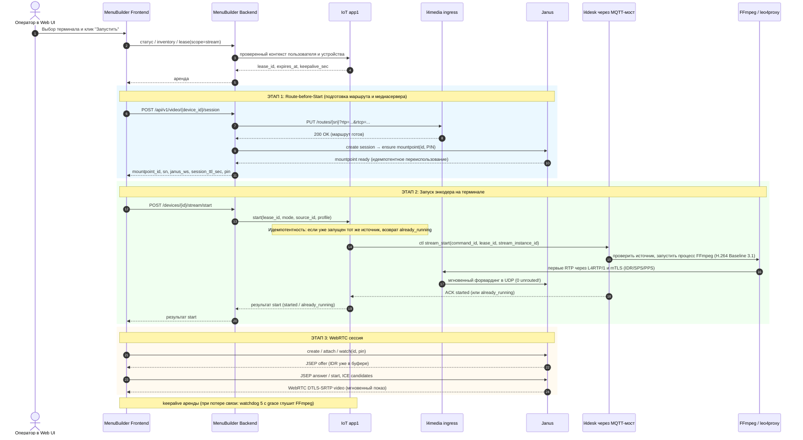
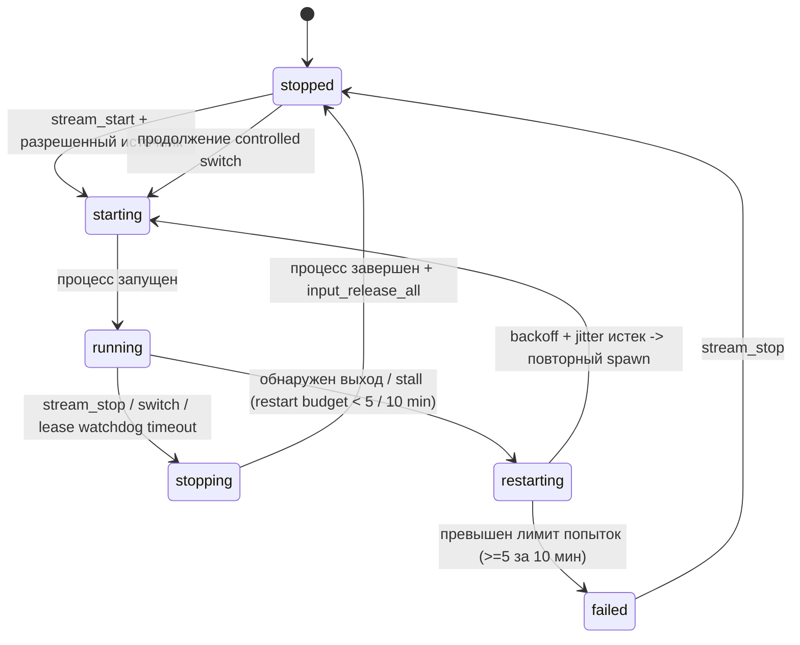
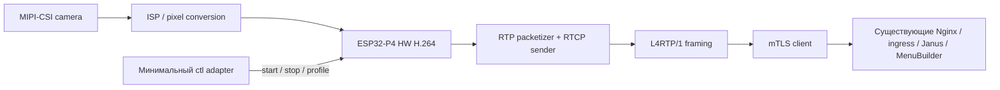

# E2E-архитектура видеонаблюдения и удаленного управления

**Срез исходников:** 11.09.2026. Актуализировано по результатам синхронизации контрактов `ctl v1` (R1 / P0), реализации Route-before-Start & Autonomous Recovery (Шаг 2), стабилизации цикла продления аренды (Шаг 3), а также ревизии контрактов, координации сессии (SessionLifecycleCoordinator), валидации RTP-свежести и устранения инцидента 2026-09-11 F1–F9 (Шаг 4) между `iot-rpc-rest-app` (`app1`), `MenuBuilder` (BFF/UI), `tools/l4desk` и `l4media`.

**Область:** Windows-терминал, FFmpeg, leo4proxy, локальный Mosquitto, l4desk/l4superv, l4media/Nginx/Janus, MenuBuilder и IoT app1/RabbitMQ; направления Linux и ESP32-P4. Это описание live video и remote input, **не** системы архивной записи/NVR. Аудио, запись, хранение и воспроизведение архива в описанном тракте не реализованы.

Документ состоит из двух частей: **[краткая архитектура](#part-1)** для общего понимания и **[детальная архитектура](#part-2)** для разработки и эксплуатации. В подробной части: [оркестрация](#orchestration), [контракты](#contracts), [безопасность](#security), [надежность и развертывание](#reliability), [Linux и ESP32-P4](#ports), [источники](#sources).

Обозначения: **сейчас** — подтверждено статическим чтением указанных исходников; **ограничение** — обнаруженная граница или расхождение реализаций; **предложение** — еще не реализованное целевое поведение. Репозиторные настройки не выдаются за проверенную конфигурацию production. Нагрузочные, аппаратные и сетевые измерения в рамках подготовки документа не выполнялись.

<a id="part-1"></a>
## Часть 1. Краткая версия

### 1.1. Главное: это три взаимосвязанных, но разных канала

1. **Медиаканал:** экран или камера → FFmpeg/H.264 → RTP/RTCP → leo4proxy → mTLS/TCP → Nginx → l4media ingress → RTP/RTCP/UDP → Janus → WebRTC → браузер MenuBuilder.
2. **Управление устройством:** браузер → MenuBuilder BFF → IoT app1 → RabbitMQ/AMQP–MQTT → leo4proxy → локальный Mosquitto → l4desk. По нему идут аренда, инвентаризация, start/stop и ввод, но не видеокадры.
3. **Сигнализация WebRTC:** браузер ↔ публичный Janus endpoint через reverse proxy ↔ Janus. Здесь идут `watch`, JSEP/SDP, ICE и keepalive. Создание mountpoint выполняет отдельно MenuBuilder backend через внутренний Janus HTTP API.

Таким образом, исходные цепочки верны по направлению, но требуют двух уточнений: **между Janus и MenuBuilder видео приходит прямо в браузер, не через FastAPI**; **control WebSocket проходит через MenuBuilder BFF, а не дает браузеру прямой доступ к app1**. Nginx медиавхода работает в режиме `stream` с TLS, а не как HTTP-видеосервер.



Стрелка `l4desk → FFmpeg` — управление процессом. Ввод исполняется l4desk через API ОС, не через FFmpeg. Одно имя `leo4proxy` на схеме объединяет два разных транспорта; медиасоединение и MQTT-соединение не мультиплексируются друг в друга.

### 1.2. Кто за что отвечает

| Компонент | Ответственность | Чего от него не следует ожидать |
|---|---|---|
| FFmpeg | Захват экрана/камеры, кодирование H.264, RTP-пакетизация | Авторизация оператора, аренды, удаленный ввод |
| l4desk | Инвентаризация, локальная политика, управление FFmpeg, ввод в интерактивной сессии | WebRTC, публичный TLS endpoint, глобальный реестр пользователей |
| l4superv | Жизненный цикл локальных компонентов и запуск агента в пользовательской сессии | Владение арендами app1 |
| Mosquitto + leo4proxy | Локальная MQTT-шина и защищенный выход; отдельно — медиатуннель | Подтверждение того, что браузер видит кадры |
| l4media ingress | Разбор L4RTP/1, `SN → RTP/RTCP ports`, счетчики | Декодирование, транскодирование, WebRTC signaling |
| Janus | Streaming mountpoint, SDP/ICE/DTLS-SRTP, доставка одному или нескольким подписчикам | Захват, H.264-транскодирование, бизнес-аренды |
| IoT app1 | Авторитет аренды, scope/владелец/TTL, публикация ctl, корреляция ACK/NACK | Пересылка видеокадров |
| MenuBuilder BFF/UI | Tenant/permission gate, операторский UX, прокси управления, подготовка просмотра | Источник локальной истины о живом процессе и кадрах |

### 1.3. Нормальный сценарий оператора

1. Оператор проходит авторизацию; BFF проверяет разрешения и принадлежность устройства организации.
2. UI получает состояние агента/источники, берет аренду `scope=stream`.
3. **Подготовка медиаканала (Route-before-Start):** UI запрашивает сессию `POST /api/v1/video/{device_id}/session`. BFF регистрирует ingress route (`PUT /routes/{sn}`) и подготавливает Janus mountpoint с PIN. Маршрут и Janus готовы принимать UDP-дейтаграммы до старта энкодера.
4. **Запуск энкодера на терминале:** UI запрашивает старт выбранного источника `POST /devices/{id}/stream/start`. app1 валидирует аренду (идемпотентно: повторный start для того же источника возвращает `already_running` с сохранением действующего `stream_instance_id`), отсылает ctl `stream_start`; l4desk проверяет политику и запускает FFmpeg.
5. Первые же RTP/RTCP-дейтаграммы (IDR/SPS/PPS) от FFmpeg через leo4proxy и ingress мгновенно попадают в готовый Janus mountpoint (0 unrouted пакетов). UI выполняет Janus `watch` и обмен SDP/ICE; браузер сразу декодирует ключевой кадр без 2-секундного ожидания.
6. Для ввода нужна аренда со scope `input`, desktop-источник и разрешенная локальная политика. Камера всегда view-only. Команды ввода обогащаются контекстом active lease (`desktop_id`, `stream_instance_id`), координаты нормализуются к диапазону `0..65535`. Оверлей ввода в UI блокирует отправку событий мыши (`sendMove`), если активен режим камеры или трансляция не в режиме `desktop`, а обработчик `wheel` использует непассивный слушатель `{ passive: false }`, исключая ошибки в консоли браузера.
7. **Сквозное удержание аренды (Keepalive Chain):** UI каждые 5 секунд вызывает `POST /api/v1/video/devices/{device_id}/control/keepalive`. BFF транслирует запрос в `app1`, который продлевает срок аренды и публикует команду `lease_renew` в топик `srv/{SN}/ctl`. После успешного ответа app1 BFF продлевает TTL активной video-сессии ingress через `POST /api/v1/media/sessions/renew` с проверкой SN. Агент `l4desk` обновляет локальный таймер аренды. Если keepalive прекращается, локальный watchdog и ingress TTL завершают свои ресурсы.
8. При штатном завершении запрашиваются stop (идемпотентный: повтор возвращает `already_stopped`, а ошибки 409 подавляются в BFF) и освобождение аренды, закрываются control WS и Janus-сессия. При разрыве связи на терминале срабатывает локальный fail-closed watchdog (5 с grace), принудительно останавливающий FFmpeg и сбрасывающий удерживаемый ввод через `input_release_all()`. При аварийном перезапуске агента супервизор выполняет `reconcile` (убийство осиротевшего процесса FFmpeg) и гарантированно отправляет на сервер событие `stream_event(stopped, agent_restart_reconcile)`.

**Три разные готовности:** `FFmpeg running` ≠ `свежий RTP на ingress` ≠ `браузер декодирует кадры`. Аналогично MQTT online ≠ интерактивный desktop доступен.

### 1.4. Приоритеты развития

- **P0 / R1 — согласовать контракты [ВЫПОЛНЕНО]:** расхождения `key`/`key_event`, опциональный `sn` в `stream_event`, координаты `0..65535` и серверное обогащение active lease устранены; профиль H.264 Constrained Baseline Level 3.1 зафиксирован под Janus; тесты-фикстуры добавлены, сервисы `app1` и BFF обновлены/задеплоены, бинарники `l4desk` собраны без предупреждений компилятора.
- **P1 / R6 — порядок Route-before-Start и привязка сессии [ВЫПОЛНЕНО В КОДЕ И ЗАДЕПЛОЕНО]:** в MenuBuilder (UI/BFF) реализован порядок Route-before-Start (`createVideoSession` до `startDeviceStream`), исключающий потерю начальных IDR/SPS/PPS кадров в `unrouted` и задержку до 2 с; PIN mountpoint привязан к `device_id` и `lease_id`/`stream_instance_id`, mountpoint переиспользуется идемпотентно, реализован безопасный откат при ошибках запуска; фронтенд собран и доставлен, бэкенд перезапущен на `87.242.100.34`.
- **P1 / R5 — идемпотентность управления и синхронизация жизненного цикла [ВЫПОЛНЕНО И ЗАДЕПЛОЕНО]:** в `app1` реализована идемпотентность `stream_start` (`already_running`) и `stream_stop` (`already_stopped`), исключено рассогласование сессий при повторных кликах/ретраях; при терминальных событиях `stream_event` (`stopped`/`failed`/`source_unavailable`) поля стрима в active lease очищаются, а клиентам рассылается `WsStreamState`; тесты пройдены, контейнер `app1` задеплоен на `87.242.100.34`.
- **P0 / R3 и P1 / R4 — локальный watchdog аренды и замкнутый recovery-loop [ВЫПОЛНЕНО В КОДЕ И ЗАДЕПЛОЕНО]:** в `tools/l4desk` супервизор FFmpeg замкнут в полноценный recovery-loop (перезапуск с экспоненциальным backoff, jitter и лимитом 5 попыток за 10 мин, отмена при stop); внедрен локальный fail-closed watchdog аренды (5 с grace) с функцией `input_release_all()`, исключающий утечку экрана и залипание клавиш при потере связи; бинарники x86/x64 пересобраны через `build.cmd all`.
- **Шаг 3 — стабилизация удержания аренды (Lease Keepalive), идемпотентность останова, Reconcile-события и исправление UX ввода [ВЫПОЛНЕНО И ЗАДЕПЛОЕНО]:**
  - **MenuBuilder:** Устранены 404 на эндпоинте продления аренды `POST /api/v1/video/devices/{device_id}/control/keepalive` (актуализирован и задеплоен `menubuilder-backend`), исключены ошибки 409 Conflict при `stream/stop` (сделана идемпотентная обработка), ликвидирована runtime-ошибка с пассивным листнером `wheel` и спам перемещений мыши вне desktop-режима в `RemoteControlOverlay`, настроен регулярный keepalive-цикл продления аренды каждые 5 с с обработкой ошибок и информированием оператора.
  - **tools/l4desk:** Устранена преждевременная остановка FFmpeg сторожевым таймером аренды (добавлена поддержка команд `lease_renew` и `stream_renew` в протокол `ctl`). Реализовано гарантированное оповещение сервера о принудительном завершении осиротевшего процесса FFmpeg при `reconcile` (`stopped` / `agent_restart_reconcile`), буферизация событий до подключения к брокеру MQTT и регламентирована методика тестирования recovery.
  - **iot-rpc-rest-app (app1):** Устранено замерзание видеопотока терминала: реализована отправка исходящей команды продления аренды `CtlLeaseRenew` (`lease_renew`) в топик `srv/{SN}/ctl` при каждом keepalive (REST и WebSocket). Устранена ошибка отклонения событий мыши `mode_conflict` / `input_not_allowed_in_camera_mode`: обеспечена обязательная фиксация `lease.stream_mode = "desktop"` при создании аренды со `scope in ("stream", "input")` и при повышении scope до `"input"`. Защищен статус агента от гонки LWT-сообщений брокера при рестарте `l4desk` и обеспечен сброс состояния стрима (`lease.stream_state = "stopped"`, `lease.stream_instance_id = None`) по `stream_event` со `state in ("stopped", "failed")` с оповещением WebSocket-клиентов.
- **Шаг 4 — ревизия контрактов, свежесть RTP, координатор сессии и устранение дефектов F1–F9 [ВЫПОЛНЕНО В КОДЕ И ЗАДЕПЛОЕНО]:**
  - **tools/l4desk (v1.5.0):** Устранена первопричина отбрасывания `lease_renew` (F1/F2). Добавлена проверка соответствия эпохи `stream_instance_id` (в командах ввода и при наличии в renew; NACK `stream_mismatch`) и строгая валидация дедлайна `expires_at_ms > now_ms` (NACK `invalid_payload`), исключающая фиктивное продление без обновления сторожевого таймера. Сессионный мьютекс переведен на формат с явным серийным номером (`Local\L4Desk_SingleInstance_<SN>`), исключая коллизии при интеграционных тестах. Артефакты x86 и x64 скомпилированы статически (`/MT`) и верифицированы.
  - **l4media:** Устранена проблема ложного статуса STREAMING при остановке RTP (инцидент F5): `l4media-ingress` раздельно отслеживает `last_rtp_time` и `last_activity` с порогом `RTP_STALE_DEADLINE_SEC = 10`, введены монотонная эпоха соединения `connection_epoch` и явный enum `media_state` (`receiving_fresh_media`, `stale`, `unknown`, `connected`, `disconnected`). Добавлены эндпоинты `/stats` и `/stats/<sn>`, C unit-тесты (`make test` в Dockerfile) и Python regression suite (6 сценариев). Уровень отладки Janus понижен до `debug_level = 3` (F9, исключена утечка PIN в stdout), потоковый лог Nginx направлен в `/dev/stdout` и `/dev/stderr`.
  - **MenuBuilder frontend:** Реализована архитектура единого владельца сессии `SessionLifecycleCoordinator` (F3/F4) с трекингом поколений (`generation`), неперекрывающимся расписанием keepalive, фильтрацией событий по `stream_instance_id`, безопасным detach input без освобождения общей аренды (`sharedLease`) и fail-closed предикатом `isInputPermitted`. Гарантирован безопасный сброс зажатых клавиш (`key_event` kind="up") при teardown. Написаны reproduction-тесты на Vitest с fake timers, собран и задеплоен production-бандл.
  - **MenuBuilder backend:** Нормализован контракт ошибок 404 (`{"code": "lease_not_found", ...}`) с сохранением `lease_id` и `generation`, поддержана передача `generation` в `remote_input_keepalive`. DTO обновлены (`KeepaliveRequest`, `StreamStopRequest`, `WsInboundKeepalive`, `WsInboundRelease`). Переработана идемпотентность `stop_device_stream` с сохранением 409 для реальных конфликтов (owner, tenant, epoch). Статус видеопотока обогащен полями `transport_connected`, `fresh_rtp`, `media_state`, принудительно переводится в `stopped` при истечении серверной аренды. Сервис протестирован (`test_step4_video_contracts.py`) и задеплоен на `87.242.100.34`.
  - **iot-rpc-rest-app (app1):** Поле `CtlLeaseRenew` приведено к каноническому wire-полю `command_id` (UUID), что восстановило сквозную корреляцию ACK терминала и устранило отбрасывание ответов на `mqtt_bridge` (F1/F2). Поддержана семантика состояний keepalive (`renew_status`: `server_accepted`, `terminal_applied`, `terminal_pending`, `terminal_timeout`, `terminal_nack`) и `applied_deadline_ms`. Реализован безопасный идемпотентный `release` для владельца без повторных side-effects, исключен ложный сброс режима камеры в десктоп при re-acquire/upgrade, изолированы эпохи стримов от запоздалых событий прошлых сессий. Все 101 тест пройдены, контейнер задеплоен на `87.242.100.34`.
- **Текущее состояние системы:** код всех звеньев (Шаги 1, 2, 3 и 4) реализован, протестирован локальными и регрессионными наборами тестов и задеплоен на прод-сервер `87.242.100.34`.
- **Следующие шаги:**
  - **P0 — закрыть безопасность (R2):** проверить связывание сертификата с SN медиапреамбулы; защита media/control management API.
  - **P1 — комплексная E2E-приемка на стенде:** длительная сессия (≥120 с) без перемещений мыши, валидация fail-closed watchdog, graceful stop и отключение ввода.
  - **P1 — упростить развертывание (R8, R9):** совместимый подписанный набор версий, единый bootstrap/preflight, защищенные локальные сокеты.
  - **P1/P2 — сетевые условия (R10):** TURN для сложных сетей, измерение задержки и head-of-line blocking TCP.
  - **Linux (R12):** платформенные захват/ввод/службы с сохранением внешних контрактов. **ESP32-P4 (R12):** stream-only RTP over TLS (L4RTP/1) на аппаратном H.264.

<a id="part-2"></a>
## Часть 2. Детальная версия

### 2.1. Границы системы и размещение

Локальная граница доверия — Windows-терминал: интерактивный l4desk, FFmpeg, loopback-сокеты и локальный Mosquitto. loopback уменьшает сетевую поверхность атаки, но не авторизует локальные процессы. Службы и пользовательский агент имеют разные привилегии и жизненные циклы; захват/ввод нельзя переносить в Session 0 без изменения модели.

Серверная media-группа в `l4media\compose.yaml`: `l4media-nginx`, `l4media-ingress`, `l4media-janus`. Внутренняя сеть — `l4media_net`; ingress и Janus также включены во внешнюю Compose-сеть `user1_default` для интеграции. Эта топология не отменяет необходимость ACL: другие контейнеры в общей сети не должны автоматически получать право менять маршруты и mountpoint.

| Участок | Транспорт/адрес по исходникам | Назначение и граница |
|---|---|---|
| FFmpeg → leo4proxy | UDP `127.0.0.1:5004`, RTCP `:5005` | Локальные RTP-пакеты, не TLS и не SRTP |
| l4desk ↔ Mosquitto | MQTT `127.0.0.1:1883`, client ID `svc_desk` | Локальный ctl |
| Mosquitto bridge ↔ leo4proxy | TCP `127.0.0.1:18883` | Выход bridge; затем отдельное защищенное MQTT-соединение к IoT |
| leo4proxy → media Nginx | mTLS/TCP, контейнер `:8443`; host port `${L4MEDIA_PORT:-8443}` | Не HTTP, не RTSP, не WebRTC от терминала |
| media Nginx → ingress | TCP `:9000` | Уже расшифрованный L4RTP/1; только доверенная сеть |
| BFF → ingress | HTTP `:9100` | Маршруты и статистика; не публичный API |
| ingress → Janus | UDP, отдельная пара RTP/RTCP на слот устройства | Janus принимает исходный H.264 без транскодирования |
| BFF → Janus | Внутренний HTTP Janus API | Создание Streaming Plugin mountpoint |
| UI ↔ Janus | Публичный endpoint signaling через reverse proxy | WebSocket/Janus JSON, JSEP/ICE; URL возвращает BFF |
| Janus ↔ браузер | ICE, DTLS-SRTP; Compose публикует UDP `20000–20100` | Медиа не проходит через BFF; диапазон не равен гарантированной емкости |
| BFF ↔ app1 | Внутренние HTTP REST + WS | Доверенный сервисный контекст, не browser API key |
| app1 ↔ RabbitMQ ↔ терминал | AMQP на сервере, MQTT на терминальной стороне | Асинхронный command/reply; сообщения управления, не видео |

Публичные IoT/MQTT endpoint и порты определяются развертыванием внешнего репозитория, а не портом media `8443`. Нельзя одним изменением адреса медиавхода перенастроить control-plane.

<a id="orchestration"></a>
### 2.2. Оркестрация просмотра и удаленного управления

#### 2.2.1. Запуск и подключение зрителя



В реализации **Route-before-Start** сессия просмотра и маршрут в ingress регистрируются **до** отправки команды `stream_start` агенту. Первые RTP-пакеты от FFmpeg сразу попадают в зарегистрированный динамический маршрут (`unrouted_packets` = 0), а Janus получает начальный IDR-кадр без 2-секундного ожидания следующего GOP. При ошибке запуска на терминале в UI срабатывает безопасный откат: закрытие сессии Janus, освобождение аренды и очистка состояния плеера.

`POST /api/v1/video/{device_id}/session` — подготовка ресурса просмотра и настройка маршрута, а не запуск FFmpeg. BFF проверяет устройство/организацию/разрешение и состояние аренды app1. PIN mountpoint сохраняется в кэше с привязкой к `device_id` и `lease_id`/`stream_instance_id`, исключая деструктивное пересоздание mountpoint при повторном открытии или подключении viewer.

В `janusClient.ts` используется WebSocket subprotocol Janus, отдельные session/handle/transaction IDs, trickle ICE и keepalive каждые 25 с. PeerConnection сейчас настроен с Google STUN, **без TURN**. STUN помогает обнаружить адрес, но не ретранслирует медиа; для сетей с заблокированным UDP нужен проверенный relay-сценарий. Локальный callback `streaming` вызывается после отправки SDP answer/start, до подтверждения декодированного кадра — его нельзя использовать как единственную метрику успешного просмотра.

#### 2.2.2. Локальная модель состояния



Схема показывает существенные переходы, включая замкнутый recovery-loop и локальный fail-closed watchdog.

- l4desk инвентаризирует дисплеи и DirectShow-камеры. Идентификаторы имеют вид `disp:<fnv1a_hex>` и `cam:<fnv1a_hex>`; локальная политика дисплеев — `input`, `view`, `denied`. Геометрия учитывает виртуальный экран, включая отрицательные координаты.
- Бинарник FFmpeg берется из `<base>\ffmpeg\ffmpeg.exe`; базовое размещение — `C:\l4tools`. Запуск скрытый, с перенаправленными stdin/stdout/stderr, Job Object и журналом.
- Controlled switch — **последовательные stop старого и start нового**, а не бесшовная смена без потери кадров. Непрерывность SSRC/декодирования между источниками не гарантируется.
- Остановка: `q\n` в stdin → ожидание до 5 с → принудительное завершение Job/process при необходимости. ACK остановки означает завершенный процесс, а не только прием команды.
- Файл состояния `<base>\l4desk\state\ffmpeg_state.json` используется для reconciliation. При работе с оставшимся PID требуется проверка creation time и метаданных: один PID не доказывает владение процессом.
- В supervisor `tools/l4desk` (`ffmpeg_supervisor.c`) замкнут **recovery-loop**: при выходе процесса, stall более 10 с или потере источника супервизор проверяет скользящий бюджет перезапусков (не более 5 попыток за 10 минут) и рассчитывает задержку с экспоненциальным backoff и jitter. В состоянии `restarting` по истечении таймера выполняется повторный запуск процесса FFmpeg с активными параметрами (`mode`, `source_id`, `profile`, `stream_instance_id`). При успехе отсылается `stream_event(state="running", reason="recovered")`. Превышение лимита переводит стрим в `failed` (`reason="restart_limit"`). Команда `stream_stop` немедленно отменяет запланированный перезапуск.
- **Локальный watchdog аренды (Fail-Closed):** агент отслеживает `expires_at_ms`. Если связь с сервером прервана и локальное время превышает `expires_at_ms + 5000` (5 с grace), супервизор принудительно останавливает FFmpeg, вызывает `input_release_all()` (отпускание всех зажатых клавиш клавиатуры и кнопок мыши) и переводит стрим в `stopped` (`reason="lease_expired"`), предотвращая утечку рабочего стола и залипание ввода.

**Инвариант целевого локального reconciler:** не более одного encoder-процесса на активный источник/выход; только действующая авторизация разрешает `running`; отмена desired state отменяет и отложенный restart. Автономность означает восстановление разрешенного состояния, а не бессрочную трансляцию после потери сервера.

#### 2.2.3. Сроки жизни и завершение

| Механизм | Что поддерживает | Чего не подтверждает |
|---|---|---|
| app1 lease keepalive | Аренду владельца/scope до `expires_at` | Свежий кадр, живой encoder, остановку после потери связи |
| Janus keepalive | Janus signaling session | Действительность бизнес-аренды |
| MQTT presence/LWT | Состояние агента/соединения по правилам канала | Работоспособность захвата или ввод в доступную сессию |
| L4RTP keepalive | Активность TCP-туннеля | Свежий RTP и декодирование |
| `session_ttl_sec` ответа BFF | Декларируемое время видеосессии | Самостоятельный серверный таймер отзыва уже подключенного зрителя |

app1 при отзыве stream/input-аренды публикует stop без ожидания ACK. При недоступном агенте это best effort. Поэтому безопасное завершение требует трех независимых действий: отозвать право в app1, остановить локальную трансляцию/ввод, закрыть доступ к медиаресурсу в Janus. Закрытие вкладки — удобный cleanup, но не механизм безопасности.

Идемпотентность в `app1`: повторный вызов `stream_start` при уже активном источнике возвращает `already_running` с тем же `stream_instance_id` без отправки дублирующей команды в MQTT, исключая сброс эпохи стрима у подключенных клиентов. Повторный вызов `stream_stop` при отсутствующем стриме возвращает `already_stopped` (HTTP 200 OK вместо 409 Conflict). При получении терминальных событий `stream_event` (`stopped`, `failed`, `source_unavailable`) `app1` автоматически очищает `stream_instance_id` в active lease и транслирует `WsStreamState` во все активные WebSocket-сессии.

<a id="contracts"></a>
### 2.3. Контракт медиа: H.264, RTP и L4RTP/1

#### 2.3.1. Кодек и ожидания Janus

Сейчас backend создает RTP mountpoint с `video=true`, `audio=false`, `videopt=96`, `videocodec=h264`, `videofmtp="profile-level-id=42e01f;packetization-mode=1"`. Это заявка на constrained-baseline/Level 3.1 с non-interleaved packetization; Janus **не перекодирует** неподходящий H.264 под эту заявку.

В локальном генераторе FFmpeg (`tools/l4desk/src/ffmpeg_cmdline.c`) профиль кодирования H.264 строго зафиксирован флагами: `-profile:v baseline -level 3.1 -x264-params bframes=0:force-cfr=1 -keyint_min %d -sc_threshold 0 -pix_fmt yuv420p`, что гарантирует полное соответствие заявке Janus `profile-level-id=42e01f;packetization-mode=1`. Профиль `default` задает 25 fps и 2 Мбит/с, `low` — 15 fps и 800 Кбит/с; фиксированный GOP равен `fps * 2` с отключенной вставкой внеплановых смен сцен (`-sc_threshold 0`).

**Закрепленный media profile:** H.264 Constrained Baseline Level 3.1, RTP clock 90 kHz, PT 96, packetization-mode 1; фактические SPS/profile/level строго согласованы с SDP mountpoint Janus; регулярные IDR каждые 2 с, отсутствие B-frames для режима zerolatency. RTP packet size по умолчанию формируется FFmpeg/RTP муксером (фрагментация FU-A при превышении MTU, маркер на границе access unit; RTP timestamp кадра, sequence пакета).

В частности, 1080p нельзя автоматически объявить совместимым с `42e01f`: разрешение/FPS и ограничения H.264 level должны согласовываться с реальным SPS и SDP. Выбор аппаратного энкодера сам по себе этого не решает.

#### 2.3.2. Байтовый формат L4RTP/1

Преамбула отправляется один раз после TLS-handshake каждого нового media-соединения:

```text
offset  size  значение
0       4     ASCII "L4RT" (не строка "L4RTP/1")
4       1     version = 0x01
5       1     flags, отправитель использует 0
6       2     sn_len, unsigned big-endian
8       N     байты SN, без завершающего NUL
```

Текущий ingress принимает `sn_len` от 1 до 127, дополняет строку NUL локально. Это ограничение длины парсера, не полноценная валидация бизнес-идентичности. Канонизацию SN и недопустимость встроенного NUL следует закрепить общим контрактом.

Далее идет последовательность кадров:

```text
offset  size  значение
0       1     type: 0x01 RTP, 0x02 RTCP, 0x03 keepalive
1       1     reserved, отправитель использует 0
2       2     payload_len, unsigned big-endian
4       N     payload: целая исходная UDP-дейтаграмма
```

Для keepalive полезная нагрузка пустая. Предельный payload ingress — 65507 байт; это защитный предел парсера, **не рекомендуемый размер RTP**. TCP/TLS может дробить и склеивать записи произвольно, поэтому read не равен кадру; receiver накапливает преамбулу/заголовок/payload. Сериализация полей не зависит от endian CPU.

После reconnect преамбула отправляется заново. Новый connection с тем же SN вытесняет старый. Сейчас media identity на wire — только SN: `lease_id`, `stream_instance_id`, `desktop_id` и tenant не входят в L4RTP/1. Привязка этих сущностей находится в control-plane; нельзя обещать, что ingress проверяет lease или отсекает старый stream epoch по текущей преамбуле.

#### 2.3.3. Маршрутизация и ее пределы

```text
slot      = device_id % VIDEO_PORT_SLOTS
rtp_port  = VIDEO_PORT_BASE + 2 * slot
rtcp_port = rtp_port + 1
mountpoint_id — идентификатор ресурса Janus для устройства
SN        — ключ маршрута ingress
```

BFF делает `PUT /routes/{sn}?rtp={rtp_port}&rtcp={rtcp_port}` на control port ingress; состояние читает через `GET /stats`. Модификация маршрута не запускает encoder. Modulo-распределение допускает коллизии разных device_id, то есть само по себе не обеспечивает изоляцию видеопотоков. Нужен уникальный allocator с владением и освобождением слотов.

Пределы текущего ingress: 128 клиентов, 512 маршрутов, приемный буфер 128 KiB на клиента, idle timeout 120 с. Они не означают достижимые 128 полноскоростных потоков при заданных ресурсах: требуется нагрузочное измерение CPU/RAM/сети и числа Janus-зрителей. Динамические маршруты и mountpoint необходимо восстанавливать после рестартов соответствующих компонентов.

#### 2.3.4. RTCP и задержка

Текущий туннель переносит RTCP **от отправителя к Janus**. Наличие порта RTCP и кадра `0x02` не доказывает обратный путь Janus → encoder. Browser RTCP/PLI/NACK до Janus не превращается автоматически в запрос IDR на FFmpeg. Регулярный GOP и повтор SPS/PPS потому особенно важны при позднем подключении и после переключения.

TCP дает упорядоченную доставку, но при потере сегмента задерживает последующие пакеты — head-of-line blocking. Он не гарантирует «реальное время»: возможны рост очереди и устаревшее изображение без потери байтов. Для low-latency режима нужны ограниченные буферы, метрика возраста кадра и восстановление на ключевом кадре. Нельзя произвольно удалять байты из уже сформированного TCP-потока: отброс должен происходить на границе кадров/пакетов в контролируемой очереди с учетом декодируемости.

### 2.4. Контракты управления и идентификаторы

#### 2.4.1. Identity и владение

| Идентификатор | Назначение | Важное различие |
|---|---|---|
| `device_id`, `org_id` | Устройство и tenant в backend | SN нельзя принимать как замену проверки tenant |
| `sn` | Устройство в MQTT topics и ingress routing | Должен быть связан с сертификатом и серверной записью устройства |
| `lease_id` | Аренда app1, владелец, scope, срок | Не Janus session и не FFmpeg PID |
| `stream_instance_id` | Конкретный запуск/эпоха выбранного источника | Меняется при новом start; отсутствует в L4RTP/1 |
| `source_id` | Выбранный `desktop_id` либо `camera_id` | Смысл задается `mode` |
| `command_id` | UUID ctl, корреляция и dedup | Не browser client reference и не lease |
| `session_id` | В зависимости от контекста: пользовательская сессия либо Windows session | Эти значения нельзя смешивать; есть также отдельная Janus session |
| `mountpoint_id`, `pin` | Ресурс Janus Streaming и секрет просмотра | PIN не является JWT и не реализует срок аренды |

#### 2.4.2. Browser/BFF и BFF/app1

Публичный video API: `POST /api/v1/video/{device_id}/session` возвращает `mountpoint_id`, `sn`, `janus_ws`, `session_ttl_sec`, `pin`; `GET /api/v1/video/{device_id}/status` возвращает `streaming`, `rtp_packets`, `bytes`, `idle_sec`, `sn`. Права на просмотр, управление и источник проверяются на сервере; UI-флаги не являются защитой.

Внутренний префикс app1: `/api/internal/v1/remote-input`. Точные публичные control routes и DTO BFF определены в `video_control.py`; их нельзя считать прозрачной копией внутренних DTO app1.

| Операция | Путь относительно внутреннего префикса | Ключевые данные |
|---|---|---|
| Статус / inventory | `/devices/{sn}/status`, `/devices/{sn}/inventory` | agent, stale, inventory, lease; refresh для inventory |
| Получение аренды | `/devices/{sn}/lease` | scope, TTL; owner берется из проверенного контекста |
| Scope / keepalive / release | `/lease/{lease_id}/scope`, `/lease/{lease_id}/keepalive`, `/lease/{lease_id}` | Владелец, срок, конфликт занятости |
| Запуск / остановка | `/lease/{lease_id}/stream/start`, `/lease/{lease_id}/stream/stop` | mode, source_id, profile; stream_instance_id результата |
| Ввод REST | `/lease/{lease_id}/pointer-move`, `/mouse-click`, `/key` | Координаты либо клавиша; последние два суффикса также под `/lease/{lease_id}` |
| Ввод WS | `/ws/lease/{lease_id}` | Поток команд/результатов с контекстом сессии |
| Наблюдение WS | `/ws/watch/{sn}` | Read-only `snapshot`, затем `invalidate` для presence/stream; после сигнала BFF/UI повторно читает REST status |
| Отзыв по владельцу | `/leases/by-owner` | Cleanup пользовательских сессий |

BFF передает `X-Internal-Service-Key`, `X-Org-Id` и контекст `X-User-Id`, `X-Role`, `X-Role-Id`, `X-Session-Id`. Значения выводятся из серверной авторизации, а не из произвольных browser headers. Внутренний ключ не должен попадать в JS, query string, логи или документ. WebSocket не отменяет повторной проверки срока и владельца аренды.

Для видеовкладки MenuBuilder BFF открывает внутренний watch WS app1 после проверки `video:view`, tenant и `device_id → sn`. Браузеру BFF передает только сигнал `invalidate`, затем UI читает собственные REST status endpoints. При переподключении и после сигнала выполняется новый snapshot; hint от старого `stream_instance_id` не восстанавливает `running`. Watch не продлевает lease и не измеряет RTP или декодированные кадры. Счётчик кадров UI читает локально из WebRTC `getStats()` без HTTP-опроса `/session/status`. Поток app1 использует локальные подписки и требует одного worker (`WEB_CONCURRENCY=1`); браузерный BFF watch закрывается и переавторизуется каждые 60 секунд.

#### 2.4.3. MQTT/AMQP и ctl v1

- Сервер → устройство: MQTT `srv/{SN}/ctl`; устройство → сервер: `dev/{SN}/ctl`.
- На AMQP-стороне используются routing keys с точками; publisher строит ключ из `prefix_srv`, SN и `suffix_control`. Для обычных `srv`/`ctl` это `srv.{SN}.ctl`. SN и ACL должны соответствовать правилам преобразования MQTT topics в RabbitMQ routing keys.
- Publisher передает `correlation_id=command_id`, заголовки `correlationData`, `ctl_type` и broker expiration из TTL команды. Broker delivery/PUBACK означает доставку на транспортном уровне, не успешное выполнение в ОС.
- Mosquitto bridge конфигурируется как MQTT v5, с SN в `remote_clientid`, clean session и без persistence. Это снижает накопление старых команд, но не заменяет TTL/dedup и не гарантирует replay после разрыва.
- l4desk отправляет ctl presence с retain/QoS 1; stream_event — без retain/QoS 1. Состояние и одноразовые команды нельзя смешивать: retained команда ввода или start после reconnect опасна.

Общий envelope команд app1: `v=1`, `type`, `command_id` (UUID), `sn`, `issued_at_ms`, `expires_at_ms` (Unix time в миллисекундах); `lease_id` обязателен, кроме допускающего отсутствие аренды `inventory_get`. Срок команды и срок аренды — разные ограничения. Для `key_event` диапазон `vk` — `0..255`, `text` — не более 32 символов. Локальные whitelist/проверки могут быть строже серверных DTO.

| Команда ctl v1 | Полезные поля сверх `v`, `type`, `command_id` | Семантика |
|---|---|---|
| `inventory_get` | `lease_id` при наличии | Получить дисплеи/камеры и политику |
| `stream_start` | `lease_id`, `mode`, `source_id`, `profile`, `stream_instance_id` | `mode=desktop` либо `usb-camera`; запустить/переключить источник |
| `stream_stop` | `lease_id`, необязательный `stream_instance_id` | Остановить, учитывать повторы и чужой stream |
| `lease_renew` | `lease_id`, `ttl_sec`, `expires_at_ms` | Продлить локальный таймер аренды watchdog в l4desk (также `stream_renew`) |
| `pointer_move` | `lease_id`, координаты, привязка к desktop/stream | Высокочастотное движение; без поштучного ACK |
| `mouse_click` | Аналогично, `button` в локальном протоколе | app1 ограничивает текущий e2e API левой кнопкой |
| `key_event` | `lease_id`, desktop/stream, `kind`, `vk`, опциональный `text` | `down`, `up`, `press`; whitelist и политика агента |

Точная обязательность/nullable-поля и поля срока действия определяются DTO app1 и C-парсером, а не сокращенной таблицей. Основные результаты `ack.result`: `started`, `already_running`, `switched`, `stopped`, `already_stopped`, `injected`. ACK/NACK коррелируются по `command_id`; ACK содержит SN и может нести inventory/stream. Примеры отказов: `lease_mismatch`, `desktop_mismatch`, `stream_mismatch`, `source_not_allowed`, `source_unavailable`, `session_unavailable`, `busy_transition`, `ffmpeg_missing`, `invalid_profile`, `expired`, `unsupported`, `inject_failed`.

`presence` содержит доступность desktop/session, screen geometry, inventory, stream и timestamp. `stream_event` сообщает изменение состояния. Нельзя принимать retained online без оценки `last_seen`/stale как доказательство текущей доступности агента.

**Существующий `svc_desk`:** по отдельному сценарию `AGENTS.md` Will — JSON presence offline на `dev/{SN}/ctl`, retain/QoS 1; после CONNACK — подписка на `srv/{SN}/ctl`, online presence и обновление каждые 30 с; штатный offline — перед DISCONNECT. Его нельзя переименовывать в `extra_service` или переносить presence на `dev/{SN}/svc`: этот retained-топик используется `l4con`, что создаст last-wins конфликт.

**Presence приложения и ctl presence — разные контракты.** При будущей разработке нового MQTT-клиента сначала требуется ответ владельца: «Какой тип MQTT-клиента создаётся: main_app или extra_service?». Для `main_app` обязательны `dev/{SN}/app`, `app_online`/`app_offline`; для `extra_service` — `dev/{SN}/svc`, `svc_online`/`svc_offline`. В обоих случаях Will задается до CONNECT с retain, online публикуется с retain только после успешного CONNACK, штатный offline с retain — перед DISCONNECT, аварийный — через Will. Тип нового клиента в этом документе не выбирается; для нового клиента ctl presence не заменяет выбранный сценарий. Совместное размещение нескольких владельцев одного retained status topic требует отдельного согласования, не автоматического объединения.

### 2.5. Подтвержденные расхождения и пределы совместимости

Эта таблица — результат сопоставления текущих исходников, а не отчет о воспроизведенных production-инцидентах. Она важнее расширенных обещаний отдельных README.

| Область | Что сейчас различается / статус | Следствие / актуальное состояние |
|---|---|---|
| Клавиатура WS | **Устранено [R1].** BFF нормализует `key` → `key_event`; app1 валидирует `Literal["key_event", "key"]` | Клавиатурный ввод полностью синхронизирован e2e (UI ↔ BFF ↔ app1 ↔ l4desk) |
| Привязка ввода | **Устранено [R1].** BFF автоматически обогащает команды active lease (`desktop_id`, `stream_instance_id`) | Команды ввода жестко привязаны к активному экрану и эпохе стрима; mismatch отсекается |
| Stream event | **Устранено [R1].** В схеме `CtlStreamEvent` (app1) поддержано опциональное поле `sn` | События смены состояния стрима от l4desk успешно валидируются и транслируются в UI |
| Координаты | **Устранено [R1].** UI и BFF округляют и ограничивают координаты в диапазон `0..65535` | Исключена неоднозначность масштабирования: l4desk нормализует `0..65535` к виртуальному экрану |
| Мышь | Локальный агент знает left/right/middle; app1 принимает только left | Документировать left как текущее пересечение, остальные кнопки — отдельное расширение |
| Статус start | В BFF есть compatibility fallback, возвращающий `running` без терминального подтверждения | Legacy-ответ не равен ACK агента и не доказывает живой поток; явно маркировать степень подтверждения |
| Статус ingress | Накопленный `rtp_packets` и общая активность соединения | Keepalive может поддерживать активность без нового кадра. Нужны `last_rtp_at` и дельты, затем browser decode stats |
| H.264 | **Устранено [R1].** FFmpeg строго зафиксирован на Baseline Level 3.1 под SDP Janus | Исключены ошибки несовместимости профилей H.264 в WebRTC декодерах браузеров |
| PIN и mountpoint | **Устранено [R6].** В BFF PIN привязан к `device_id` и `lease_id`/`stream_instance_id`; Janus mountpoint переиспользуется идемпотентно | Исключены конфликты и сброс mountpoint при повторном открытии сессии или подключении viewer |
| Порядок старта (Route-before-Start) | **Устранено [R6].** UI запрашивает сессию (маршрут ingress + mountpoint) ДО отправки `stream_start` агенту | Первые IDR-кадры не теряются в `unrouted_packets`; задержка первого кадра сокращена до sub-second |
| Идемпотентность start/stop | **Устранено [R5].** В `app1` реализована идемпотентность `stream_start` (`already_running`) и `stream_stop` (`already_stopped`) | Исключены ошибки 409 Conflict и сброс `stream_instance_id` при повторных запросах/ретраях; lease синхронизируется с `stream_event` |
| Самовосстановление FFmpeg | **Устранено [R4].** В `l4desk` замкнут recovery-loop с backoff, jitter и лимитом 5 попыток за 10 мин | Сбой процесса FFmpeg или stall автоматически восстанавливается без ручного вмешательства; stop отменяет перезапуск |
| Локальный watchdog аренды | **Устранено [R3].** В `l4desk` внедрен fail-closed watchdog (5 с grace) и функция `input_release_all()` | При разрыве связи трансляция экрана принудительно останавливается, зажатые клавиши и кнопки мыши сбрасываются |
| Продление аренды (Keepalive) | **Устранено (Шаг 3).** UI каждые 5 с вызывает keepalive; app1 публикует исходящую команду `CtlLeaseRenew` (`lease_renew`) в топик `srv/{SN}/ctl` при каждом keepalive (REST и WS); l4desk сдвигает `expires_at_ms` | Исключена ложная остановка FFmpeg через 20 с fail-closed watchdog'ом при штатном просмотре; поток стабилен |
| Идемпотентность stream/stop в BFF | **Устранено (Шаг 3).** BFF перехватывает 409 Conflict ("no active stream") и возвращает 200 OK | Исключены ошибки 409 в консоли браузера при остановке уже завершенного потока, очищается PIN mountpoint |
| Reconcile и синхронизация стрима | **Устранено (Шаг 3).** В `l4desk` при `reconcile` (taskkill) осиротевший FFmpeg завершается с отправкой `stream_event(stopped, agent_restart_reconcile)`; в `app1` по `stream_event(stopped/failed)` сбрасываются `lease.stream_state = "stopped"` и `lease.stream_instance_id = None` с уведомлением WS-клиентов | Предотвращен рассинхрон («В эфире» при мертвом видео); сервер и UI немедленно узнают о прекращении трансляции |
| Статус агента (LWT vs Presence) | **Устранено (Шаг 3).** В `app1` статус агента защищен от гонки LWT-сообщений брокера при рестарте `l4desk` (гарантированное выставление online при получении presence) | Исключена ситуация «Агент офлайн» при успешно переподключившемся и работающем процессе `l4desk` |
| Режим трансляции и мышь UI | **Устранено (Шаг 3).** В `app1` обеспечена фиксация `lease.stream_mode = "desktop"` при создании со `scope in ("stream", "input")` и при upgrade до `"input"`; в UI `pointer_move` блокируется вне desktop-режима, а `wheel` переведен на `{ passive: false }` | Ликвидированы ошибки `mode_conflict` / `input_not_allowed_in_camera_mode`, runtime-ошибка DOM `Unable to preventDefault` и спам перемещений мыши |
| Поле `command_id` в `lease_renew` (F1) | **Устранено (Шаг 4).** В `app1` `CtlLeaseRenew` сериализует каноническое wire-поле `command_id` UUID (вместо `cmd_id`) | Агент `l4desk` корректно распознает команду продления, ликвидирован NACK `invalid_payload` и отбрасывание ответов на `mqtt_bridge` |
| Корреляция и семантика keepalive (F2) | **Устранено (Шаг 4).** В `app1` поддержана семантика `renew_status` (`server_accepted`, `terminal_applied`, etc.) и поле `applied_deadline_ms` | Полная наблюдаемость подтверждения аренды терминалом; устранено фиктивное продление без обновления локального таймера |
| Единый владелец сессии и аренды (F3) | **Устранено (Шаг 4).** В UI внедрен `SessionLifecycleCoordinator` с трекингом поколений (`generation`), неперекрывающимся расписанием keepalive и безопасным `detachInput()` | Исключен преждевременный DELETE lease при отключении ввода, последующий 404 на keepalive и повторные side-effects |
| Фильтрация эпох стрима (F4) | **Устранено (Шаг 4).** В `l4desk` валидируется `stream_instance_id` (в командах ввода и при наличии в renew; NACK `stream_mismatch`); в BFF и `app1` отфильтровываются устаревшие события прошлых эпох | Запоздалые события старой сессии не затирают активную новую трансляцию |
| Свежесть RTP и статус стрима (F5) | **Устранено (Шаг 4).** В `l4media-ingress` разделены `last_rtp_time` и `last_activity` с дедлайном `RTP_STALE_DEADLINE_SEC = 10` и enum `media_state`; BFF вычисляет `fresh_rtp` и сбрасывает статус при истекшей аренде | Ликвидирован ложный статус «В эфире» при остановленном или застывшем видеопотоке |
| Валидация дедлайна аренды (F6) | **Устранено (Шаг 4).** В `l4desk` добавлена строгая проверка `expires_at_ms > now_ms` и верхнего предела эпохи (NACK `invalid_payload`) | Исключено фиктивное продление локальной аренды с некорректным или истекшим временем дедлайна |
| Изоляция тестов l4desk (F7) | **Устранено (Шаг 4).** Сессионный мьютекс `l4desk` именуется с учетом SN: `Local\L4Desk_SingleInstance_<SN>` | Исключены конфликты запуска тестов на хосте с работающей службой |
| Конфиденциальность логов Janus (F9) | **Устранено (Шаг 4).** В `janus.jcfg` уровень отладки понижен до `debug_level = 3`, логи Nginx перенаправлены в stdout/stderr | Исключена утечка PIN и тел запросов в открытый лог контейнера |

<a id="security"></a>
### 2.6. Безопасность и границы доверия

1. **Это e2e-архитектура, но не end-to-end encryption от камеры до оператора.** mTLS заканчивается на media Nginx; внутри серверной сети идет открытый L4RTP/RTP. Janus является доверенным WebRTC endpoint и участвует в DTLS-SRTP. Серверная сторона имеет доступ к медиаданным.
2. **mTLS ≠ авторизация SN из payload.** Nginx проверяет сертификат, ingress читает SN из преамбулы. В проверенном пути не установлена криптографическая привязка этих двух идентичностей. Для raw TCP нельзя просто добавить HTTP `X-Client-*` headers. Нужно отдельное согласованное решение: доверенная передача identity из TLS terminator и проверка binding, либо TLS termination в ingress. Сохраняющий L4RTP/1 вариант должен решать это на доверенной server-side границе, без самодельных заголовков клиента.
3. **Duplicate SN — не механизм anti-clone.** Новое соединение вытесняет старое; без cert↔SN binding это также риск перехвата маршрута/отказа в обслуживании. Нужны аудит сертификата/серийного номера/соединения и политика конфликтов.
4. **Авторизация зрителя и медиаресурса разделены.** BFF проверяет tenant/permissions; Janus PIN ограничивает `watch`, но не дает автоматически TTL, owner binding или принудительный revoke. Ротация PIN не должна считаться отключением уже подключенного viewer без проверки Janus lifecycle.
5. **Control-plane fail-closed.** Нельзя доверять lease ID без владельца, scope, срока и источника. Локальное разрешение должно истекать даже при потере MQTT, а старые команды — отклоняться после switch/reconnect. Обработка key-up и освобождение удерживаемых клавиш необходимы при разрыве/отзыве.
6. **Защита локальной машины.** Loopback MQTT/UDP не защищен от другого локального процесса. Нужны минимальные ACL, права на policy/state/binaries, проверка происхождения FFmpeg и ограничение привилегий. Secure Desktop/UAC/Session 0 не обходятся удаленным агентом; недоступность должна возвращаться оператору как отказ.
7. **Требование к management API.** ingress `:9100`, Janus management/Streaming create-destroy и app1 internal API нельзя публиковать напрямую в Интернет. Browser signaling должен разрешать необходимый просмотр, но не давать произвольное создание/удаление mountpoint. Для cookie-auth WS нужны проверка Origin и ограничения размера/частоты сообщений. Выполнение этих требований в production требует отдельного аудита.
8. **Секреты и наблюдаемость.** Ключи сертификатов, внутренние service keys, JWT, PIN и содержимое клавиатурного ввода не записываются в обычные логи. Доступ к захвату экрана платежного терминала требует аудита и политики приватности; добавление записи — отдельный проект с retention/access requirements.

<a id="reliability"></a>
### 2.7. Задачи надежности, автономности и упрощения развертывания

Все сроки и числа в критериях ниже — **предлагаемые цели приемки**, а не измеренные SLA. Перед обещанием SLA нужны замеры на целевом терминале и сети.

| ID / приоритет | Задача и владелец | Проверяемый результат |
|---|---|---|
| R1 / P0 | **✓ ВЫПОЛНЕНО:** Единые ctl/REST/WS fixtures: MenuBuilder + app1 + l4desk | Контракты `ctl v1` синхронизированы во всех трех звеньях (`app1`, `MenuBuilder BFF/UI`, `l4desk`), добавлены комплексные контрактные тесты-фикстуры, зафиксирован H.264 Baseline 3.1, обновлены и задеплоены сервисы `app1` и `menubuilder-backend`, собраны бинарники `l4desk` x86/x64 |
| R2 / P0 | Cert↔SN binding, защита media/control management API: proxy/ingress/app1 | Клиент с валидным сертификатом A не может публиковать SN B; неверный tenant/владелец/PIN не получает видео/ввод; duplicate SN аудируется |
| R3 / P0 | **✓ ВЫПОЛНЕНО В КОДЕ (Шаг 2):** Локальное истечение разрешения и fail-closed watchdog: l4desk | Разрыв MQTT не оставляет бессрочный ввод/стрим; локальный watchdog (5 с grace) принудительно останавливает FFmpeg и сбрасывает ввод через `input_release_all()`; бинарники x86/x64 пересобраны *(ожидает сквозной E2E-верификации)* |
| R4 / P1 | **✓ ВЫПОЛНЕНО В КОДЕ (Шаг 2):** Замкнутый recovery-loop FFmpeg: l4desk/l4superv | Kill/stall → автоперезапуск с экспоненциальным backoff и jitter; лимит не более 5 попыток за 10 мин; stop отменяет restart, исключен запуск двух энкодеров; бинарники x86/x64 пересобраны *(ожидает сквозной E2E-верификации)* |
| R5 / P1 | **✓ ВЫПОЛНЕНО И ЗАДЕПЛОЕНО (Шаг 2):** Идемпотентный start/stop и синхронизация жизненного цикла: app1 | Повторный `stream_start` возвращает `already_running` с сохранением `stream_instance_id`; `stream_stop` возвращает `already_stopped`; `stream_event` очищает стрим в active lease; тесты пройдены, контейнер `app1` задеплоен на `87.242.100.34` *(ожидает сквозной E2E-верификации)* |
| R6 / P1 | **✓ ВЫПОЛНЕНО И ЗАДЕПЛОЕНО (Шаг 2):** Route-before-Start и стабилизация сессий: MenuBuilder (UI/BFF) | Маршрут ingress и mountpoint Janus настраиваются до старта FFmpeg (0 unrouted); PIN привязан к lease, mountpoint переиспользуется; безопасный откат при сбоях; UI собран и доставлен, бэкенд перезапущен на `87.242.100.34` *(ожидает сквозной E2E-верификации)* |
| R7 / P1 | **✓ ВЫПОЛНЕНО В КОДЕ И ЗАДЕПЛОЕНО (Шаг 4):** Проверяемый H.264 profile, fresh-frame telemetry (fresh RTP в ingress и BFF), bounded queues: FFmpeg/proxy/ingress/UI | PT/SPS/SDP согласованы; в `l4media-ingress` разделены `last_rtp_time` и транспортный keepalive, введен порог `RTP_STALE_DEADLINE_SEC = 10` и эндпоинты `/stats` / `/stats/<sn>`; в BFF статус стрима привязан к `fresh_rtp` и состоянию серверной аренды; сервисы задеплоены на `87.242.100.34` |
| R8 / P1 | Воспроизводимый установочный комплект: tools/DevOps | Один manifest совместимых l4superv/l4desk/leo4proxy/Mosquitto/FFmpeg, подписи/хеши; повторный bootstrap безопасен; конфигурация валидируется; offline-install возможен с заранее выданной identity, секреты не встроены |
| R9 / P1 | Серверный preflight/health/readiness: DevOps | Закреплены версии/digest вместо Janus `latest`; проверены сети, DNS, UDP range, public ICE address, сертификаты и срок; readiness проверяет API, а не только старт контейнера |
| R10 / P1 | TURN и ограничения сети: frontend/Janus/DevOps | Проверены UDP blocked, symmetric NAT, корпоративный proxy; TURN с короткоживущими credentials и проверкой relay candidates; стоимость relay traffic учтена |
| R11 / P2 | Обратная связь encoder: media/control | Выбран механизм запроса IDR/RTCP feedback, измерен эффект на late join и recovery; версия/совместимость определены явно, без молчаливого изменения L4RTP/1 |
| R12 / P2 | Платформенные адаптеры Linux/ESP32-P4 | Те же wire-fixtures и проверка view-only capabilities; выбраны MQTT client type, provisioning, OTA/rollback; аппаратные лимиты измерены |

> ⏳ **Текущее состояние реализации (Шаги 1, 2, 3 и 4):** Задачи R1–R7, а также ревизия контрактов `ctl v1` / `lease_renew`, устранение дефектов инцидента F1–F9, архитектура `SessionLifecycleCoordinator`, свежесть RTP и безопасный stop полностью реализованы на уровне исходного кода, сервисы `app1`, `menubuilder-backend`, `l4media` с фронтендом задеплоены на сервере `87.242.100.34`, бинарники `l4desk` (v1.5.0) собраны и протестированы. Следующим этапом является сквозная стендовая верификация (E2E) с реальным терминалом.

#### 2.7.1. Целевая локальная автономность

Локальная машина должна самостоятельно: поднять необходимые компоненты в правильном контексте; проверить сертификат/конфигурацию/доступность источника; восстановить исходящие соединения с backoff+jitter; прекратить просроченный ввод/поток; ограничить дисковые логи и очереди; после crash сверить desired/observed state. Разрыв серверной связи не должен ломать основное платежное приложение.

Уменьшать число компонентов следует после измерений: отдельный Mosquitto полезен как общая локальная шина, leo4proxy — как граница ключей/сертификатов. Их удаление только ради «одного exe» переносит broker/reconnect/TLS/key-management в агент. Сначала лучше единый installer/manifest и supervisor, а не скрытое объединение всех обязанностей в l4desk. На ESP32 эти роли могут быть задачами одной firmware при неизменной внешней границе.

#### 2.7.2. Порядок готовности при развертывании

1. **Identity и конфигурация:** SN↔device↔tenant, сертификат/CA/hostname, доступ к закрытому ключу, endpoints, MQTT ACL, часы. Секреты выдаются отдельно от пакета.
2. **Сервер:** RabbitMQ/app1, затем Janus/ingress и TLS ingress, затем доступные BFF endpoints. Порядок запуска Compose не равен готовности зависимостей: нужны healthcheck/retry.
3. **Терминал:** leo4proxy и локальная MQTT-шина, l4superv, l4desk в интерактивной сессии; инвентаризация должна стать доступна до разрешения start. FFmpeg устанавливается заранее, но запускается только по разрешению.
4. **Smoke-проверка:** статус без секретов → inventory → lease → start → свежий RTP → первый декодированный кадр → разрешенный left click на тестовом desktop → stop → освобождение ресурсов.
5. **Обновление/откат:** прекратить новые аренды, завершить активные операции по политике, обновить совместимый набор, выполнить smoke, при неудаче вернуть предыдущий подписанный набор. Не смешивать произвольные версии app1/BFF/agent со строгими DTO.

Локальный диагностический пакет должен содержать версии/архитектуру x86/x64, причины состояния, код выхода encoder, агрегированные метрики и correlation IDs; не сертификатный private key, JWT, PIN или содержимое ввода. Windows 7/старые x86 требуют отдельной матрицы TLS/FFmpeg/codec-совместимости, а не предположения «один бинарник подходит всем».

### 2.8. Наблюдаемость и сценарии отказа

Корреляция: `device_id`, SN, `lease_id`, `stream_instance_id`, `command_id`, mountpoint/Janus session, локальная OS session и generation процесса. Не все эти поля присутствуют на media wire: связь SN с stream epoch в логах должна выполняться управляющим слоем и не выдаваться за пакетную проверку ingress.

| Симптом | Сначала проверить | Не делать ложный вывод |
|---|---|---|
| Агент online, start не выполняется | Lease/scope, NACK, source policy, интерактивная сессия, бинарник FFmpeg | MQTT online не означает desktop_available |
| Start ответил running, ingress пуст | Подтвержден ли ACK; процесс, локальный UDP, TLS/SN, counters unrouted/route | Compatibility fallback не доказывает запуск |
| RTP счетчик растет, черный экран | Janus route/PT/SPS/PPS/IDR, SDP/JSEP, ICE, browser codec/decode stats | ingress не декодирует и не проверяет картинку |
| ICE не подключается | Advertised public address, UDP firewall/range, STUN/TURN, выбранная candidate pair | Рабочий HTTPS/WSS не доказывает доступность WebRTC media |
| Растет задержка без потери соединения | TCP retransmission/backpressure, очередь, encoder FPS/bitrate, render/decode | Надежная доставка TCP не равна своевременной |
| Switch ломает ввод | desktop_id/stream_instance_id, geometry, stale commands, scope | Нельзя переназначать старый клик на новый экран |
| После restart не видно видео | Route/mountpoint/PIN reconciliation, DNS Janus, старые соединения | `restart: unless-stopped` не восстанавливает прикладное состояние |
| После logout продолжает идти видео | Lease revoke, agent stop ACK, Janus viewer/mountpoint lifecycle | Cookie/logout/TTL сами по себе не закрывают PeerConnection |

Минимальные метрики: last RTP/RTCP timestamp и packet deltas, unrouted packets, reconnects, queue age/bytes, FFmpeg frame progress/exit/restart count, ACK latency/timeouts, lease conflicts, Janus sessions/handles, browser `framesDecoded`, FPS, packet loss/jitter/RTT и выбранный ICE transport. `bytes` ingress — не измеренный полезный FPS.

Стендовая приемка должна включать: потерю WAN/MQTT/TLS, kill FFmpeg/agent, зависший encoder, отключение камеры, lock/logoff/switch Windows-сессии, restart каждого серверного компонента, два оператора/две вкладки, повтор и просрочку команд, неверный SN/tenant/PIN, late join, медленный канал и UDP blocked. Цели R3/R7 измеряются отдельно; мониторинг без fault injection не доказывает восстановление.

<a id="ports"></a>
### 2.9. Linux-версия: краткое направление

Серверная архитектура не меняется. Портируются platform adapters:

- **Захват:** X11 — FFmpeg `x11grab`; Wayland — PipeWire/desktop portal или согласованный compositor API. Это разные модели разрешений; универсальный фоновый root-capture для Wayland не предполагается. Камеры — V4L2.
- **Ввод:** X11 — разрешенный механизм XTest; Wayland — разрешенные compositor/portal/libei-механизмы. `uinput` допустим только при явно спроектированных privileges/seat boundaries. Запрет secure/неразрешенных сессий остается.
- **Оркестрация:** systemd service для инфраструктуры, user service для захвата/ввода; cgroup/process group вместо Windows Job Object, корректный soft/hard stop и reconciliation без PID reuse.
- **TLS/identity:** замена SChannel на поддерживаемую TLS-библиотеку и защищенное хранение ключа; SN/cert provisioning и wire-поведение неизменны. Неэкспортируемость Windows key нельзя автоматически обещать для обычного PEM-файла Linux.
- **Контракты:** сохранить L4RTP/1, H.264/RTP profile, topics/envelope, lease/stream IDs, геометрию и semantics policies. Источники имеют стабильные platform-specific ID; не требуется совпадение Windows device path с Linux device node. Поскольку `vk` — Windows-ориентированное поле, нужна явно проверенная таблица преобразования поддерживаемых клавиш; неподдерживаемые операции возвращают отказ, а не «успех без действия».

Linux-порт не требует переноса Janus на терминал. Необходимые расширения capabilities/DTO должны быть обратно совместимы; строгая схема app1 не допускает произвольного добавления новых полей без согласования.

### 2.10. ESP32-P4: stream-only RTP over TLS

Под «rpt over tls» в постановке здесь понимается **RTP over TLS в существующей оболочке L4RTP/1**. Не RTSP-over-TLS, не RTMP и не native WebRTC publisher.



По документации Espressif ESP32-P4 имеет MIPI-CSI/ISP и аппаратный H.264 Baseline; заявляемый класс производительности — 1080p30. Это не результат измерения firmware с TLS, памятью, sensor driver и сетью. ESP32-P4 требует подходящего сетевого решения платы: Ethernet с PHY либо внешний Wi-Fi-сопроцессор; не следует рассчитывать на встроенное Wi-Fi-радио самого P4.

**Что сохраняется без изменений media-backend:** certificate/SN identity, mTLS endpoint/CA/hostname verification, байтовый L4RTP/1, PT/clock/packetization H.264, маршрутизация и Janus watch/PIN. FFmpeg и Windows leo4proxy заменяются firmware-задачами; внешнему серверу не важно, какой процесс изготовил валидные RTP-пакеты.

**Что нужно реализовать на MCU:** захват и формат входа hardware encoder, SPS/PPS/IDR, RTP sequence/timestamp/SSRC и FU-A, RTCP sender reports при поддержке профиля, framed partial writes, keepalive/reconnect, bounded queue/backpressure, проверка серверного сертификата, безопасное provision/rotation ключа, синхронизация времени, watchdog, OTA/rollback. Не отправлять Annex B elementary stream вместо RTP payload. После reconnect — новая преамбула и быстрый доступ к декодируемому IDR.

**Stream-only не означает «нет control-plane».** Чтобы сохранить on-demand UX MenuBuilder и аренды, минимальный агент обязан поддержать inventory камеры, stream_start/stop, ACK/NACK, состояние/presence, stream_instance_id и локальное истечение разрешения. Механизмы desktop/input отсутствуют: capability view-only, без принятия keyboard/mouse команд. MQTT main_app/extra_service выбирается владельцем до реализации, с обязательным соответствующим Will/online/offline-сценарием.

**Особенность текущего API:** `mode` допускает только `desktop` и `usb-camera`. MIPI-CSI — не USB. Для сохранения wire v1 можно согласовать использование `usb-camera` как совместимого значения «camera-source» с платформенно-независимым `camera_id`, честно показывая аппаратный тип в UI/документации. Если такая семантика неприемлема, необходима согласованная версия/расширение camera mode во всех строгих DTO. Нельзя самостоятельно послать `mode=mipi-camera` и обещать совместимость. Это открытое решение владельца контракта.

Чистый always-on media-only transmitter без ctl технически сможет отдавать валидный L4RTP/1 после отдельной настройки маршрута, но **не сохранит все текущие контракты аренды/on-demand управления**. Такой вариант нельзя объявлять полной заменой l4desk для MenuBuilder.

Приемка ESP32: тот же contract fixture suite; тест сертификата/SN, start/stop/replay/TTL, late join/reconnect, фактический SPS↔SDP, длительный прогон на целевом разрешении/FPS, RAM/queue watermark, температурный режим и сетевые потери. 720p/1080p и итоговый bitrate выбираются по измерениям и согласованию H.264 level, не только по паспортной скорости encoder.

<a id="sources"></a>
### 2.11. Карта первоисточников и сопровождение

При расхождении старого описания и реализации для этого среза использовался код. Исторические README/архитектурные заметки полезны как контекст, но не доказывают production-состояние.

| Источник | Что проверять при обновлении документа |
|---|---|
| [MenuBuilder video API](../MenuBuilder/backend/app/routers/video.py) | Формула портов, route API, mountpoint/PIN, session/status, аренда |
| [MenuBuilder control BFF](../MenuBuilder/backend/app/routers/video_control.py) | Permission/tenant/lease, DTO REST/WS, fallback, проксирование |
| [IoT client BFF](../MenuBuilder/backend/app/services/iot_client.py) | Внутренние URL, identity headers, WS URL |
| [Browser Janus client](../MenuBuilder/frontend/src/api/janusClient.ts) | JSEP/ICE, STUN/TURN, lifecycle и keepalive |
| [MenuBuilder configuration](../MenuBuilder/backend/app/config.py) | Настройки endpoint/портов/TTL, без чтения секретов окружения |
| [l4media compose](../l4media/compose.yaml) | Сети, контейнеры, port publishing, resource limits |
| [l4media ingress](../l4media/ingress/src/l4media_ingress.c) | Wire parsing, duplicate SN, маршруты, counters/limits |
| [l4media nginx](../l4media/nginx/) и [Janus config](../l4media/janus/) | TLS termination, management/signaling exposure, ICE/RTP настройки |
| [l4desk](../tools/l4desk/) | `src\ctl_protocol.c`, MQTT lifecycle, supervisor FFmpeg, inventory/policy/input |
| [leo4proxy](../tools/leo4proxy/) | RTP tunnel framing, SChannel и соединения; отдельно MQTT tunnel |
| [l4superv](../tools/l4superv/) | Запуск в интерактивной сессии и lifecycle локальных компонентов |
| `D:\work\iot.leo4.ru\iot-rpc-rest-app\app-service\core\remote_input` | `schemas.py`, `publisher.py`, обработка ACK/events, lease/start/stop; внешний репозиторий, относительной ссылки из этого repo нет |
| [Предыдущее описание l4media](etran_arch-l4media-streaming-architecture.md) | Детали исторического media-подпроекта; актуальные расхождения отмечены выше |

Аппаратные источники: [ESP32-P4 — Espressif](https://www.espressif.com/en/products/socs/esp32-p4), [компонент esp_h264](https://components.espressif.com/components/espressif/esp_h264). Паспортные возможности не заменяют измерений интегрированного клиента.

При изменении протокола обновлять одновременно: DTO BFF/app1, C/firmware parser, fixtures, сведения о совместимых версиях и этот документ. Закрытие R1–R12 отмечать только после проверки соответствующего сценария, а не после появления нового состояния/флага в README.
