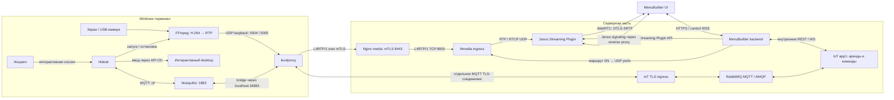
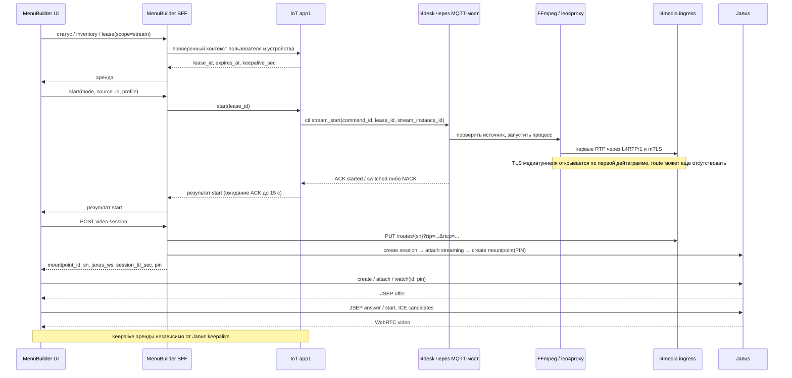
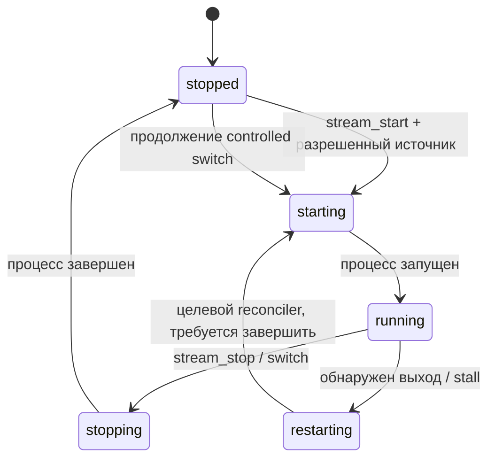
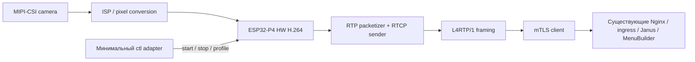

# E2E-архитектура видеонаблюдения и удаленного управления

**Срез исходников:** 10.09.2026. `etranprocessing`: `a9cb848`; внешний `iot-rpc-rest-app`: `4805b40` (`D:\work\iot.leo4.ru\iot-rpc-rest-app`).

**Область:** Windows-терминал, FFmpeg, leo4proxy, локальный Mosquitto, l4desk/l4superv, l4media/Nginx/Janus, MenuBuilder и IoT app1/RabbitMQ; направления Linux и ESP32-P4. Это описание live video и remote input, **не** системы архивной записи/NVR. Аудио, запись, хранение и воспроизведение архива в описанном тракте не реализованы.

Документ состоит из двух частей: **[краткая архитектура](#part-1)** для общего понимания и **[детальная архитектура](#part-2)** для разработки и эксплуатации. В подробной части: [оркестрация](#orchestration), [контракты](#contracts), [безопасность](#security), [надежность и развертывание](#reliability), [Linux и ESP32-P4](#ports), [источники](#sources).

Обозначения: **сейчас** — подтверждено статическим чтением указанных исходников; **ограничение** — обнаруженная граница или расхождение реализаций; **предложение** — еще не реализованное целевое поведение. Репозиторные настройки не выдаются за проверенную конфигурацию production. Нагрузочные, аппаратные и сетевые измерения в рамках подготовки документа не выполнялись.

<a id="part-1"></a>
## Часть 1. Краткая версия

### 1.1. Главное: это три взаимосвязанных, но разных канала

1. **Медиаканал:** экран или камера → FFmpeg/H.264 → RTP/RTCP → leo4proxy → mTLS/TCP → Nginx → l4media ingress → RTP/RTCP/UDP → Janus → WebRTC → браузер MenuBuilder.
2. **Управление устройством:** браузер → MenuBuilder BFF → IoT app1 → RabbitMQ/AMQP–MQTT → leo4proxy → локальный Mosquitto → l4desk. По нему идут аренда, инвентаризация, start/stop и ввод, но не видеокадры.
3. **Сигнализация WebRTC:** браузер ↔ публичный Janus endpoint через reverse proxy ↔ Janus. Здесь идут `watch`, JSEP/SDP, ICE и keepalive. Создание mountpoint выполняет отдельно MenuBuilder backend через внутренний Janus HTTP API.

Таким образом, исходные цепочки верны по направлению, но требуют двух уточнений: **между Janus и MenuBuilder видео приходит прямо в браузер, не через FastAPI**; **control WebSocket проходит через MenuBuilder BFF, а не дает браузеру прямой доступ к app1**. Nginx медиавхода работает в режиме `stream` с TLS, а не как HTTP-видеосервер.



Стрелка `l4desk → FFmpeg` — управление процессом. Ввод исполняется l4desk через API ОС, не через FFmpeg. Одно имя `leo4proxy` на схеме объединяет два разных транспорта; медиасоединение и MQTT-соединение не мультиплексируются друг в друга.

### 1.2. Кто за что отвечает

| Компонент | Ответственность | Чего от него не следует ожидать |
|---|---|---|
| FFmpeg | Захват экрана/камеры, кодирование H.264, RTP-пакетизация | Авторизация оператора, аренды, удаленный ввод |
| l4desk | Инвентаризация, локальная политика, управление FFmpeg, ввод в интерактивной сессии | WebRTC, публичный TLS endpoint, глобальный реестр пользователей |
| l4superv | Жизненный цикл локальных компонентов и запуск агента в пользовательской сессии | Владение арендами app1 |
| Mosquitto + leo4proxy | Локальная MQTT-шина и защищенный выход; отдельно — медиатуннель | Подтверждение того, что браузер видит кадры |
| l4media ingress | Разбор L4RTP/1, `SN → RTP/RTCP ports`, счетчики | Декодирование, транскодирование, WebRTC signaling |
| Janus | Streaming mountpoint, SDP/ICE/DTLS-SRTP, доставка одному или нескольким подписчикам | Захват, H.264-транскодирование, бизнес-аренды |
| IoT app1 | Авторитет аренды, scope/владелец/TTL, публикация ctl, корреляция ACK/NACK | Пересылка видеокадров |
| MenuBuilder BFF/UI | Tenant/permission gate, операторский UX, прокси управления, подготовка просмотра | Источник локальной истины о живом процессе и кадрах |

### 1.3. Нормальный сценарий оператора

1. Оператор проходит авторизацию; BFF проверяет разрешения и принадлежность устройства организации.
2. UI получает состояние агента/источники, берет аренду `scope=stream`.
3. Запрашивает start выбранного источника. app1 создает `stream_instance_id`, посылает ctl; l4desk проверяет политику и запускает FFmpeg.
4. После ответа start UI запрашивает видеосессию. BFF настраивает ingress route и Janus mountpoint с PIN.
5. UI выполняет Janus `watch` и обмен SDP/ICE; браузер получает видео непосредственно от Janus.
6. Для ввода нужна аренда со scope `input`, desktop-источник и разрешенная локальная политика. Камера всегда view-only. Поддержка конкретных команд ограничена пересечением реализаций, см. §2.5.
7. При завершении запрашиваются stop и освобождение аренды, закрываются control WS и Janus-сессия. Истечение аренды на сервере само по себе не является доказательством остановки FFmpeg или уже установленного WebRTC-подключения.

**Три разные готовности:** `FFmpeg running` ≠ `свежий RTP на ingress` ≠ `браузер декодирует кадры`. Аналогично MQTT online ≠ интерактивный desktop доступен.

### 1.4. Приоритеты развития

- **P0 — согласовать контракты:** несовпадения `key`/`key_event`, лишний `sn` в `stream_event`, координаты и привязка ввода к источнику. Зафиксировать единый профиль H.264 и e2e conformance fixtures.
- **P0 — закрыть безопасность:** проверить связывание сертификата с SN медиапреамбулы; локально ограничивать срок действия разрешения; реально прекращать просмотр и ввод после отзыва, а не только менять серверный статус.
- **P1 — довести автономное восстановление:** замкнутый supervisor/reconciler, bounded queues, ограниченный restart budget, восстановление маршрутов/mountpoint после рестартов, достоверные признаки готовности.
- **P1 — упростить развертывание:** совместимый подписанный набор версий, единый bootstrap/preflight, защищенные локальные сокеты, конфигурация без секретов в пакете, воспроизводимые серверные образы.
- **P1/P2 — сетевые условия:** TURN для сложных сетей, измерение задержки и head-of-line blocking TCP; отдельное решение по обратному RTCP/запросу ключевого кадра.
- **Linux:** заменить только платформенные захват/ввод/службы/хранилище ключей, сохранив внешние контракты. **ESP32-P4:** MIPI-CSI → ISP → аппаратный H.264 → RTP → L4RTP/1/mTLS; без FFmpeg, Janus на устройстве и без эмуляции desktop-ввода. Это направления реализации, не готовые клиенты.

<a id="part-2"></a>
## Часть 2. Детальная версия

### 2.1. Границы системы и размещение

Локальная граница доверия — Windows-терминал: интерактивный l4desk, FFmpeg, loopback-сокеты и локальный Mosquitto. loopback уменьшает сетевую поверхность атаки, но не авторизует локальные процессы. Службы и пользовательский агент имеют разные привилегии и жизненные циклы; захват/ввод нельзя переносить в Session 0 без изменения модели.

Серверная media-группа в `l4media\compose.yaml`: `l4media-nginx`, `l4media-ingress`, `l4media-janus`. Внутренняя сеть — `l4media_net`; ingress и Janus также включены во внешнюю Compose-сеть `user1_default` для интеграции. Эта топология не отменяет необходимость ACL: другие контейнеры в общей сети не должны автоматически получать право менять маршруты и mountpoint.

| Участок | Транспорт/адрес по исходникам | Назначение и граница |
|---|---|---|
| FFmpeg → leo4proxy | UDP `127.0.0.1:5004`, RTCP `:5005` | Локальные RTP-пакеты, не TLS и не SRTP |
| l4desk ↔ Mosquitto | MQTT `127.0.0.1:1883`, client ID `svc_desk` | Локальный ctl |
| Mosquitto bridge ↔ leo4proxy | TCP `127.0.0.1:18883` | Выход bridge; затем отдельное защищенное MQTT-соединение к IoT |
| leo4proxy → media Nginx | mTLS/TCP, контейнер `:8443`; host port `${L4MEDIA_PORT:-8443}` | Не HTTP, не RTSP, не WebRTC от терминала |
| media Nginx → ingress | TCP `:9000` | Уже расшифрованный L4RTP/1; только доверенная сеть |
| BFF → ingress | HTTP `:9100` | Маршруты и статистика; не публичный API |
| ingress → Janus | UDP, отдельная пара RTP/RTCP на слот устройства | Janus принимает исходный H.264 без транскодирования |
| BFF → Janus | Внутренний HTTP Janus API | Создание Streaming Plugin mountpoint |
| UI ↔ Janus | Публичный endpoint signaling через reverse proxy | WebSocket/Janus JSON, JSEP/ICE; URL возвращает BFF |
| Janus ↔ браузер | ICE, DTLS-SRTP; Compose публикует UDP `20000–20100` | Медиа не проходит через BFF; диапазон не равен гарантированной емкости |
| BFF ↔ app1 | Внутренние HTTP REST + WS | Доверенный сервисный контекст, не browser API key |
| app1 ↔ RabbitMQ ↔ терминал | AMQP на сервере, MQTT на терминальной стороне | Асинхронный command/reply; сообщения управления, не видео |

Публичные IoT/MQTT endpoint и порты определяются развертыванием внешнего репозитория, а не портом media `8443`. Нельзя одним изменением адреса медиавхода перенастроить control-plane.

<a id="orchestration"></a>
### 2.2. Оркестрация просмотра и удаленного управления

#### 2.2.1. Запуск и подключение зрителя



Первые пакеты могут прийти до маршрута: ingress оставляет такое соединение открытым, учитывает пакеты как `unrouted` и ожидает динамический маршрут. Это текущее поведение отличается от старого alpha-описания «неизвестный SN отклоняется». Пропуск начала потока означает ожидание следующего пригодного IDR/SPS/PPS; перестановку route-before-start можно рассматривать как улучшение, но не как уже существующий порядок UI.

`POST /api/v1/video/{device_id}/session` — подготовка ресурса просмотра, а не запуск FFmpeg. BFF проверяет устройство/организацию/разрешение и состояние аренды app1. Создание временной служебной Janus-сессии в backend не создает browser PeerConnection.

В `janusClient.ts` используется WebSocket subprotocol Janus, отдельные session/handle/transaction IDs, trickle ICE и keepalive каждые 25 с. PeerConnection сейчас настроен с Google STUN, **без TURN**. STUN помогает обнаружить адрес, но не ретранслирует медиа; для сетей с заблокированным UDP нужен проверенный relay-сценарий. Локальный callback `streaming` вызывается после отправки SDP answer/start, до подтверждения декодированного кадра — его нельзя использовать как единственную метрику успешного просмотра.

#### 2.2.2. Локальная модель состояния



Схема показывает существенные переходы, не полный enum ошибок. Последняя стрелка — **предложение**, а не доказательство существующего автоматического restart-loop.

- l4desk инвентаризирует дисплеи и DirectShow-камеры. Идентификаторы имеют вид `disp:<fnv1a_hex>` и `cam:<fnv1a_hex>`; локальная политика дисплеев — `input`, `view`, `denied`. Геометрия учитывает виртуальный экран, включая отрицательные координаты.
- Бинарник FFmpeg берется из `<base>\ffmpeg\ffmpeg.exe`; базовое размещение — `C:\l4tools`. Запуск скрытый, с перенаправленными stdin/stdout/stderr, Job Object и журналом.
- Controlled switch — **последовательные stop старого и start нового**, а не бесшовная смена без потери кадров. Непрерывность SSRC/декодирования между источниками не гарантируется.
- Остановка: `q\n` в stdin → ожидание до 5 с → принудительное завершение Job/process при необходимости. ACK остановки должен означать завершенный процесс, а не только прием команды.
- Файл состояния `<base>\l4desk\state\ffmpeg_state.json` используется для reconciliation. При работе с оставшимся PID требуется проверка creation time и метаданных: один PID не доказывает владение процессом.
- В supervisor есть проверки выхода процесса, потери источника/сессии, stall более 10 с и состояние `restarting`. Наличие этих проверок и заявленного в README restart budget не заменяет проверку реального повторного запуска; см. задачу R4.

**Инвариант целевого локального reconciler:** не более одного encoder-процесса на активный источник/выход; только действующая авторизация разрешает `running`; отмена desired state отменяет и отложенный restart. Автономность означает восстановление разрешенного состояния, а не бессрочную трансляцию после потери сервера.

#### 2.2.3. Сроки жизни и завершение

| Механизм | Что поддерживает | Чего не подтверждает |
|---|---|---|
| app1 lease keepalive | Аренду владельца/scope до `expires_at` | Свежий кадр, живой encoder, остановку после потери связи |
| Janus keepalive | Janus signaling session | Действительность бизнес-аренды |
| MQTT presence/LWT | Состояние агента/соединения по правилам канала | Работоспособность захвата или ввод в доступную сессию |
| L4RTP keepalive | Активность TCP-туннеля | Свежий RTP и декодирование |
| `session_ttl_sec` ответа BFF | Декларируемое время видеосессии | Самостоятельный серверный таймер отзыва уже подключенного зрителя |

app1 при отзыве stream/input-аренды публикует stop без ожидания ACK. При недоступном агенте это best effort. Поэтому безопасное завершение требует трех независимых действий: отозвать право в app1, остановить локальную трансляцию/ввод, закрыть доступ к медиаресурсу в Janus. Закрытие вкладки — удобный cleanup, но не механизм безопасности.

Повтор start в app1 создает новый `stream_instance_id`; повтор одного и того же `command_id` на MQTT-уровне и повтор HTTP start — разные операции. Полную e2e-идемпотентность нельзя вывести из наличия локального dedup-кеша.

<a id="contracts"></a>
### 2.3. Контракт медиа: H.264, RTP и L4RTP/1

#### 2.3.1. Кодек и ожидания Janus

Сейчас backend создает RTP mountpoint с `video=true`, `audio=false`, `videopt=96`, `videocodec=h264`, `videofmtp="profile-level-id=42e01f;packetization-mode=1"`. Это заявка на constrained-baseline/Level 3.1 с non-interleaved packetization; Janus **не перекодирует** неподходящий H.264 под эту заявку.

В локальном генераторе FFmpeg профиль `default` — 25 fps и 2 Мбит/с, `low` — 15 fps и 800 Кбит/с; GOP задается примерно на 2 с. Профиль не является гарантией фактических FPS/bitrate/latency. Генератор не фиксирует явно все параметры PT, H.264 profile/level и размера RTP-пакета. Старые ручные alpha-команды FFmpeg не следует считать актуальным продуктовым профилем.

**Предлагаемый проверяемый media profile:** H.264, RTP clock 90 kHz, PT 96, packetization-mode 1; фактические SPS/profile/level должны соответствовать SDP; SPS/PPS доступны новому подписчику, регулярные IDR, без B-frames для low-latency режима. RTP packet size целесообразно ограничить примерно 1200 байт как начальную настройку и проверить на целевых сетях. NAL больше пакета фрагментировать FU-A, marker ставить на конец access unit; RTP timestamp относится к кадру, sequence — к пакету. Это требования к унификации, **не утверждение, что они все явно закреплены текущим запуском FFmpeg**.

В частности, 1080p нельзя автоматически объявить совместимым с `42e01f`: разрешение/FPS и ограничения H.264 level должны согласовываться с реальным SPS и SDP. Выбор аппаратного энкодера сам по себе этого не решает.

#### 2.3.2. Байтовый формат L4RTP/1

Преамбула отправляется один раз после TLS-handshake каждого нового media-соединения:

```text
offset  size  значение
0       4     ASCII "L4RT" (не строка "L4RTP/1")
4       1     version = 0x01
5       1     flags, отправитель использует 0
6       2     sn_len, unsigned big-endian
8       N     байты SN, без завершающего NUL
```

Текущий ingress принимает `sn_len` от 1 до 127, дополняет строку NUL локально. Это ограничение длины парсера, не полноценная валидация бизнес-идентичности. Канонизацию SN и недопустимость встроенного NUL следует закрепить общим контрактом.

Далее идет последовательность кадров:

```text
offset  size  значение
0       1     type: 0x01 RTP, 0x02 RTCP, 0x03 keepalive
1       1     reserved, отправитель использует 0
2       2     payload_len, unsigned big-endian
4       N     payload: целая исходная UDP-дейтаграмма
```

Для keepalive полезная нагрузка пустая. Предельный payload ingress — 65507 байт; это защитный предел парсера, **не рекомендуемый размер RTP**. TCP/TLS может дробить и склеивать записи произвольно, поэтому read не равен кадру; receiver накапливает преамбулу/заголовок/payload. Сериализация полей не зависит от endian CPU.

После reconnect преамбула отправляется заново. Новый connection с тем же SN вытесняет старый. Сейчас media identity на wire — только SN: `lease_id`, `stream_instance_id`, `desktop_id` и tenant не входят в L4RTP/1. Привязка этих сущностей находится в control-plane; нельзя обещать, что ingress проверяет lease или отсекает старый stream epoch по текущей преамбуле.

#### 2.3.3. Маршрутизация и ее пределы

```text
slot      = device_id % VIDEO_PORT_SLOTS
rtp_port  = VIDEO_PORT_BASE + 2 * slot
rtcp_port = rtp_port + 1
mountpoint_id — идентификатор ресурса Janus для устройства
SN        — ключ маршрута ingress
```

BFF делает `PUT /routes/{sn}?rtp={rtp_port}&rtcp={rtcp_port}` на control port ingress; состояние читает через `GET /stats`. Модификация маршрута не запускает encoder. Modulo-распределение допускает коллизии разных device_id, то есть само по себе не обеспечивает изоляцию видеопотоков. Нужен уникальный allocator с владением и освобождением слотов.

Пределы текущего ingress: 128 клиентов, 512 маршрутов, приемный буфер 128 KiB на клиента, idle timeout 120 с. Они не означают достижимые 128 полноскоростных потоков при заданных ресурсах: требуется нагрузочное измерение CPU/RAM/сети и числа Janus-зрителей. Динамические маршруты и mountpoint необходимо восстанавливать после рестартов соответствующих компонентов.

#### 2.3.4. RTCP и задержка

Текущий туннель переносит RTCP **от отправителя к Janus**. Наличие порта RTCP и кадра `0x02` не доказывает обратный путь Janus → encoder. Browser RTCP/PLI/NACK до Janus не превращается автоматически в запрос IDR на FFmpeg. Регулярный GOP и повтор SPS/PPS потому особенно важны при позднем подключении и после переключения.

TCP дает упорядоченную доставку, но при потере сегмента задерживает последующие пакеты — head-of-line blocking. Он не гарантирует «реальное время»: возможны рост очереди и устаревшее изображение без потери байтов. Для low-latency режима нужны ограниченные буферы, метрика возраста кадра и восстановление на ключевом кадре. Нельзя произвольно удалять байты из уже сформированного TCP-потока: отброс должен происходить на границе кадров/пакетов в контролируемой очереди с учетом декодируемости.

### 2.4. Контракты управления и идентификаторы

#### 2.4.1. Identity и владение

| Идентификатор | Назначение | Важное различие |
|---|---|---|
| `device_id`, `org_id` | Устройство и tenant в backend | SN нельзя принимать как замену проверки tenant |
| `sn` | Устройство в MQTT topics и ingress routing | Должен быть связан с сертификатом и серверной записью устройства |
| `lease_id` | Аренда app1, владелец, scope, срок | Не Janus session и не FFmpeg PID |
| `stream_instance_id` | Конкретный запуск/эпоха выбранного источника | Меняется при новом start; отсутствует в L4RTP/1 |
| `source_id` | Выбранный `desktop_id` либо `camera_id` | Смысл задается `mode` |
| `command_id` | UUID ctl, корреляция и dedup | Не browser client reference и не lease |
| `session_id` | В зависимости от контекста: пользовательская сессия либо Windows session | Эти значения нельзя смешивать; есть также отдельная Janus session |
| `mountpoint_id`, `pin` | Ресурс Janus Streaming и секрет просмотра | PIN не является JWT и не реализует срок аренды |

#### 2.4.2. Browser/BFF и BFF/app1

Публичный video API: `POST /api/v1/video/{device_id}/session` возвращает `mountpoint_id`, `sn`, `janus_ws`, `session_ttl_sec`, `pin`; `GET /api/v1/video/{device_id}/status` возвращает `streaming`, `rtp_packets`, `bytes`, `idle_sec`, `sn`. Права на просмотр, управление и источник проверяются на сервере; UI-флаги не являются защитой.

Внутренний префикс app1: `/api/internal/v1/remote-input`. Точные публичные control routes и DTO BFF определены в `video_control.py`; их нельзя считать прозрачной копией внутренних DTO app1.

| Операция | Путь относительно внутреннего префикса | Ключевые данные |
|---|---|---|
| Статус / inventory | `/devices/{sn}/status`, `/devices/{sn}/inventory` | agent, stale, inventory, lease; refresh для inventory |
| Получение аренды | `/devices/{sn}/lease` | scope, TTL; owner берется из проверенного контекста |
| Scope / keepalive / release | `/lease/{lease_id}/scope`, `/lease/{lease_id}/keepalive`, `/lease/{lease_id}` | Владелец, срок, конфликт занятости |
| Запуск / остановка | `/lease/{lease_id}/stream/start`, `/lease/{lease_id}/stream/stop` | mode, source_id, profile; stream_instance_id результата |
| Ввод REST | `/lease/{lease_id}/pointer-move`, `/mouse-click`, `/key` | Координаты либо клавиша; последние два суффикса также под `/lease/{lease_id}` |
| Ввод WS | `/ws/lease/{lease_id}` | Поток команд/результатов с контекстом сессии |
| Отзыв по владельцу | `/leases/by-owner` | Cleanup пользовательских сессий |

BFF передает `X-Internal-Service-Key`, `X-Org-Id` и контекст `X-User-Id`, `X-Role`, `X-Role-Id`, `X-Session-Id`. Значения выводятся из серверной авторизации, а не из произвольных browser headers. Внутренний ключ не должен попадать в JS, query string, логи или документ. WebSocket не отменяет повторной проверки срока и владельца аренды.

#### 2.4.3. MQTT/AMQP и ctl v1

- Сервер → устройство: MQTT `srv/{SN}/ctl`; устройство → сервер: `dev/{SN}/ctl`.
- На AMQP-стороне используются routing keys с точками; publisher строит ключ из `prefix_srv`, SN и `suffix_control`. Для обычных `srv`/`ctl` это `srv.{SN}.ctl`. SN и ACL должны соответствовать правилам преобразования MQTT topics в RabbitMQ routing keys.
- Publisher передает `correlation_id=command_id`, заголовки `correlationData`, `ctl_type` и broker expiration из TTL команды. Broker delivery/PUBACK означает доставку на транспортном уровне, не успешное выполнение в ОС.
- Mosquitto bridge конфигурируется как MQTT v5, с SN в `remote_clientid`, clean session и без persistence. Это снижает накопление старых команд, но не заменяет TTL/dedup и не гарантирует replay после разрыва.
- l4desk отправляет ctl presence с retain/QoS 1; stream_event — без retain/QoS 1. Состояние и одноразовые команды нельзя смешивать: retained команда ввода или start после reconnect опасна.

Общий envelope команд app1: `v=1`, `type`, `command_id` (UUID), `sn`, `issued_at_ms`, `expires_at_ms` (Unix time в миллисекундах); `lease_id` обязателен, кроме допускающего отсутствие аренды `inventory_get`. Срок команды и срок аренды — разные ограничения. Для `key_event` диапазон `vk` — `0..255`, `text` — не более 32 символов. Локальные whitelist/проверки могут быть строже серверных DTO.

| Команда ctl v1 | Полезные поля сверх `v`, `type`, `command_id` | Семантика |
|---|---|---|
| `inventory_get` | `lease_id` при наличии | Получить дисплеи/камеры и политику |
| `stream_start` | `lease_id`, `mode`, `source_id`, `profile`, `stream_instance_id` | `mode=desktop` либо `usb-camera`; запустить/переключить источник |
| `stream_stop` | `lease_id`, необязательный `stream_instance_id` | Остановить, учитывать повторы и чужой stream |
| `pointer_move` | `lease_id`, координаты, привязка к desktop/stream | Высокочастотное движение; без поштучного ACK |
| `mouse_click` | Аналогично, `button` в локальном протоколе | app1 ограничивает текущий e2e API левой кнопкой |
| `key_event` | `lease_id`, desktop/stream, `kind`, `vk`, опциональный `text` | `down`, `up`, `press`; whitelist и политика агента |

Точная обязательность/nullable-поля и поля срока действия определяются DTO app1 и C-парсером, а не сокращенной таблицей. Основные результаты `ack.result`: `started`, `already_running`, `switched`, `stopped`, `already_stopped`, `injected`. ACK/NACK коррелируются по `command_id`; ACK содержит SN и может нести inventory/stream. Примеры отказов: `lease_mismatch`, `desktop_mismatch`, `stream_mismatch`, `source_not_allowed`, `source_unavailable`, `session_unavailable`, `busy_transition`, `ffmpeg_missing`, `invalid_profile`, `expired`, `unsupported`, `inject_failed`.

`presence` содержит доступность desktop/session, screen geometry, inventory, stream и timestamp. `stream_event` сообщает изменение состояния. Нельзя принимать retained online без оценки `last_seen`/stale как доказательство текущей доступности агента.

**Существующий `svc_desk`:** по отдельному сценарию `AGENTS.md` Will — JSON presence offline на `dev/{SN}/ctl`, retain/QoS 1; после CONNACK — подписка на `srv/{SN}/ctl`, online presence и обновление каждые 30 с; штатный offline — перед DISCONNECT. Его нельзя переименовывать в `extra_service` или переносить presence на `dev/{SN}/svc`: этот retained-топик используется `l4con`, что создаст last-wins конфликт.

**Presence приложения и ctl presence — разные контракты.** При будущей разработке нового MQTT-клиента сначала требуется ответ владельца: «Какой тип MQTT-клиента создаётся: main_app или extra_service?». Для `main_app` обязательны `dev/{SN}/app`, `app_online`/`app_offline`; для `extra_service` — `dev/{SN}/svc`, `svc_online`/`svc_offline`. В обоих случаях Will задается до CONNECT с retain, online публикуется с retain только после успешного CONNACK, штатный offline с retain — перед DISCONNECT, аварийный — через Will. Тип нового клиента в этом документе не выбирается; для нового клиента ctl presence не заменяет выбранный сценарий. Совместное размещение нескольких владельцев одного retained status topic требует отдельного согласования, не автоматического объединения.

### 2.5. Подтвержденные расхождения и пределы совместимости

Эта таблица — результат сопоставления текущих исходников, а не отчет о воспроизведенных production-инцидентах. Она важнее расширенных обещаний отдельных README.

| Область | Что сейчас различается | Следствие / необходимое решение |
|---|---|---|
| Клавиатура WS | BFF принимает `type=key` и пересылает без преобразования; app1 ожидает `key_event` | Нельзя объявлять этот WS-путь e2e-совместимым. Согласовать DTO/адаптер; отдельный REST `/key` не исправляет WS автоматически |
| Привязка ввода | WS DTO BFF не включает `desktop_id`/`stream_instance_id`, тогда как локальный ввод должен относиться к выбранному источнику | Проверить server-side enrichment и смену источника; устаревший клик не должен попасть в новый desktop |
| Stream event | l4desk добавляет `sn`; строгий `CtlStreamEvent` app1 не объявляет его, inbound проходит строгую валидацию | Согласовать envelope; такой event рискует быть отвергнут, даже если ACK/presence работают |
| Координаты | app1: int `0..65535`; локальный протокол: float `0..1`, адаптер выбирает масштаб по значению `>1` | Пары только из `0`/`1` неоднозначны. Нужен один явный wire-диапазон/версия и edge-тесты, не эвристика |
| Мышь | Локальный агент знает left/right/middle; app1 принимает только left | Документировать left как текущее пересечение, остальные кнопки — отдельное расширение |
| Статус start | В BFF есть compatibility fallback, возвращающий `running` без терминального подтверждения | Legacy-ответ не равен ACK агента и не доказывает живой поток; явно маркировать степень подтверждения |
| Статус ingress | Накопленный `rtp_packets` и общая активность соединения | Keepalive может поддерживать активность без нового кадра. Нужны `last_rtp_at` и дельты, затем browser decode stats |
| H.264 | Фиксированная SDP-заявка Janus, неполностью закрепленный профиль FFmpeg | Проверять фактические SPS/PT/packetization, не рассчитывать на транскодирование Janus |
| PIN и mountpoint | PIN хранится в памяти процесса BFF и связан с stream instance; существующий mountpoint при PIN может уничтожаться и создаваться заново | Рестарт/несколько BFF workers/повторный просмотр могут конфликтовать; нужна атомарная идемпотентная reconciliation-модель |
| Самовосстановление FFmpeg | Есть обнаружение отказа и переход `restarting`; завершенный путь автоматического respawn не подтвержден | Замкнуть и испытать recovery-loop, не принимать README за доказательство |

<a id="security"></a>
### 2.6. Безопасность и границы доверия

1. **Это e2e-архитектура, но не end-to-end encryption от камеры до оператора.** mTLS заканчивается на media Nginx; внутри серверной сети идет открытый L4RTP/RTP. Janus является доверенным WebRTC endpoint и участвует в DTLS-SRTP. Серверная сторона имеет доступ к медиаданным.
2. **mTLS ≠ авторизация SN из payload.** Nginx проверяет сертификат, ingress читает SN из преамбулы. В проверенном пути не установлена криптографическая привязка этих двух идентичностей. Для raw TCP нельзя просто добавить HTTP `X-Client-*` headers. Нужно отдельное согласованное решение: доверенная передача identity из TLS terminator и проверка binding, либо TLS termination в ingress. Сохраняющий L4RTP/1 вариант должен решать это на доверенной server-side границе, без самодельных заголовков клиента.
3. **Duplicate SN — не механизм anti-clone.** Новое соединение вытесняет старое; без cert↔SN binding это также риск перехвата маршрута/отказа в обслуживании. Нужны аудит сертификата/серийного номера/соединения и политика конфликтов.
4. **Авторизация зрителя и медиаресурса разделены.** BFF проверяет tenant/permissions; Janus PIN ограничивает `watch`, но не дает автоматически TTL, owner binding или принудительный revoke. Ротация PIN не должна считаться отключением уже подключенного viewer без проверки Janus lifecycle.
5. **Control-plane fail-closed.** Нельзя доверять lease ID без владельца, scope, срока и источника. Локальное разрешение должно истекать даже при потере MQTT, а старые команды — отклоняться после switch/reconnect. Обработка key-up и освобождение удерживаемых клавиш необходимы при разрыве/отзыве.
6. **Защита локальной машины.** Loopback MQTT/UDP не защищен от другого локального процесса. Нужны минимальные ACL, права на policy/state/binaries, проверка происхождения FFmpeg и ограничение привилегий. Secure Desktop/UAC/Session 0 не обходятся удаленным агентом; недоступность должна возвращаться оператору как отказ.
7. **Требование к management API.** ingress `:9100`, Janus management/Streaming create-destroy и app1 internal API нельзя публиковать напрямую в Интернет. Browser signaling должен разрешать необходимый просмотр, но не давать произвольное создание/удаление mountpoint. Для cookie-auth WS нужны проверка Origin и ограничения размера/частоты сообщений. Выполнение этих требований в production требует отдельного аудита.
8. **Секреты и наблюдаемость.** Ключи сертификатов, внутренние service keys, JWT, PIN и содержимое клавиатурного ввода не записываются в обычные логи. Доступ к захвату экрана платежного терминала требует аудита и политики приватности; добавление записи — отдельный проект с retention/access requirements.

<a id="reliability"></a>
### 2.7. Задачи надежности, автономности и упрощения развертывания

Все сроки и числа в критериях ниже — **предлагаемые цели приемки**, а не измеренные SLA. Перед обещанием SLA нужны замеры на целевом терминале и сети.

| ID / приоритет | Задача и владелец | Проверяемый результат |
|---|---|---|
| R1 / P0 | Единые ctl/REST/WS fixtures: MenuBuilder + app1 + l4desk | Одинаковые валидные/невалидные сообщения проходят три реализации; отдельно key/key_event, stream_event со SN, координаты 0/1/65535, stale stream, wrong tenant, camera input, unsupported button |
| R2 / P0 | Cert↔SN binding, защита media/control management API: proxy/ingress/app1 | Клиент с валидным сертификатом A не может публиковать SN B; неверный tenant/владелец/PIN не получает видео/ввод; duplicate SN аудируется |
| R3 / P0 | Локальное истечение разрешения и отзыв viewer: app1/l4desk/BFF/Janus | Разрыв MQTT не оставляет бессрочный ввод/стрим; после локального deadline encoder остановлен не позднее согласованного grace, начальная цель 5 с; отозванный viewer не получает новые кадры после серверного grace |
| R4 / P1 | Замкнутый reconciler FFmpeg: l4desk/l4superv | Kill/stall/потеря камеры → ограниченные повторы с jitter; не более 5 автоматических попыток за 10 мин как начальная политика; stop отменяет restart, нет orphan/двух encoder; PID reuse безопасен |
| R5 / P1 | Идемпотентный start/switch и дедупликация: app1/agent | Повтор HTTP с одним idempotency key не порождает новый stream; старый ACK не меняет новую эпоху; повтор click не вызывает вторую инъекцию; тайм-аут трактуется как неизвестный результат, не гарантированный отказ |
| R6 / P1 | Allocator и reconciliation media resources: BFF/ingress/Janus | Коллизии device_id по modulo не смешивают поток; рестарт ingress/Janus/BFF восстанавливает активные ресурсы; несколько BFF workers не перезаписывают PIN друг друга; завершенные ресурсы освобождаются |
| R7 / P1 | Проверяемый H.264 profile, fresh-frame telemetry, bounded queues: FFmpeg/proxy/ingress/UI | PT/SPS/SDP согласованы; late join получает IDR/SPS/PPS; транспорт не накапливает бесконечную задержку; initial LAN-цель p95 до первого кадра ≤5 с и glass-to-glass ≤1 с, отдельно для default/low |
| R8 / P1 | Воспроизводимый установочный комплект: tools/DevOps | Один manifest совместимых l4superv/l4desk/leo4proxy/Mosquitto/FFmpeg, подписи/хеши; повторный bootstrap безопасен; конфигурация валидируется; offline-install возможен с заранее выданной identity, секреты не встроены |
| R9 / P1 | Серверный preflight/health/readiness: DevOps | Закреплены версии/digest вместо Janus `latest`; проверены сети, DNS, UDP range, public ICE address, сертификаты и срок; readiness проверяет API, а не только старт контейнера |
| R10 / P1 | TURN и ограничения сети: frontend/Janus/DevOps | Проверены UDP blocked, symmetric NAT, корпоративный proxy; TURN с короткоживущими credentials и проверкой relay candidates; стоимость relay traffic учтена |
| R11 / P2 | Обратная связь encoder: media/control | Выбран механизм запроса IDR/RTCP feedback, измерен эффект на late join и recovery; версия/совместимость определены явно, без молчаливого изменения L4RTP/1 |
| R12 / P2 | Платформенные адаптеры Linux/ESP32-P4 | Те же wire-fixtures и проверка view-only capabilities; выбраны MQTT client type, provisioning, OTA/rollback; аппаратные лимиты измерены |

#### 2.7.1. Целевая локальная автономность

Локальная машина должна самостоятельно: поднять необходимые компоненты в правильном контексте; проверить сертификат/конфигурацию/доступность источника; восстановить исходящие соединения с backoff+jitter; прекратить просроченный ввод/поток; ограничить дисковые логи и очереди; после crash сверить desired/observed state. Разрыв серверной связи не должен ломать основное платежное приложение.

Уменьшать число компонентов следует после измерений: отдельный Mosquitto полезен как общая локальная шина, leo4proxy — как граница ключей/сертификатов. Их удаление только ради «одного exe» переносит broker/reconnect/TLS/key-management в агент. Сначала лучше единый installer/manifest и supervisor, а не скрытое объединение всех обязанностей в l4desk. На ESP32 эти роли могут быть задачами одной firmware при неизменной внешней границе.

#### 2.7.2. Порядок готовности при развертывании

1. **Identity и конфигурация:** SN↔device↔tenant, сертификат/CA/hostname, доступ к закрытому ключу, endpoints, MQTT ACL, часы. Секреты выдаются отдельно от пакета.
2. **Сервер:** RabbitMQ/app1, затем Janus/ingress и TLS ingress, затем доступные BFF endpoints. Порядок запуска Compose не равен готовности зависимостей: нужны healthcheck/retry.
3. **Терминал:** leo4proxy и локальная MQTT-шина, l4superv, l4desk в интерактивной сессии; инвентаризация должна стать доступна до разрешения start. FFmpeg устанавливается заранее, но запускается только по разрешению.
4. **Smoke-проверка:** статус без секретов → inventory → lease → start → свежий RTP → первый декодированный кадр → разрешенный left click на тестовом desktop → stop → освобождение ресурсов.
5. **Обновление/откат:** прекратить новые аренды, завершить активные операции по политике, обновить совместимый набор, выполнить smoke, при неудаче вернуть предыдущий подписанный набор. Не смешивать произвольные версии app1/BFF/agent со строгими DTO.

Локальный диагностический пакет должен содержать версии/архитектуру x86/x64, причины состояния, код выхода encoder, агрегированные метрики и correlation IDs; не сертификатный private key, JWT, PIN или содержимое ввода. Windows 7/старые x86 требуют отдельной матрицы TLS/FFmpeg/codec-совместимости, а не предположения «один бинарник подходит всем».

### 2.8. Наблюдаемость и сценарии отказа

Корреляция: `device_id`, SN, `lease_id`, `stream_instance_id`, `command_id`, mountpoint/Janus session, локальная OS session и generation процесса. Не все эти поля присутствуют на media wire: связь SN с stream epoch в логах должна выполняться управляющим слоем и не выдаваться за пакетную проверку ingress.

| Симптом | Сначала проверить | Не делать ложный вывод |
|---|---|---|
| Агент online, start не выполняется | Lease/scope, NACK, source policy, интерактивная сессия, бинарник FFmpeg | MQTT online не означает desktop_available |
| Start ответил running, ingress пуст | Подтвержден ли ACK; процесс, локальный UDP, TLS/SN, counters unrouted/route | Compatibility fallback не доказывает запуск |
| RTP счетчик растет, черный экран | Janus route/PT/SPS/PPS/IDR, SDP/JSEP, ICE, browser codec/decode stats | ingress не декодирует и не проверяет картинку |
| ICE не подключается | Advertised public address, UDP firewall/range, STUN/TURN, выбранная candidate pair | Рабочий HTTPS/WSS не доказывает доступность WebRTC media |
| Растет задержка без потери соединения | TCP retransmission/backpressure, очередь, encoder FPS/bitrate, render/decode | Надежная доставка TCP не равна своевременной |
| Switch ломает ввод | desktop_id/stream_instance_id, geometry, stale commands, scope | Нельзя переназначать старый клик на новый экран |
| После restart не видно видео | Route/mountpoint/PIN reconciliation, DNS Janus, старые соединения | `restart: unless-stopped` не восстанавливает прикладное состояние |
| После logout продолжает идти видео | Lease revoke, agent stop ACK, Janus viewer/mountpoint lifecycle | Cookie/logout/TTL сами по себе не закрывают PeerConnection |

Минимальные метрики: last RTP/RTCP timestamp и packet deltas, unrouted packets, reconnects, queue age/bytes, FFmpeg frame progress/exit/restart count, ACK latency/timeouts, lease conflicts, Janus sessions/handles, browser `framesDecoded`, FPS, packet loss/jitter/RTT и выбранный ICE transport. `bytes` ingress — не измеренный полезный FPS.

Стендовая приемка должна включать: потерю WAN/MQTT/TLS, kill FFmpeg/agent, зависший encoder, отключение камеры, lock/logoff/switch Windows-сессии, restart каждого серверного компонента, два оператора/две вкладки, повтор и просрочку команд, неверный SN/tenant/PIN, late join, медленный канал и UDP blocked. Цели R3/R7 измеряются отдельно; мониторинг без fault injection не доказывает восстановление.

<a id="ports"></a>
### 2.9. Linux-версия: краткое направление

Серверная архитектура не меняется. Портируются platform adapters:

- **Захват:** X11 — FFmpeg `x11grab`; Wayland — PipeWire/desktop portal или согласованный compositor API. Это разные модели разрешений; универсальный фоновый root-capture для Wayland не предполагается. Камеры — V4L2.
- **Ввод:** X11 — разрешенный механизм XTest; Wayland — разрешенные compositor/portal/libei-механизмы. `uinput` допустим только при явно спроектированных privileges/seat boundaries. Запрет secure/неразрешенных сессий остается.
- **Оркестрация:** systemd service для инфраструктуры, user service для захвата/ввода; cgroup/process group вместо Windows Job Object, корректный soft/hard stop и reconciliation без PID reuse.
- **TLS/identity:** замена SChannel на поддерживаемую TLS-библиотеку и защищенное хранение ключа; SN/cert provisioning и wire-поведение неизменны. Неэкспортируемость Windows key нельзя автоматически обещать для обычного PEM-файла Linux.
- **Контракты:** сохранить L4RTP/1, H.264/RTP profile, topics/envelope, lease/stream IDs, геометрию и semantics policies. Источники имеют стабильные platform-specific ID; не требуется совпадение Windows device path с Linux device node. Поскольку `vk` — Windows-ориентированное поле, нужна явно проверенная таблица преобразования поддерживаемых клавиш; неподдерживаемые операции возвращают отказ, а не «успех без действия».

Linux-порт не требует переноса Janus на терминал. Необходимые расширения capabilities/DTO должны быть обратно совместимы; строгая схема app1 не допускает произвольного добавления новых полей без согласования.

### 2.10. ESP32-P4: stream-only RTP over TLS

Под «rpt over tls» в постановке здесь понимается **RTP over TLS в существующей оболочке L4RTP/1**. Не RTSP-over-TLS, не RTMP и не native WebRTC publisher.



По документации Espressif ESP32-P4 имеет MIPI-CSI/ISP и аппаратный H.264 Baseline; заявляемый класс производительности — 1080p30. Это не результат измерения firmware с TLS, памятью, sensor driver и сетью. ESP32-P4 требует подходящего сетевого решения платы: Ethernet с PHY либо внешний Wi-Fi-сопроцессор; не следует рассчитывать на встроенное Wi-Fi-радио самого P4.

**Что сохраняется без изменений media-backend:** certificate/SN identity, mTLS endpoint/CA/hostname verification, байтовый L4RTP/1, PT/clock/packetization H.264, маршрутизация и Janus watch/PIN. FFmpeg и Windows leo4proxy заменяются firmware-задачами; внешнему серверу не важно, какой процесс изготовил валидные RTP-пакеты.

**Что нужно реализовать на MCU:** захват и формат входа hardware encoder, SPS/PPS/IDR, RTP sequence/timestamp/SSRC и FU-A, RTCP sender reports при поддержке профиля, framed partial writes, keepalive/reconnect, bounded queue/backpressure, проверка серверного сертификата, безопасное provision/rotation ключа, синхронизация времени, watchdog, OTA/rollback. Не отправлять Annex B elementary stream вместо RTP payload. После reconnect — новая преамбула и быстрый доступ к декодируемому IDR.

**Stream-only не означает «нет control-plane».** Чтобы сохранить on-demand UX MenuBuilder и аренды, минимальный агент обязан поддержать inventory камеры, stream_start/stop, ACK/NACK, состояние/presence, stream_instance_id и локальное истечение разрешения. Механизмы desktop/input отсутствуют: capability view-only, без принятия keyboard/mouse команд. MQTT main_app/extra_service выбирается владельцем до реализации, с обязательным соответствующим Will/online/offline-сценарием.

**Особенность текущего API:** `mode` допускает только `desktop` и `usb-camera`. MIPI-CSI — не USB. Для сохранения wire v1 можно согласовать использование `usb-camera` как совместимого значения «camera-source» с платформенно-независимым `camera_id`, честно показывая аппаратный тип в UI/документации. Если такая семантика неприемлема, необходима согласованная версия/расширение camera mode во всех строгих DTO. Нельзя самостоятельно послать `mode=mipi-camera` и обещать совместимость. Это открытое решение владельца контракта.

Чистый always-on media-only transmitter без ctl технически сможет отдавать валидный L4RTP/1 после отдельной настройки маршрута, но **не сохранит все текущие контракты аренды/on-demand управления**. Такой вариант нельзя объявлять полной заменой l4desk для MenuBuilder.

Приемка ESP32: тот же contract fixture suite; тест сертификата/SN, start/stop/replay/TTL, late join/reconnect, фактический SPS↔SDP, длительный прогон на целевом разрешении/FPS, RAM/queue watermark, температурный режим и сетевые потери. 720p/1080p и итоговый bitrate выбираются по измерениям и согласованию H.264 level, не только по паспортной скорости encoder.

<a id="sources"></a>
### 2.11. Карта первоисточников и сопровождение

При расхождении старого описания и реализации для этого среза использовался код. Исторические README/архитектурные заметки полезны как контекст, но не доказывают production-состояние.

| Источник | Что проверять при обновлении документа |
|---|---|
| [MenuBuilder video API](../MenuBuilder/backend/app/routers/video.py) | Формула портов, route API, mountpoint/PIN, session/status, аренда |
| [MenuBuilder control BFF](../MenuBuilder/backend/app/routers/video_control.py) | Permission/tenant/lease, DTO REST/WS, fallback, проксирование |
| [IoT client BFF](../MenuBuilder/backend/app/services/iot_client.py) | Внутренние URL, identity headers, WS URL |
| [Browser Janus client](../MenuBuilder/frontend/src/api/janusClient.ts) | JSEP/ICE, STUN/TURN, lifecycle и keepalive |
| [MenuBuilder configuration](../MenuBuilder/backend/app/config.py) | Настройки endpoint/портов/TTL, без чтения секретов окружения |
| [l4media compose](../l4media/compose.yaml) | Сети, контейнеры, port publishing, resource limits |
| [l4media ingress](../l4media/ingress/src/l4media_ingress.c) | Wire parsing, duplicate SN, маршруты, counters/limits |
| [l4media nginx](../l4media/nginx/) и [Janus config](../l4media/janus/) | TLS termination, management/signaling exposure, ICE/RTP настройки |
| [l4desk](../tools/l4desk/) | `src\ctl_protocol.c`, MQTT lifecycle, supervisor FFmpeg, inventory/policy/input |
| [leo4proxy](../tools/leo4proxy/) | RTP tunnel framing, SChannel и соединения; отдельно MQTT tunnel |
| [l4superv](../tools/l4superv/) | Запуск в интерактивной сессии и lifecycle локальных компонентов |
| `D:\work\iot.leo4.ru\iot-rpc-rest-app\app-service\core\remote_input` | `schemas.py`, `publisher.py`, обработка ACK/events, lease/start/stop; внешний репозиторий, относительной ссылки из этого repo нет |
| [Предыдущее описание l4media](etran_arch-l4media-streaming-architecture.md) | Детали исторического media-подпроекта; актуальные расхождения отмечены выше |

Аппаратные источники: [ESP32-P4 — Espressif](https://www.espressif.com/en/products/socs/esp32-p4), [компонент esp_h264](https://components.espressif.com/components/espressif/esp_h264). Паспортные возможности не заменяют измерений интегрированного клиента.

При изменении протокола обновлять одновременно: DTO BFF/app1, C/firmware parser, fixtures, сведения о совместимых версиях и этот документ. Закрытие R1–R12 отмечать только после проверки соответствующего сценария, а не после появления нового состояния/флага в README.