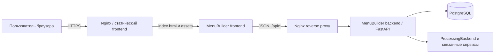
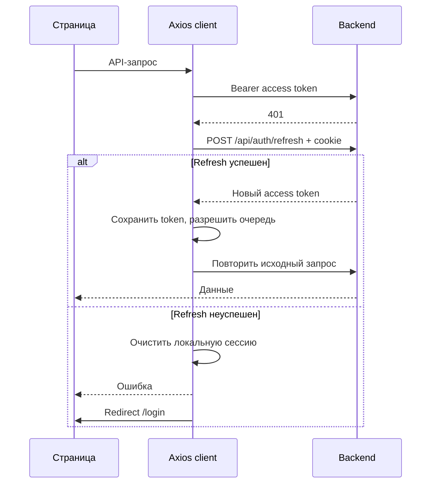
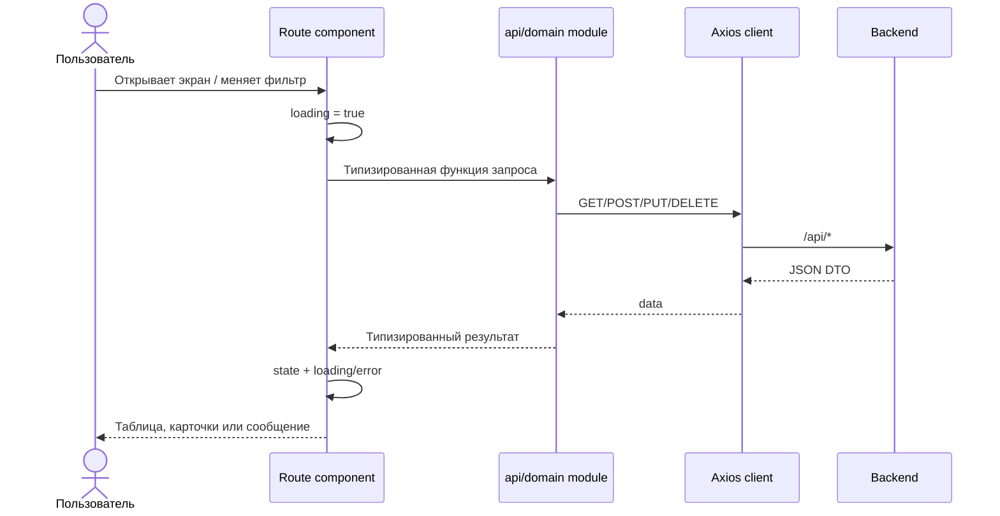

# Архитектура MenuBuilder frontend

> Статус: описание текущей реализации. Документ следует обновлять при изменении маршрутов, способа аутентификации, структуры функциональных модулей или процесса сборки.

## 1. Назначение и границы

`MenuBuilder/frontend` — одностраничное веб-приложение (SPA) для сотрудников организаций и суперадминистраторов платформы etranprocessing. Оно предоставляет интерфейс для:

- мониторинга терминалов;
- настройки вариантов меню, каталога услуг и привязок терминалов;
- просмотра операционных и финансовых отчётов;
- управления лицензиями и заказом PIN-кодов сертификатов;
- управления устройствами и диагностическими задачами;
- настройки интеграций;
- администрирования организаций, терминалов и пользователей.

Фронтенд не является источником бизнес-правил и не обеспечивает границу авторизации. Он визуализирует данные, управляет пользовательским состоянием и вызывает API `MenuBuilder/backend`; доступ к данным, проверка ролей, мультитенантная изоляция, расчёты и изменения состояния должны окончательно контролироваться сервером.

## 2. Контекст системы



В production браузер загружает статические файлы через Nginx и обращается к API по тому же origin с префиксом `/api`. В режиме разработки Vite проксирует `/api` на `http://localhost:8000`, поэтому код приложения не содержит отдельных development URL и не требует CORS для штатного локального сценария.

## 3. Технологический стек

Фактические версии и диапазоны фиксируются в `MenuBuilder/frontend/package.json`.

| Область | Технология | Роль |
|---|---|---|
| UI runtime | React 19, React DOM 19 | Компоненты, hooks, рендеринг SPA |
| Язык | TypeScript 5.8 | Статическая типизация приложения и DTO |
| Маршрутизация | React Router 7 | Иерархия страниц, вложенные layout и редиректы |
| UI kit | Ant Design 6, Ant Design Icons | Компоненты, сетка, сообщения и design tokens |
| HTTP | Axios 1.9 | Общий клиент, JWT-заголовок, refresh и нормализация ошибок |
| Сборка | Vite 6, TypeScript build mode | Dev server, production bundle и code splitting |

В проекте нет отдельного глобального state manager или server-state библиотеки. Основные механизмы состояния — React hooks, `localStorage` для контекста сессии и небольшой in-memory TTL-кэш.

## 4. Точка входа и композиция приложения

### 4.1. Bootstrap

`src/main.tsx` формирует корневую композицию:

1. `React.StrictMode` включает дополнительные проверки жизненного цикла в development.
2. `ConfigProvider` задаёт русскую локаль Ant Design и единую тему из `src/theme.ts`.
3. `BrowserRouter` включает клиентскую маршрутизацию.
4. `App` объявляет дерево маршрутов.
5. `src/styles/global.css` подключает reset, общие табличные стили и responsive-правила.

### 4.2. Маршрутизация и загрузка кода

Страницы импортируются через `React.lazy`, а общий `Suspense` показывает spinner до загрузки чанка. Это разделяет код по маршрутам и не включает все доменные экраны в первоначальный чанк.

```mermaid
flowchart TD
    Root[/] --> Login[/login]
    Root --> Auth[RequireAuth + AppLayout]
    Auth --> Monitoring[/monitoring]
    Auth --> Menu[/menu]
    Menu --> Terminals[/menu/terminals]
    Menu --> Variants[/menu/variants]
    Menu --> Catalog[/menu/catalog]
    Auth --> Reports[/reports]
    Auth --> Billing[/billing]
    Auth --> Integrations[/integrations]
    Auth --> Devices[/devices, superuser]
    Auth --> Admin[/admin, superuser]
    Admin --> Organizations[/admin/organizations]
    Admin --> AdminTerminals[/admin/terminals]
    Admin --> Users[/admin/users]
```

`RequireAuth` проверяет только наличие `mb_token` в `localStorage`. Это UX-guard от открытия внутренних страниц без сессии, но не механизм безопасности. Истинная проверка токена и полномочий выполняется backend. Старые пути `/terminals`, `/variants` и `/profile` перенаправляются на актуальные разделы для совместимости с закладками.

### 4.3. Основной layout

`src/routes/layout.tsx` отвечает за устойчивую оболочку приложения:

- боковую навигацию и выделение активного раздела;
- responsive-сворачивание `Sider` на основании Ant Design breakpoints;
- получение текущего пользователя через `GET /api/auth/me`;
- показ пунктов `devices` и `admin` для суперадминистратора;
- переключение организации через `OrgSwitcher`;
- выход из системы;
- рендеринг дочернего маршрута через `Outlet`.

Вложенные разделы используют собственные layout-компоненты, например `menu-management.tsx`, `admin-layout.tsx` и `SectionLayout.tsx`. Навигация остаётся отделена от содержимого страницы, но регистрация верхнеуровневых маршрутов и меню пока выполняется в разных файлах.

## 5. Слои и зависимости

```mermaid
flowchart TB
    Routes[Route pages и feature-компоненты] --> Components[Общие UI-компоненты]
    Routes --> Utils[Чистые форматтеры и утилиты]
    Routes --> API[Тематические API-модули]
    Components --> API
    API --> Client[Общий Axios client]
    API --> Cache[In-memory TTL cache]
    Client --> Backend[/api/*]
    Routes --> AntD[Ant Design + theme]
    Components --> AntD
```

Допустимое направление зависимостей — сверху вниз: страницы и компоненты используют API и утилиты, API-модули используют общий HTTP-клиент. `src/api` не должен импортировать React-компоненты, а чистые `src/utils` не должны зависеть от UI или сети.

### 5.1. Структура исходного кода

```text
src/
├── api/                     # Типизированные DTO и вызовы backend по предметным областям
├── components/              # Переиспользуемые формы, layout, модальные окна
├── routes/                  # Маршрутные страницы и layout разделов
│   └── devices/             # Частично декомпозированный feature-модуль устройств
│       └── domain/          # Доменные справочники/метаданные команд
├── styles/global.css        # Глобальные и responsive-правила
├── utils/                   # Форматирование биллинга, дат и часовых поясов
├── App.tsx                  # Маршруты, guards, lazy imports
├── main.tsx                 # Bootstrap приложения
└── theme.ts                 # Design tokens и настройки компонентов Ant Design
```

Текущая организация является route-centric: большинство сценариев сосредоточено в файлах страниц. Модуль `routes/devices` показывает целевое направление для сложных областей — отдельные вкладки, модальные окна, типы и domain-данные рядом с маршрутом.

## 6. Сетевой слой

### 6.1. Общий Axios-клиент

`src/api/client.ts` создаёт единственный клиент со следующими настройками:

- `baseURL: "/api"`;
- JSON как тип содержимого по умолчанию;
- `withCredentials: true` для cookie-based refresh;
- request interceptor, добавляющий `Authorization: Bearer <mb_token>`;
- response interceptor для обновления токена и приведения ошибок к `Error`.

API разделён по предметным областям: `auth`, `monitoring`, `reports`, `billing`, `certificate-pin`, `catalog`, `menu-variants`, `terminal-bindings`, `devices`, `integrations`, `admin`, `adminTenants`, `adminUsers` и другие. Компоненты не должны собирать URL вручную, если операция относится к существующему API-модулю.

### 6.2. Восстановление сессии после 401



Флаг `isRefreshing` и `failedQueue` предотвращают параллельный запуск нескольких refresh-запросов: остальные запросы ожидают результат первого и затем повторяются с новым токеном. Запросы login и refresh исключены из этого цикла.

### 6.3. Ошибки

Для непройденных interceptor-ом ошибок клиент извлекает `response.data.detail`, затем `err.message`, и отклоняет Promise с обычным `Error`. Страницы показывают сообщение через Ant Design `message` или сохраняют локальное error-состояние.

Единой модели ошибок, централизованной телеметрии и error boundary сейчас нет. Поэтому API-контракты должны отдавать пригодный для пользователя `detail`, а страницы — отдельно обрабатывать ожидаемые доменные ошибки и пустые состояния.

## 7. Состояние, кэш и потоки данных

### 7.1. Виды состояния

| Вид | Механизм | Примеры | Жизненный цикл |
|---|---|---|---|
| UI state | `useState`, `useMemo`, `useCallback` | фильтры, вкладки, формы, modal visibility, selection | До размонтирования компонента |
| Server data | Локальный state страницы после API-вызова | терминалы, отчёты, лицензии | До перезагрузки/повторного fetch |
| Session context | `localStorage` | access token, пользователь, роль, организация, timezone | Между перезагрузками браузера |
| Короткий read cache | `Map` в `src/api/cache.ts` | профиль и отдельные справочники | До reload вкладки или invalidation |

`withCache` реализует cache-aside с TTL: возвращает свежее значение из памяти или вызывает fetcher и сохраняет результат. Несмотря на комментарий о stale-while-revalidate, текущая реализация не возвращает устаревшие данные и не выполняет фоновое обновление — просроченная запись удаляется перед новым запросом.

Мутации должны инвалидировать связанные ключи через `invalidateCache(prefix)`. Выход очищает весь in-memory cache и значения контекста сессии.

### 7.2. Типовой поток страницы



Большинство страниц самостоятельно управляет загрузкой, ошибками, фильтрами и повторным запросом. Такой подход прозрачен для небольших экранов, но приводит к дублированию server-state логики в крупных модулях.

## 8. Функциональные модули

| Область | Основные файлы | Ответственность |
|---|---|---|
| Мониторинг | `routes/monitoring.tsx`, `api/monitoring.ts`, `api/stats.ts` | Оперативное состояние и показатели терминалов |
| Управление меню | `routes/menu-management.tsx`, `terminals.tsx`, `variants.tsx`, `catalog.tsx` | Варианты меню, дерево категорий, услуги и привязки терминалов |
| Отчёты | `routes/reports.tsx`, `api/reports.ts` | Агрегаты, платежи, инкассации и фильтры периода |
| Лицензии | `routes/billing.tsx`, `api/billing.ts`, `CheckoutModal.tsx`, `CertificatePinModal.tsx` | Состояние лицензий, корзина, деактивация и сертификатные PIN-коды |
| Устройства | `routes/devices/*`, `api/devices.ts` | Паспорт, события, теги, задачи и консоль устройства |
| Интеграции | `routes/integrations.tsx`, `api-connection.tsx`, `api-tokens.tsx`, `api/integrations.ts` | Витрина интеграций и настройки API-доступа |
| Администрирование | `routes/admin-*.tsx`, `api/admin*.ts` | Организации, терминалы и пользователи |

Крупные файлы `billing.tsx`, `reports.tsx`, `variants.tsx` и `devices/index.tsx` объединяют orchestration, бизнес-представление и большой объём JSX. При развитии этих областей новые самостоятельные блоки следует выносить в feature-компоненты и hooks, не меняя публичный маршрут.

Некоторые карточки витрины интеграций используют локальное состояние и имитацию сохранения через таймер. Их нельзя считать подключёнными к backend, пока операция явно не реализована в соответствующем API-модуле и не подтверждена серверным ответом.

## 9. Аутентификация, роли и мультитенантность

### 9.1. Сессия

После логина access token сохраняется под ключом `mb_token`. Дополнительно локально сохраняются имя пользователя, признак суперадминистратора, текущая организация и её часовой пояс. Refresh token ожидается в cookie и отправляется благодаря `withCredentials`.

`GET /api/auth/me` является источником актуального профиля. Его результат кэшируется на 60 секунд и используется layout для построения навигации. `localStorage` выступает fallback при первом рендере, но не должен считаться доверенным источником ролей.

### 9.2. Переключение организации

`OrgSwitcher` показывается только пользователям с признаком superuser/can-switch-org. После выбора организации backend выдаёт новый access token с тенантным контекстом; компонент обновляет localStorage и перезагружает страницу, чтобы сбросить локальное состояние экранов.

Важные инварианты:

- `org_id` из UI нельзя использовать как достаточное условие доступа;
- backend обязан выводить доступную организацию из проверенного токена/серверной сессии;
- смена организации должна сбрасывать или разделять все tenant-dependent cache keys;
- скрытие пунктов меню не заменяет серверную проверку прав.

### 9.3. Риски хранения токена

Access token доступен JavaScript через `localStorage`, поэтому успешная XSS-атака может его прочитать. До перехода на более защищённую модель сессии необходимо минимизировать inline HTML, не использовать небезопасный `dangerouslySetInnerHTML`, поддерживать строгую CSP на Nginx и не журналировать токены или секреты интеграций.

## 10. UI-архитектура и UX

### 10.1. Дизайн-система

`src/theme.ts` централизует цвета, типографику, размеры контролов и component tokens Ant Design. Базовый интерфейс рассчитан на плотную работу с данными:

- компактные таблицы и контролы;
- нейтральный фон и единый основной цвет;
- общие состояния success/warning/error;
- единые радиусы и отсутствие тяжёлых теней;
- русская локаль компонентов.

`src/styles/global.css` содержит минимальный reset, стили scrollbars, таблиц и mobile media query. Новые цвета и размеры по возможности задаются через design tokens; глобальные CSS override допустимы только для правил, которые невозможно выразить через Ant Design API.

### 10.2. Адаптивность

Layout и отдельные страницы используют `Grid.useBreakpoint`, responsive props `Row`/`Col`, горизонтальную прокрутку таблиц и уменьшенную плотность на экранах до 768 px. Сайдбар автоматически сворачивается на breakpoint `lg`, а переключатель организации сокращает ширину на мобильных экранах.

Data-dense таблицы остаются desktop-first. Для критических мобильных сценариев предпочтительны не только уменьшение шрифта и горизонтальный scroll, но и отдельное приоритетное представление ключевых полей.

### 10.3. Повторно используемые элементы

- `PageHeader` — единый заголовок страницы;
- `SectionLayout` — оболочка разделов с локальной навигацией;
- `OrgSwitcher` — смена tenant context;
- `CheckoutModal` и `CertificatePinModal` — сложные диалоги лицензирования;
- `GroupForm` и `ServiceForm` — формы управления меню.

Перед созданием нового локального варианта заголовка, layout, формы или диалога следует проверить, можно ли расширить существующий общий компонент без добавления предметной связанности.

## 11. Производительность и сборка

### 11.1. Code splitting

Route-level lazy imports создают отдельные чанки страниц. В `vite.config.ts` библиотеки дополнительно разделены на стабильные vendor chunks:

- `vendor-react` — React, React DOM и React Router;
- `vendor-antd` — Ant Design и иконки;
- `vendor-axios` — Axios.

Это улучшает browser caching при изменении прикладного кода. Реальные размеры бандла зависят от текущих зависимостей и должны измеряться по артефактам каждой сборки, а не фиксироваться в архитектурном документе.

### 11.2. Оптимизация запросов

In-memory TTL-кэш уменьшает повторные загрузки профиля и справочников. Внутри страниц используются `useMemo` и `useCallback` для вычисляемых наборов данных и стабильных обработчиков. Для таблиц важно сохранять server-side пагинацию и фильтрацию там, где объём данных может расти.

### 11.3. Специальный build plugin

Плагин `export-method-codes` копирует `src/routes/devices/domain/methodCodes.json` в `public/methodCodes.json` в начале сборки. Это делает справочник доступным как статический ресурс. Ошибка копирования сейчас только выводит warning и не останавливает build; изменения схемы справочника должны учитывать оба способа его потребления.

## 12. Проверка качества

Production-команда из каталога `MenuBuilder/frontend`:

```powershell
npm run build
```

Она последовательно запускает `tsc -b` и `vite build`, то есть проверяет типы и создаёт `dist/`. Отдельных scripts для unit-, component- или e2e-тестов в текущем `package.json` нет. Поэтому build является обязательной, но недостаточной проверкой сложных пользовательских сценариев.

Минимальная ручная smoke-проверка после изменений должна охватывать:

1. логин, refresh сессии и logout;
2. открытие lazy-loaded маршрутов без ошибок чанков;
3. видимость ролевых пунктов меню;
4. смену организации и отсутствие данных предыдущего tenant;
5. loading, empty и error states изменённого экрана;
6. основной сценарий на desktop и узком viewport;
7. критические мутации с повторной загрузкой актуальных данных.

## 13. Развёртывание

Vite создаёт статический production bundle в `MenuBuilder/frontend/dist/`. В принятой схеме deployment каталог `dist` смонтирован в контейнер `menubuilder-frontend` и обслуживается Nginx. Обновление файлов в live mount делает новую статику доступной без рестарта контейнера; рестарт требуется при изменениях конфигурации Nginx.

Для корректной SPA-навигации Nginx должен возвращать `index.html` для неизвестных клиентских путей, а `/api` проксировать в `menubuilder-backend`. Статические assets с content hash следует отдавать с долгим cache lifetime, а `index.html` — с коротким или отключённым кэшированием, чтобы клиенты быстро получали ссылки на новый bundle.

## 14. Архитектурные ограничения и технический долг

1. **Route-centric монолиты.** Несколько страниц велики и совмещают загрузку данных, доменные вычисления и JSX, что усложняет изолированное тестирование и повторное использование.
2. **Ручное управление server state.** Loading/error/refetch/cache-invalidation реализуются в каждом экране отдельно; отсутствуют дедупликация запросов и согласованная политика retries для большинства данных.
3. **Разрозненный session context.** Профиль и tenant context дублируются между React state и несколькими ключами localStorage; смена организации требует полного reload.
4. **JWT в localStorage.** Текущая модель повышает последствия XSS и требует особенно строгой защиты frontend/Nginx.
5. **Неполная автоматизированная проверка.** Нет unit/component/e2e test scripts, а build не проверяет поведение критических потоков.
6. **Неоднородная готовность интеграций.** Часть интерфейса витрины имеет демонстрационное локальное поведение без сохранения на backend.
7. **Нет общей observability-границы.** Ошибки в основном показываются локально; отсутствуют error boundary, correlation ID и централизованный сбор frontend exceptions.

## 15. Правила развития

### 15.1. Новый функциональный модуль

Для нового самостоятельного раздела:

1. создать route component или каталог feature в `src/routes`;
2. добавить тематический API-модуль с DTO в `src/api`;
3. использовать общий `client`, не создавать второй Axios instance;
4. зарегистрировать lazy route в `App.tsx`;
5. синхронизировать доступный пункт навигации с ролью;
6. предусмотреть loading, empty, error и permission states;
7. проверить desktop и mobile layout;
8. выполнить `npm run build`.

### 15.2. Работа с данными

- Не доверять `localStorage` при принятии решений о доступе.
- Не хранить пароли, API-ключи, refresh tokens и другие секреты в исходном коде или localStorage.
- Типизировать request/response DTO рядом с API-функциями.
- После мутации явно обновлять локальные данные или инвалидировать соответствующий cache key.
- Tenant-dependent ключи должны включать организацию либо полностью очищаться при её смене.
- Не скрывать сетевую ошибку пустой таблицей; пользователь должен различать «данных нет» и «данные не загрузились».

### 15.3. Декомпозиция UI

В route component остаются параметры маршрута и orchestration. Самостоятельные таблицы, формы, панели фильтров и диалоги выносятся в feature-компоненты; повторяемая stateful-логика — в hooks; чистые форматтеры и расчёты — в `utils` или локальный `domain`. Общий `components` предназначен только для действительно межмодульных элементов.

## 16. Карта ключевых решений

| Решение | Причина | Следствие |
|---|---|---|
| SPA с BrowserRouter | Быстрая навигация и единая оболочка кабинета | Nginx обязан поддерживать history fallback |
| API только через `/api` | Same-origin production и простой dev proxy | Frontend зависит от корректной reverse-proxy конфигурации |
| Lazy routes + vendor chunks | Снижение стоимости первой загрузки и стабильный browser cache | Нужны корректные loading/error сценарии чанков |
| Ant Design + централизованная тема | Единообразный data-dense UI | Следует ограничивать inline-стили и глобальные overrides |
| Axios interceptor refresh queue | Один refresh при серии параллельных 401 | Ошибка refresh завершает всю ожидающую очередь и сессию |
| Локальный React state | Низкий порог сложности для независимых экранов | Крупные страницы дублируют server-state orchestration |
| Полный reload при switch tenant | Гарантированный сброс локального UI state | Переключение медленнее и зависит от корректной очистки кэша |
