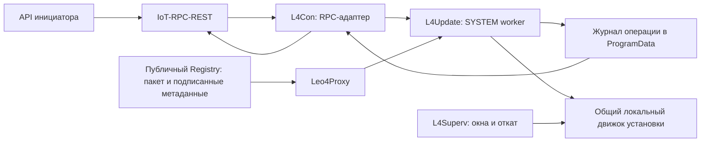

# L4Update: remote update, установка Windows и release-конвейер

## Статус и границы evidence

**Accepted — 2026-10-06.** Решения согласованы владельцем в архитектурном
диалоге. Это целевая архитектура и план реализации, а не описание уже работающего
`l4update`. Реализация, выпуск и испытания по этому документу ещё не выполнены.
Имена будущих команд и файлов ниже — контракт проекта, а не существующие команды.

Прогресс этапа 1: [release foundation](../tools/release/README.md) реализует
plan/prepare/release/verify/keys init; [packet](../.agent-context/tasks/active/2026-10-06-l4release-stage1.md)
отделяет локальные проверки от ещё не подтверждённой полной сборки. Worker,
новая раскладка, terminal gate/catalog/promote пока не внедрены.

Текущий runtime-маршрут через l4mcp описан отдельно в
[runbook](ops_run-l4tools-update-via-l4mcp.md). Он не подтверждает реализацию нового flow.
Миграция старой установки `C:\l4tools` исключена из задачи; первое развёртывание
новой архитектуры выполняется через новый `l4setup` отдельным bootstrap-шагом.
Совместимость внешних контрактов tools с IoT/PB/MB обязательна.

## Task intake

- Цель: автономный remote update tools suite, новая раскладка Windows, стабильный
  единый конвейер сборки, подписи, проверки и публикации.
- Scope: native tools, установка, release-процесс и минимальная интеграция IoT RPC.
  UI инициатора, миграция старых каталогов, изменение аккаунтов служб исключены.
- Владельцы: tools — установка/операция/восстановление; release-конвейер — артефакты,
  метаданные/evidence; IoT — существующие авторизация, task ID и MQTT RPC/event.
  Изменения схемы shared DB и миграции не планируются.
- Producer → transport → consumer: API инициатора → IoT-RPC-REST → штатный MQTT
  RPC → L4Con → защищённый локальный интерфейс → независимый SYSTEM worker.
- Инварианты: проверенные подписи и идентичность, обязательная совместимость связи,
  отсутствие одинаковых MQTT client ID одновременно, ограниченные бюджеты,
  единственная операция изменения, сохранённая рабочая версия, явный результат.
- Критерий готовности: подписанный комплект, подготовленный без остановки служб;
  один реальный переход на 773, барьеры и результат; fault evidence для изменённых
  механизмов. Нельзя считать сборку или `Running` доказательством E2E.
- В этом документальном шаге разрешены чтение исходников и проверки документов;
  не выполняются broker/API-вызовы, сборки, ключегенерация, установка и деплой.

## 1. Владение и независимость от backends

| Компонент | Ответственность |
|---|---|
| Инициатор | Один API-запрос к IoT-RPC-REST, internal или public; версии `1.13.2` / `latest` |
| IoT | Авторизация и tenant/SN binding, task ID, доставка RPC, обработка RES и EVT/EVA |
| L4Con | Единственный MQTT-адаптер update, RPC/status, отправка событий и барьерные обмены |
| L4Update | Выбор и доставка релиза, план, журнал, локальная блокировка, применение и результат |
| L4Superv | Обычный надзор, ограниченные окна обслуживания, принудительный откат по deadline |
| L4Rollback | Минимальная страховка замены самого L4Superv |
| L4Setup | Автономный подписанный установщик, bootstrap и ручной запуск общего update-flow |
| Registry | Публичное чтение неизменяемых артефактов; запись существующими build credentials |
| Release-конвейер | Сборка, тесты, подпись, упаковка, публикация, evidence и promotion |

MB/PB не получают новых API, DB-моделей или relay пакетов. Существующие обращения
tools к backends, идентичность, policy, сертификаты и MQTT-топики сохраняются.
Терминальный HTTP идёт через Leo4Proxy, без прямого fallback; публичный Registry
убирает необходимость выдачи download-grant для этого flow.

IoT потребует проверки/регистрации `7030–7033`, API payload-валидации и capability
polling; это минимальная интеграция, а не новая серверная подсистема обновления.
Код/тег события ещё не выбраны. Исключение нового события из биллинга, если
потребуется владельцу, — отдельная небольшая интеграция IoT, не текущий факт.



## 2. RPC и идентификация

| RPC | Назначение | Параметры |
|---|---|---|
| 7030 UpdatePlan | Проверка и план без установки | `version`, `target` |
| 7031 UpdateStart | Единственная необходимая инициатору команда | `version`, `target` |
| 7032 UpdateStatus | Операторское/роботизированное наблюдение | `operation_id` |
| 7033 UpdateCancel | Отмена подготовки до начала применения | `operation_id` |

`version` — точная версия либо `latest`; `target` — `suite` либо `updater`.
Инициатор не передаёт URL, пути, budgets, shell-команды или обход проверок.
Номера требуют сверки/регистрации в IoT. Wire-формат использует существующий
`payload.dt[]`; JSON ниже показывает содержимое параметров, не заменяет оболочку:

```json
{"version":"1.13.2","target":"suite"}
```

Для remote update `operation_id = task_id исходного 7031`. У запросов 7032/7033
собственные task ID, их параметр ссылается на исходную операцию. Локальный запуск
из l4setup получает UUID локально.

7031 возвращает `accepted` после надёжного сохранения запроса и подготовки
независимого запуска. Не держит RPC открытым во время установки. Ответ включает
operation ID и requested version; разрешение `latest`, план и результат доступны
через EVT и 7032. RES/CMT подтверждают RPC принятия, а не завершение установки.

- `latest` разрешается однократно в назначенный stable-релиз; точная версия,
  manifest digest и маршрут сохраняются до изменения служб.
- Повтор того же task ID с теми же параметрами возвращает существующую операцию.
  Изменённые параметры для того же ID — конфликт.
- Другой 7031 во время изменения — busy. Общая блокировка защищает RPC, l4setup,
  cleanup и target=updater от конкурирующих изменений.
- Уже установленная и исправная точная версия не переустанавливается.
- После принятия инициатор не обязан присылать 7032 или другие команды.
- TTL доставки RPC и локальный deadline установки — разные ограничения.
  Перезапуск L4Con не должен уничтожать worker; запуск вне его command Job.
- 7033 отменяет подготовку. После начала применения отмена недоступна:
  выполняется ограниченное завершение либо откат.

7032 читает локальное состояние и возвращает target, requested/resolved version,
маршрут и номер перехода, этап, фактические версии компонентов, проверки связи,
ошибку и состояние отправки отчёта. При отключённой связи сам 7032 недоступен;
после восстановления читает тот же журнал.

## 3. Состояния и контрольные точки

Базовые состояния: `accepted`, `preparing`, `prepared`, `applying`, `verifying`,
`rolling_back`; итоговые — `succeeded`, `failed`, `cancelled`, `partially_applied`,
`connectivity_unconfirmed`, `recovery_required`.
`reporting_pending` — отдельный признак, а не основание отката успешной установки.

Журнал содержит исходный запрос, зафиксированные digests/маршрут, предыдущие и
текущие пути служб, снимки конфигурации, фазу/deadline, контрольные точки, факты
проверок и конечный результат. Записи намерения предшествуют изменению;
контрольная точка публикуется только после подтверждения фактического состояния.
Конкретный минимальный формат и атомарная запись уточняются в реализации.

Короткие разрывы связи допустимы. «Атомарность» означает подтверждённое
переключение либо подтверждённое восстановление в пределах протокола; это не
транзакция Windows и не гарантия будущей доступности внешнего IoT.

## 4. Проверки связи и переключение Leo4Proxy/Mosquitto

До применения скачаны и проверены все необходимые файлы, snapshot конфигурации
подготовлен, аккаунты служб и ACL проверены, план отката готов.
Предварительный барьер на старой рабочей связке: REQ/RSP + свежий EVT/EVA.
Если он не проходит, установка связи не начинается.

Последовательность первого окна:

1. L4Superv проверяет план отката и подтверждает обслуживание конкретной операции.
2. L4Con ограничивает обычную работу, обслуживая update RPC, барьеры и события.
   Остальные команды получают предусмотренный протоколом отказ
   `update_in_progress`; уже активные работы должны завершиться/быть дренированы
   до изменения связи, не уничтожаются неявно.
3. Проба Leo4Proxy-кандидата на временных loopback-портах: процесс, идентичность,
   policy, локальные API и безопасные внешние пробы без конкурирующего MQTT client ID.
4. Старый Leo4Proxy останавливается, его соединение закрывается; новый запускается
   на штатных портах. Mosquitto остаётся прежним. Полные проверки и барьеры.
5. Новый Mosquitto запускается только после остановки старого. Проверяются процесс,
   порты, конфигурация, bridge, REQ/RSP и EVT/EVA. Этап имеет предел **5 минут**.
6. Ограниченное окно устойчивости, сохранение контрольной точки новой связи;
   L4Superv принимает её под обычный надзор.

**Параллельные MQTT-подключения с одинаковым client ID категорически запрещены.**
Проба на временных портах не является доказательством штатного bridge.
Не создавать тестовые топики или новый IoT handshake. Конкретные безопасные пробы
выбираются после аудита текущего Leo4Proxy и policy.

После запуска проверять EXE/digest, SCM/процесс, SN/сертификат, штатные порты,
соединения и сквозные обмены. `Running`, локальный `ready`, CONNACK, PUBACK и
retained presence по отдельности недостаточны.

### Наблюдение существующего IoT

Статически прочитан внешний репозиторий `iot-rpc-rest-app`, HEAD
`2ffa1403b4529ae1260b14c662e23e9c43a858d6`; это не проверка production.

- `core/crud/dev_tasks_repo.py:_select_task_query/select_task_by_id` исключает
  `status >= DONE`, истёкшие/удалённые задачи и проверяет SN при адресной выборке.
- `core/services/device_tasks.py:select` отвечает на REQ завершённой задачи
  NOP `{"method_code":0}` в `srv/{SN}/rsp`, method_code=0,
  correlationData=нулевой UUID, expiration=180 секунд. Другую задачу не выбирает.
- Общий poll с нулевым UUID может выбрать доступную задачу либо вернуть NOP.
  NOP не сохраняет исходный UUID, поэтому сам по себе не доказывает свежесть.
- Адресная выборка допускает методы до 7099. Проверенный polling whitelist
  содержит только 7001/7002/7003/7011; перед добавлением 703x нужна повторная сверка.
- `core/services/device_events_collect.py`/`device_task_processing.py` уже отправляют
  EVA с correlation UUID, кодом/ID события и success/error, в том числе для дубликатов.
  EVA не ожидается для gauge, нулевого кода или нулевого dev_event_id.

Барьер сочетает REQ/RSP и **новое событие со свежим UUID**, подтверждённое
соответствующим EVA success. UUID события отдельный от operation ID в данных.
Приём старого/повторного NOP не заменяет свежий EVA. Без дополнительных полей IoT
абсолютная корреляция NOP с конкретной пробой не обещается.

IoT-приложение, DB, очереди, права и подписки тоже могут нарушить барьер.
Коллектор может выйти без EVA при ошибке поиска устройства; публикация webhook
в очередь предшествует EVA. Доставка webhook внешнему получателю не требуется.

### Отказ барьера

| Наблюдение | Решение |
|---|---|
| Исходный барьер не пройден | Остановить подготовку без изменения служб |
| Конкретный локальный отказ кандидата | Начать откат раньше общего timeout |
| Локальное здоровье есть, внешних ответов нет | Ограниченно ждать/повторять, затем один откат |
| После отката обмен восстановлен | Оставить старую связку; update неуспешен |
| После отката обмен также отсутствует | Оставить старую связку, `connectivity_unconfirmed` |
| Локальное восстановление не подтверждено | `recovery_required`, ограничить автоматику |

Таймаут не доказывает дефект tools; восстановление IoT во время отката тоже
возможно. Запрещены бесконечные переключения версий.

## 5. Два окна обслуживания и бюджеты

| Окно | Область | Откат |
|---|---|---|
| Связь | Leo4Proxy/Mosquitto, самые длительные барьеры | Предыдущая связка и конфигурация |
| Остальные | L4Con и другие tools, кроме L4Superv/updater/helper | Затронутые компоненты; новую подтверждённую связь сохранить |

Во втором окне L4Superv продолжает надзор за новой связью, не вмешиваясь в
заменяемые компоненты. При потере связи дальнейшие изменения приостанавливаются
в пределах бюджета. Новая связь со старыми остальными tools — обязательное
проверенное состояние, включая перезагрузку. Ошибка второго окна допускает
`partially_applied`; полная версия suite не объявляется успешно установленной.

У каждого окна абсолютный deadline; heartbeat его не продлевает. Сумма всех
timeout, числа попыток, наблюдения и запаса ограничена. Окно включает резерв
штатного отката; после deadline есть отдельный ограниченный бюджет аварийного
отката. Если времени на следующий этап и восстановление недостаточно, worker
начинает откат сразу. Успех не ждёт истечения timeout.

Принят предел Mosquitto **5 минут**. Прочие значения из обсуждения (20 минут
окно связи, 10 минут остальные, 3 минуты замена supervisor/updater) — стартовые
предложения, **не измеренные и не окончательно подтверждённые бюджеты**.
Проверка комплектности budgets до начала операции обязательна; долгие/бесконечные
внутренние ожидания должны быть ограничены внешним исполнителем.

L4Superv по deadline прекращает worker и его процессы, подтверждает остановку,
затем выполняет один фиксированный откат. После boot обнаруживает незавершённый
маркер и выполняет тот же откат. Не восстанавливает сложную машину состояний.
При невозможности остановить конкурирующий исполнитель замена не начинается;
ошибка сохраняется для оператора.

## 6. Замена L4Superv и неизменяемая страховка

После проверки связи и остальных компонентов L4Superv обновляется отдельным
коротким этапом. До его остановки подготовлена независимая SYSTEM-задача
`l4rollback.exe` с deadline и boot trigger. Задача не зависит от L4Con/L4Superv.

Helper умеет только: захватить блокировку, проверить маркер завершения, остановить
worker, остановить supervisor, вернуть прежний путь службы и snapshot конфигурации,
запустить прежний supervisor и записать результат. Все ожидания ограничены.
Нет сети, MQTT, скачивания, manifest, выбора версии и исполнения произвольных команд.
План/EXE защищены ACL, сохранённый бинарник проверяется по digest.

Worker и helper синхронизируют решение о завершении/откате одной блокировкой;
точный порядок остановки worker без deadlock проверяется отдельно. Удаление задачи
не является единственной защитой от ложного отката. Новый supervisor должен
подтвердить версию, чтение состояния, принятие надзора и окно здоровья.

**Helper не обновляется через target=suite/updater.** Его изменение — только по
обоснованному решению владельца через bootstrap/repair. Минимальный формат плана
замораживается; общий движок установки в helper не включается.

## 7. Самообновление updater

`target=updater` — отдельная взаимно исключающая операция, не меняющая suite.
Updater хранится по версиям; RPC-адаптер и l4setup читают защищённый
`updater-active.json`, проверяют допустимость пути и запускают конкретный EXE.

Старый updater готовит подписанный кандидат. Кандидат проверяет локальные IPC,
форматы и окружение без изменения suite. L4Superv сохраняет прежний указатель,
открывает короткое окно, переключает указатель атомарно и подтверждает проверочный
запуск. По deadline/boot незавершённого этапа возвращает прежний указатель.
Helper не участвует. Обновление L4Superv и updater одновременно запрещено.

Gate updater проверяет совместимость с установленными supervisor, L4Con,
l4setup и форматами состояния. Если suite требует нового updater, suite-flow
возвращает требование отдельной операции, не обновляет его неявно.

## 8. События и простой outbox

Один новый тип `tools_update`; **весь объект операции в одном числовом теге**.
Код события и номер тега ещё не выделены. Используется действующая MQTT5 EVT
оболочка, `dev/{SN}/evt`, QoS 1, retain=false и существующий `srv/{SN}/eva`.

Внутренний объект: operation_id, seq, target, stage/state, occurred_at,
requested/resolved version, manifest digest и компактные details.
Этапы: принятие, подготовка, переключение/проверка, откат и итог.
Исходное время события отдельно от времени его публикации.

Outbox — ограниченная файловая очередь по размеру/сроку/числу попыток, без
сложного планировщика и стремления к абсолютной доставке. Повторы сохраняют UUID
события и dev_event_id. EVA success закрывает запись; EVA error/исчерпание лимита
фиксируются. Информационные события не блокируют применение.
Свежие barrier-события имеют отдельный ограниченный цикл ожидания.

Локальный журнал и 7032 — источник результата операции. Существующее
[событие 75](term_tool-event75-inventory.md) дополняет факт инвентаризацией;
само по себе не подтверждает конкретную операцию. После переноса путей его
инвентаризацию необходимо адаптировать без изменения внешнего контракта.

## 9. Windows-раскладка и общий движок

Пример структуры; конкретные системные корни получаются через Known Folders
с учётом архитектуры, не конкатенацией жёстко заданного `C:\Program Files`:

```text
<Program Files>\Leo4\Tools\
  releases\<version>\<component>\...
  bin\...                         стабильные CLI launchers
  updater\versions\<version>\...
  recovery\...                    bootstrap helper

<ProgramData>\Leo4\Tools\
  config\...
  state\updater-active.json
  logs\...
  update\operations\<operation_id>\...
  update\cache\...
  update\staging\...
```

Изолированные каталоги компонентов сохраняются. SCM использует явные пути
конкретных релизов; общий `current` не переключает все службы одновременно.
PATH получает один стабильный launcher-каталог. Рабочие каталоги, path_match,
логи/persistence, FM root и локальные discovery-пути адаптируются согласованно.

Аккаунты служб остаются прежними. ACL разделяют binaries/config/control plans
и writable logs/persistence; обычный пользователь не может менять управляющие
файлы. До остановки Mosquitto проверять реальный доступ его аккаунта на чтение
EXE/config и создание/запись logs/persistence. Доступ SYSTEM updater недостаточен.

Бинарники по версиям неизменяемы; snapshot конфигурации входит в откат.
Журнал операции не откатывается. Certificate Store/CNG-ключ, SN и сертификат
терминала не заменяются/перевыпускаются в update-flow.

L4Setup и updater используют общий локальный движок файлов/SCM/config/rollback.
Полный автономный l4setup содержит подписанные payload обеих архитектур:
ручной upgrade передаёт его установленному updater без повторного скачивания
и устанавливает точную версию пакета, не latest. Проверки перехода и барьеры
сохраняются. Чистая установка использует отдельный bootstrap-путь; отсутствие
настроенной связи не выдаётся за полностью готовый терминал.

## 10. Registry, подписи и допуски

Рекомендуемый дополнительный раздел: `l4tools/metadata/`. Существующие
неизменяемые `l4tools/<version>/...` сохраняются. Детальные имена метаданных
финализируются в реализации.

| Объект | Семантика |
|---|---|
| Manifest состава | Неизменяемая версия, sizes/digests, архитектуры, требования |
| Evidence перехода | Отдельная запись, ссылающаяся на точные digests и профиль стенда |
| Подписанный каталог | Допущенные пары, отозванные версии, stable→версия+digest, ревизия и expiry |
| Стендовый допуск | Конкретные digests/пара, SN 773, tenant 1, короткий срок, один сценарий |

Пакет-кандидат публикуется после проверки комплекта. Стендовый допуск позволяет
испытать ещё не допущенную пару только на 773; он не снимает подписи/барьеры.
После теста добавляется evidence и допуск пары без изменения manifest пакета.
Stable назначается последним отдельной promote-командой. Допуск для другого
SN/tenant/пары или после expiry не применяется.

Один отдельный ключ **RSA-3072/SHA-256, PKCS#1 v1.5**, публичная часть встроена
в updater/bootstrap. Конвейер подписывает точные байты документов; подпись в
отдельном `.sig`. JSON читается после проверки; общей канонизации JSON нет.
Каталог имеет expiry и монотонную ревизию; устаревшая/просроченная версия не
начинает установку. Начатая операция использует сохранённый проверенный план.
Локальный аварийный откат не требует повторной сетевой авторизации.

**Нет root.json, нескольких ключей или автоматической ротации.** Замена ключа
только владельцем через Authenticode-подписанный bootstrap/repair-пакет.
Модель не заявляется эквивалентом TUF; отзыв и инцидент утраты ключа требуют
отдельной процедуры владельца. Сам URL или checksum без доверенной подписи
не устанавливает доверие. Authenticode/timestamp payload и setup обязательны.

## 11. Совместимость, маршруты и очистка

**Gate связи обязательный и без waiver.** Для каждой допущенной пары X→Y
проверить proxy Y + broker X и proxy/broker Y + остальные X, включая boot,
действующие backend-контракты, обе сигнализации и возврат X при отказе.
Успешной компиляции x86/x64 недостаточно.

Каталог хранит направленные проверенные пары переходов, не готовые маршруты.
Updater выбирает прямую пару, иначе кратчайшую цепочку; исключает отозванные и
неподходящие платформе переходы. Если пути нет — отказ до изменения служб.
Совместимость не транзитивна: X→Y→Z не доказывает X→Z.
Маршрут/digests фиксируются и все файлы готовятся до применения. Каждый переход
самостоятелен; при отказе сохраняется последняя подтверждённая контрольная точка.

«Хорошая версия» одновременно допущена release-метаданными и проверена на данном
терминале по фактам установки/здоровья/барьеров. Предыдущий успешный локальный
релиз с snapshot — предпочтительный резерв, не просто меньший номер.
Учёт фактических версий связи обязателен при partially_applied.

Cleanup `through_version=X` предлагает удалить локальные релизы ≤X, кроме:
активных компонентов, выбранного резерва, участников незавершённой операции
и закреплённых оператором версий. Проверять реальное использование SCM и всех
указателей, особенно при смеси версий. План показывает причины сохранения.
Registry не очищается. Cleanup не является частью обновления и не стирает
нужное evidence. Отзыв текущего/резервного релиза сигнализируется отдельно.

## 12. Единый release-конвейер и секреты

Целевой интерфейс (пока не реализован):

```text
uv run python -m l4release keys init
uv run python -m l4release release --version <Y>
uv run python -m l4release release --version <Y> --with-terminal-gate --from-version <X>
uv run python -m l4release promote --version <Y> --channel stable
```

Один конфиг задаёт компоненты/архитектуры/команды/упаковку/tests. Существующие
build/sign/publish механизмы переводятся за единый интерфейс; не создаются новые
одноразовые сценарии на каждый выпуск. Инкрементальный режим — штатная возможность
с проверкой происхождения повторно используемых байтов.

Порядок: environment preflight → build x86/x64 → локальные tests и допуск
комплекта → подпись компонентов → упаковка l4setup → подпись l4setup → окончательная
проверка payload/версий/hashes/timestamps → публикация кандидата → полные download
проверки → явно включённый terminal gate → подписанный допуск → явный promote.
Terminal gate не запускается скрыто обычной release-командой.

Checkpoint связывает каждый результат с входными digests. После подписи нельзя
пересобирать файлы и продолжать старый checkpoint. Совпадающая публикация
идемпотентно проверяется; перезапись версии другими байтами запрещена.
Сбой возобновляется по отчёту, без бессмысленной пересборки или переподписи.
Build-компоненты не меняют рабочие службы без terminal-gate режима.

`sw_sign.env` в базовой папке проекта — единственный файл секретов этого flow,
исключённый из Git. Приватные ключи/PFX вне репозитория. Принятые имена:

```dotenv
SW_SIGN_PFX=
W_SIGN_PFX_PASSWORD=
L4TOOLS_METADATA_KEY_PATH=
L4TOOLS_METADATA_KEY_PASSWORD=
IOT_API_KEY_773=
```

`W_SIGN_PFX_PASSWORD` сохраняется буквально по выбору владельца. Остальные
credentials publisher добавляются только после аудита существующей конфигурации;
владельцу сообщить точные имена/назначение. Нельзя печатать значения env,
пароли/ключи, Authorization или token-bearing URL в логи/артефакты.
Keys init создаёт зашифрованный PKCS#8 PEM один раз, без перезаписи; экспортирует
только public key и выполняет пробную подпись. Key ID вычисляется из public key.
Конвейер сам подписывает из env; историческую ручную паузу signing workflow
заменять согласованно при реализации, не считать её уже устранённой.

## 13. Стенды и экономный gate

Основной стенд — текущая машина, **терминал 773, tenant 1**. Владелец допускает
локальное вмешательство/восстановление оператором. Перед API/RPC проверять
фактическое связывание SN/tenant; IOT_API_KEY_773 применяется только в явном gate.
Этот документ не является результатом API-проверки ключа.

До остановки служб кандидат проходит:

1. Сборку обеих архитектур, tests, payload/signature/config checks.
2. Пробу из staging, ACL под аккаунтами служб, безопасные временные порты/IPC.
3. Только после этого — один реальный переход с промежуточными совместимостями,
   штатными портами и итоговыми барьерами.

Абсолютная готовность штатного bridge до переключения недоказуема, поэтому
реальный переход не отменяется. Полное произведение всех faults×версий×архитектур
не выполняется на каждом выпуске. Fault-матрица обязательна при создании/изменении
update/watchdog/rollback механизмов; затем evidence переиспользуется только при
совпадении всех относящихся к проверке входов и профиля платформы. Изменения связи
заново проходят затронутые gates; release evidence содержит степень проверки.

Конвейер подготавливает исходное состояние X в отдельном стендовом режиме,
не превращая произвольный downgrade в production-возможность updater. Первый
bootstrap новой архитектуры отдельный; миграции C:\l4tools нет. Приёмка не
засчитывается до подтверждённого требуемого финального состояния стенда.
Политика «вернуть X или оставить Y» должна быть явным параметром перед запуском;
конкретный default ещё требуется зафиксировать в реализации.

Второй, пока не назначенный стенд: независимые необязательные испытания l4setup
(clean install/manual upgrade; repair/uninstall только после уточнения scope).
Используется тот же подписанный артефакт без пересборки. Evidence добавляется
отдельно, не переписывает manifest и не блокирует обязательный remote gate.

Бюджет конвейера вычисляется из сценариев и измерений: до запуска показываются
новые проверки, повторно используемое evidence, ожидаемое время и предельная
сумма budgets. Оценка 3–6 часов из раннего обсуждения **не является нормой выпуска**.
x86 под WOW64 не доказывает работу на x86 Windows/Win7; profile evidence ограничен
реально проверенной ОС/архитектурой. Таймерные границы можно моделировать локально,
но реальную работу deadline/Task Scheduler проверять отдельным live-сценарием.

## 14. План реализации и приёмка

| Шаг | Результат | Критерий приёмки |
|---|---|---|
| 1. Release-конвейер | Единый uv entry point/config/env/checkpoints, build/sign/setup/publish/report | Подписанный комплект и полные download checks; службы не меняются |
| 2. Windows/layout | Общий движок, явные SCM пути, ProgramData/ACL/launchers, автономный l4setup | Чистая установка и согласованная инвентаризация; внешние контракты сохранены |
| 3. Local update | Worker, журнал, два окна, fixed rollback, supervisor helper | Локальный переход/частичный результат и восстановление на 773 |
| 4. RPC/events | 7030–7033, минимальная IoT-интеграция, один тег, простой outbox, барьеры | Один 7031 автономно завершается результатом; retry/restart без повторной установки |
| 5. Release admission | Catalog/signatures/stend admission/pairs/promotion/cleanup | Candidate→gate→admission→promote; нет неявного latest или unsafe cleanup |
| 6. Отдельные замены | Supervisor replacement и updater pointer flow | Deadline/boot interruption восстанавливают прежний рабочий компонент |

До live-run обязательна проверка обеих сторон RPC/events, актуальных API schemas
и всех локальных потребителей новых путей. При изменении MQTT-клиента L4Con
выполнить обязательное уточнение типа клиента по AGENTS; новый MQTT-клиент updater
не создаётся, существующий extra_service presence не меняется самовольно.

### Осталось уточнить по коду

- Свободные event code/tag и реальные API validation правила для 703x; billing policy.
- Аккаунты/SCM dependencies, фактические пути всех consumers, FM root, event75,
  supervisor path_match и сохранение сертификата/идентичности.
- Минимальный stable формат журнала/rollback plan и безопасная синхронизация
  worker/helper/supervisor; поведение Task Scheduler после пропущенного deadline.
- Полные суммы budgets, реальные повторные попытки и окна устойчивости.
- Формат `.sig`, persistence catalog revision, безопасный bootstrap при смене ключа.
- Точная схема manifest/catalog/evidence, источники compatibility evidence и
  подготовка стендового X без миграции старой установки.
- Release module placement/dependencies/lockfile и дополнительные имена env
  существующего publisher; второй стенд и финальное состояние 773.

Эти пункты не разрешают обход принятых gates или расширение backend scope.

## 15. Альтернативы и последствия

Выбраны публичный Registry + компактные подписанные метаданные, независимый worker,
версии каталогов, два окна watchdog, отдельная страховка supervisor и общий движок.
Отдельные manifest-сервис/TUF, постоянная служба updater, сложная recovery-машина,
дублирующий MQTT-клиент, замена файлов на месте и автоматическая ротация ключей
не входят в решение. Текущий shell-flow — исходная практика, не целевая реализация.

Цена выбора: ограниченная доступность во время переключения, обязательный локальный
резерв и немного дополнительных metadata; нужны контроль сроков/ревизий и отдельный
owner-driven repair ключа/helper. Плюсы: небольшое владение на сервере, одинаковые
manual/remote механизмы, независимость от L4Con Job, явные control points и
воспроизводимый выпуск без повторных переделок сценариев.

## Источники

- [Текущая tools architecture](term_tool-architecture-guide.md),
  [remote console](ops_run-remote-console-diagnostics.md),
  [RPC7011 matrix](term_arch-rpc7011-flow-matrix.md).
- [Release signing](../tools/release/README.md),
  [build_dist](../tools/build_dist.cmd), [publisher](../deploy/publish_l4tools.py).
- [L4Con MQTT](../tools/l4con/src/mqtt_client.c),
  [L4Superv](../tools/l4superv/src/orchestrator.h),
  [setup tests](../tools/l4setup/run_tests.cmd).
- [Microsoft Known Folders](https://learn.microsoft.com/en-us/windows/win32/shell/knownfolderid),
  [CNG signature verification](https://learn.microsoft.com/en-us/windows/win32/api/bcrypt/nf-bcrypt-bcryptverifysignature),
  [PKCS#8 serialization](https://github.com/pyca/cryptography/blob/main/docs/hazmat/primitives/asymmetric/serialization.rst).
- Внешний IoT: статические исходники при указанном HEAD; checkout path — локальный
  контекст сессии, в репозиторий не переносится как зависимость runtime.
