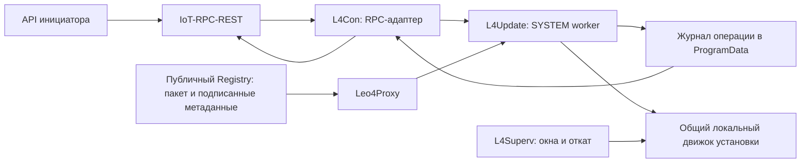

# L4Update: remote update, установка Windows и release-конвейер

## Решение владельца 2026-10-08: допуск совместимости в конвейере

Это решение заменяет отдельную шеститочечную приёмку смесей версий.
Конвейер владеет исходными версиями, сборкой и подписанными комплектами; он
проверяет совместимость компонентов и публикует подписанный допуск точного
перехода X → Y. Обратная совместимость новой связи со старыми потребителями
остаётся обязательной. Неизменившиеся входы проверки позволяют использовать
предыдущее evidence; один лишь успешный build не доказывает совместимость.

Обязательная стендовая приёмка — принудительный откат X → Y → X, затем штатный
переход X → Y через один и тот же исполнитель. Это оставляет стенд на Y без
третьего прохода для возврата исходной версии. Промежуточные состояния наблюдаются внутри этих
проходов; отдельного движка шести смесей, отдельного сборщика их доказательств
и специального допуска побайтово одинаковых релизов нет.

Первую приёмку до публикации catalog выполняет локальный инженерный режим
того же исполнителя с двумя проверенными подписанными комплектами. Его допуск
не доступен через RPC. Пока этот режим и реальный сбор результатов не реализованы,
публикация перехода и производственный RPC7031 остаются закрытыми. Fixture PASS,
ручное поле PASS и подпись произвольного отчёта не заменяют выполненные проверки.

Терминал проверяет подписанный допуск, исходный комплект и собственные условия;
не строит матрицу совместимости. Независимое восстановление, фиксированные окна,
порядок leo4proxy → mosquitto, проверка штатной policy, свежие REQ/RSP + EVT/EVA,
итоговое событие76/tag449 и проверенный старый комплект сохраняются.


### Дополнение реализации 2026-10-07: допуск работ и дренирование

Общий `tools/l4common/update_guard` реализует только локальную синхронизацию:
владелец — исходный UUID операции; закрытие входа предшествует ожиданию уже
принятых работ. В окне связи запрещены обычные работы обоих классов; в окне
остальных tools допустим отдельный надзор за связью. Deadline абсолютный,
повтор запроса его не продлевает, timeout не открывает обычную работу.
Освобождение выполняет владелец после внешней проверки завершения/отката и
выхода всех активных работ. Проверены реальные межпоточные завершения x86/x64.

Сам механизм не является защищённым состоянием или владельцем отката; подключение
потребителей состояния описано ниже. Подтверждённое дренирование ещё требуется.
Новая mutating IPC-команда не добавлена. Текущий барьер l4con дополнительно
отказывает при очереди/работе/аренде файлового менеджера и незавершённом worker,
включая интервал отправки результата после сброса is_running. Это проверка
занятости, не гарантия отсутствия новых работ без закрытого допуска.

### Защищённое состояние и потребители служб — 2026-10-07

В новом layout `update/operations/update.state` обязателен. Отсутствие, повреждение,
небезопасные ACL, ADS/reparse/hardlink закрывают обычный допуск. Один объект из
112 байт содержит UUID исходного7031, generation, ссылку на operation64, окно и
UTC FILETIME deadline; фиксированный формат и SHA256 проверяются перед выдачей
снимка. Контроль локального файла основан на ACL SYS/BA, checksum не заменяет
проверку подписанных релизов. Читатели не захватывают deployment.lock.

Fresh bootstrap регистрирует исходный явный clear до создания служб и только
при отсутствии всех четырёх. Активное/испорченное состояние не обнуляется.
Producer под общей блокировкой сохраняет intent65 до атомарной замены; проверяет
generation, владельца/план, порядок окон и сроки. Повтор не продлевает окно,
просроченное нельзя продолжить. Завершение/откат публикует явный terminal window0;
удаление файла и timeout не возвращают обычную работу. Storage API сам не является
доказательством preflight или завершения — их проверяет будущий контроллер.

L4Con перед обычными RPC, FMC и пользовательскими EVT читает состояние; при update
отказывает без запуска/неявной отмены уже активной команды. Completed task replay
сохраняет результат. Fresh NOP/RSP+EVA и presence сохраняют действующий транспорт.
L4Superv проверяет состояние до startup ACL-правки и каждого цикла: в окне1 нет
обычной оркестрации; в окне2 только чтение идентичности/SCM здоровья связи, без
конфигов, PIN, desktop, state.json или SCM-ремонта. Состояние читается и после
рестарта; portable development не обращается к production marker.

Локальный read-only drain IPC теперь подтверждает точный UUID/window/generation/
plan/deadline из защищённого состояния. SRW fence не позволяет подтвердить готовность
раньше обработки решения о допуске, принятого до update. Con ждёт команд, FM-аренды,
очереди/очистки и выдачи RPC/FMR результатов. FM child отдельно приостанавливает
background hello/reconcile и сообщает точный quiet snapshot. Superv ждёт полного
цикла и подтверждённого завершения своего PIN-процесса; независимый desk не входит
в этот ACK и останавливается контроллером отдельным шагом.

ACK относится к исходному SCM process epoch: перед stop контроллер повторяет
PID+creation/source/config/actor/state и свежий REQ/RSP+EVT/EVA. Подмена нового PID
после рестарта не допустима. ACK не является разрешением stop и не сохраняется
как готовность на будущее. До применения остаются внешний watchdog, typed recovery,
план отката и контроллер. Живой update/новый layout CLI остаются отключёнными.

### Подключение барьера к pre-stop контроллеру — 2026-10-07

Новый `SetupStopGate` сохраняет исходные PID+creation четырёх служб после
owner-authenticated operation64 и свежего preflight при явном clear-state.
После включения внешней защиты отката и публикации window1 контроллер одноразово
подтверждает тот же journal/UUID/plan и следующее поколение. Проверка заново
перепроверяет подписанный план/пакеты, дренирует superv затем con, повторяет
конфиги/ACL/исходные процессы, проверяет proxy/broker и получает свежий
REQ/RSP+EVT/EVA; затем снова проверяет локальное состояние. Обычный health superv
в окне1 не нужен: требуется drain, а не активность обычной оркестрации.

Успех и отказ расходуют объект одной попытки; параллельные callers не могут
дважды подтвердить его. Состояние READY не записывается и после рестарта не
восстанавливается. Это check-only часть контроллера: реального stop/apply нет.
При отказе marker не снимается автоматически; внешняя защита и recovery-owner
остаются обязательными до подключения переключения. Candidate temporary-port
проверка, минимальный immutable helper, typed apply/rollback и живой стенд773
ещё необходимы. Новый layout CLI остаётся отключённым.

### Фиксированный план защиты l4superv — 2026-10-07

Реализованы codec и защищённое хранилище отдельного supervisor-only плана.
План привязан к исходному UUID/operation64, фактическим PID+creation worker,
двум каноническим l4superv.exe, размерам/SHA256, снимкам конфигурации/ACL,
неизменяемому deadline и явно заданному бюджету восстановления. Произвольные
службы, пути, shell-команды и выбор версии потребителем отсутствуют. Producer
должен предварительно проверить подписанный источник и владение worker Job;
хранилище проверяет живой process handle, но не заменяет эти проверки.

В приватном каталоге операции находятся `supervisor.recovery`,
`supervisor.decision.lock` и `supervisor.result`. План неизменяем; точный повтор
не создаёт новый intent66, конфликт не перезаписывает план. Читатель проверяет
ACL, owner, checksum, UUID и привязку результата к digest плана, не читает
каталог релизов и не получает deployment.lock. Неизвестный/повреждённый
результат не считается завершением; удаление задания не отменяет защиту.

Под одной decision lock worker до deadline фиксирует COMMITTED либо helper
по deadline/защищённому boot-trigger фиксирует STARTED. STARTED необратимо
закрывает worker commit. Перед остановкой worker и получением deployment.lock
helper освобождает decision lock, сохраняя открытый неизменяемый план. После
внешней проверки восстановления он снова получает её для RESTORED/FAILED;
FAILED прекращает автоматические повторения и требует владельца восстановления.
Это арбитраж записи, не доказательство выполнения SCM/config/health операций.

Проверены реальные защищённые временные файлы, process epoch, эксклюзивная
блокировка, конкурентный commit/rollback и отказы от stale/tampered/unsafe
данных для x86/x64. Helper executable, SYSTEM Task Scheduler, worker Job fence,
фактический SCM/config rollback и живой watchdog ещё не подключены. Бюджеты
явные: предложения длительности не превращены в подтверждённые defaults.
Новый layout CLI/live apply остаются отключёнными.

### Минимальный helper executable — 2026-10-07

`tools/l4rollback` реализует отдельный статический x86/x64 executable. Подключение
к Task Scheduler и bootstrap signing/packaging ещё отсутствует; helper не установлен,
не опубликован и не добавлен в обычное suite/updater обновление. Уже развёрнутый
helper и 1.13.2 не меняются. Portable CLI допускает только help; фактический запуск
требует SYSTEM и защищённый фиксированный KnownFolders recovery-путь, без overrides.

В начальный, ещё не развёрнутый формат добавлен исходный PID+creation supervisor:
SCM STOPPED не заменяет наблюдение выхода процесса. Reader-only compilation
исключает журнал, общий installer, каталог/пакеты/сеть и запись update marker.
Приватный zero-byte runner lock сериализует helper across decision-lock release;
его получают без decision lock, затем заново проверяют completion. После STARTED
helper освобождает decision lock, завершает только UUID-owned private Job worker
и ждёт нулевого числа Job-процессов и исходного worker exit. Producer обязан
создать Job до запуска worker с kill-on-close и без breakaway; helper проверяет
профиль при наличии Job. Сам helper в этом Job быть не должен. Bare/reused PID
не завершается, живой matching worker без Job отказывает.

После получения deployment.lock helper закрепляет и проверяет SHA/size старого
бинарника, допускает только L4Superv/own-process/LocalSystem/unchanged start type
и before/after command. Ожидает выход исходного и текущего процессов; дополнительно
наблюдает exact approved paths для кандидата, PID которого потерян при crash/SCM
STOPPED. Найденные таким образом процессы не завершаются: их наличие блокирует
восстановление до exit/deadline. Подменённый PID не получает прав остановки.

Восстанавливается только фиксированный l4superv.json: exact old/candidate bytes
и SD, атомарные flushed bytes/owner/group/DACL; чужой конфиг/небезопасный файл
отказывает. Затем только ImagePath службы, запуск прежнего supervisor, проверка
SYS/image/PID+creation, свежего private health-cycle и unchanged owned window2.
Expired drain не применяется для отката: deadline marker не продлевается и
marker не снимается. Полный REQ/RSP+EVT/EVA и terminal clear выполняет будущий
внешний recovery-controller. RESTORED записывается только после локальных проверок;
ошибка — FAILED, без автоматического повторения.

Ожидания используют явно заданный recovery_ms; после исчерпания предусмотрена
единственная bounded попытка записи failure-result, decision-lock timeout ≤1s.
Синхронный Win32 file/SCM I/O не имеет hard interruption; независимый лимит
SYSTEM-задачи и blocked-I/O/power-loss/Win7 испытания остаются обязательными.
Реальные тесты ограничены собственными временными файлами/Job/процессами;
SCM и health-actions проверены на модели. Это не live recovery acceptance.

## Статус и границы evidence

**Accepted — 2026-10-06.** Решения согласованы владельцем в архитектурном
диалоге. Это целевая архитектура и план реализации, а не описание уже работающего
`l4update`. Новый terminal flow ещё не развёрнут; состояние реализации отдельных
этапов отмечено ниже. Остальные будущие команды и файлы — контракт проекта.

Прогресс этапа 1: [release foundation](../tools/release/README.md) реализует
plan/prepare/release/verify/keys init; [packet](../.agent-context/tasks/completed/2026-10-06-l4release-stage1.md)
фиксирует полный build/sign/publish candidate 1.13.2, native gates и anonymous GET.
Worker,
новая раскладка, terminal gate/catalog/promote пока не внедрены.

Текущий runtime-маршрут через l4mcp описан отдельно в
[runbook](ops_run-l4tools-update-via-l4mcp.md). Он не подтверждает реализацию нового flow.
Миграция старой установки `C:\l4tools` исключена из задачи; первое развёртывание
новой архитектуры выполняется через новый `l4setup` отдельным bootstrap-шагом.
Совместимость внешних контрактов tools с IoT/PB/MB обязательна.

## Task intake

- Цель: автономный remote update tools suite, новая раскладка Windows, стабильный
  единый конвейер сборки, подписи, проверки и публикации.
- Scope: native tools, установка, release-процесс и минимальная интеграция IoT RPC.
  UI инициатора, миграция старых каталогов, изменение аккаунтов служб исключены.
- Владельцы: tools — установка/операция/восстановление; release-конвейер — артефакты,
  метаданные/evidence; IoT — существующие авторизация, task ID и MQTT RPC/event.
  Изменения схемы shared DB и миграции не планируются.
- Producer → transport → consumer: API инициатора → IoT-RPC-REST → штатный MQTT
  RPC → L4Con → защищённый локальный интерфейс → независимый SYSTEM worker.
- Инварианты: проверенные подписи и идентичность, обязательная совместимость связи,
  отсутствие одинаковых MQTT client ID одновременно, ограниченные бюджеты,
  единственная операция изменения, сохранённая рабочая версия, явный результат.
- Критерий готовности: подписанный комплект, подготовленный без остановки служб;
  один реальный переход на 773, барьеры и результат; fault evidence для изменённых
  механизмов. Нельзя считать сборку или `Running` доказательством E2E.
- В этом документальном шаге разрешены чтение исходников и проверки документов;
  не выполняются broker/API-вызовы, сборки, ключегенерация, установка и деплой.

## 1. Владение и независимость от backends

| Компонент | Ответственность |
|---|---|
| Инициатор | Один API-запрос к IoT-RPC-REST, internal или public; версии `1.13.2` / `latest` |
| IoT | Авторизация и tenant/SN binding, task ID, доставка RPC, обработка RES и EVT/EVA |
| L4Con | Единственный MQTT-адаптер update, RPC/status, отправка событий и барьерные обмены |
| L4Update | Выбор и доставка релиза, план, журнал, локальная блокировка, применение и результат |
| L4Superv | Обычный надзор, ограниченные окна обслуживания, принудительный откат по deadline |
| L4Rollback | Минимальная страховка замены самого L4Superv |
| L4Setup | Автономный подписанный установщик, bootstrap и ручной запуск общего update-flow |
| Registry | Публичное чтение неизменяемых артефактов; запись существующими build credentials |
| Release-конвейер | Сборка, тесты, подпись, упаковка, публикация, evidence и promotion |

MB/PB не получают новых API, DB-моделей или relay пакетов. Существующие обращения
tools к backends, идентичность, policy, сертификаты и MQTT-топики сохраняются.
Терминальный HTTP идёт через Leo4Proxy, без прямого fallback; публичный Registry
убирает необходимость выдачи download-grant для этого flow.

IoT потребует проверки/регистрации `7030–7033`, API payload-валидации и capability
polling; это минимальная интеграция, а не новая серверная подсистема обновления.
Код/тег события ещё не выбраны. Исключение нового события из биллинга, если
потребуется владельцу, — отдельная небольшая интеграция IoT, не текущий факт.



## 2. RPC и идентификация

| RPC | Назначение | Параметры |
|---|---|---|
| 7030 UpdatePlan | Проверка и план без установки | `version`, `target` |
| 7031 UpdateStart | Единственная необходимая инициатору команда | `version`, `target` |
| 7032 UpdateStatus | Операторское/роботизированное наблюдение | `operation_id` |
| 7033 UpdateCancel | Отмена подготовки до начала применения | `operation_id` |

`version` — точная версия либо `latest`; `target` — `suite` либо `updater`
(при отсутствии target используется suite). Точная версия — три числовых
компонента без ведущих нулей, максимум девять цифр в компоненте.
Инициатор не передаёт URL, пути, budgets, shell-команды или обход проверок.
Номера требуют сверки/регистрации в IoT. Wire-формат использует существующий
`payload.dt[]`; JSON ниже показывает содержимое параметров, не заменяет оболочку:

```json
{"version":"1.13.2","target":"suite"}
```

Для remote update `operation_id = task_id исходного 7031`. У запросов 7032/7033
собственные task ID, их параметр ссылается на исходную операцию. Локальный запуск
из l4setup получает UUID локально.

7031 возвращает `accepted` после надёжного сохранения запроса и подготовки
независимого запуска. Не держит RPC открытым во время установки. Ответ включает
operation ID и requested version; разрешение `latest`, план и результат доступны
через EVT и 7032. RES/CMT подтверждают RPC принятия, а не завершение установки.

- `latest` разрешается однократно в назначенный stable-релиз; точная версия,
  manifest digest и маршрут сохраняются до изменения служб.
- Повтор того же task ID с теми же параметрами возвращает существующую операцию.
  Изменённые параметры для того же ID — конфликт.
- Другой 7031 во время изменения — busy. Общая блокировка защищает RPC, l4setup,
  cleanup и target=updater от конкурирующих изменений.
- Уже установленная и исправная точная версия не переустанавливается.
- После принятия инициатор не обязан присылать 7032 или другие команды.
- TTL доставки RPC и локальный deadline установки — разные ограничения.
  Перезапуск L4Con не должен уничтожать worker; запуск вне его command Job.
- 7033 отменяет подготовку. После начала применения отмена недоступна:
  выполняется ограниченное завершение либо откат.

7032 читает локальное состояние и возвращает target, requested/resolved version,
маршрут и номер перехода, этап, фактические версии компонентов, проверки связи,
ошибку и состояние отправки отчёта. При отключённой связи сам 7032 недоступен;
после восстановления читает тот же журнал.

## 3. Состояния и контрольные точки

Базовые состояния: `accepted`, `preparing`, `prepared`, `applying`, `verifying`,
`rolling_back`; итоговые — `succeeded`, `failed`, `cancelled`, `partially_applied`,
`connectivity_unconfirmed`, `recovery_required`.
`reporting_pending` — отдельный признак, а не основание отката успешной установки.

Журнал содержит исходный запрос, зафиксированные digests/маршрут, предыдущие и
текущие пути служб, снимки конфигурации, фазу/deadline, контрольные точки, факты
проверок и конечный результат. Записи намерения предшествуют изменению;
контрольная точка публикуется только после подтверждения фактического состояния.
Конкретный минимальный формат и атомарная запись уточняются в реализации.

Короткие разрывы связи допустимы. «Атомарность» означает подтверждённое
переключение либо подтверждённое восстановление в пределах протокола; это не
транзакция Windows и не гарантия будущей доступности внешнего IoT.

## 4. Проверки связи и переключение Leo4Proxy/Mosquitto

До применения скачаны и проверены все необходимые файлы, snapshot конфигурации
подготовлен, аккаунты служб и ACL проверены, план отката готов.
Предварительный барьер на старой рабочей связке: REQ/RSP + свежий EVT/EVA.
Принято 2026-10-08: отдельная метка MQTT5 `iot_probe=1` на существующих
req/rsp/evt/eva, без создания задач, записи событий, billing или webhook.
REQ использует свежий UUID N; RSP method0 обязан вернуть N и строгий
`{"v":1,"type":"channel_probe","status":"success"}`. После него EVT получает
другой свежий UUID M, ненулевой dev_event_id, event_type_code0 и request_nonce=N;
EVA возвращает M, тот же ID и N. Nonce, stage и deadline проверяются клиентом.
Обычный NOP с UUID0 и ответы на реальные задачи не закрывают этот барьер.
Этот обмен доказывает канал/обработчики/identity lookup, а не запись event в БД.
Итоговый76 продолжает обычный persistent EVT/EVA flow. Старый IoT без метки
приводит к таймауту проверки; автоматического обхода нет.

Production probe также проверяет штатную policy leo4proxy: выбранную identity,
private key, routes и владельца HTTP/MQTT listeners; известный server grant,
разрешения MQTT/RTP и outgoing HTTPS, generation, завершённое сохранение и
неистекшее штатное72-часовое окно. Initial unknown grace недостаточно для update.
Действующий известный cached grant допустим согласно policy-контракту; временная
ошибка следующего policy poll сама по себе не отменяет grant. Проверка кандидата
на временных портах остаётся отдельной, без production MQTT CONNECT.
Если он не проходит, установка связи не начинается.

Последовательность первого окна:

1. L4Superv проверяет план отката и подтверждает обслуживание конкретной операции.
2. L4Con ограничивает обычную работу, обслуживая update RPC, барьеры и события.
   Остальные команды получают предусмотренный протоколом отказ
   `update_in_progress`; уже активные работы должны завершиться/быть дренированы
   до изменения связи, не уничтожаются неявно.
3. Проба Leo4Proxy-кандидата на временных loopback-портах: процесс, идентичность,
   policy, локальные API и безопасные внешние пробы без конкурирующего MQTT client ID.
4. Старый Leo4Proxy останавливается, его соединение закрывается; новый запускается
   на штатных портах. Mosquitto остаётся прежним. Полные проверки и барьеры.
5. Новый Mosquitto запускается только после остановки старого. Проверяются процесс,
   порты, конфигурация, bridge, REQ/RSP и EVT/EVA. Этап имеет предел **5 минут**.
6. Ограниченное окно устойчивости, сохранение контрольной точки новой связи;
   L4Superv принимает её под обычный надзор.

**Параллельные MQTT-подключения с одинаковым client ID категорически запрещены.**
Проба на временных портах не является доказательством штатного bridge.
Не создавать тестовые топики или новый IoT handshake. Конкретные безопасные пробы
выбираются после аудита текущего Leo4Proxy и policy.

После запуска проверять EXE/digest, SCM/процесс, SN/сертификат, штатные порты,
соединения и сквозные обмены. `Running`, локальный `ready`, CONNACK, PUBACK и
retained presence по отдельности недостаточны.

### Наблюдение существующего IoT

Статически прочитан внешний репозиторий `iot-rpc-rest-app`, HEAD
`2ffa1403b4529ae1260b14c662e23e9c43a858d6`; это не проверка production.

- `core/crud/dev_tasks_repo.py:_select_task_query/select_task_by_id` исключает
  `status >= DONE`, истёкшие/удалённые задачи и проверяет SN при адресной выборке.
- `core/services/device_tasks.py:select` отвечает на REQ завершённой задачи
  NOP `{"method_code":0}` в `srv/{SN}/rsp`, method_code=0,
  correlationData=нулевой UUID, expiration=180 секунд. Другую задачу не выбирает.
- Общий poll с нулевым UUID может выбрать доступную задачу либо вернуть NOP.
  NOP не сохраняет исходный UUID, поэтому сам по себе не доказывает свежесть.
- Адресная выборка допускает методы до 7099. Проверенный polling whitelist
  содержит только 7001/7002/7003/7011; перед добавлением 703x нужна повторная сверка.
- `core/services/device_events_collect.py`/`device_task_processing.py` уже отправляют
  EVA с correlation UUID, кодом/ID события и success/error, в том числе для дубликатов.
  EVA не ожидается для gauge, нулевого кода или нулевого dev_event_id.

Барьер сочетает REQ/RSP и **новое событие со свежим UUID**, подтверждённое
соответствующим EVA success. UUID события отдельный от operation ID в данных.
Приём старого/повторного NOP не заменяет свежий EVA. Без дополнительных полей IoT
абсолютная корреляция NOP с конкретной пробой не обещается.

IoT-приложение, DB, очереди, права и подписки тоже могут нарушить барьер.
Коллектор может выйти без EVA при ошибке поиска устройства; публикация webhook
в очередь предшествует EVA. Доставка webhook внешнему получателю не требуется.

### Отказ барьера

| Наблюдение | Решение |
|---|---|
| Исходный барьер не пройден | Остановить подготовку без изменения служб |
| Конкретный локальный отказ кандидата | Начать откат раньше общего timeout |
| Локальное здоровье есть, внешних ответов нет | Ограниченно ждать/повторять, затем один откат |
| После отката обмен восстановлен | Оставить старую связку; update неуспешен |
| После отката обмен также отсутствует | Оставить старую связку, `connectivity_unconfirmed` |
| Локальное восстановление не подтверждено | `recovery_required`, ограничить автоматику |

Таймаут не доказывает дефект tools; восстановление IoT во время отката тоже
возможно. Запрещены бесконечные переключения версий.

## 5. Два окна обслуживания и бюджеты

| Окно | Область | Откат |
|---|---|---|
| Связь | Leo4Proxy/Mosquitto, самые длительные барьеры | Предыдущая связка и конфигурация |
| Остальные | L4Con и другие tools, кроме L4Superv/updater/helper | Затронутые компоненты; новую подтверждённую связь сохранить |

Во втором окне L4Superv продолжает надзор за новой связью, не вмешиваясь в
заменяемые компоненты. При потере связи дальнейшие изменения приостанавливаются
в пределах бюджета. Новая связь со старыми остальными tools — обязательное
проверенное состояние, включая перезагрузку. Ошибка второго окна допускает
`partially_applied`; полная версия suite не объявляется успешно установленной.

У каждого окна абсолютный deadline; heartbeat его не продлевает. Сумма всех
timeout, числа попыток, наблюдения и запаса ограничена. Окно включает резерв
штатного отката; после deadline есть отдельный ограниченный бюджет аварийного
отката. Если времени на следующий этап и восстановление недостаточно, worker
начинает откат сразу. Успех не ждёт истечения timeout.

Принят предел Mosquitto **5 минут**. Прочие значения из обсуждения (20 минут
окно связи, 10 минут остальные, 3 минуты замена supervisor/updater) — стартовые
предложения, **не измеренные и не окончательно подтверждённые бюджеты**.
Проверка комплектности budgets до начала операции обязательна; долгие/бесконечные
внутренние ожидания должны быть ограничены внешним исполнителем.

L4Superv по deadline прекращает worker и его процессы, подтверждает остановку,
затем выполняет один фиксированный откат. После boot обнаруживает незавершённый
маркер и выполняет тот же откат. Не восстанавливает сложную машину состояний.
При невозможности остановить конкурирующий исполнитель замена не начинается;
ошибка сохраняется для оператора.

## 6. Замена L4Superv и неизменяемая страховка

После проверки связи и остальных компонентов L4Superv обновляется отдельным
коротким этапом. До его остановки подготовлена независимая SYSTEM-задача
`l4rollback.exe` с deadline и boot trigger. Задача не зависит от L4Con/L4Superv.

Helper умеет только: захватить блокировку, проверить маркер завершения, остановить
worker, остановить supervisor, вернуть прежний путь службы и snapshot конфигурации,
запустить прежний supervisor и записать результат. Все ожидания ограничены.
Нет сети, MQTT, скачивания, manifest, выбора версии и исполнения произвольных команд.
План/EXE защищены ACL, сохранённый бинарник проверяется по digest.

Worker и helper синхронизируют решение о завершении/откате одной блокировкой;
точный порядок остановки worker без deadlock проверяется отдельно. Удаление задачи
не является единственной защитой от ложного отката. Новый supervisor должен
подтвердить версию, чтение состояния, принятие надзора и окно здоровья.

**Helper не обновляется через target=suite/updater.** Его изменение — только по
обоснованному решению владельца через bootstrap/repair. Минимальный формат плана
замораживается; общий движок установки в helper не включается.

## 7. Самообновление updater

`target=updater` — отдельная взаимно исключающая операция, не меняющая suite.
Updater хранится по версиям; RPC-адаптер и l4setup читают защищённый
`updater-active.json`, проверяют допустимость пути и запускают конкретный EXE.

Старый updater готовит подписанный кандидат. Кандидат проверяет локальные IPC,
форматы и окружение без изменения suite. L4Superv сохраняет прежний указатель,
открывает короткое окно, переключает указатель атомарно и подтверждает проверочный
запуск. По deadline/boot незавершённого этапа возвращает прежний указатель.
Helper не участвует. Обновление L4Superv и updater одновременно запрещено.

Gate updater проверяет совместимость с установленными supervisor, L4Con,
l4setup и форматами состояния. Если suite требует нового updater, suite-flow
возвращает требование отдельной операции, не обновляет его неявно.

## 8. События и простой outbox

Один новый тип `tools_update`, **код76, весь объект операции в числовом теге449**
(принято владельцем 2026-10-08). Это инфраструктурное событие без тарификации,
с обычной записью, dedup, webhook и EVA в IoT. Используется действующая MQTT5 EVT
оболочка, `dev/{SN}/evt`, QoS 1, retain=false и существующий `srv/{SN}/eva`.

Внутренний объект: operation_id, seq, target, stage/state, occurred_at,
requested/resolved version, manifest digest и компактные details.
Этапы: принятие, подготовка, переключение/проверка, откат и итог.
Исходное время события отдельно от времени его публикации.
Текущий native terminal-result codec: v1, operation_id, target, phase=finished,
result, requested_version, resolved_version (null при отказе до разрешения),
previous_version, error, started_at, finished_at. Идентичность доставки отличается
от исходного task UUID. Codec не является свидетельством подключения publisher
или durable outbox; это отдельная интеграция SYSTEM-контроллера.

Outbox — ограниченная файловая очередь по размеру/сроку/числу попыток, без
сложного планировщика и стремления к абсолютной доставке. Повторы сохраняют UUID
события и dev_event_id. EVA success закрывает запись; EVA error/исчерпание лимита
фиксируются. Информационные события не блокируют применение.
Свежие barrier-события имеют отдельный ограниченный цикл ожидания.

Локальный журнал и 7032 — источник результата операции. Существующее
[событие 75](term_tool-event75-inventory.md) дополняет факт инвентаризацией;
само по себе не подтверждает конкретную операцию. После переноса путей его
инвентаризацию необходимо адаптировать без изменения внешнего контракта.

## 9. Windows-раскладка и общий движок

Начало реализации этапа 2: [l4common](../tools/l4common/README.md) и read-only
`l4setup --layout-plan`. Определение путей, защищённое создание дерева и SCM
inventory реализуются отдельно от live установки; runtime consumers и общий
движок deployment ещё не адаптированы. Команда плана не включает новую установку.

Supervisor/Mosquitto path consumers подключены к общему runtime resolver:
installed release → ProgramData config/state/logs; binary path_match остаётся
versioned. Legacy autorегистрация и перезапись installed log ACL отключены в новой
раскладке. Native gates проверены; остальные компоненты и live installation gate
ещё не готовы.

Diagnostic paths l4capture и leo4proxy также используют общий resolver от EXE:
installed release → ProgramData/logs/<component>, portable build → EXE directory.
Crash path прокси вычисляется до установки exception handler. Policy JSON прокси
также перенесён в state/leo4proxy, registry authority/record format сохранены.
Con workspace/FM journal и desk config/state/log paths адаптированы в исходниках;
media state writer desk и reader supervisor используют один ProgramData path.
Общие ACL/file/journal и launcher primitives описаны в дополнениях ниже;
включение deployment engine в новый install/update flow ещё впереди.

Пример структуры; конкретные системные корни получаются через Known Folders
с учётом архитектуры, не конкатенацией жёстко заданного `C:\Program Files`:

```text
<Program Files>\Leo4\Tools\
  releases\<version>\<component>\...
  bin\...                         стабильные CLI launchers
  updater\versions\<version>\...
  recovery\...                    bootstrap helper

<ProgramData>\Leo4\Tools\
  config\...
  state\updater-active.json
  logs\...
  update\operations\<operation_id>\...
  update\cache\...
  update\staging\...
```

Изолированные каталоги компонентов сохраняются. SCM использует явные пути
конкретных релизов; общий `current` не переключает все службы одновременно.
PATH получает один стабильный launcher-каталог. Рабочие каталоги, path_match,
логи/persistence, FM root и локальные discovery-пути адаптируются согласованно.

Аккаунты служб остаются прежними. ACL разделяют binaries/config/control plans
и writable logs/persistence; обычный пользователь не может менять управляющие
файлы. До остановки Mosquitto проверять реальный доступ его аккаунта на чтение
EXE/config и создание/запись logs/persistence. Доступ SYSTEM updater недостаточен.

Бинарники по версиям неизменяемы; snapshot конфигурации входит в откат.
Журнал операции не откатывается. Certificate Store/CNG-ключ, SN и сертификат
терминала не заменяются/перевыпускаются в update-flow.

L4Setup и updater используют общий локальный движок файлов/SCM/config/rollback.
Полный автономный l4setup содержит подписанные payload обеих архитектур:
ручной upgrade передаёт его установленному updater без повторного скачивания
и устанавливает точную версию пакета, не latest. Проверки перехода и барьеры
сохраняются. Чистая установка использует отдельный bootstrap-путь; отсутствие
настроенной связи не выдаётся за полностью готовый терминал.

## 10. Registry, подписи и допуски

Рекомендуемый дополнительный раздел: `l4tools/metadata/`. Существующие
неизменяемые `l4tools/<version>/...` сохраняются. Детальные имена метаданных
финализируются в реализации.

| Объект | Семантика |
|---|---|
| Manifest состава | Неизменяемая версия, sizes/digests, архитектуры, требования |
| Evidence перехода | Отдельная запись, ссылающаяся на точные digests и профиль стенда |
| Подписанный каталог | Допущенные пары, отозванные версии, stable→версия+digest, ревизия и expiry |
| Стендовый допуск | Конкретные digests/пара, SN 773, tenant 1, короткий срок, один сценарий |

Пакет-кандидат публикуется после проверки комплекта. Стендовый допуск позволяет
испытать ещё не допущенную пару только на 773; он не снимает подписи/барьеры.
После теста добавляется evidence и допуск пары без изменения manifest пакета.
Stable назначается последним отдельной promote-командой. Допуск для другого
SN/tenant/пары или после expiry не применяется.

Один отдельный ключ **RSA-3072/SHA-256, PKCS#1 v1.5**, публичная часть встроена
в updater/bootstrap. Конвейер подписывает точные байты документов; подпись в
отдельном `.sig`. JSON читается после проверки; общей канонизации JSON нет.
Каталог имеет expiry и монотонную ревизию; устаревшая/просроченная версия не
начинает установку. Начатая операция использует сохранённый проверенный план.
Локальный аварийный откат не требует повторной сетевой авторизации.

**Нет root.json, нескольких ключей или автоматической ротации.** Замена ключа
только владельцем через Authenticode-подписанный bootstrap/repair-пакет.
Модель не заявляется эквивалентом TUF; отзыв и инцидент утраты ключа требуют
отдельной процедуры владельца. Сам URL или checksum без доверенной подписи
не устанавливает доверие. Authenticode/timestamp payload и setup обязательны.

## 11. Совместимость, маршруты и очистка

**Gate связи обязательный и без waiver.** Для каждой допущенной пары X→Y
проверить proxy Y + broker X и proxy/broker Y + остальные X, включая boot,
действующие backend-контракты, обе сигнализации и возврат X при отказе.
Успешной компиляции x86/x64 недостаточно.

Каталог хранит направленные проверенные пары переходов, не готовые маршруты.
Updater выбирает прямую пару, иначе кратчайшую цепочку; исключает отозванные и
неподходящие платформе переходы. Если пути нет — отказ до изменения служб.
Совместимость не транзитивна: X→Y→Z не доказывает X→Z.
Маршрут/digests фиксируются и все файлы готовятся до применения. Каждый переход
самостоятелен; при отказе сохраняется последняя подтверждённая контрольная точка.

«Хорошая версия» одновременно допущена release-метаданными и проверена на данном
терминале по фактам установки/здоровья/барьеров. Предыдущий успешный локальный
релиз с snapshot — предпочтительный резерв, не просто меньший номер.
Учёт фактических версий связи обязателен при partially_applied.

Cleanup `through_version=X` предлагает удалить локальные релизы ≤X, кроме:
активных компонентов, выбранного резерва, участников незавершённой операции
и закреплённых оператором версий. Проверять реальное использование SCM и всех
указателей, особенно при смеси версий. План показывает причины сохранения.
Registry не очищается. Cleanup не является частью обновления и не стирает
нужное evidence. Отзыв текущего/резервного релиза сигнализируется отдельно.

## 12. Единый release-конвейер и секреты

Целевой интерфейс (пока не реализован):

```text
uv run python -m l4release keys init
uv run python -m l4release release --version <Y>
uv run python -m l4release release --version <Y> --with-terminal-gate --from-version <X>
uv run python -m l4release promote --version <Y> --channel stable
```

Один конфиг задаёт компоненты/архитектуры/команды/упаковку/tests. Существующие
build/sign/publish механизмы переводятся за единый интерфейс; не создаются новые
одноразовые сценарии на каждый выпуск. Инкрементальный режим — штатная возможность
с проверкой происхождения повторно используемых байтов.

Порядок: environment preflight → build x86/x64 → локальные tests и допуск
комплекта → подпись компонентов → упаковка l4setup → подпись l4setup → окончательная
проверка payload/версий/hashes/timestamps → публикация кандидата → полные download
проверки → явно включённый terminal gate → подписанный допуск → явный promote.
Terminal gate не запускается скрыто обычной release-командой.

Checkpoint связывает каждый результат с входными digests. После подписи нельзя
пересобирать файлы и продолжать старый checkpoint. Совпадающая публикация
идемпотентно проверяется; перезапись версии другими байтами запрещена.
Сбой возобновляется по отчёту, без бессмысленной пересборки или переподписи.
Build-компоненты не меняют рабочие службы без terminal-gate режима.

`sw_sign.env` в базовой папке проекта — единственный файл секретов этого flow,
исключённый из Git. Приватные ключи/PFX вне репозитория. Принятые имена:

```dotenv
SW_SIGN_PFX=
W_SIGN_PFX_PASSWORD=
L4TOOLS_METADATA_KEY_PATH=
L4TOOLS_METADATA_KEY_PASSWORD=
IOT_API_KEY_773=
```

`W_SIGN_PFX_PASSWORD` сохраняется буквально по выбору владельца. Остальные
credentials publisher добавляются только после аудита существующей конфигурации;
владельцу сообщить точные имена/назначение. Нельзя печатать значения env,
пароли/ключи, Authorization или token-bearing URL в логи/артефакты.
Keys init создаёт зашифрованный PKCS#8 PEM один раз, без перезаписи; экспортирует
только public key и выполняет пробную подпись. Key ID вычисляется из public key.
Конвейер сам подписывает из env; историческую ручную паузу signing workflow
заменять согласованно при реализации, не считать её уже устранённой.

## 13. Стенды и экономный gate

Основной стенд — текущая машина, **терминал 773, tenant 1**. Владелец допускает
локальное вмешательство/восстановление оператором. Перед API/RPC проверять
фактическое связывание SN/tenant; IOT_API_KEY_773 применяется только в явном gate.
Этот документ не является результатом API-проверки ключа.

До остановки служб кандидат проходит:

1. Сборку обеих архитектур, tests, payload/signature/config checks.
2. Пробу из staging, ACL под аккаунтами служб, безопасные временные порты/IPC.
3. Только после этого — один реальный переход с промежуточными совместимостями,
   штатными портами и итоговыми барьерами.

Абсолютная готовность штатного bridge до переключения недоказуема, поэтому
реальный переход не отменяется. Полное произведение всех faults×версий×архитектур
не выполняется на каждом выпуске. Fault-матрица обязательна при создании/изменении
update/watchdog/rollback механизмов; затем evidence переиспользуется только при
совпадении всех относящихся к проверке входов и профиля платформы. Изменения связи
заново проходят затронутые gates; release evidence содержит степень проверки.

Конвейер подготавливает исходное состояние X в отдельном стендовом режиме,
не превращая произвольный downgrade в production-возможность updater. Первый
bootstrap новой архитектуры отдельный; миграции C:\l4tools нет. Приёмка не
засчитывается до подтверждённого требуемого финального состояния стенда.
Политика «вернуть X или оставить Y» должна быть явным параметром перед запуском;
конкретный default ещё требуется зафиксировать в реализации.

Второй, пока не назначенный стенд: независимые необязательные испытания l4setup
(clean install/manual upgrade; repair/uninstall только после уточнения scope).
Используется тот же подписанный артефакт без пересборки. Evidence добавляется
отдельно, не переписывает manifest и не блокирует обязательный remote gate.

Бюджет конвейера вычисляется из сценариев и измерений: до запуска показываются
новые проверки, повторно используемое evidence, ожидаемое время и предельная
сумма budgets. Оценка 3–6 часов из раннего обсуждения **не является нормой выпуска**.
x86 под WOW64 не доказывает работу на x86 Windows/Win7; profile evidence ограничен
реально проверенной ОС/архитектурой. Таймерные границы можно моделировать локально,
но реальную работу deadline/Task Scheduler проверять отдельным live-сценарием.

## 14. План реализации и приёмка

| Шаг | Результат | Критерий приёмки |
|---|---|---|
| 1. Release-конвейер | Единый uv entry point/config/env/checkpoints, build/sign/setup/publish/report | Подписанный комплект и полные download checks; службы не меняются |
| 2. Windows/layout | Общий движок, явные SCM пути, ProgramData/ACL/launchers, автономный l4setup | Чистая установка и согласованная инвентаризация; внешние контракты сохранены |
| 3. Local update | Worker, журнал, два окна, fixed rollback, supervisor helper | Локальный переход/частичный результат и восстановление на 773 |
| 4. RPC/events | 7030–7033, минимальная IoT-интеграция, один тег, простой outbox, барьеры | Один 7031 автономно завершается результатом; retry/restart без повторной установки |
| 5. Release admission | Catalog/signatures/stend admission/pairs/promotion/cleanup | Candidate→gate→admission→promote; нет неявного latest или unsafe cleanup |
| 6. Отдельные замены | Supervisor replacement и updater pointer flow | Deadline/boot interruption восстанавливают прежний рабочий компонент |

До live-run обязательна проверка обеих сторон RPC/events, актуальных API schemas
и всех локальных потребителей новых путей. При изменении MQTT-клиента L4Con
выполнить обязательное уточнение типа клиента по AGENTS; новый MQTT-клиент updater
не создаётся, существующий extra_service presence не меняется самовольно.

### Осталось уточнить по коду

- Свободные event code/tag и реальные API validation правила для 703x; billing policy.
- Аккаунты/SCM dependencies, фактические пути всех consumers, FM root, event75,
  supervisor path_match и сохранение сертификата/идентичности.
- Минимальный stable формат журнала/rollback plan и безопасная синхронизация
  worker/helper/supervisor; поведение Task Scheduler после пропущенного deadline.
- Полные суммы budgets, реальные повторные попытки и окна устойчивости.
- Формат `.sig`, persistence catalog revision, безопасный bootstrap при смене ключа.
- Точная схема manifest/catalog/evidence, источники compatibility evidence и
  подготовка стендового X без миграции старой установки.
- Release module placement/dependencies/lockfile и дополнительные имена env
  существующего publisher; второй стенд и финальное состояние 773.

Эти пункты не разрешают обход принятых gates или расширение backend scope.

## 15. Альтернативы и последствия

Выбраны публичный Registry + компактные подписанные метаданные, независимый worker,
версии каталогов, два окна watchdog, отдельная страховка supervisor и общий движок.
Отдельные manifest-сервис/TUF, постоянная служба updater, сложная recovery-машина,
дублирующий MQTT-клиент, замена файлов на месте и автоматическая ротация ключей
не входят в решение. Текущий shell-flow — исходная практика, не целевая реализация.

Цена выбора: ограниченная доступность во время переключения, обязательный локальный
резерв и немного дополнительных metadata; нужны контроль сроков/ревизий и отдельный
owner-driven repair ключа/helper. Плюсы: небольшое владение на сервере, одинаковые
manual/remote механизмы, независимость от L4Con Job, явные control points и
воспроизводимый выпуск без повторных переделок сценариев.

## Источники

- [Текущая tools architecture](term_tool-architecture-guide.md),
  [remote console](ops_run-remote-console-diagnostics.md),
  [RPC7011 matrix](term_arch-rpc7011-flow-matrix.md).
- [Release signing](../tools/release/README.md),
  [build_dist](../tools/build_dist.cmd), [publisher](../deploy/publish_l4tools.py).
- [L4Con MQTT](../tools/l4con/src/mqtt_client.c),
  [L4Superv](../tools/l4superv/src/orchestrator.h),
  [setup tests](../tools/l4setup/run_tests.cmd).
- [Microsoft Known Folders](https://learn.microsoft.com/en-us/windows/win32/shell/knownfolderid),
  [CNG signature verification](https://learn.microsoft.com/en-us/windows/win32/api/bcrypt/nf-bcrypt-bcryptverifysignature),
  [PKCS#8 serialization](https://github.com/pyca/cryptography/blob/main/docs/hazmat/primitives/asymmetric/serialization.rst).
- Внешний IoT: статические исходники при указанном HEAD; checkout path — локальный
  контекст сессии, в репозиторий не переносится как зависимость runtime.


### Реализованная основа account/access gate (2026-10-06)

Общий native l4common/access разделяет offline provisioning ACL и проверку доступа
перед остановкой. Проверка не исправляет live ACL: отсутствующий каталог, недоступный
RUNNING token, смена account/PID/ImagePath либо отказ I/O останавливают подготовку.
Config читается от своего actor; writable leaf проверяется реальными файловыми
операциями с flush/rename/delete. Все actor tokens должны быть готовы заранее,
включая фактическую desktop session. Scoped Modify не включает смену ACL/владельца.
Con/desktop имеют общий work/fm, но приватный fm-state принадлежит доверенному
service identity. Квитанции с ordinary user owner или посторонним ACE отклоняются.

API готов локально; включение в l4setup/updater deployment engine, проверка конкретных
существующих файлов, получение desktop token и initial-install bootstrap ещё впереди.
Захват service token в `--layout-plan` — диагностический sub-gate, не доказательство
работы новой installed раскладки. Аккаунты, MQTT contracts и published 1.13.2 не менялись.


### Реализованные release/SCM primitives (2026-10-06)

Общий native движок проверяет SHA-256 удерживаемого архива до разбора ZIP и
размер/hash каждого inventory file, распаковывает в уникальный protected staging
и публикует полную версию переименованием внутри одного releases container.
Baseline layout не создаёт пустую целевую версию. Existing version не переписывается:
полный inventory/ACL/owner audit либо reuse, либо отказ. Hardlinks/reparse points,
лишние файлы/каталоги и file ADS отклоняются. Failed staging не является релизом.

SCM plan хранит account/path/start type и digest/size обоих EXE. Apply/rollback
проверяют STOPPED и captured fields, удерживают проверенный target/reserve и меняют
только BinaryPathName. Повторный вызов допустим; внешний change captured fields
вызывает отказ. Ошибка после SCM write требует recovery, не считается no-op.
Legacy source C:\l4tools не поддерживается. Контроль связи, stop/process-exit/start,
конфигурация ProgramData, журнал операции и initial bootstrap принадлежат внешнему
flow и ещё не подключены к этим primitives.

Authenticated catalog/inventory adapter обязан проверить происхождение metadata
до вызова engine; native hashes не заменяют RSA/Authenticode/PE/stable gate.
File inventory должен покрывать assets, а не только текущие девять EXE entries.
Новый CLI install остаётся выключен, реальное SCM изменение здесь не проверялось.
Directory rename/flush ещё не являются E2E гарантией восстановления после power loss.


### Реализованные journal/config primitives (2026-10-06)

Общий native operation journal привязан к исходному task UUID и удерживает один
exclusive deployment file lock на раскладку. SYS/BA-only protected journal имеет
явный schema v1, sequence/size/type, SHA chain и end marker; append завершается
flush. Open может удалить только incomplete tail; corruption завершённой записи
вызывает отказ до replay callbacks. I/O failure блокирует текущий writer до reopen.
SCM plan сериализуется в UTF-8/LE поля с roots binding, не через ABI structs.

Config plan durably содержит old/new bytes и Windows security descriptor до
замены. Apply/rollback: проверка ожидаемого файла/policy → flushed intent →
соседний temporary file + flush + policy + replace → readback → flushed done.
Missing done допускает идемпотентное восстановление по фактическому состоянию.
Изменения оператора отклоняются без overwrite. Отсутствующий исходный файл
откатывается удалением. Windows вычисляет inherited file policy через отдельный
временный delete-on-close файл. Boundaries: config 64 KiB, SD 4096 bytes,
record 256 KiB, journal 8 MiB. Named streams/hardlinks/reparse отклоняются.

Это per-file механизм; writers должны быть quiesced внешним flow. Multi-file
конфигурация/SCM ещё не объединены operation state machine. API linked в setup,
новая установка не включена. Temporary NTFS reopen/corruption/I/O fault tests
не подтверждают power-loss recovery. Initial bootstrap, stable launchers,
authenticated full inventory, фактический desktop token и IoT barriers впереди.


### Bootstrap preflight и stable launcher foundation (2026-10-06)

Native bootstrap preflight проверяет full inventory supplied by caller, четыре
явных профиля служб и отсутствие каждого SCM имени. Query error/существующая
служба останавливают чистую установку; adoption/migration текущих служб нет.
Поддерживается явно заданный LocalSystem профиль; другие fresh accounts ещё
не verified. Preflight не регистрирует/запускает службы и не доказывает связь.
Race до CreateService должен закрывать будущий registration adapter.

Stable CLI template l4launch собирается x86/x64/default и включён в uv build plan,
staging, signing path и package-components inventory. Bootstrap copy API публикует
защищённый PF/bin/<tool>.exe через journal intent → flush/publish/hash readback →
done, повторно проверяет existing bytes без overwrite. CLI pointers размещены в
ProgramData/config/launchers/<tool>.target, меняются через прежний config transaction.
Это отдельные версии компонентов; SCM продолжает использовать явные EXE пути.

Указатель содержит только schema/version/size/SHA; fixed tool-name allowlist
задаёт component/file, capture сохраняет bin/l4capture.exe. Protected parents и
owner/ACL исключают запись ordinary user; inherited file ACL допускается только
из проверенных control parents. ADS/hardlink/reparse и invalid grammar запрещены.
Launcher удерживает verified EXE/ancestors до завершения child и не позволяет
заменить/удалить используемый релиз. Explicit CreateProcess path, raw argument
suffix, stdio, provisioned work CWD и exit code сохраняются. Elevation/account/PATH
changes при запуске отсутствуют. Результаты относятся к native temporary fixtures,
не к установленному терминалу или power-loss/IoT E2E.

Новый install всё ещё выключен: CreateService/ownership-safe rollback/start,
общая operation phase machine, PATH provisioning, authenticated full inventory
adapter и реальные communication/desktop/Win7 gates должны быть подключены.
Recovery helper и опубликованная 1.13.2 не меняются.


### Bootstrap registration/recovery adapter (2026-10-06)

Typed persisted bootstrap plan includes four canonical service commands, verified
EXE size/SHA and requested final start types. Save rechecks absence under deployment
lock; native x86/x64 use identical UTF-8/LE schema, no ABI struct serialization.
SCM creation atomically includes an owner display marker from operation UUID + plan
sequence. Retry verifies exact owner/account/path/type/start/error/dependencies/group
and stopped state. An unknown API return or missing journal done is reconciled by
actual SCM state; a foreign service is not adopted.

Creation is provisional: LocalSystem/own process/manual start/stopped, no service
launch or auto-start activation. Ordered create intents/done are durably journaled.
Rollback first persists its direction, then deletes owned stopped services in reverse
order with fingerprint recheck after intent. Foreign/running entries refuse; other
owned stopped entries can be cleaned. Registration of a plan with rollback-begin
is forbidden; completed rollback is terminal/idempotent.

DeleteService only marks removal; open handles can delay actual disappearance
([Microsoft SDK](https://github.com/MicrosoftDocs/sdk-api/blob/docs/sdk-api-src/content/winsvc/nf-winsvc-deleteservice.md)).
The adapter waits for SCM absence before journaling completion, using one caller
poll budget across services, at most 5 minutes. This does not impose a hard timeout
on synchronous Windows APIs; external watchdog budgeting remains necessary.
No service stop/kill or change of an existing account/config is implemented here.
Suite workers are serialized by file lock; concurrent trusted admin actions are not
an atomic compare/delete transaction with SCM.

Adapter is linked in setup but not enabled in install CLI. All mutation evidence
is mock SCM plus real protected journal/file I/O; actual terminal/power-loss/Win7
and mandatory communication barriers remain unverified. Signed full inventory
admission, service start/process-exit checks, AUTO_START commit and PATH provisioning
must be connected before enabling clean install or update. Existing helper unchanged.

## Native bootstrap activation boundary (2026-10-06)

The registered fresh-install bundle can now be activated by the common native API:
proxy -> broker -> console -> mandatory fresh barrier -> supervisor -> final barrier.
This is not the update communication switch. Entire bundle owner/config/EXE hash
preflight precedes starting. Each start has durable intent; recovery accepts running/
pending only with this plan's prior intent, and repeats application probes/barriers.
Running image, actual SYSTEM token, held process handle/PID and config are rechecked.
Local READY records never substitute for current communication evidence.

Mosquitto has a separate 300000ms startup + probe window. Other windows are explicit
caller budgets, not final production watchdog defaults. Late callback success fails;
synchronous SDK/callback execution cannot be interrupted, so external watchdog remains
necessary. No default-success probes/barriers exist. Actual REQ/RSP + fresh EVT/EVA
adapter remains pending; tests model callbacks without production MQTT clients.

Failure leaves owned manual services. Managed stop with confirmed process exit,
subsequent delete recovery, supervisor update quiescence/console update-only,
AUTO_START commit, signed inventory admission and PATH are still prerequisites.
No new CLI install is enabled, no real service starts, no helper/backend changes.
See the [native boundary and evidence](../tools/l4common/README.md#bootstrap-activationreadiness-adapter-2026-10-06).

## Native bootstrap stop/abort boundary (2026-10-06)

Managed abort now persists rollback direction and stops supervisor -> console ->
broker -> proxy before deletion. One absolute deadline covers stop and deletion.
A failed supervisor stop prevents stopping the communication bundle. Activation
records observed PID + creation FILETIME before readiness; STOP intent is durable
before the request, and STOP_DONE requires STOPPED plus exit of that exact process.
Deletion cannot bypass this confirmation for a service started by the plan.

Reopen reconciles unknown STOP returns/missing done using the saved process identity.
It never trusts pending/stopped SCM PID or mistakes access denial for absence.
Foreign changes, changed running generation and started-but-unobserved STOPPED
require owner recovery. No forced process termination or new helper behavior.
This is fresh bootstrap rollback, not the remote-update communication swap.

Evidence remains modeled SCM/process lifecycle with real native journal/hash I/O.
Actual application/IoT adapters, final AUTO_START/PATH/signed inventory admission
and live terminal integration are pending; new installation remains disabled.
See [managed abort details and SDK references](../tools/l4common/README.md#bootstrap-managed-abort-2026-10-06).


## Readiness adapters (2026-10-06)

`setup_readiness_checks` supplies production callbacks to the existing bootstrap API:
proxy GET /_leo4/info must report ready/certificate_found; broker first proves a
literal loopback TCP listener (full MQTT proof follows after console); console
requires successful QoS1 SUBACK for tsk/rsp/eva; supervisor requires a new successful
orchestration cycle with active status. Mosquitto retains an explicit 300000ms budget.

The mandatory link barrier runs through the existing L4Con MQTT connection. It sends
ordinary zero-UUID REQ, validates RSP (including IoT method_code=0 NOP), then forces a
fresh existing certificate/inventory event75 and requires successful EVA with the
same UUID, event_type_code=75 and dev_event_id. Error, wrong identity, malformed or
late replies and disconnect never complete the barrier. Ordinary command activity
can refuse a probe with BUSY. No second MQTT CONNECT/client ID, new IoT contract,
new event code, presence change or durable event outbox is introduced. A zero-UUID
NOP has no unique request correlation; freshness proof relies on the subsequent
uniquely correlated event/EVA, not on the NOP alone.

Private local health IPC uses protected SYSTEM/Administrators-only message pipes,
rejects remote clients and verifies server PID against read-only SCM before and
after the request. The bootstrap caller still owns exact bundle/process identity
checks. Fixed request: four little-endian u32 values (v1, mode0 local/mode1 link,
budget1..300000ms, reserved0); response is Win32 result plus client receipt.
Timeouts/cancellation fail closed; synchronous external SDK calls remain subject
to the previously specified outer recovery/watchdog budget.

Native tests cover real restricted-token pipe access, wrong server PID, reconnect,
cancellation/deadline and real loopback TCP/IPC, with modeled SCM. MQTT packet tests
cover actual metadata parsing and incoming RSP/EVA dispatch, stale/wrong replies,
error/disconnect. Supervisor cycle tests use modeled service operations. These are
not real-terminal/IoT E2E evidence. Signed inventory admission, bootstrap CLI wiring,
AUTO_START/PATH commit and remote-update quiescence/update-only remain open; new
layout installation is still disabled. No installation or publication. See the active task packet for the pre-existing
component-test isolation incident and corrected verification.


### Native signed admission boundary

Preparation now has a required admission callback before publication. Setup
requires caller-authenticated full file inventory/archive hashes and publisher
leaf certificate SHA256. Correct hashes cannot bypass timestamped Windows
Authenticode/expected publisher/revocation checks for executable files. Existing
version reuse repeats admission; failures refuse/quarantine without replacement.
`publisher_certificate_sha256` is emitted/checked by the release pipeline; its
authenticity depends on the trusted manifest path, never the payload itself.

The native APIs are linked, tested and remain behind disabled new installation.
Manifest acquisition/authentication, full inventory mapping of root config/data
and the installer worker are not implied by this gate. Synchronous Windows trust
checks retain the outer watchdog/recovery requirement. Actual terminal install/
IoT E2E is still a separate gate; no new backend or MQTT contracts introduced.


### Complete layout descriptor boundary

The release pipeline now emits two additional layout archives with complete schema1
file descriptors. Every included file has a size/hash; executable inventory and
three immutable configuration templates are mandatory. Root release metadata binds
all four assets, and publication orders payloads before root metadata. No additional
registry section or backend/MQTT contract is required for these artifacts.

Native setup receives trusted descriptor/publisher digests from its caller, checks
the document hash first, validates bounded paths/inventory, then uses signed release
admission. It plans template destinations in ProgramData without applying them.
Metadata acquisition/authentication and journaled configuration application/worker
commit remain required. New installation stays disabled; fixture tests are not
actual terminal or IoT E2E evidence.


### Detached signature implementation

The metadata signature wire format is raw384-byte RSA3072/PKCS1v1.5/SHA256 over
exact1..65535 document bytes. No JSON normalization or signature envelope is used.
The shared producer emits the411-byte CNG public blob for native verification;
key ID stays SHA256 of DER SubjectPublicKeyInfo. Setup verifies signatures before
bounded descriptor parsing. Trust root and expected publisher remain independently
trusted caller inputs; downloaded public keys cannot establish trust.

This implements cryptographic verification, not the whole metadata flow. Owner
public-key embedding, sealed signing/publication, signed root/catalog schemas,
revision/expiry persistence and acquisition remain prerequisites. No published
release was changed; fixture signatures do not constitute owner release admission.


### Signing/publication and embedded root connected

The first owner metadata key is provisioned in a protected external directory;
configuration/password remain only in external sw_sign.env. The public key is
compiled into native verification; production verification accepts no downloaded
key override. Signed builds preflight the configured/embedded key match and pin the
public DER key ID in the release checkpoint. Owner replacement remains explicit.

The release pipeline signs both layout descriptors and the final root document,
binds descriptor signatures in the root file inventory, includes root signature
in checksums and checkpoints, and preserves signed staging on finalization failure.
Publisher verifies all three exact-byte signatures against independently configured
public trust and uploads10 fixed assets with root metadata last. Existing published
artifacts are unchanged. Native signed root/catalog schema and freshness/revision
checks are implemented; acquisition and installer commit are still required before live use.


### Catalog schema and durable floor implemented

Catalog schema1 has eight fields: schema/key_id/revision/issued_at/expires_at/stable/
releases/transitions. Each release pins a canonical numeric version and root manifest
SHA256 with a revoked flag. Each directed edge pins from/to, bundle architecture,
exact evidence profile and evidence SHA256. Bounds24 releases/24 edges fit the
shared native parser; producer uses the same bounds and semantics. No URLs are
learned from this document. `stable=null` means latest is unavailable; no implicit
promotion. A revoked installed version may leave via an explicitly allowed edge,
but revoked destinations/intermediates cannot be selected. Shortest chains do not
assert direct/transitive compatibility; every traversed edge needs owner admission.

Native signature verification precedes JSON. Future/expired catalogs refuse new
admission. The common deployment lock protects a global private revision floor in
ProgramData state/catalog.floor, retaining monotonic revision, accepted UTC time and
exact catalog digest across operation IDs. Same revision requires identical bytes;
clock rollback, unsafe files and torn/corrupt history refuse.8MiB bound never resets
history. Saved operation recovery/local rollback remains independent of network
catalog freshness. Worker connection and metadata acquisition,
scoped trial admission and catalog publication/promotion are still pending. The
Registry prefix for catalog publication is l4tools/metadata/; no upload was performed.

### Root release and descriptor admission implemented

The production native root entry authenticates the compiled owner signature and
the exact catalog-pinned root SHA256 before bounded JSON interpretation. It accepts
only the current signed pipeline schema, matching version, clean provenance and
publisher, both architectures and fixed JSON/ZIP/signature names with bounded sizes
and matching file/layout hashes. Metadata cannot select an authority or arbitrary
path. The root then supplies descriptor/signature size/hash, expected publisher and
archive hash to descriptor admission; signature and every cross-document identity
must agree before the existing ZIP/Authenticode inventory gate can prepare a release.

This is read-only native admission, not a new installation or transport. Leo4Proxy's
existing local CONNECT handles only FM storage admitted by verified PB policy. A
Registry path now has its own constrained proxy transport; there is no direct
HTTPS fallback or expansion of FM authorities. Durable resolved route is implemented
below; prepared packages/complete prepared plan, worker/installer commit and live
barriers remain pending. No IoT/MB/PB change here.

### Registry transport and durable route implemented

Leo4Proxy's new loopback CONNECT branch accepts only the fixed public Registry:443,
separately from FM policy storage. Common media/HTTPS/identity/stop policy applies,
including an atomic policy check at socket registration. One DNS resolution yields
a validated public IPv4 used for numeric TCP. One active tunnel, bounded1500ms
handoff for closing connections,10min lifetime,1MiB upstream/1GiB+16MiB downstream.
The proxy relays TLS bytes and attaches no terminal credential. The client uses
native WinHTTP end-to-end TLS1.2, named loopback proxy, fixed GET paths, bounded
complete responses, no redirects/auth/proxy discovery/bypass/direct fallback.

Catalog/metadata acquisition is pre-stop work. Catalog UTC is read locally after
download. After signature/schema/time/BFS checks and global floor flush, record60
durably stores exact signed catalog/signature and current/request/arch/profile/
original admission time. Every root/evidence pin is retained in that catalog.
Only one route selection per original operation may be saved. On reopen it is
verified using original admission time, reconstructed offline and never replaced
by fresh latest or reauthorized against a newer floor. Production root/descriptor
acquisition refuses injected-key plans and roots that do not match the saved hop.

The protected package cache and single-hop preparation adapter are implemented:
root-authenticated size/SHA, unique private CREATE_NEW file, flushed exact bytes,
read-only recheck and held file/ancestor handles, then full ZIP inventory and
Authenticode/publisher/timestamp admission. Reopen rejects ADS/hardlink/reparse,
insecure ACLs, corrupt/short/missing files and noncanonical leaves. Partial streams
delete only their own newly created object by handle; crash leftovers are never
automatically adopted. Tests exercise actual cache I/O and refusal of unsigned
EXEs even when the fixture catalog/root/descriptor/ZIP hashes and signatures pass.

Route persistence is not the complete prepared operation. Account/config/SCM
checks must finish, with the full prepared
plan durably saved, before any service stop. Worker/RPC/live773/Win7 gates remain
pending. Tests cover real loopback relay/deny/handoff, actual WinHTTP untrusted TLS
refusal and ephemeral high-level composition with real CNG/protected journal; no
live installed-proxy/public Registry or terminal transition evidence is claimed.

### Durable package preparation implemented

The preparation worker core resumes the original journal/route, persists record61
per hop (bounded LE schema, exact signed root/descriptor and signatures, canonical
private cache leaf) only after full package admission, then record62 referencing
every hop. Resume rechecks saved catalog at original admission time, root/descriptor
signature/hash/version/arch agreement, cached archive and already published immutable
inventory/Authenticode. It downloads only missing hops. Completed plans are idempotent
and entirely offline; expiry/new latest cannot replace the selected route. Corrupt/
missing saved artifacts, malformed/duplicate/foreign records and incomplete completion
fail closed. Cache handles remain pinned through the returned opaque prepared plan.

This completion means all packages are prepared. It is not the overall operation's
`prepared` acknowledgement: durable account/config/source/SCM plans and mandatory
communication readiness still precede service stop. The core does not create/run a
worker process or enable the RPC/installer/apply path. Interrupted unreferenced cache
files/releases are never silently adopted; a saved hop must revalidate offline.

### Pre-stop checking primitive implemented

The current-state preflight checks old config bytes/existence/SD via the read-only
journal decoder, captured actor ACLs and fixed canonical source service commands,
accounts/start modes/running PID+creation epochs. It runs fresh application probes
and the existing-connection mandatory REQ/RSP+EVT/EVA barrier, then rechecks local
config/ACL/service epochs. One total deadline rejects late success and clips each
callback. No cached/durable barrier success, config repair or service action.
Source owner authentication and the durable composition of source/config/SCM plans
with all-hop package completion remain required; this checker cannot authorize stop.

### Signed source/composite plan implemented

Record63 saves exact signed installed-source root/descriptor (compiled owner trust,
original catalog hash/version/arch pin, actual signed inventory); catalog revocation
can permit leaving an installed source but cannot admit a revoked target. Record64
binds all-hop package completion, prepared original config refs and four SCM switches
per hop. Source SCM must match the exact canonical source/LocalSystem/AUTO-or-DEMAND
profile. Each hop starts from the preceding expected command, preserving arguments,
account and start mode. Reload validates signed source/targets, original config/SCM
and compares recomputed switches with every saved switch. No mutable latest/URLs,
default config overwrite, source replacement or service action.

The composite-plan preflight wrapper authenticates/revalidates the operation before
calling the fresh local/REQ-RSP/EVT-EVA checker. Failed plan append is never acknowledged,
and partial switch records are not adopted. A saved completion is not connectivity
evidence. Console/supervisor update mode, helper/budgets, live worker/RPC/apply/
rollback remain to connect. Original-state reload is
deliberately pre-stop only, separate from later apply-progress recovery.

### Temporary-port candidate foundation implemented

`setup_update_candidate_probe` revalidates the signed operation and pins the exact
selected target EXE/ancestors. Suspended process creation, private kill-on-close job
assignment and resume precede bounded health checks. Both exclusive loopback HTTP/
MQTT listeners must belong to that held live child PID before and after health.
All results terminate only the owned job; pins remain until bounded cleanup.
Foreign responders, occupied ports, late success and OS/job/start failure refuse.

The early dedicated Leo4Proxy mode uses real certificate discovery and Schannel
credentials with the effective saved SCM certificate selection. Actual listeners are exercised,
but HTTP permits only local GET /_leo4/info and MQTT accepts close before workers;
no MQTT CONNECT or remote connection. Policy identity/cache/poller, discovery,
firewall, SCM, tray/media and writable diagnostic paths are bypassed. This is a
local startup check, not upstream validation. Certificate profile now preserves
effective saved SCM email/thumb/store and actual discovery precedence through a
shared bounded/quoted whitelist; explicit thumb must match owned health. Unknown/
ambiguous/truncating/non-ASCII settings refuse before candidate launch. CurrentUser
uses the captured service identity. Other network/media argument/config coverage
remains an outer-worker requirement. Service-account launch is now bound
to the original RUNNING Leo4Proxy snapshot: read-only capture of its actual primary
LocalSystem/session0 token with a held PID/creation epoch. SCM/token/source epoch
are rechecked around creation and before resume; child SID/session/auth LUID match.
CreateProcessAsUserW has a non-inherited Unicode environment, no inherited handles
or interactive desktop, and private thread privilege scopes. Restore failure
cancels its own suspended child and terminates the worker, never continuing as
SYSTEM. No new logon/account/SCM or operator-token fallback. Optional local stand
SYSTEM tests cover real cert/listeners, missing parent env canary and unchanged
caller process privileges/thread identity; production still requires signed source.
No durable success or stop permission; full new proxy signal checks after stopping
the old proxy and then Mosquitto5min + fresh REQ/RSP/EVT/EVA remain mandatory.

### Independent supervisor recovery task adapter implemented (2026-10-07)

Producer-side local SYSTEM COM arm/audit creates one protected original-UUID task
under fixed L4ToolsRecovery folder. Time trigger is the immutable deadline rounded
up to whole UTC seconds; immediate boot trigger restores even after clock rollback.
Both call fixed Program Files recovery/l4rollback.exe with original operation UUID
and existing protected --boot mode. Demand start disabled, IgnoreNew, no retries,
network/idle/battery blockers; explicit recovery budget plus supplied overhead is
rounded up into ExecutionTimeLimit with AllowHardTerminate enabled. Overhead min2s
covers helper initial/final decision-lock waits; measured startup reserve required.
This OS configuration is not proof of termination latency under blocked I/O.

Task description binds exact immutable plan checksum and authenticated bootstrap
helper hash/size. Protected SYSTEM+Administrators folder/task ACL, effective SYSTEM
ServiceAccount/HighestAvailable principal and enabled task are checked. Helper file
and parents remain pinned against write/delete; checksum/security are rechecked.
Only absent exact task can be created, never an existing mismatch updated/repaired.
Intent67 precedes creation; unknown registration result fails, matching readback
retry adds no intent. Two exact normalized XML/ACL readbacks and final WAIT/time
recheck are required. Decision lock released throughout COM while producer retains
deployment lock; independent helper can elect recovery without lock inversion.
Success remains a fresh observation, never durable READY or permission to stop.

Native XML omits LogonType, registration explicitly uses ServiceAccount API value;
effective readback verifies it. The [Microsoft XML schema](https://learn.microsoft.com/en-us/windows/win32/taskschd/taskschedulerschema-logontype-principaltype-element)
has a different enum from the API. Real read-only TaskDefinition accepts/normalizes
the XML; x86/x64 fixture166/0 each models registration and drift/error/race cases.
Actual task/folder creation, SYSTEM registered readback, time/boot firing and hard
termination were not exercised. Bootstrap authentication/signing/packaging,
producer Job/controller integration, measured windows and live773 remain pending.
Helper executable/default rollout unchanged; live update still disabled.

### Producer worker ownership implemented (2026-10-07)

Common worker_job creates a new protected named Job derived from original journal
UUID; only SYSTEM producer API, SYS/BA ACL, kill-on-close, no breakaway/handle
inheritance. Existing name is never adopted, configured or repaired. Trusted owner
supplies authenticated pinned executable, directory, authorized command and fresh
Unicode environment; no new CLI/catalog or backend contract. Locally created
worker is suspended, then assigned and verified before execution. Parent remains
outside Job and retains it until terminal operation cleanup; handle not passed to
worker. Failed assignment cancels only that locally created suspended process.

Held worker epoch binds immutable recovery plan before task arm. Production resume
reopens matching private plan and audits recovery task, rechecks Job/profile/epoch,
and atomically permits one ResumeThread attempt. Decision lock released across
audit; helper may elect/kill concurrently. Recovery audit cannot authorize service
stop, state publication or marker clear. Spawn/close are single-owner serialized.
Explicit cancel observes worker exit and zero Job processes within supplied budget,
then releases handles even on failure. No bare PID kill or unknown Job adoption.

80/0 actual native tests per x86/x64 prove helper worker adapter interoperability,
descendant confinement, ACL/breakaway/epoch/collision refusal and concurrent resume.
Task-audit gate modeled; installed SYSTEM controller and worker payload do not yet
exist. Windows7 has no nested Job support, so assignment failure must refuse launch
([Microsoft Job Objects](https://learn.microsoft.com/en-us/windows/win32/procthread/job-objects)).
Full controller must connect signed worker admission, suspended plan/task arm,
ownership of journal/deployment lock, marker/watchdog windows and typed switch/
rollback. Bootstrap/real Scheduler/Win7/live773 acceptance remains outstanding.

### Worker-start sequence composed (2026-10-07)

SYSTEM producer API now connects held original journal/explicit clear state -> new
private Job -> own suspended worker -> immutable supervisor plan with actual held
PID/creation -> recovery task arm -> fresh audited resume -> final Job/clear/WAIT
check. Before spawn it validates UUID, operation64 reference, helper inventory,
codec/budgets/deadline and zero template worker epoch. Existing recovery file forbids
new-worker retry under same operation. Signed worker pinning/supervisor admission
remain trusted caller prerequisites; checksum is not an admission signature.

On success parent retains Job AND journal lock. Worker must await a separate
controller admission/journal handoff before state publication or service changes;
that protocol/payload and SYSTEM host/RPC703x are not implemented by this composition.
On failure cancel owned worker, preserve original error and distinct cleanup error,
keep immutable plan/unknown task outcome. No COMMITTED-for-abort, task delete,
marker clear, new PID adoption or durable READY. Abandoned task cannot restore a
foreign operation; helper still requires matching supervisor window2 before SCM.
Fixture scheduling is modeled, with actual process/Job/store/decision primitives.
Live flow remains disabled; helper source/binary and published release unchanged.

### Journal ownership handed to the exact worker (2026-10-07)

SYSTEM controller validates original worker/plan/clear state and fresh recovery task,
flushes private ticket68, closes its journal/deployment lock and keeps Job ownership.
Ticket fixes original UUID/operation64, plan checksum, parent and worker epochs,
clear generation and authenticated helper receipt/budget. Any previous ticket or
receipt in verified history forbids reissue. Failed transfer retains original journal
for controller cancellation; it does not remove recovery/task or invent another PID.

SYSTEM child polls existing journal boundedly; create=false cannot create missing
deployment.lock or operation. It checks exactly its own epoch and named Job, live
original parent, immutable plan checksum, clear generation/WAIT and fresh task audit.
Decision lock is released during audit; Job/parent/state/WAIT rechecked afterward.
Only one flushed receipt69 returns journal ownership; repeated/wrong-process/late
acceptance fails. This is internal startup admission, no new IoT/initiator contract.

Actual separate child + locks/Job/ticket/receipt tested; scheduler audit modeled.
Receipt permits owning journal only. Worker must reload signed operation/source
and repeat real pre-stop checks before state/service mutation. Controller retains
Job until terminal result; parent-loss/blocked-I/O and live task acceptance remain
required. No helper rollout, task/SCM mutation or enabled live update in this stage.

### Signed pre-stop capture in the admitted worker

SYSTEM worker_recheck revalidates ticket/receipt hash, own Job/epoch, original live
parent, immutable recovery, clear generation/WAIT and fresh task audit. Read-only;
no new receipt or marker, no pointers into released plan memory. Setup wrapper
captures a NEW local signed operation64/source/config/all-hop/preflight gate, binds
original supervisor epoch and first signed before/after/hash/size/start profile to
immutable recovery, then repeats worker proof and exact comparison. Captured signed
switch is kept inside opaque gate, avoiding another unnecessary metadata reload.
No parent gate adoption, cached link success or permission to stop services.

Boundary: current immutable helper restores supervisor/window2 only; independent
communication rollback/watchdog is not implemented. Window1 publication and live
stop remain disabled until that coverage exists. Current wrapper prepares pre-stop
gate only. Real worker host/task runtime, communication and multi-hop/config recovery,
typed stop/apply and live773 acceptance are outstanding. No default helper change.


### Реализация ядра отката связи и запроса защиты (2026-10-07)

Владелец первого окна — L4Superv. Добавлено ядро фиксированного порядка отката,
с атомарным однократным вызовом в процессе и явными бюджетами. Прекращение
worker и всех детей Job должно быть подтверждено до получения deployment.lock.
Сначала восстанавливается leo4proxy и проверяются его локальные сигнальные
endpoints, затем Mosquitto и полный свежий REQ/RSP + EVT/EVA. В откате проверка
прокси не зависит от текущего брокера или доступности IoT: сломанный Mosquitto
не должен блокировать собственное восстановление. Прямой порядок обновления
с барьером через старый брокер перед переключением Mosquitto сохраняется. На запуск/проверку Mosquitto остаются полные 300000 мс:
остановка и восстановление конфигурации учитываются отдельно. Поздний успешный
ответ считается таймаутом. При отсутствии финального барьера локально проверенный
старый комплект сохраняется с connectivity_unconfirmed; marker не очищается.

Закрытый локальный IPC v2 mode3 предназначен для проверки уже вооружённого
независимого recovery конкретного window1 (UUID, generation, operation64, deadline).
Он не вооружает watchdog и не продлевает срок. Setup проверяет защиту до публикации
следующего состояния и повторно до/после drain. Health/drain не заменяют эту
проверку; старый supervisor и отсутствие обработчика дают отказ.

Native adapter, защищённый неизменяемый план восстановления пары и конфигураций,
арбитраж с worker, независимый таймер и boot reconciliation ещё не подключены.
Текущий supervisor не объявляет готовность recovery; реальный вход/stop выключен.
Модельные проверки ядра не являются доказательством runtime SCM/boot recovery.
Минимальный helper l4rollback остаётся только для supervisor, без изменений.


### Защищённый план связи и startup reader L4Superv (2026-10-07)

Добавлен неизменяемый communication.recovery в приватном каталоге исходной
операции. Он связывает UUID/operation64 и его SHA256, следующее поколение window1,
дедлайн, исходные PID/creation worker и supervisor, явные бюджеты, первые два
сохранённых переключения и снимки обоих существующих файлов брокера:
mosquitto/mosquitto.conf и mosquitto/acl.conf (байты old/new и исходный ACL).
Leo4Proxy сохраняет проверенные CLI-параметры; произвольные службы и пути запрещены.

Producer под deployment.lock сверяет ссылки и байты с журналом, текущее исходное
состояние конфигураций, живые epochs и clear marker. Intent70 предшествует
публикации; точный повтор не дописывает журнал, другой/повреждённый план не заменяется.
Подписи исходного и целевых релизов обязан проверить вызывающий trusted producer;
SHA256 локального плана такую проверку не заменяет.

Reader работает без deployment.lock, удерживает файл и его родителей, запрещает
запись/замену во время использования. Проверяет приватный ACL, ADS/hardlink/reparse,
пределы и структуру payload/SD, UUID и точное состояние окна. L4Superv использует
только reader при startup активного window1; publisher в эту сборку не включается.

Это storage/readiness foundation. Startup-совпадение плана не означает независимый
работающий recovery: mode3 продолжает отклоняться. Следующие обязательные части —
подписанный setup producer, durable арбитраж с worker, native SCM/Job/config adapter
и независимый deadline/boot executor. Остановка рабочих служб ещё не включена.


### Producer подписанной операции и арбитраж связи (2026-10-07)

Контроллер готовит communication.recovery до передачи журнала (до ticket68/receipt69).
Он заново проверяет подписанную source/all-hop operation64, исходные process epochs
и каналы, принадлежность worker исходному Job, неизменяемый supervisor recovery и
WAIT. Выбирает оба заранее подготовленных снимка брокера из этой операции. Отсутствие
снимка или расхождение даёт отказ; defaults и новые конфигурации не придумываются.
Дедлайн связи плюс весь бюджет её восстановления должен закончиться раньше дедлайна
неизменяемого supervisor recovery. Receipt69-last admission не ослабляется.

Арбитраж независим от deployment.lock: короткая приватная decision.lock выбирает
COMMITTED новой проверенной связи или STARTED отката. После STARTED worker не может
подтвердить новую связь. Отдельная runner.lock удерживается во время восстановления;
decision.lock освобождается до остановки worker и получения deployment.lock.
Состояние результата связано с UUID и SHA256 плана, требует точного активного window1.
План при clear marker не разрешает откат. Результаты — RESTORED, UNCONFIRMED или FAILED;
последние два запрещают автоматические повторы. Marker эти API не очищают.

При подтверждённом SYSTEM boot можно продолжить незавершённый STARTED только после
освобождения kernel-блокировки прежнего исполнителя. Обычный повтор STARTED отклоняется.
Доказательство boot поступает от будущего native startup adapter, а не из RPC.

Producer и storage-арбитраж реализованы; независимый таймер и native SCM/Job/config
executor ещё не подключены. Хранилище не доказывает выполнение свежих барьеров или
восстановление служб. Mode3 readiness и реальное окно обновления остаются закрыты.

### Native communication execution and deadline module

The fixed window1 executor is implemented in l4common/communication_runtime.c,
with separate original-UUID Job termination in communication_worker.c. It
requires LocalSystem without thread impersonation and exact original supervisor
PID/creation, never adopts a restarted process. Immutable plan/old images are
pinned, STARTED and runner precede worker exit, short decision lock is released
before existing journal acquisition. Exact operation64 and record10/20 ownership
is rechecked. Native SCM stop waits STOPPED/process exit and approved survivors;
no enumerated PID is killed. Fixed rollback preserves account/start mode and
restores only ImagePath plus saved existing broker bytes/security descriptors.
Proxy local readiness/channels precede Mosquitto stop; full 300000ms broker
start/probe and fresh final REQ/RSP+EVT/EVA remain mandatory callback gates.

The total native budget reserves two additional verify_ms allocations for initial
plan/claim and terminal decision publication, inside total_ms. No silent deadline
renewal; producer admission covers this larger total within supervisor deadline.
Failed final connectivity retains the restored local pair and active marker;
publication failure never means an absent decision or a safe automatic retry.

communication_monitor.c provides an independent native deadline thread and owned
close/wait lifecycle. It accepts explicit clear at generation-1 before publication,
then exact window1; foreign/missing/corrupt marker and backward clock fail closed.
A fixed monotonic cap prevents clock correction from extending waiting. COMMITTED
prevents execution through durable arbitration. Cancellation cannot detach a
claimed runner or clear persistent state.

L4Superv now registers communication_watch independently of its ordinary cycle.
Only installed original SYSTEM identity may own it. Private prepared plans are
discovered without RPC arming or deployment.lock: explicit clear generation-1 or
exact active window1, original supervisor epoch, live original private UUID Job,
unique eligible plan. History enumeration is bounded at256 entries; ambiguity
refuses. The short decision lock is released before local signal acquisition.
Monitor, callback profile and immutable pins survive close timeout until actual
executor exit. Completed ownership never silently adopts/retries another plan.

Production communication_signals derives ports from immutable old command/broker
snapshot, supports literal loopback plain HTTP and one broker listener/bridge,
rejects unsupported profiles, checks exact listener owner PID and captures SN/
certificate identity. It holds current source-version LocalSystem Con epoch.
Proxy channels use bounded local HTTP/raw TCP with zero MQTT CONNECT/client ID,
independently of broker/IoT. Final fresh REQ/RSP+EVT/EVA uses existing Con mode1
with epoch checks before/after. Factory mode0 is local readiness, not fresh
connectivity proof. Signed Con inventory and one-shot original Con epoch admission
remain the producer's responsibility.

Registered mode3 is read-only and always refuses readiness: registration alone
MUST NOT authorize communication stop. Authenticated boot/restarted-supervisor
admission, actual SYSTEM/SCM acceptance and forward/transition controller remain
required before live entry. Tests exercise real loopback HTTP/TCP/PID ownership,
files/decisions/threads and separate real Job children; SCM/Con IPC/SYSTEM and
manager signal/executor dependencies are modeled. No real broker/IoT update,
service mutation or boot acceptance is claimed. Helper remains unchanged.

### Protected restart permit and native recovery entry

communication_boot opens independently pinned original communication and supervisor
plans and requires identical UUID/operation sequence/original worker+supervisor
epochs. Original admitted communication deadline + recovery budget must remain
strictly before supervisor deadline. Exact active window1 is mandatory; neither
clear state nor window2 grants recovery permission.

A new LocalSystem supervisor must prove SCM own-process identity (RUNNING or
START_PENDING with its PID), exact original old ImagePath/account/start mode,
held process creation/image and old EXE hash/ancestors. Original supervisor must
be exited/absent, or its PID verifiably reused with a different creation time;
no original process is killed by admission. Existing supervisor runner exclusion
is held; its short decision lock is released. Frozen helper is not modified or
used as a generic communications executor.

The opaque permit admits one synchronous execute_boot invocation per restarted
supervisor lifetime. Constructor and claim share the initial verify reserve;
total_ms starts at constructor entry, never at a reopened object or a late claim.
A new object cannot bypass an already spent process attempt, including result
publication failure or elapsed admission. Native marker/owner checks repeat
through recovery. Existing STARTED can resume only after previous runner lock is
gone; COMMITTED/RESTORED/UNCONFIRMED/FAILED never admit another recovery. Budget,
old-pair order, mandatory fresh barrier and active marker retention are preserved.

This is an implemented guarded native entry, not completed startup integration.
Current signal factory assumes a healthy original pair and held original Con
epoch. Safe acquisition at interrupted startup and Con authentication against
original metadata remain mandatory before registration/readiness. Actual SYSTEM
fixtures test tokens/processes/protected files/decisions with modeled SCM/images/
signals; no real terminal boot or service recovery acceptance is implied.
Mode3 and live window1 admission remain closed.


### Interrupted-link startup registration (2026-10-07)

The same immutable communication plan now uses L4COM02 and includes the exact
first-hop source Con record10/hash/size, original PID/creation and the selected
old proxy certificate thumbprint. Producer reloads signed source/all-hop operation64,
captures certificate through original proxy epoch and owned loopback listeners,
and copies the Con record referenced by operation64. Missing/drifting identity
refuses publication. No additional persistent sidecar or external RPC contract.
Prior experimental L4COM01 plans refuse; this foundation has not been released
or installed, and no migration/compatibility path is introduced.

The shared original-command port parser is used by producer and native signal
adapter. Normal acquisition additionally pins signed-source Con EXE/hash and
requires its original epoch. Guarded boot acquisition pins that same old EXE,
SCM command/account/start mode, held running SYSTEM Con epoch and saved certificate;
it makes no initial proxy/broker/Con-IPC/network probe. If Con has restarted, it
accepts a new epoch only after proving the original is gone and checking the
same fixed old image/hash/SCM. It never starts/kills Con or creates MQTT CONNECT.
Con must already be RUNNING locally; missing/pending/foreign Con refuses acquisition.
After acquisition its epoch stays fixed through the fresh final REQ/RSP+EVT/EVA.

The independent supervisor owner thread now takes one startup snapshot of the
explicit active operation. Original owner continues the deadline monitor; restarted
owner uses opaque native permit -> interrupted-link signal acquisition -> guarded
synchronous old-pair recovery. Failure/completion suppresses re-admission for this
manager lifetime. STOP waits for actual executor exit before releasing profile,
permit, Con image/process and runner exclusions; timed-out close retains ownership.
Admission and signal acquisition share the original verify reserve; admission also
requires enough time for its entire recovery budget before immutable supervisor
deadline, and owner checks refuse after that deadline. No timer renewal, marker
clear or positive mode3/live-stop admission.

Native fixtures exercise actual protected files, original process exit/epochs,
loopback/PID/zero-byte transport and owner-thread retention; SCM, boot image
resolution and application barrier are modeled. Full Windows boot/SCM ordering,
actual failure recovery on773 and typed forward/apply/window transitions remain
required before live update readiness. Helper and published1.13.2 remain frozen.


### Real isolated SCM acceptance (2026-10-07)

Added an explicit LocalSystem-only SCM fixture using uniquely named temporary
services and private source/target mosquitto.exe test images. It includes the
unchanged production communication_runtime adapter: SCM calls, service state,
account/config, primary process token, PID/creation, orphan enumeration and
process exit are real, with no substituted API/status responses. Normal native
build only compiles the fixture and prints help; --system-scm is explicit and
refuses ordinary owner tokens before registration.

Checks cover healthy start/stop, approved surviving source process wait without
killing/adopting it, START_PENDING delay, STOPPED before actual host-process exit,
stop/start timeout, failed service start, account/start type/ImagePath drift
refused before start, and cached process epoch mismatch. Cleanup uses only the
CREATE_NEW service handle and exact private command, confirms process/service
exit and SCM absence, then deletes the owned tree. On failure it retains files
for reconciliation instead of claiming cleanup.

This tests actual native SCM adapter mechanics on the default local773 stand.
It does not install/repoint the four production services, modify helper or
published1.13.2, reboot Windows, or establish actual leo4proxy/Mosquitto/Con/IoT
barriers. Metadata signatures and full guarded recovery/controller flow are not
accepted by this fixture; mode3/live readiness remains closed. Pending/missing
Con startup ordering and full production-name failure acceptance remain required.


### Bounded automatic Con startup (2026-10-07)

Guarded boot signal acquisition now waits for the exact saved automatic old Con
in STOPPED (without failure code) or START_PENDING to reach RUNNING. Each poll
revalidates SCM own-process/account/start type/command and native boot admission;
missing, failed, stopping or drifting services refuse. It never starts/stops Con,
performs IPC/network preflight or creates MQTT clients while waiting. The existing
absolute initial verify reserve covers all waiting and subsequent epoch/image
checks; there is no timeout renewal or second attempt. Normal acquisition still
requires RUNNING immediately. After acquisition, the held same-source Con epoch
remains fixed through the fresh final REQ/RSP+EVT/EVA barrier.

Native fixtures model SCM ordering and exercise real bounded waiting; this does
not establish actual Windows reboot order or full guarded recovery/IoT acceptance.
Mode3/live update remains closed; helper and published1.13.2 remain unchanged.


### Installed stand IPC prerequisites (2026-10-07)

`tools/l4superv/build.cmd stand-probe` builds x86/x64/default
`probe_installed_communication.exe` under tests; normal all build only runs help.
Explicit `--live-preflight` observes installed L4Con/L4Superv via query-only SCM,
held primary SYSTEM process/image/creation and exact command/start type. It checks
existing local mode0 health, then Con mode1 fresh REQ/RSP+EVT/EVA only if both
local checks pass; process/config pins are rechecked around calls. Output JSON is
observational IPC prerequisites only, never signed source/update admission.
Missing health transport or changing epoch refuses; no new MQTT connection,
service start/stop, active marker, recovery task or automatic failure injection.
All observations share a fixed60s window; mode0 local health is capped at5s per
component so a missing endpoint does not consume the other observation. The
fresh barrier uses remaining time, not a durable readiness lease. Exit0
only means this observed prerequisite succeeded; live_update_enabled is always
false and mode3/controller/full guarded recovery acceptance is still separate.


### Fresh bootstrap start-type finalization (2026-10-07)

`l4_bootstrap_commit` finalizes the explicit AUTO/DEMAND profile only for the
original activated four-service bootstrap plan. It pins all four old images,
SCM owner/configuration and original recorded primary SYSTEM process epochs;
fresh application probes and existing Con REQ/RSP+EVT/EVA run before and after
start-type changes. Records52..55 bind commit begin, per-service intent/readback,
and final completion to the same bootstrap sequence. One aggregate explicit
budget includes SCM/callback time; a late synchronous return is rejected, not
preempted. Historical READY or COMMIT records never replace a fresh barrier.

Interrupted commit accepts only the plan's manual/selected start types backed
by its own flushed intent, exact recorded epochs and unchanged fingerprint.
Managed abort first durably excludes commit, restores only those owned start
types to manual, then uses the existing reverse stop/process-exit/delete path.
Unknown SCM/journal result remains incomplete; foreign state is retained rather
than repaired. Successful commit forbids bootstrap abort/registration/activation;
a repeated commit is read-only and repeats fresh checks, never starts services.
After a reboot changes the recorded epochs, automatic commit/abort refuses;
actual reboot/owner repair acceptance remains required.

This primitive does not authenticate a caller-supplied inventory independently,
prepare configs/ACLs/launchers/PATH, enable a public installer entry, migrate
C:\l4tools or admit live update. Signed complete suite and final fresh installer
orchestration remain mandatory. Frozen helper and published1.13.2 are unchanged.

### Fresh installer composition (2026-10-07, native API)

`setup_fresh_prepare/apply/abort` connects the existing admission, ACL, config,
launcher and bootstrap primitives. Preparation requires a primary SYSTEM host,
no thread impersonation, explicit impersonation actor tokens and an original new
locked journal. All four services, destination data and update.state must be
absent. Production owner-trusted descriptor and signed complete payload are
admitted before offline ACL provisioning; legacy layout is never adopted.

The journal prepares three signed templates, mandatory component-produced broker
config and nine launcher pointers. Additional proposal destinations are a fixed
local whitelist, never selected by RPC. Apply is one attempt tied to the retained
context/header/layout: revalidate signed inventory and ACLs, install immutable
launchers, apply/verify configs, register/activate services and finalize start types
through bootstrap commit with fresh probes and REQ/RSP+EVT/EVA. Abort first finishes
owned service stop/process-exit/delete, then rolls config transactions back in
reverse order. Completed commit refuses abort; immutable binaries are retained.

Native composition fixtures cover real files, ACLs, config transactions, journal
and launchers; metadata admission, SYSTEM identity, SCM and barriers are modeled.
This does not establish actual installation acceptance. Public SYSTEM installer
entry, durable context restart/resume and signed live
SYSTEM/SCM/IoT installation/reboot remain open gates. Live update/mode3 stays closed.
Future staging template omits supervisor base_path so installed paths derive from
the pinned executable. Published1.13.2 and frozen helper are unchanged.

The normal native producer now uses setup_fresh_prepare_broker: authenticated
discovered SN -> pure contract3 renderer -> the same journaled config preparation.
Listener1883/loopback bridge18883, fourteen explicit QoS1 routes and ProgramData
log path match existing generation. No MQTT client/connection, custom template,
endpoint fallback or activation of previously unused broker ACLs is introduced.

Fresh setup also journals a fixed native HKLM Environment Path transaction
(records80..84). Preserve original existence/type/bytes and placeholders; add one
stable PF/bin directory, exact-segment duplicate detection, no legacy removal.
Apply after activation, before final commit. Managed abort must finish before
PATH rollback, which precedes reverse config rollback; external value drift
refuses restoration. Registry read/write/flush/readback and intent records are
real in isolated HKCU fixtures, fixed HKLM binding and SYSTEM identity modeled.
Cross-process PATH-plan replay and final environment-change broadcast remain
public-host work. Windows value writes have no CAS; the suite deployment lock
does not serialize external writers. Actual signed installation remains untested.

### Remote preparation implementation (2026-10-08)

The SYSTEM controller now binds original request92 and host93 to one signed
route60 and prepares every hop61/62 before any service change. Retrying latest
loads the saved selection; it does not resolve a newer release. Prepared package
pins remain held through repeated installed-source and controller verification.
Preparation alone never authorizes a stop or establishes communication readiness.

Production transition profiles use actual NT major/minor/build and native machine
architecture: `windows-nt-<major>.<minor>.<build>-<native arch>-client`.
The current stand reports `windows-nt-10.0.19045-x64-client` in both x86 and x64
executables. Package architecture remains a separate signed field. A matching
owner-signed transition is mandatory; identifying an OS does not establish
compatibility and fixture profile aliases are not accepted as substitutes.

One monotonic preparation deadline and cooperative cancellation cover transport,
admission, restored packages and final verification. Late expiry or cancellation
after flushing completion62 returns failure while retaining the durable record
for an offline retry. Synchronous native calls are checked afterward and are
not claimed to be interruptible. Unified builds and focused native fixtures pass
on both architectures; actual SYSTEM/Registry preparation remains untested.
The public remote engine remains disabled pending forward execution, watchdog
acceptance, final installed-source authority and bounded event76 reporting.

The next composition builds an owned worker-plan snapshot from the same original
preparation and three journaled component config proposals. It binds signed
operation64 and copies the source SCM snapshot, request and operation UUID;
the returned object retains package/manifest pins, not a borrowed source or
journal pointer. After handoff, a worker must reload64 and obtain fresh process,
communication and recovery proof. The historical snapshot grants no stop right.

Controller preparation/planning failure or cancellation can now terminate with
record94 before worker handoff. UUID, request and start time derive from92;
previous version derives from93 and optional resolved version from trusted60.
Exact retry preserves the original finish time, while changed errors conflict.
Prepared proposals grant no apply authority; any worker/window/apply record
refuses this terminal path. A pure Con adapter serializes the bound outcome in
event76/tag449 with a separate delivery UUID. Network publication, post-worker
success authority and the real forward engine remain separate pending work.

The supervisor recovery template now binds signed64's exact original supervisor
switch and member config20 to a held RUNNING LocalSystem/session0 process epoch.
It owns config bytes/SD and signature pins; worker PID/birth remain zero until
an actual confined worker exists. The template cannot be published as recovery
authority in that state. Actual worker entry and trusted baseline helper receipt
are still prerequisites; neither a watchdog nor a stop permission is fabricated.

The source now provides the fixed worker entry under native PF/setup/source-version.
It independently reloads signed64 after the common ticket68/admission69 proof,
binds the original parent epoch and signed installer hash through ACK93, and holds
the verified source executable and package pins. Remote signature policy stays
strict. A read-only preflight and repeat admission precede any real executor;
the fixed startup budget is30s. Main passes no executor and refuses before69,
so this entry alone cannot start an update or stop a service. Its focused fixtures
model admission/SCM/signature and do not constitute actual worker acceptance.

The initial recovery helper is distributed through fixed owner-signed
`l4tools-bootstrap.json/.sig`, binding the current kit root and immutable x86/x64
helper identities without changing the release-root schema. First seal signs
staged copies of reviewed frozen bits once, outside the source tree. Ordinary
kits reuse those bytes. Fresh SYSTEM installation creates PF/recovery and holds
the signed document/helper; existing complete identical helper is reusable,
different or partial state refuses replacement. Abort preserves this bootstrap.
Fresh verification checks the existing destination before stopping old services;
only genuine absence under validated native PF ancestry is accepted without a
helper. Existing partial, unsafe or mismatched state refuses without writes.
Remote receipt loading remains strict; fresh local deployment alone uses the
accepted offline signature policy. No initial signed seal or real SYSTEM helper
installation has been performed yet.

Controller startup composition now retains authenticated source setup-image,
supervisor-template and immutable helper pins, constructs fixed original-UUID
child arguments and a minimal native-facts environment, then starts the owned
Job/recovery task, prepares communication70 and transfers the original journal68.
Fresh source and exact post-start66/67/70 bindings precede transfer. Failed startup
cancels only the owned Job; immutable task/recovery evidence and original error
remain. Parent retains the live Job after transfer and never dereferences the
borrowed source journal afterward. A shared compile-time executor gate currently
returns NULL, closing this path before Job/task creation. Worker entry retains
the strict helper receipt and rechecks its exact ticket68 identity before apply.
These source composition tests do not prove actual signed worker/watchdog/apply.

Recorded status can be read from an existing authenticated full-chain snapshot
without taking deployment.lock. Pure92/93/60 decoders bind identity and signed
route; terminal94 also binds the outcome. A newer caller layout can read the
original source version recorded in93. Incomplete tail returns pending without
repair; worker/apply history is unsupported until its final authority exists.
Con has an authenticated result-to76/449 consumer, but RPC/status dispatch and
network publication remain pending. Recorded package/plan progress alone grants
no live readiness, cache admission or permission to stop.
