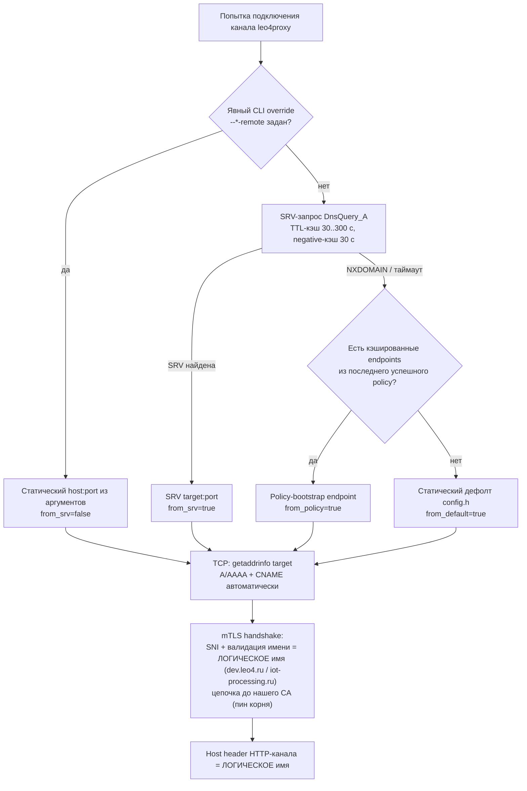

# План: Гибкая конфигурация внешних endpoints leo4proxy через DNS (SRV/CNAME) с policy-fallback

> **Статус:** план, код не изменялся.
> **Сфера:** `term` / **Флоу:** `net` — терминальный сетевой резолвинг endpoints leo4proxy.
> **Затрагиваемые компоненты:** `tools/leo4proxy` (C), `ProcessingBackend` (policy-контракт), DNS-зона `leo4.ru` / `iot-processing.ru`, `nginx-mutual-legacy`, серверные сертификаты нашего CA.
> **Цель:** централизованное управление внешними адресами и портами подключения терминалов (MQTT `8883`, HTTPS `443`, Stream `8443`, RTP-туннель `8443`) **без переустановки сервиса на каждом терминале**, с **повышением надёжности резолвинга** за счёт многоуровневого fallback.

---

## 1. Резюме

Предлагается внедрить в `leo4proxy` четырёхуровневую схему разрешения outbound-endpoints:

```text
1. Явный CLI override  (--mqtt-remote host:port и т.п.)   ← эксплуатационный режим
2. DNS SRV-запись      (_mqtt._tls.dev.leo4.ru и т.п.)    ← основной режим
3. Policy-bootstrap    (endpoints из /api/leo4proxy/policy) ← fallback при недоступном DNS
4. Статический дефолт  (захардкожен в config.h)            ← последний рубеж
```

Каждый уровень не блокирует следующий: SRV-неудача (NXDOMAIN/таймаут) негативно кэшируется на 30 с, endpoints из policy кэшируются на диске с последнего успешного ответа. В результате внедрения надёжность резолвинга **строго возрастает**: сегодня любая недоступность/подмена DNS `dev.leo4.ru` полностью отключает терминал, после внедрения терминал продолжает работать по policy/bootstrap-данным, а идентичность сервера дополнительно подтверждается строгой валидацией цепочки до нашего корневого CA (сейчас `insecure_server_cert=1` — серверный сертификат не проверяется вовсе).

---

## 2. Текущее состояние (по результатам анализа кода)

### 2.1. Модель конфигурации

Конфигурация задаётся только CLI-аргументами (персистятся в SCM при `--install`), дефолты зашиты в `tools/leo4proxy/src/config.h`. Пять outbound-точек:

| Канал | Endpoint по умолчанию | Точка подключения в коде |
|---|---|---|
| MQTT | `dev.leo4.ru:8883` (RabbitMQ MQTT) | `mqtt_proxy.c:84` → `schannel_connect_media()` |
| HTTP | `iot-processing.ru:443` (nginx-mutual-legacy) | `http_proxy.c:614` → `schannel_connect()` |
| Stream | `dev.leo4.ru:8443` (media ingress) | `stream_proxy.c:65` |
| RTP-туннель | `dev.leo4.ru:8443` | `rtp_tunnel.c:161` (lazy connect + reconnect backoff 3–30 с) |
| Policy fetch | `http_remote_host` (HTTP-канал) | `policy.c:239-277` (WinHttp) |

### 2.2. DNS сегодня

- A/AAAA-резолв выполняется **при каждой попытке подключения** (`getaddrinfo` в `schannel_tls.c:106`, `http_proxy.c:39`, `rtp_tunnel.c:37`) — смена A-записи подхватывается без перезапуска службы. Смена IP уже работает.
- **CNAME** работает прозрачно (резолвер следует цепочке) — но только для имени хоста.
- **Порты** изменить через DNS сегодня нельзя: `getaddrinfo` не запрашивает SRV. Смена порта (`8883→8884` и т.п.) требует переустановки сервиса на каждом терминале.
- MQTT/Stream/RTP используют одно имя `dev.leo4.ru` — разделить сервисы по разным хостам без переустановки нельзя.

### 2.3. Сертификаты сегодня

- `insecure_server_cert = 1` по умолчанию: SChannel работает с `SCH_CRED_MANUAL_CRED_VALIDATION` — серверный сертификат **не проверяется** (см. `schannel_tls.c:29-33`). Идентичность сервера держится только на факте, что DNS ведёт на наш хост.
- Все серверные сертификаты, предъявляемые терминалам, выданы **нашим собственным CA** (`iot.leo4.ru` CA, корень `iot_leo4_ca.crt`), не Let's Encrypt: nginx-mutual-legacy (`iot-processing.ru`), брокер (`dev.leo4.ru`), media-ингресс (`dev.leo4.ru:8443`).
- Клиентские (терминальные) сертификаты выпускаются тем же CA.

### 2.4. Policy-контракт сегодня

`GET /api/leo4proxy/policy` (ProcessingBackend, `app/routers/leo4proxy.py` + `app/schemas/leo4proxy.py`):

```json
{
  "v": 1,
  "sn": "<SN>",
  "mqtt_rtp_allowed": true,
  "outgoing_https_allowed": true,
  "stop_facts": []
}
```

Клиентский парсер `tools/leo4proxy/src/policy_json.c` — потоковый токенизатор, извлекающий значения по именам ключей; **неизвестные поля игнорируются** (структурная валидация проверяет только дубликаты ключей). Это обеспечивает естественную обратную совместимость при аддитивном расширении ответа.

---

## 3. Целевая архитектура резолвинга



### 3.1. Ключевые инварианты

1. **Логическое имя ≠ connect target.** TCP-подведение — к SRV target (хост/порт из записи); SNI, имя валидации сертификата и HTTP `Host:` — к **логическому** имени из конфигурации (`dev.leo4.ru`, `iot-processing.ru`). Следствия:
   - nginx маршрутизирует по `server_name`/`Host` — роутинг не меняется при любом SRV target;
   - серверный сертификат остаётся сертификатом логического имени — **перевыпуск не требуется** (см. §8).
2. **Каждый уровень резолва не может ухудшить доступность:** SRV-поиск имеет жёсткий таймаут (2 с) и негативный кэш; RTP-туннель с циклом реконнекта 3–30 с не создаёт DNS-шторм.
3. **Grace-период при смене endpoint:** активные TLS-сессии не разрываются; новые подключения используют новый endpoint. Предыдущий endpoint сохраняется как «last known good» на время TTL + 300 с.
4. **Наблюдаемость:** в `GET /_leo4/info` добавляются поля текущего endpoint каждого канала и его источника (`cli|srv|policy|default`) — диагностика l4superv/инженером без логов.

### 3.2. Матрица SRV-имён

| Канал leo4proxy | SRV owner name (выводится автоматически) | Явный флаг переопределения |
|---|---|---|
| MQTT | `_mqtt._tls.<mqtt_remote_host>` → `_mqtt._tls.dev.leo4.ru` | `--mqtt-srv <fqdn>` |
| HTTP | `_https._tcp.<http_remote_host>` → `_https._tcp.iot-processing.ru` | `--http-srv <fqdn>` |
| Stream | `_l4stream._tls.<stream_remote_host>` | `--stream-srv <fqdn>` |
| RTP-туннель | `_l4rtp._tls.<rtp_tunnel_remote_host>` | `--rtp-srv <fqdn>` |

Глобальные флаги: `--no-srv` (полное отключение SRV-уровня, поведение <=1.7.x), `--srv-lax-cert` (отключить строгую валидацию для SRV-подключений — только для отладки, задокументировать опасность).

---

## 4. DNS: записи, которые нужно прописать уже сейчас

DNS-провайдер зоны `leo4.ru` (и `iot-processing.ru`, если зоны различаются — проверить у регистратора/в текущем DNS-менеджменте). **Записи-заглушки, идентичные текущей топологии** — no-op для существующих терминалов и фиксация схемы для новых версий leo4proxy:

```zone
; === Leo4 IoT terminal endpoints (SRV; потребляются leo4proxy >= 1.8) ===
; MQTT (RabbitMQ MQTT over mTLS)
_mqtt._tls.dev.leo4.ru.        60 IN SRV 10 100 8883 dev.leo4.ru.
; RTP-туннель L4RTP/1 (media ingress)
_l4rtp._tls.dev.leo4.ru.       60 IN SRV 10 100 8443 dev.leo4.ru.
; Legacy TCP stream forwarder
_l4stream._tls.dev.leo4.ru.    60 IN SRV 10 100 8443 dev.leo4.ru.
; Исходящий HTTPS (nginx-mutual-legacy)
_https._tcp.iot-processing.ru. 60 IN SRV 10 100 443  iot-processing.ru.
```

Рекомендации:

- **TTL = 60 с** (кэш в leo4proxy клампится в диапазон 30–300 с независимо от значения TTL записи). 60 с — баланс между скоростью переключения и нагрузкой на резолверы.
- **Target = текущие имена** на первом шаге. Никаких изменений серверов не требуется. Старые версии leo4proxy эти записи не читают (SRV не запрашивается `getaddrinfo`), т.е. запись безопасна для действующего парка.
- Резервный endpoint добавляется второй SRV-записью с большим priority (пример будущего failover):

```zone
; Пример будущего failover (НЕ добавлять сейчас):
_mqtt._tls.dev.leo4.ru.  60 IN SRV 20 100 8883 mqtt-backup.leo4.ru.
```

- **Проверить до внедрения:** зона `iot-processing.ru` управляется там же, где `leo4.ru`; подтвердить, что DNS-провайдер не фильтрует SRV у сторонних резолверов (критично для мобильных операторов терминалов — обрабатывается fallback-уровнями, но нужно знать долю).

### 4.1. Статус внесения записей (проверено 2026-10-04)

Записи уже внесены (Этап 1 выполнен на стороне DNS). Результат проверки через локальный резолвер и внешний `8.8.8.8`:

| SRV-запись | Статус | Результат |
|---|---|---|
| `_mqtt._tls.dev.leo4.ru` | ✅ подтверждена | `SRV 10 100 8883 dev.leo4.ru` (роутер + 8.8.8.8) |
| `_l4rtp._tls.dev.leo4.ru` | ✅ подтверждена | `SRV 10 100 8443 dev.leo4.ru` |
| `_l4stream._tls.dev.leo4.ru` | ✅ подтверждена | `SRV 10 100 8443 dev.leo4.ru` |
| `_https._tcp.iot-processing.ru` | ❌ **Non-existent domain** | Отсутствует и через локальный резолвер, и через `8.8.8.8` — кэш исключён |

**Действие:** повторить `nslookup -type=SRV _https._tcp.iot-processing.ru 8.8.8.8` через 1–24 ч (задержка распространения зоны); если запись не появится — проверить, в какую зону фактически внесена (возможно, владелец зоны `iot-processing.ru` иной / запись добавлена в `leo4.ru`). До появления записи HTTP-канал работает на уровнях policy/config — работоспособность не нарушена, но полная схема для HTTPS не активируется.

---

## 5. Policy-контракт: обратная совместимое расширение `endpoints`

### 5.1. Расширение ответа (сервер ProcessingBackend)

`app/schemas/leo4proxy.py` — новое **опциональное** поле (default `None`, в ответ не включается, пока не активировано):

```json
{
  "v": 1,
  "sn": "<SN>",
  "mqtt_rtp_allowed": true,
  "outgoing_https_allowed": true,
  "stop_facts": [],
  "endpoints": {
    "mqtt":     {"host": "dev.leo4.ru",       "port": 8883},
    "https":    {"host": "iot-processing.ru", "port": 443},
    "l4rtp":    {"host": "dev.leo4.ru",       "port": 8443},
    "l4stream": {"host": "dev.leo4.ru",       "port": 8443}
  }
}
```

- **`v` остаётся равным 1** — расширение аддитивное, ломающих изменений нет.
- **Первая итерация: значения статические, равные текущим production-endpoints**, захардкожены в настройках ProcessingBackend (env-переменные `LEO4_ENDPOINT_*` с дефолтами = текущие значения, без секретов). Централизованное управление (БД/админка) — отдельная задача, контракт под неё уже готов.
- Валидация на сервере: `host` — валидное DNS-имя (без схемы, без `:port`), `port` 1–65535. Некорректный блок `endpoints` → поле опускается, ответ деградирует до текущего формата (терминал использует свои уровни 2/4).

### 5.2. Матрица совместимости

| Клиент leo4proxy | Сервер policy | Поведение |
|---|---|---|
| Текущий (<=1.7.x) | Расширенный | ✅ Неизвестное поле `endpoints` игнорируется парсером `policy_json.c` (проверено анализом кода) |
| Новый (>=1.8) | Текущий | ✅ Поля нет → policy-уровень резолва неактивен, работают SRV/config-дефолты |
| Новый | Расширенный | ✅ Полная схема (CLI > SRV > policy > config) |

### 5.3. Клиентская сторона (leo4proxy)

- Модуль policy (`policy.c`) при успешном разборе ответа извлекает `endpoints` и публикует их в общий реестр endpoints (SRWLOCK, аналогично существующему механизму facts).
- **Персист:** endpoints последнего успешного ответа сохраняются в существующее локальное хранилище policy-состояния (реестр + JSON, `policy.c: persist/restore`) отдельной записью — переживают перезагрузку терминала. Это ключевой элемент надёжности: DNS недоступен после старта (мобильные сети, сбои оператора) → терминал стартует с последними известными endpoints.
- Policy-fetch сам использует многоуровневый резолв HTTP-канала (bootstrap через любой доступный уровень); при подключении к policy-endpoint, отличному от логического имени, заголовок `Host:` выставляется в логическое имя (`WinHttpAddRequestHeaders` + `WINHTTP_ADDREQ_FLAG_REPLACE`).

---

## 6. Изменения в leo4proxy, l4setup и l4superv (обзор, без кода)

| Файл | Изменение |
|---|---|
| `src/dns_srv.h` / `src/dns_srv.c` *(новые)* | `DnsQuery_A(DNS_TYPE_SRV)` (dnsapi.lib, доступна с Windows 2000 — совместимо с POSReady 7/Win7 x86); выбор по RFC 2782 (min priority → weighted random); TTL-кэш 30–300 с + негативный кэш 30 с на имя; SRWLOCK; функция `leo4_endpoint_resolve()` реализует всю цепочку уровней §3 |
| `src/config.h` | Поля: `srv_enabled` (default 1), `srv_require_trusted_cert` (default 1), `mqtt/http/stream/rtp_srv_name[]`, `*_remote_explicit` (ставится при `--*-remote`) |
| `src/schannel_tls.c` | Strict-режим валидации серверного сертификата (см. §7): ручная проверка цепочки после handshake + second CredHandle без `SCH_CRED_MANUAL_CRED_VALIDATION`; SNI/имя валидации = логическое имя |
| `src/mqtt_proxy.c`, `src/http_proxy.c`, `src/stream_proxy.c`, `src/rtp_tunnel.c` | Замена прямого использования `config->*_remote_host:port` на `leo4_endpoint_resolve()`; `Host:` header HTTP-канала остаётся логическим именем (уже так — `http_proxy.c:564`); логирование фактического target и источника |
| `src/policy.c` | Разбор `endpoints`, публикация в реестр, персист/restore |
| `src/main.c` | Дефолты, новые CLI-флаги, `--*-remote` помечает `*_remote_explicit=1`, инициализация CA-пина, статусный вывод |
| `build.cmd`, `CMakeLists.txt` | + `src/dns_srv.c`, + `dnsapi.lib` |
| `tests/test_dns_srv.c` + `tests/test_dns_srv.cmd` *(новые)* | Unit-тесты выбора priority/weight, кэша, приоритетов уровней (offline, без сети — как `test_policy.c`) |
| README.md / USER_GUIDE.md / CHANGELOG.md leo4proxy | Документация SRV-режима, флагов, инвариантов эксплуатации |
| `tools/l4setup/src/srv_probe.c/h` *(новые)* + `ui.c`, `engine.c`, `smoke.c`, `summary.c`, `services.c` | Пробивка SRV с отображением в UI, проверка валидности серверного сертификата, переключатели режимов резолвинга, трансляция опций в аргументы службы (см. §6.1) |
| `tools/l4superv/src/config.c`, `services.c`, `orchestrator.c` | Консистентность `leo4proxy_args` с опциями l4setup при watchdog-рестартах (см. §6.2) |
| `leo4proxy --check-upstream` *(новый диагностический режим)* | Однократная проба endpoint'ов с strict-валидацией; вызывается l4setup, результат парсится и показывается в UI (см. §6.1.2) |

Упаковка `tools/l4superv/pack_zip.cmd` и `installer_main.c` **не меняются** — имя бинарника и структура дистрибутива сохраняются.

### 6.1. l4setup: пробивка SRV, валидация серта и переключатели режимов

#### 6.1.1. Пробивка SRV-записей с отображением в UI

Новый модуль `srv_probe` вызывается в конвейере фаз (точка — после `SETUP_PHASE_START`, в начале Verify):

- `DnsQuery_A(DNS_TYPE_SRV)` для 4 каналов; таймаут 2 с на запрос, 1 ретрай.
- UI-таблица «Сервис → SRV-имя → target:port → статус»: `OK (srv)` / `нет записи → policy/config` / `DNS недоступен → policy/config`.
- Отсутствие SRV или недоступность DNS — **не ошибка установки** (жёлтый статус): установщик обязан завершаться успешно при любых результатах пробы, т.к. fallback-уровни покрывают сценарий.
- Unattended-режим (`--silent`): проба выполняется без UI, результат попадает в `install_summary.json` (новый блок `srv_probe`).

#### 6.1.2. Проверка валидности серверного сертификата и галочка «Доверять»

Условие запуска: сертификат терминала установлен **и** служба leo4proxy успешно стартовала.

- l4setup вызывает `leo4proxy.exe --check-upstream` (новый однократный диагностический режим leo4proxy): проба mTLS-подключения каждого канала к его резолвенному endpoint с strict-валидацией цепочки до pinned корня CA и имени (§7.2), вывод построчного результата и итогового exit code. Единая логика валидации живёт в leo4proxy — l4setup не дублирует криптографию.
- **Сертификат валиден (все каналы)** → l4setup автоматически выставляет `srv_require_trusted_cert=1` в аргументах устанавливаемой службы; в UI галочка «Доверять» отмечается автоматически с пояснением «серверный сертификат подтверждён нашим CA».
- **Сертификат не валиден (хотя бы один канал)** → жёлто-красное предупреждение (канал, код ошибки: `untrusted_root` / `cert_name_mismatch` / `cert_expired` / `handshake_failed`), установка НЕ прерывается; галочка «Доверять» остаётся снятой — пользователь принимает решение вручную. Ручная установка галочки включает strict-режим в SRV-режиме (экранный текст должен явно предупреждать о риске MITM при продолжении без доверия).
- Результат проверки фиксируется в `install_summary.json` (`upstream_validation`: per-channel verdict + принятое пользователем решение).

#### 6.1.3. Переключатели режимов резолвинга в UI

- **«Авто» (по умолчанию, включён сразу):** полный 4-этажный резолвинг §3. Транслируется в аргументы службы **без** `--*-remote` флагов (не explicit), `srv_enabled=1` (дефолт).
- **«Ручной» (per-service):** поля `host:port` для каждого из 4 сервисов (`mqtt`, `https`, `l4rtp`, `l4stream`); транслируются в `--mqtt-remote host:port` и т.д. (explicit override — SRV-уровень для этого канала отключается автоматически).
- Комбинации допустимы (часть сервисов «Авто», часть «Ручной»).
- Валидация ввода: непустой host без схемы, порт 1–65535; пустое поле = «Авто» для этого сервиса.

#### 6.1.4. Трансляция опций в аргументы службы

- `services.c` при установке/обновлении службы `Leo4Proxy` генерирует аргументы из выбранных опций (режимы 6.1.3 + решение «Доверять» 6.1.2).
- Те же аргументы l4setup записывает в конфиг l4superv (`leo4proxy_args`, уже существует) — единый источник для watchdog-рестартов.
- Unattended-режим: те же опции через CLI-флаги l4setup (`--resolve-auto` по умолчанию / `--resolve-manual mqtt=h:p,https=h:p,...` / `--trust-upstream auto|yes|no`).

### 6.2. l4superv: сохранение режима резолвинга при рестартах

- l4superv при watchdog-старте/рестарте leo4proxy запускает службу с аргументами из `leo4proxy_args` без модификаций — режим резолвинга, выбранный в l4setup, сохраняется.
- Инвариант консистентности: аргументы в SCM и в конфиге l4superv совпадают; **единственный писатель — l4setup**. l4superv при расхождении логирует warning (`leo4proxy_args_mismatch`) и не «чинит» самостоятельно.
- В HTTP-поллинг `GET /_leo4/info` (уже используется l4superv) добавляются поля endpoint/источника — l4superv отражает фактический режим в своём статусе без дополнительной логики.

### 6.3. Аудит флоу после реализации: гарантия отсутствия блокировок

После реализации — обязательный сквозной просчёт всех флоу (код-ревью + тесты), цель: **leo4proxy не теряет надёжность/стабильность, только приобретает адаптивность**. Контрольные точки:

| Флоу | Требование |
|---|---|
| Холодный старт службы без DNS | Без блокировок: SRV-таймаут ≤ 2 с на канал, негативный кэш 30 с; старт службы не ждёт резолва (резолв ленивый, при первом подключении) |
| Standby без сертификата (service_mgr.c) | SRV-уровень не участвует до появления серта; HTTP-диагностика доступна как сегодня |
| Hot-swap сертификата при активных SRV-сессиях | Ротация кредов не пересоздаёт endpoint-кэш; активные сессии живут |
| Policy-fetch при недоступном SRV | Использует policy/config-уровень; таймауты WinHttp прежние (5 с) |
| Watchdog-рестарт l4superv | Служба стартует с сохранёнными аргументами; отсутствие l4superv не меняет поведение leo4proxy |
| SRV-проба в UI l4setup | Выполняется в worker-потоке (существующая модель engine.c), UI остаётся отзывчивым, cancel/retry работают; таймаут пробы ≤ 8 с суммарно |
| Unattended l4setup | Никаких интерактивных ожиданий: предупреждения 6.1.2 при `--silent` дефолтуют в безопасную сторону (`trust=no`), фиксируются в summary |
| RTP-туннель reconnect-loop | Не более 1 SRV-запроса / 30 с на имя (негативный кэш), без DNS-шторма |
| `--no-srv` | Точное поведение версии 1.7.x (регрессионный тест-двойник) |

**Принцип запрета деградации:** каждый новый путь кода обязан при отказе любого из новых уровней (SRV, policy-endpoints) деградировать строго до поведения 1.7.x, но не хуже. Это фиксируется регрессионными тестами.

---

## 7. Безопасность: строгая валидация серверного сертификата (наш CA)

### 7.1. Проблема

Сегодня серверный сертификат не проверяется (`insecure_server_cert=1`). Добавление DNS-управляемых endpoints без валидации расширяет поверхность MITM: подмена SRV/A-записи + произвольный сервер = терминал отдаёт клиентский сертификат и полезную нагрузку злоумышленнику.

### 7.2. Решение (режим A — рекомендуемый, по умолчанию)

- **Имя валидации и SNI = логическое имя** (`dev.leo4.ru` / `iot-processing.ru`): сервер на любом SRV-target обязан предъявить действительный сертификат **на логическое имя**. Существующие сертификаты этим свойством уже обладают.
- **Цепочка до нашего CA:** в leo4proxy встраивается корневой сертификат `iot.leo4_ca.crt` (как ресурс бинарника) либо его пин (SHA-256 SPKI корня). Валидация выполняется вручную после SChannel-handshake: `CertGetCertificateChain` с дополнительным trust-anchor из встроенного корня + `CertVerifyCertificateChainPolicy` (SSL-политика, имя = логическое). Это **не требует** установки корня в `LocalMachine\Root` на терминалах и не зависит от состояния системного хранилища.
- Строгий режим обязателен для подключений, полученных **из SRV** (`srv_require_trusted_cert=1` по умолчанию). Для уровней policy/config-default сохраняется текущее поведение (без регрессии доступности парка); распространение strict-режима на все каналы — отдельный этап (см. §10, Этап 4) после набора статистики.
- Отказ в strict-режиме (недоверенная цепочка/имя) → подключение к этому target прерывается, логируется `srv_cert_rejected`; терминал не даёт MITM-серверу ни полезную нагрузку, ни клиентский сертификат далее handshake.
- **Принятие решения «Доверять» выносится в l4setup** (§6.1.2): при валидном серверном сертификате (цепочка до pinned корня + имя подтверждены для всех каналов) галочка «Доверять» и `srv_require_trusted_cert=1` выставляются автоматически; при невалидном — предупреждение и явное ручное подтверждение пользователем (в т.ч. для SRV-режима). Решение персистится в аргументах службы и в `install_summary.json`.

### 7.3. Альтернативный режим B (опция на будущее)

Валидация по **имени target** (для хостов, где невозможно переиспользовать серт логического имени) — требует выпуска SAN-сертификатов нашим CA на каждое новое целевое имя. В план основного внедрения не входит; архитектура это допускает без изменения клиента.

---

## 8. Сертификаты: нужно ли перевыпускать?

**Короткий ответ: нет.** При режиме A (§7.2):

| Сценарий | Действие с сертификатами |
|---|---|
| Внедрение SRV с target = текущие имена (первый шаг, записи §4) | Ничего. Серты `dev.leo4.ru` (брокер, media) и `iot-processing.ru` (nginx) остаются |
| Смена только портов (SRV port ≠ 8883/8443/443) | Ничего. Порт не входит в сертификат |
| Перенос сервиса на новый хост (SRV target = новое имя) | **Перенос** существующего серта логического имени на новый хост (сертификат `dev.leo4.ru` продолжает предъявляться; выпуск не нужен). При необходимости — выпуск нашим CA серта с SAN `[dev.leo4.ru, <новое имя>]` — штатная процедура нашего CA, не LE |
| Переход на режим B (валидация по target) | Выпуск SAN-сертов нашим CA на целевые имена — отдельная задача |

Дополнительно требуется (не перевыпуск, а распространение): **закэпить корень `iot.leo4_ca.crt` в бинарнике leo4proxy** (ресурс) — корень уже существует и используется для терминальных сертификатов, меняется только способ его потребления.

---

## 9. Изменения на nginx и серверной инфраструктуре

### 9.1. Обязательные изменения сейчас — **нет**

При target = текущие имена/порты (записи §4) конфигурация `nginx-mutual-legacy` (`legacy_ssl.conf`), `compose.yaml` и фаервол сервера `87.242.100.34` не меняются: Host header остаётся `iot-processing.ru`, SNI = `iot-processing.ru`, порт 443 прежний.

### 9.2. Изменения при будущем вводе новых портов/хостов (задокументировать как runbook)

| Действие | Где |
|---|---|
| Новый HTTPS-порт (например 9443) | `server { listen 9443 ssl; }` в `legacy_ssl.conf` (копия блока 443), публикация порта в `nginx-mutual-legacy/docker-compose.yml`, открытие в облачном/хостовом фаерволе, обновление SRV |
| Перенос брокера MQTT на отдельный хост | A-запись нового target, публикация 8883, установка серта `dev.leo4.ru` (или SAN) на новый хост, обновление SRV target |
| Перенос media-ингресс (8443) | Аналогично: A-запись, порт, серт `dev.leo4.ru`, SRV `_l4rtp._tls` / `_l4stream._tls` |
| Failover-хост | Вторая SRV-запись с большим priority + идентичная настройка сертов/портов на резервном хосте |

Инвариант для всех случаев: **SNI и Host header всегда остаются логическими именами** — маршрутизация nginx по `server_name` и выбор серверного сертификата не зависят от фактического target.

---

## 10. Этапы реализации

| Этап | Содержание | Верификация |
|---|---|---|
| **0. DNS (выполнен частично)** | ~~Прописать SRV-записи §4~~ — записи внесены; статус проверки — §4.1 (3/4 подтверждены, `_https._tcp.iot-processing.ru` отсутствует — повторная проверка после задержки распространения). Зафиксировать пин корня CA; подтвердить управление зоной `iot-processing.ru` | Повторный `nslookup -type=SRV _https._tcp.iot-processing.ru 8.8.8.8` через 1–24 ч; при отсутствии — аудит внесения записи владельцем зоны |
| **1. Сервер policy** | Опциональное поле `endpoints` в `Leo4ProxyPolicy` (env-конфиг со статическими дефолтами = production); pytest: старый формат без поля, новый с полем, инвалидный блок деградирует | `pytest ProcessingBackend/backend/tests/test_leo4proxy_policy.py` + новые кейсы |
| **2. leo4proxy** | Модуль `dns_srv`, интеграция 5 точек подключения, strict-валидация §7, policy-endpoints + персист, CLI-флаги, `--check-upstream`, `/_leo4/info` расширение | `tests/test_dns_srv.cmd` (x86+x64, offline), `build.cmd` обе архитектуры, ручной прогон на тестовом терминале |
| **2a. l4setup + l4superv** | Доработки §6.1–§6.2: SRV-проба в UI, проверка валидности серверного серта с авто/ручной галочкой «Доверять», переключатели режимов резолвинга (Авто по умолчанию / ручной host:port per-service), трансляция опций в аргументы службы и `leo4proxy_args` l4superv | `tools/l4setup/run_tests.cmd` + новые кейсы (проба, трансляция аргументов, unattended); ручная проверка UI-флоу |
| **2b. Аудит флоу** | Сквозной просчёт всех флоу §6.3 на блокировки/затыки + регрессионные тесты «no-worse-than-1.7.x» (`--no-srv` = точное поведение 1.7.x) | Чек-лист §6.3 закрыт тестами; ни один таймаут не превышен |
| **3. Раскатка** | `pack_zip` → beta-стенд → prod через стандартный l4install-флоу (l4setup с новыми опциями) | E2E §11 |
| **4. Пост-внедрение (опции)** | Распространение strict-валидации на все каналы; управление endpoints из БД/админки; режим B | Отдельные задачи |

**Критерий готовности Этапов 2/2a/2b:** на тестовом терминале при работающем DNS подключение идёт по SRV; при блокировке DNS (hosts-файл на несуществующий резолвер / firewall drop UDP+TCP 53) терминал продолжает работать: policy-bootstrap (после первого успешного fetch) → config-дефолты (холодный старт без DNS и без кэша policy). l4setup в «Авто»-режиме завершается успешно при любом состоянии DNS и SRV. Ни один флоу §6.3 не содержит блокировок сверх заданных таймаутов; поведенческий дифф с 1.7.x при `--no-srv` пуст.

**Инвариант неменьшей надёжности:** результатом внедрения является строгое расширение адаптивности — любая комбинация отказов новых уровней (DNS, SRV, policy-endpoints) деградирует до текущего поведения 1.7.x и не может привести к состоянию хуже него. Проверяется регрессионными тестами и сценариями §11.

---

## 11. E2E-сценарии приёмки

1. **Happy path SRV:** SRV-запись → терминал подключается к target:port, `/_leo4/info` показывает `source: srv`, mTLS успешен, строгая валидация цепочки до нашего CA пройдена.
2. **SRV недоступен (NXDOMAIN):** негативный кэш 30 с, подключение по policy-bootstrap (если кэш есть) или config-дефолту; восстановление DNS → возврат на SRV в пределах TTL.
3. **DNS полностью недоступен при старте:** холодный старт → config-дефолты; после первого успешного policy-fetch endpoints кэшируются; рестарт без DNS → policy-bootstrap.
4. **Смена порта через SRV без toque на терминале:** правка записи → новые подключения на новый порт в пределах TTL+кэша.
5. **MITM-негатив:** SRV/target подменён на хост с неверным сертом → strict-валидация отклоняет handshake, в логах `srv_cert_rejected`, терминал не устанавливает сессию.
6. **Failover:** две SRV (priority 10/20), недоступность primary → подключения на secondary.
7. **Обратная совместимость:** старый leo4proxy против нового policy-ответа (поле игнорируется); новый leo4proxy против старого policy-сервера.
8. **RTP-туннель:** цикл реконнекта при недоступном DNS не штормит резолвер (не более 1 SRV-запроса / 30 с).
9. **l4setup, пробивка SRV в UI:** на машине с внесёнными записями (§4) установщик показывает таблицу резолвинга: 4 канала → `target:port` со статусом `OK (srv)`; при отсутствии записи `_https._tcp.iot-processing.ru` (текущее состояние §4.1) — жёлтый статус `нет записи → policy/config`, установка завершается успехом.
10. **l4setup, автовыставление «Доверять»:** после старта leo4proxy `--check-upstream` возвращает «валиден» для всех каналов → галочка «Доверять» отмечена автоматически, аргументы службы содержат strict-режим. При подменённом/невалидном серте на стенде → предупреждение с кодом ошибки, галочка не выставлена; ручное подтверждение работает и персистится в аргументах.
11. **l4setup, ручной режим резолвинга:** ввод `host:port` для отдельных сервисов → служба установлена с соответствующими `--*-remote`, SRV для этих каналов не запрашивается; комбинированный режим (часть Авто / часть Ручной) работает.
12. **l4superv, сохранение режима:** watchdog-рестарт leo4proxy выполняется с аргументами, записанными l4setup (`leo4proxy_args` == SCM-аргументы); расхождение логируется как `leo4proxy_args_mismatch`.
13. **Регрессия «no-worse-than-1.7.x»:** `--no-srv` на новом бинарнике — поведение (логи, тайминги, endpoints) неотличимо от 1.7.x; SRV-таймаут не добавляет задержку подключению сверх 2 с при полностью мёртвом DNS.
14. **Unattended l4setup:** `--silent` без DNS завершается успехом, `install_summary.json` содержит блоки `srv_probe` и `upstream_validation` с дефолтом `trust=no` при невалидном/непроверяемом серте.

---

## 12. Риски и митигации

| Риск | Митигация |
|---|---|
| Операторские/корпоративные DNS режут SRV (мобильные сети киосков) | Уровни 3–4 (policy/config) полностью покрывают сценарий; позитивный/негативный кэш; E2E-сценарий 2 |
| Подмена DNS (MITM) | Strict-валидация цепочки до pinned корня CA + имени (§7); обязательна для SRV-подключений |
| Регрессия доступности парка при раскатке | SRV-записи этапа 0 = текущие endpoints (no-op); уровень policy/config сохраняет поведение 1.7.x; раскатка через beta-стенд |
| Смена endpoint «на лету» ломает долгоживущие сессии | Grace-инвариант §3.1 (активные сессии не рвутся) |
| Отрицательный кэш маскирует восстановление DNS | TTL негативного кэша 30 с; системный резолвер-кэш Windows используется `DnsQuery_A` штатно |
| Утечка информации через `/_leo4/info` | Endpoint-поля добавляются в существующий диагностический JSON, доступный только с loopback-слушателя (текущая модель) |
| UI l4setup блокирует установку на слабых машинах/медленных DNS | Проба в worker-потоке с жёсткими таймаутами (§6.3); таблица обновляется по мере готовности строк, а не по завершении всех проб |
| Рассинхрон аргументов службы (SCM) и `leo4proxy_args` l4superv | Единственный писатель — l4setup; l4superv только читает и логирует расхождение, не модифицирует |
| Автодоверие при ошибке пробы (ошибка сети ≠ невалидный серт) | `--check-upstream` различает `probe_failed` (сеть/DNS) и `cert_invalid` (криптографический вердикт); автогалочка ставится только при подтверждённом `valid`; при `probe_failed` — предупреждение + ручное решение |
| Задержка распространения DNS-записей (наблюдается: `_https._tcp` отсутствует, §4.1) | Наличие/отсутствие записи не влияет на успех установки (жёлтый статус); повторная проба в l4setup по кнопке; повторная проверка записи через 1–24 ч |

---

## 13. Открытые вопросы (решить до Этапа 2)

1. Зона `iot-processing.ru`: подтвердить, что управление записями доступно там же, где `leo4.ru` (для `_https._tcp`).
2. Режим встраивания корня CA: ресурс бинарника (`res/leo4proxy.rc`) vs файл рядом с exe vs оба — предложение: ресурс + fallback на файл `iot_leo4_ca.crt` в каталоге установки.
3. Сроки включения strict-валидации для policy/config-уровней (Этап 4) — после статистики отказов на beta-стенде.
