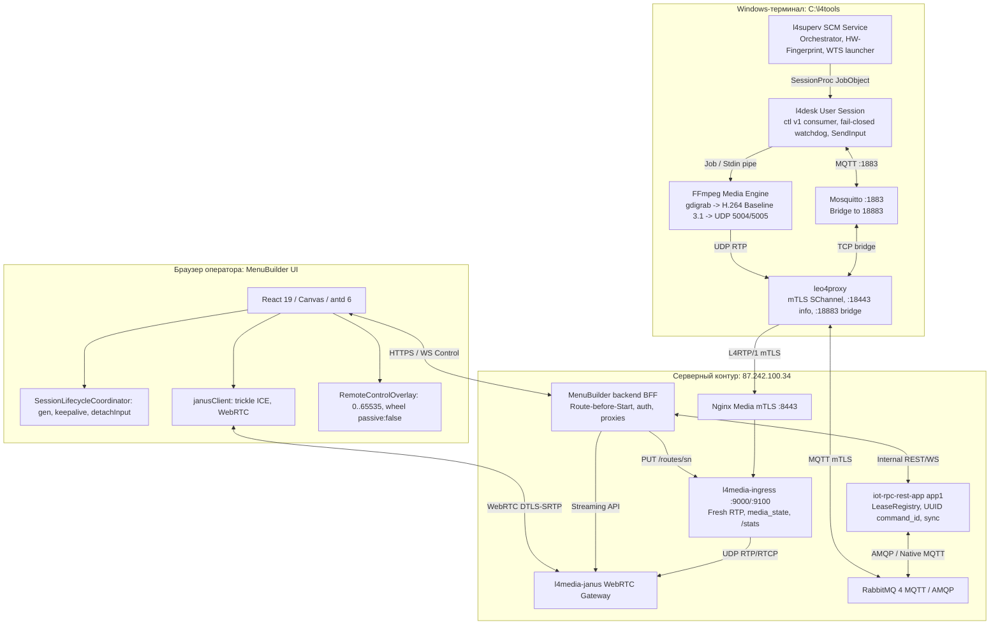

# Ревизия архитектуры управления видео / удаленным управлением и план перехода к Zero-Touch комплексу tools на Windows-терминале

**Дата составления:** 12.09.2026  
**Статус документа:** Проект / Архитектурный план на следующий этап  
**Сфера:** `term` (Терминальный контур и киоски платёжной платформы etranprocessing)  
**Флоу:** `tool` (Нативные терминальные утилиты L4 Suite, оркестрация и инсталлятор)  
**Контекст:** Развитие E2E-тракта видеонаблюдения и удаленного управления по результатам Шагов 1–4 (`etran_arch-video-remote-desktop-e2e.md`, `etran_arch-remote-input-control.md`), ревизия стабильности облачного контура (`MenuBuilder`, `app1`, `l4media`) и фокус на локальном комплексе Windows-терминала (`tools/`).  
**Исключения скоупа:** По прямому указанию архитектора вопросы криптографического связывания серийного номера (SN) с сертификатом в медиапреамбуле L4RTP/1 (задача R2) **вынесены за рамки данного этапа** и будут решаться отдельно на сервере.  
**Связанные документы:** `ops_run-beta-ci-cd.md` (действующий контур builder → OCI Artifact Registry `dev-leo4-ru.cr.cloud.ru/etran` → production для серверных образов), публичный Generic Artifact Registry `https://l4tools-generic.ar.cloud.ru/` (целевой канал раздачи `l4tools`), `tools/dist/README.md` (текущий формат дистрибутива).  
**Ревизия 2 (12.09.2026):** добавлен раздел 7 «Оценка Artifact Registry для публикации и дистрибуции tools», рабочий пакет 6 «Канал публикации и самообновления», уточнены Пакет 5, риски и критерии приемки.  
**Ревизия 3 (12.09.2026):** по уточнению архитектора (`l4tools` не секрет, есть публичный Generic-реестр) раздел 7 и Пакеты 5–6 переведены с OCI/ORAS на Generic-реестр: payload раздается терминалам напрямую из реестра анонимным `GET`, mTLS-контур несет только подписанный манифест канала; зафиксированы проверенные факты и API реестра (`HEAD digest`, `PUT /upload`, нет Range, no-overwrite, тарифы).  
**Ревизия 4 (12.09.2026):** добавлены состояния S9 «валидный сертификат уже установлен — не трогать» и S10 «сертификата нет — PIN опционален, активное ожидание» (3.2, 4.1, 4.3, Пакет 3, DoD 6.2); добавлен раздел 8 — разбиение переработки на изолированные этапы по стекам: Этап 1 (инсталлятор + сертификат + smoke + публикация в Generic-реестр, **без** самообновления) с серией промптов `prompts/prompt_step5_*`, Этапы 2–3 (канал манифестов и Update Agent, наблюдаемость версии в UI) — позже.

---

## 1. Резюме и системный вывод

### 1.1. Текущий статус сквозного тракта (End-to-End)
В ходе последовательной реализации Шагов 1, 2, 3 и 4 сквозная связка видеонаблюдения и удаленного управления терминалом переведена в устойчивое, предсказуемое рабочее состояние:
1. **Media Plane (Видеотрансляция):** Захват экрана FFmpeg (`gdigrab`) кодируется в строго детерминированный профиль **H.264 Constrained Baseline Level 3.1** (RTP clock 90 kHz, PT 96, zero-latency без B-frames, регулярный IDR раз в 2 с), передается через локальный UDP на `leo4proxy`, инкапсулируется в байтовый поток **L4RTP/1 over mTLS**, расшифровывается Nginx и направляется в `l4media-ingress`. Внедренный на Шаге 2 порядок **Route-before-Start** (регистрация маршрута в ingress до команды старта энкодера) ликвидировал потерю начальных кадров в `unrouted_packets` и обеспечивает мгновенный sub-second показ в плеере WebRTC Janus без ожидания следующего GOP.
2. **Control Plane (Удаленный ввод и жизненный цикл):** Команды мыши и клавиатуры передаются через MenuBuilder BFF в `iot-rpc-rest-app` (`app1`), маршрутизируются в MQTT-топик `srv/{SN}/ctl` и исполняются агентом `l4desk` через Win32 API `SendInput`. Внедренный на Шаге 4 координатор жизненного цикла `SessionLifecycleCoordinator` с трекингом поколений (`generation`), неперекрывающимся расписанием keepalive и безопасным `detachInput()` ликвидировал коллизии аренды, рассинхронизацию эпох стрима и преждевременные 404-ошибки. Локальный сторожевой таймер аренды `l4desk` (5 с grace) и функция `input_release_all()` надежно предотвращают утечку экрана и залипание клавиш при потере связи.

### 1.2. Оценка с точки зрения пользователя MenuBuilder UI
С точки зрения оператора веб-интерфейса `MenuBuilder` (/video):
* **Стек полностью работоспособен:** Выбор терминала, запуск трансляции, переключение между дисплеями и камерами, удаленный ввод мыши с пиксельной нормализацией `0..65535` и перехват клавиатуры отрабатывают стабильно, плавно и без задержек.
* **Сессия надежно удерживается:** Трансляция не прерывается ложными срабатываниями сторожевых таймеров благодаря восстановленной цепочке сквозного продления (`lease_renew` с каноническим UUID `command_id` и семантикой `applied_deadline_ms`).
* **Статус честен и наблюдаем:** Разделение учета транспортной активности и свежих RTP-дейтаграмм (`RTP_STALE_DEADLINE_SEC = 10`) в `l4media-ingress` гарантирует, что индикатор «В эфире» отображается только при действительном поступлении видеокадров.

### 1.3. Ключевой вектор развития: Комплекс утилит Windows-терминала (`tools`)
При доказанной стабильности серверной архитектуры и веб-интерфейса главным сдерживающим фактором масштабирования на сеть из тысяч платежных киосков остается **локальный процесс развертывания и первичной инициализации утилит на терминале**:
* В текущем виде комплект поставки разделен на отдельные файлы (`l4install.exe`, `tools.zip`, `ffmpeg.zip`), разнесен по папкам архитектур (`dist` и `dist_win7_sp1`), требует ручного сопоставления разрядности и ручного запуска утилиты выпуска сертификата `l4pin.exe <PIN>`.
* Терминалы в реальной эксплуатации находятся в **самых непредсказуемых начальных состояниях**: остатки старых версий ПО, занятые порты, зависшие службы в SCM, клонированные образы дисков (смена Hardware Fingerprint), отсутствие вспомогательных библиотек (UCRT на Windows 7), отключенный по умолчанию TLS 1.2 в Schannel, заблокированные интерактивные десктопы или агрессивный Брандмауэр Windows.
* **Отсутствует канал публикации и обновлений:** готовые бинарники (`tools.zip` 1.5 МБ, `ffmpeg.zip` 28.6 МБ, четыре `l4install*.exe`) хранятся прямо в Git (`tools/dist`, `tools/dist_win7_sp1`) и переносятся на терминал вручную (flash-накопитель, RDP, копирование по сети). Нет ни манифеста с контрольными суммами и подписью, ни механизма, которым уже установленный `l4superv` мог бы узнать о новой версии и обновиться. Публичный Generic-реестр `l4tools-generic.ar.cloud.ru` уже создан, но пуст и не встроен ни в builder, ни в терминальные утилиты. Каждый выпуск `tools` на парке из тысяч киосков превращается в выезд инженера.
* **Целевая задача следующего шага:** Создать полностью монолитный, отказоустойчивый, самодостаточный исполняемый комплекс развертывания **"Нажал и забыл" (Zero-Touch / One-Click Installer-Start)**, способный в один клик или одной тихой командой привести терминал из **любого** начального состояния в полностью боевое и онлайн-доступное для `MenuBuilder UI`.

---

## 2. Комплексная ревизия состояния сквозной архитектуры

Сводный срез реализованных контрактов, компонентов и текущего состояния системы:



### 2.1. Матрица готовности подсистем (Шаги 1–4)

| Подсистема | Реализованный функционал | Подтвержденное состояние | Остаточные риски / Ограничения |
|---|---|---|---|
| **MenuBuilder Frontend** | `SessionLifecycleCoordinator`, поколения (`generation`), Route-before-Start, безопасный `detachInput()`, нормализация координат `0..65535`, защита от спама `pointer_move` вне desktop-режима, безопасный сброс зажатых клавиш (`kind="up"`). | **ГОТОВО К ПРИЕМКЕ.** Бандл собран, протестирован Vitest fake timers, развернут на `87.242.100.34`. | STUN-only WebRTC (Google STUN); для корпоративных сетей с жестким файрволом потребуется TURN relay. |
| **MenuBuilder Backend** | Предварительное монтирование маршрута (`PUT /routes/{sn}`) и Janus mountpoint, идемпотентная остановка стрима (`already_stopped` -> 200 OK), нормализация 404 (`code: "lease_not_found"`), передача `generation` в keepalive, обогащение DTO признаком `fresh_rtp`. | **ГОТОВО К ПРИЕМКЕ.** Сервис протестирован контрактными тестами `test_step4_video_contracts.py` и перезапущен на проде. | Modulo-аллокация портов (`VIDEO_PORT_SLOTS = 100`) теоретически допускает коллизию при совпадении `device_id % 100`. |
| **iot-rpc-rest-app (`app1`)** | Монопольный `LeaseRegistry`, каноническое wire-поле `command_id` UUID в `CtlLeaseRenew`, семантика `renew_status` (`applied_deadline_ms`), идемпотентный release, изоляция эпох стримов, защита LWT от гонок при рестарте агента. | **ГОТОВО К ПРИЕМКЕ.** Все 101 тест пройдены, контейнер задеплоен на проде. | Состояние аренды хранится in-memory; при горизонтальном масштабировании (`WEB_CONCURRENCY > 1`) потребуется Redis. |
| **l4media (Ingress & Janus)** | Раздельный трекинг `last_rtp_time` и `last_activity`, дедлайн устаревания 10 с, enum `media_state`, C-тесты (`make test`), Python regression suite, понижение debug-уровня Janus до 3 (устранение утечки PIN), логи Nginx в stdout. | **ГОТОВО К ПРИЕМКЕ.** Контейнеры пересобраны и задеплоены. | Входящий L4RTP/1 не проверяет криптографическую привязку сертификата к SN преамбулы (задача R2, вынесена из скоупа). |
| **tools / l4desk** | Протокол `ctl v1`, строгая валидация дедлайна `expires_at_ms > now_ms` и соответствия эпохи `stream_instance_id`, локальный fail-closed watchdog (5 с grace) с `input_release_all()`, автономный recovery-loop (backoff, jitter, лимит 5/10 мин), изолированный мьютекс `Local\L4Desk_SingleInstance_<SN>`. | **ГОТОВО К ПРИЕМКЕ.** Бинарники x86/x64 v1.5.0 собраны статически (`/MT`) без предупреждений компилятора. | При смене сессии пользователя требуется координация со стороны `l4superv`. |
| **tools / l4superv** | Служба Windows SCM, управление `mosquitto.conf` (переключение standby/active), детектор клонирования дисков (`hw_fingerprint`), запуск `l4desk` в активной интерактивной сессии (`WTSQueryUserToken` + `CreateProcessAsUserW` + Job Object). | **РАБОТАЕТ, ТРЕБУЕТ МОДЕРНИЗАЦИИ.** Базовый функционал отлажен, но разделен с инсталлятором. | Зависимость от ручного ввода PIN через `l4pin`; нет встроенного автотестирования видеозахвата при старте. |
| **tools / l4install** | Распаковка архива `tools.zip` и `ffmpeg.zip`, регистрация служб в SCM, проверка SHA-256 манифеста FFmpeg, блокировка установки при активном стриме, прописка путей в системный `PATH`. | **ТРЕБУЕТ КАПИТАЛЬНОЙ ПЕРЕРАБОТКИ.** | Разрозненный дистрибутив (3 файла), нет автоматического подбора архитектуры, нет самораспаковки, нет автозапуска с PIN. |
| **tools / публикация и дистрибуция** | Локальная сборка `tools/build_dist.cmd` (MSVC, Windows-машина разработчика), результат коммитится в `tools/dist`; ручной перенос файлов на терминал. | **ОТСУТСТВУЕТ КАК ПРОЦЕСС.** Серверные образы уже публикуются через OCI Artifact Registry `dev-leo4-ru.cr.cloud.ru/etran` по digest (`ops_run-beta-ci-cd.md`); для `tools` заведен публичный Generic-реестр `l4tools-generic.ar.cloud.ru` (анонимный pull, `HEAD digest`, no-overwrite), но он пока не подключен к builder и не используется терминалами. | Бинарники в Git раздувают репозиторий (~30 МБ на релиз); нет версии релиза как сущности, нет подписи, нет канала доставки на установленные терминалы, нет отката. См. раздел 7. |

---

## 3. Анализ узких мест развертывания и матрица начальных состояний

### 3.1. Почему текущий tools-комплект не является решением «Нажал и забыл»

1. **Разрозненность файлов дистрибутива (Multi-File Dependency):**
   * Для установки требуется скопировать рядом три файла: `l4install_x64.exe` (или `_x86.exe`), `tools.zip` и `ffmpeg.zip`.
   * Потеря или повреждение любого из zip-файлов приводит к частичной установке: если забыт `ffmpeg.zip`, установщик молча пропускает медиадвижок, службы стартуют, но при первой попытке оператора включить видео в `MenuBuilder` агент выдает NACK `ffmpeg_missing`.
2. **Архитектурный барьер (x86 vs x64):**
   * В парке платёжных терминалов до 40% устройств работают на устаревших 32-разрядных системах (Windows 7 SP1 x86, Windows Embedded POSReady 7).
   * Попытка запустить 64-битный установщик `l4install_x64.exe` на 32-битной ОС блокируется операционной системой на уровне загрузчика PE с диалоговым окном «Версия этого файла несовместима с используемой версией Windows». Инсталлятор даже не начинает выполняться, лог не создается, инженер считает сборку сломанной.
3. **Разрыв цепочки «Установка — Сертификация — Старт»:**
   * После работы `l4install.exe` службы регистрируются и запускаются, но комплекс находится в состоянии **Standby** (холостой ход):
     * Сертификата нет → `leo4proxy` не поднимает внешний mTLS-туннель.
     * `mosquitto` запущен в изолированном локальном режиме (без моста во внешнюю сеть).
     * `l4superv` видит `standby` и **не запускает** агент удаленного ввода `l4desk` (`cfg.auto_start_l4desk` требует `status == "active"` и непустого `SN`).
     * В MenuBuilder UI терминал остается `offline`.
   * Для перевода в боевой режим инженер обязан открыть командную строку и вручную выполнить `C:\l4tools\l4pin\l4pin.exe <PIN>`. Если инженер забыл этот шаг или закрыл окно после зеленой надписи инсталлятора, терминал остается мертвым грузом.
4. **Чувствительность к «грязным» начальным состояниям:**
   * Если на терминале уже стояли старые версии утилит, службы были зарегистрированы по другим путям или застряли в статусе `STOP_PENDING`, текущий инсталлятор может завершиться с ошибкой `ERROR_SHARING_VIOLATION` или не обновить заблокированные бинарники.
5. **Отсутствие жизненного цикла версии после установки (No Update Channel):**
   * Установка — разовое событие: после ухода инженера терминал остается на той версии, которую ему принесли на носителе. Исправление любого дефекта `l4desk`/`leo4proxy` (например, регресс в `ctl v1` или смена серверного сертификата) снова требует физического или RDP-доступа к каждому киоску.
   * Версия установленного комплекта нигде централизованно не наблюдается: MenuBuilder UI видит `online/offline`, но не знает, какой `l4tools` стоит на терминале, и не может показать «устаревшие» устройства.
   * Бинарники в Git не имеют неизменяемого идентификатора релиза (digest), поэтому невозможно доказать, что на терминале стоит именно тот артефакт, который прошел стендовые испытания.

### 3.2. Матрица начальных состояний терминала («Any Initial State»)

Инсталлятор следующего поколения обязан гарантированно приводить терминал в рабочее состояние из **любой** точки данной матрицы:

| Идентификатор состояния | Описание начального состояния терминала | Типичные симптомы и скрытые ловушки | Требуемая автоматическая реакция инсталлятора (Self-Healing) |
|---|---|---|---|
| **S1: Clean OS (Win10/11 x64)** | Чистая современная операционная система (Windows 10/11 IoT Enterprise 64-bit). | Идеальное состояние: поддержка UCRT «из коробки», TLS 1.2 включен. | Прямая распаковка x64-пакета, настройка правил брандмауэра, регистрация служб, провиженинг PIN. |
| **S2: Legacy Clean OS (Win7 SP1 x86/x64)** | Чистая устаревшая система (Windows 7 SP1, POSReady 7, Embedded Standard). | **1. Отключен TLS 1.2 в Schannel:** SChannel по умолчанию не использует TLS 1.2, выпуск сертификата и mTLS падают.<br>**2. Отсутствие UCRT:** FFmpeg падает с `0xC0000135` (`api-ms-win-crt-*.dll missing`). | 1. Автоматическая запись веток реестра включения клиентского TLS 1.2 в SChannel.<br>2. Проверка наличия UCRT; при отсутствии — использование статического сборщика FFmpeg или уведомление с точным кодом KB. |
| **S3: Dirty / Stale Install** | Предыдущая установка L4 Tools в `C:\l4tools` или по нестандартному пути (`D:\Platerra...`). | Службы зарегистрированы со старыми путями; файлы `.exe` заблокированы; порты 1883/18443 заняты процессами старой версии. | Процедура **Service Drainage**: сканирование SCM, извлечение реальных PID, мягкая остановка (5 с), принудительное завершение деревьев процессов (`taskkill /T /F`), перерегистрация служб на целевой путь `C:\l4tools`. |
| **S4: Orphan Video Session** | В памяти остался зависший процесс `ffmpeg.exe` или `l4desk.exe` от прерванной сессии. | `ffmpeg.exe` удерживает видеокамеру DirectShow или файл лога; `check_active_ffmpeg_stream` блокирует установку. | Инсталлятор перехватывает управление: определяет родителя, запрашивает мягкий останов через stdin/Job, принудительно очищает зависшие процессы видеозахвата и освобождает дескрипторы устройств. |
| **S5: Disk Clone / Ghost Image** | Системный образ диска раскатан на несколько терминалов (Acronis, Clonezilla). | Hardware Fingerprint в `state.json` не совпадает с реальным железом; `l4superv` сбрасывает терминал в Standby и удаляет сертификаты. | Инсталлятор детектирует клонирование на фазе Preflight, очищает устаревший `state.json`, пересоздает профиль для текущего `MachineGuid` и запрашивает новый PIN либо обновляет привязку. |
| **S6: Console Session Lock** | Рабочий стол киоска заблокирован экраном `Winlogon`, скринсейвером или окном UAC Secure Desktop. | `l4desk` не может открыть рабочий стол (`OpenInputDesktop` возвращает FALSE); в UI отображается `desktop_locked`. | Инсталлятор проверяет наличие сессий через `WTSEnumerateSessionsW`, определяет активную консольную сессию, проверяет статус автологина в реестре `Winlogon` и выдает в отчет точный статус доступности десктопа. |
| **S7: Offline / Warehouse** | Установка выполняется на сборочной линии или складе без подключения к Интернету. | Доменные имена `dev.leo4.ru` / `forpay.ru` не резолвятся; шлюз недоступен; выпуск сертификата по PIN невозможен. | Инсталлятор выполняет фазу распаковки, конфигурации и старта служб в локальном Standby-режиме, сохраняет PIN в защищенный локальный буфер отложенной активации (`pending_pin.json`) и возвращает код успешной подготовки `READY_FOR_ONLINE`. |
| **S8: Firewall & Restrictive Antivirus** | Включен Windows Defender Firewall со строгими правилами блокировки неизвестных портов. | Модальные всплывающие окна «Брандмауэр заблокировал приложение» блокируют экран киоска; loopback-трафик 5004/1883 блокируется. | Инсталлятор автоматически через Win32 INetFwPolicy2 / `netsh advfirewall` создает локальные разрешающие правила для всех бинарников `C:\l4tools` и портов `127.0.0.1`. |
| **S9: Valid Certificate Present (Cert Reuse)** | На терминале уже установлен корректный клиентский сертификат (`LocalMachine\MY`, issuer `CN=iot.leo4.ru`, CN = SN, привязан к CNG-ключу `EtranTerminalKey`, срок действия не истек) — типично при переустановке/обновлении `tools` или после переноса с `l4install` + `l4pin`. | Сегодня `l4pin` при любом запуске **удаляет все сертификаты с тем же email и выпускает новый**; повторный ввод PIN инженером «на всякий случай» приводит к лишнему перевыпуску, смене serial/thumbprint, разрыву активных MQTT/RTP-сессий и расходу одноразового PIN. Сертификат мог быть выпущен на другой `hw_fingerprint` (см. S5). | Фаза 3 начинается с **Cert Discovery**: инсталлятор ищет сертификат по критериям (issuer, наличие приватного ключа CNG, `NotAfter > now + 30 дней`, `CN` совпадает с `state.json.sn`, если он есть). При успехе — **сертификат не трогается**, PIN не запрашивается даже при `--pin` в CLI (выводится предупреждение `cert_reused`, PIN игнорируется, если не указан `--force-reissue`), сразу переход к фазе 4. Обязательное правило: без явного `--force-reissue` инсталлятор **никогда** не удаляет и не перевыпускает валидный сертификат. |
| **S10: No Certificate, PIN Deferred (Active Wait)** | Сертификата нет (чистая машина, S5 после сброса, S7), PIN у инженера в момент установки отсутствует или его введут позже (склад → объект). | Сегодня терминал остается в `standby` «мертвым грузом» до ручного `l4pin.exe <PIN>`; никакого сигнала, что установка не завершена, кроме `offline` в UI. | Инсталлятор **опционально** запрашивает PIN (окно с кнопкой «Пропустить, ввести позже» / `--no-pin` в silent) и завершает установку в **Standby с активным ожиданием**: службы запущены, `l4superv` в такте ожидания опрашивает `C:\l4tools\pending_pin.json` и `_leo4/info`; PIN можно ввести позже любым способом — `l4setup.exe --pin <PIN>` (повторный запуск делает только фазу 3–4 без переустановки), `l4pin.exe <PIN>` или файл `pending_pin.json`. При появлении сертификата `l4superv` без перезагрузки переводит комплекс в `active` за ≤ 15 с. Код возврата инсталлятора `READY_FOR_PIN` (не ошибка), в `install_summary.json` — `status: "standby_waiting_pin"`. |

---

## 4. Целевой концепт и UX-модель «Нажал и забыл» (Zero-Touch)

### 4.1. Формула идеального пользовательского опыта (Operator UX)

Целевой процесс развертывания должен состоять **из одного действия**:

```text
[ Исходный файл: l4setup.exe ]
         │
         ▼ (Двойной клик инженером или запуск из скрипта деплоя)
┌────────────────────────────────────────────────────────────────────────┐
│  Автоматический запуск под UAC Elevation                               │
│  - Если валидный сертификат уже есть: PIN не спрашивается,            │
│    показывается "Сертификат a4b000...773 действует до 29.08.2027"     │
│  - Иначе: окно ввода PIN (или --pin <PIN>) с кнопкой                  │
│    "Пропустить — ввести позже" (установка завершится в Standby)       │
│  - Нажатие кнопки "Установить и запустить" (1 клик)                   │
└────────────────────────────────────┬───────────────────────────────────┘
                                     │
 ┌───────────────────────────────────┴───────────────────────────────────┐
 │ 1. PREFLIGHT: Детекция ОС, чистка старых служб/портов, TLS 1.2, FW    │
 │ 2. UNPACK: Распаковка встроенного комплекта под архитектуру ОС        │
 │ 3. SERVICES: Регистрация и старт системных служб SCM                  │
 │ 4. PROVISION: Cert Discovery -> reuse | выпуск по PIN | active wait   │
 │ 5. ACTIVATE: Перевод Mosquitto в Bridge, запуск l4desk в сессии       │
 │ 6. SMOKE-TEST: Проверка loopback UDP, HTTP info, DirectShow/экрана    │
 └───────────────────────────────────┬───────────────────────────────────┘
                                     │
                                     ▼
┌────────────────────────────────────────────────────────────────────────┐
│  Финальное окно: [ Зелёная галочка ]                                   │
│  "Терминал a4b0000773c82 успешно настроен и подключен к PlaterraMonitoring!"  │
│  Статус: Онлайн | Экран: Доступен | Видео: Готово                      │
└────────────────────────────────────────────────────────────────────────┘
```

### 4.2. Архитектура универсального инсталлятора `l4setup.exe`

Вместо россыпи файлов создается **единый самораспаковывающийся бинарный модуль (Single-Binary Bootstrapper)**:

```text
l4setup.exe (32-bit PE-файл, подсистема Windows/GUI с консольным fallback)
├── [Секция кода .text]: 32-битный загрузчик (работает на Win7 x86 ... Win11 x64)
├── [Preflight Engine]: Модули очистки, настройки реестра, фаервола, SCM
├── [PIN Provisioner]: Встроенный клиент выпуска сертификатов (логика l4pin)
├── [Smoke Engine]: Локальный валидатор готовности портов и тестового захвата
└── [Ресурсы .rsrc]:
    ├── PAYLOAD_X86 (сжатый LZMA/Miniz архив 32-битных утилит + FFmpeg x86)
    └── PAYLOAD_X64 (сжатый LZMA/Miniz архив 64-битных утилит + FFmpeg x64)
```

**Ключевые инженерные решения загрузчика:**
1. **Универсальная 32-битная точка входа:** Загрузчик компилируется как 32-битный исполняемый файл с таргетингом подсистемы `SUBSYSTEM:WINDOWS,6.01` (Windows 7). Это гарантирует, что файл запустится абсолютно на любой поддерживаемой ОС — от древней POSReady 7 x86 до новейшей Windows 11 Enterprise x64.
2. **Динамическое определение архитектуры ОС:** На этапе инициализации загрузчик вызывает `GetNativeSystemInfo` / `IsWow64Process`. Если операционная система 64-битная, извлекается полезная нагрузка `PAYLOAD_X64`; если 32-битная — `PAYLOAD_X86`. Инженер больше не должен думать о разрядности.
3. **Отсутствие внешних рантайм-зависимостей:** Все модули установщика компилируются со статической компоновкой рантайма C (`/MT`), не требуют установки пакетов vcredist и работают в полностью изолированной среде.

### 4.3. Сквозной жизненный цикл выполнения (Execution Lifecycle Pipeline)

Процесс установки разбит на 6 строгих последовательных фаз с транзакционной семантикой (откат или безопасная фиксация при сбоях):

```mermaid
sequenceDiagram
  autonumber
  actor Eng as Сервисный инженер / Скрипт
  participant Inst as l4setup.exe (Bootstrapper)
  participant OS as Windows OS (SCM, Registry, Firewall)
  participant CA as Сервер выпуска сертификатов
  participant Tools as C:\l4tools (Службы и Агент)
  participant UI as MenuBuilder UI

  Eng->>Inst: Запуск l4setup.exe [--pin 721023] [--silent]
  Note over Inst,OS: ФАЗА 1: Preflight & System Takeover
  Inst->>OS: Проверка прав UAC (при необходимости ShellExecute runas)
  Inst->>OS: Детекция ОС (Win7/10/11) и битности (x86/x64)
  Inst->>OS: Включение TLS 1.2 в Schannel (для Win7)
  Inst->>OS: Drainage: остановка старых служб, kill зависших процессов, чистка портов
  Inst->>OS: Настройка правил Брандмауэра Windows для 127.0.0.1 и утилит

  Note over Inst,Tools: ФАЗА 2: Атомарная распаковка и деплой
  Inst->>Tools: Создание C:\l4tools, распаковка нужного PAYLOAD (x86 или x64)
  Inst->>OS: Регистрация утилит в системном PATH (WM_SETTINGCHANGE)
  Inst->>OS: Регистрация служб в SCM: Leo4Proxy, Mosquitto, L4Con, L4Superv

  Note over Inst,CA: ФАЗА 3: Сертификация и провиженинг (Cert Discovery -> PIN)
  Inst->>OS: Cert Discovery: поиск в LocalMachine\MY (issuer iot.leo4.ru, CNG-ключ, NotAfter > now+30d, CN == state.sn)
  alt S9: валидный сертификат уже установлен
    Inst->>Inst: cert_reused: сертификат НЕ трогается, PIN не запрашивается (--pin игнорируется без --force-reissue)
  else PIN указан в CLI или введен в диалоге
    Inst->>CA: Генерация CNG-ключа + запрос сертификата по PIN (3 попытки, backoff)
    CA-->>Inst: Подписанный сертификат терминала (SN: a4b000...)
    Inst->>OS: Установка сертификата в LocalMachine\MY
  else S10 / S7: PIN пропущен ("ввести позже", --no-pin) или сеть недоступна
    Inst->>Tools: Standby + active wait: pending_pin.json (если PIN был), install_summary.status = standby_waiting_pin, exit READY_FOR_PIN
    Note over Tools: l4superv в такте ожидания опрашивает _leo4/info и pending_pin.json; позже l4setup.exe --pin / l4pin.exe <PIN> -> active за <= 15 с
  end

  Note over Inst,Tools: ФАЗА 4: Запуск и активация
  Inst->>OS: Старт служб Leo4Proxy, Mosquitto, L4Con, L4Superv
  Inst->>Tools: Опрос http://127.0.0.1:18443/_leo4/info до подтверждения cert_ready
  Tools->>Tools: l4superv генерирует active mosquitto.conf, поднимает мост к серверу
  Tools->>Tools: l4superv запускает l4desk в активной консольной сессии

  Note over Inst,Tools: ФАЗА 5: Автономный Smoke-тест
  Inst->>Tools: Проверка прослушивания порта 1883
  Inst->>Tools: Тестовый smoke-захват FFmpeg (1 сек, gdigrab)
  Inst->>Tools: Проверка наличия процесса l4desk в Session > 0
  Inst->>Tools: Генерация отчета C:\l4tools\install_summary.json

  Note over Tools,UI: ФАЗА 6: Готовность в облаке
  Tools->>UI: MQTT presence [online] -> Терминал зелёный в MenuBuilder UI!
  Inst-->>Eng: [SUCCESS] Терминал полностью готов к работе!
```

---

## 5. Детальный пошаговый план реализации на следующий шаг

План состоит из 6 скоординированных рабочих пакетов (Work Packages), ориентированных на получение полностью автономного дистрибутива и воспроизводимого канала его публикации:

### Пакет 1. Разработка универсального загрузчика и упаковщика (Single-Binary Bootstrapper)
* **Цель:** Исключить разрозненные zip-архивы и раздельные инсталляторы. Получить один исполняемый файл `l4setup.exe`.
* **Задачи реализации:**
  1. Создать проект `tools/l4setup` на C/Win32 с таргетингом x86 `/SUBSYSTEM:WINDOWS,6.01` и статической компоновкой `/MT`.
  2. Интегрировать библиотеку `miniz` для распаковки встроенных ресурсов PE (`RT_RCDATA`).
  3. Реализовать CLI-парсер с поддержкой аргументов:
     * `--pin <PIN>` (`-p <PIN>`): Одноразовый PIN-код для немедленной активации.
     * `--dest <DIR>` (`-d <DIR>`): Целевой каталог (по умолчанию `C:\l4tools`).
     * `--silent` (`/S`): Полностью тихий фоновый режим без окон.
     * `--repair`: Принудительная переустановка и восстановление поврежденных компонентов.
     * `--smoke-only`: Запуск только диагностического smoke-теста на существующей установке.
  4. Создать скрипт сборки дистрибутива `tools/build_setup.cmd`, который:
     * Собирает все бинарники x86 и x64 (`leo4proxy`, `mosquitto`, `l4con`, `l4desk`, `l4sql`, `l4pin`, `l4superv`, `ffmpeg`).
     * Формирует два сжатых архива: `payload_x86.bin` и `payload_x64.bin`.
     * Линкует их как ресурсы в итоговый `l4setup.exe`.
* **Артефакт этапа:** `tools/dist/l4setup.exe` (единый бинарник размером ~25–35 МБ со встроенным FFmpeg).

### Пакет 2. Движок системного перехвата и адаптации (Preflight & Self-Healing Engine)
* **Цель:** Обеспечить 100% успешность установки независимо от предыдущего состояния терминала.
* **Задачи реализации:**
  1. **UAC Elevation Manager:** Проверка токена процесса на `TokenElevationTypeFull`. При запуске обычным пользователем — бесшовный перезапуск через `ShellExecuteExW(..., L"runas", ...)` с сохранением всех аргументов командной строки.
  2. **Service & Process Drainage:**
     * Поиск существующих служб `Leo4Proxy`, `Mosquitto`, `L4Con`, `L4Superv` в Windows SCM.
     * Запрос статуса службы и получение `dwProcessId`.
     * Если служба не останавливается за 3000 мс — принудительное завершение через `TerminateProcess` / `OpenProcess(PROCESS_TERMINATE)`.
     * Принудительное завершение любых осиротевших процессов `ffmpeg.exe` и `l4desk.exe`, удерживающих файлы в целевом каталоге.
     * Проверка и освобождение локальных портов `1883`, `18443`, `18883`.
  3. **Windows 7 SChannel TLS 1.2 Fixup:**
     * Проверка версии ОС (`dwMajorVersion == 6 && dwMinorVersion == 1`).
     * Автоматическая запись в системный реестр параметров:
       `HKLM\SYSTEM\CurrentControlSet\Control\SecurityProviders\SCHANNEL\Protocols\TLS 1.2\Client` (`DisabledByDefault = 0`, `Enabled = 1`).
  4. **Брандмауэр Windows (Automated Firewall Rules):**
     * Автоматическое добавление разрешающих правил брандмауэра для локального брокера Mosquitto (порт 1883 loopback) и исходящих соединений mTLS без всплывающих диалоговых окон.

### Пакет 3. Сквозной пайплайн «Инсталляция + Авто-PIN + Активация»
* **Цель:** Исключить ручной вызов `l4pin` в отдельной консоли; свести всю процедуру к вводу PIN в установщике — и только тогда, когда сертификат действительно нужен (S9/S10 в 3.2).
* **Факты ревизии:** `tools/l4superv/src/installer_main.c` (текущий `l4install`) с сертификатом не работает вообще — лишь печатает подсказку про `l4pin.exe`; `tools/l4pin/src/cert_store.c` при каждом выпуске удаляет все сертификаты с тем же email и ставит новый (`CERT_STORE_ADD_REPLACE_EXISTING`); `l4superv/src/orchestrator.c` определяет `active`/`standby` только по ответу `leo4proxy` `_leo4/info` и переписывает `mosquitto.conf`. Ни одна утилита не умеет ответить на вопрос «сертификат уже есть и годен?».
* **Задачи реализации:**
  1. **Cert Discovery (первый шаг фазы 3, общий модуль `cert_discovery.c` для `l4setup`, `l4pin`, `l4superv`):** поиск в `LocalMachine\MY` сертификата, у которого issuer `CN=iot.leo4.ru`, есть приватный ключ в CNG KSP (`CryptAcquireCertificatePrivateKey` успешен, контейнер `EtranTerminalKey`), `NotAfter > now + 30 дней`, а `CN` совпадает с `state.json.sn` (если `state.json` есть). Результат — `CERT_VALID` (thumbprint, SN, not_after) / `CERT_EXPIRING` (< 30 дней) / `CERT_BROKEN` (нет ключа, чужой SN, истек) / `CERT_ABSENT`.
  2. **Cert Reuse (S9):** при `CERT_VALID` инсталлятор **не трогает** сертификат, не запрашивает PIN, а переданный `--pin` игнорирует с предупреждением `cert_reused` в лог и `install_summary.json`. Перевыпуск — только по явному `--force-reissue <PIN>` (или `CERT_BROKEN`/`CERT_EXPIRING` с введенным PIN). Тот же guard добавляется в `l4pin`: без `--force` при `CERT_VALID` он завершается кодом `0` с сообщением «сертификат действителен до …, перевыпуск не требуется».
  3. **Выпуск по PIN (`CERT_ABSENT`/`CERT_BROKEN`):** встроить логику `l4pin` в инсталлятор (или вызывать `l4pin.exe` из payload с параметрами): генерация неэкспортируемого ключа в CNG KSP (`EtranTerminalKey`), запрос сертификата через REST API CA по PIN (3 попытки с backoff), установка в `LocalMachine\MY`.
  4. **Опциональный PIN и активное ожидание (S10):** в GUI-режиме окно PIN имеет кнопку «Пропустить — ввести позже»; в `--silent` без `--pin` (или с `--no-pin`) установка продолжается в `Standby`. Если PIN был введен, но CA недоступен (S7), PIN сохраняется в `C:\l4tools\pending_pin.json` (DPAPI `CryptProtectData`, machine scope, TTL 72 ч). `l4superv` получает **такт ожидания активации**: пока `_leo4/info.certificate_found == false`, раз в 30 с проверяет `pending_pin.json` (при наличии и появлении сети — вызывает `l4pin`), а при появлении сертификата любым способом (`l4setup.exe --pin`, `l4pin.exe <PIN>`, ручной импорт) в течение ≤ 15 с переводит комплекс в `active` без перезапуска служб.
  5. **Повторный запуск `l4setup.exe --pin <PIN>` на уже установленном комплексе** выполняет только фазы 3–4 (Cert Discovery → выпуск → активация) без переустановки файлов и перерегистрации служб (идемпотентность; `--repair` — явное требование переустановки).
  6. После появления сертификата — форсировать такт синхронизации `l4superv` (событие/пайп или `SERVICE_CONTROL` 128), дождаться перехода оркестратора в статус `ACTIVE` (таймаут 15 с), подтвердить генерацию активного `mosquitto.conf` и старт моста.
  7. **Коды завершения инсталлятора:** `0` (`ready`), `10` (`READY_FOR_PIN` — standby, ожидание PIN), `11` (`READY_FOR_ONLINE` — S7, PIN сохранен), `>= 20` — ошибки фаз 1–2/4; те же значения в `install_summary.json.status`.

### Пакет 4. Встроенный автономный Smoke-тест и валидация готовности
* **Цель:** Мгновенная проверка работоспособности всех компонентов на месте до ухода инженера от киоска.
* **Задачи реализации:**
  1. **Probe 1 (mTLS & Meta):** HTTP GET к `http://127.0.0.1:18443/_leo4/info` (проверка доступности `leo4proxy`, получение действительного SN и срока действия сертификата).
  2. **Probe 2 (MQTT Loopback):** Проверка прослушивания порта `127.0.0.1:1883`.
  3. **Probe 3 (Session & Agent):** Проверка запуска процесса `l4desk.exe` в активной интерактивной сессии (`SessionId > 0`).
  4. **Probe 4 (Media Engine):** Запуск 1-секундного проверочного захвата экрана через FFmpeg:
     `ffmpeg.exe -f gdigrab -i desktop -frames:v 1 -f null -`
     для валидации совместимости видеодрайвера терминала, отсутствия сбоев DirectX/GDI и целостности кодека.
  5. Генерация структурированного файла отчета `C:\l4tools\install_summary.json`:
     ```json
     {
       "timestamp": "2026-09-12T17:30:00Z",
       "installer_version": "1.6.0",
       "os": "Windows 10 Pro (10.0.19045) x64",
       "target_arch": "x64",
       "device_sn": "a4b0000773c82116d210826",
       "status": "ready",
       "probes": {
         "proxy_mtls": "ok",
         "mosquitto_port": "ok",
         "user_session_id": 1,
         "l4desk_running": true,
         "ffmpeg_smoke_capture": "ok"
       }
     }
     ```

### Пакет 5. Автоматизация CI/CD, публикация в Artifact Registry, документация и стендовые испытания
* **Цель:** Обеспечить воспроизводимую сборку артефактов, их публикацию в реестр с неизменяемым идентификатором и валидацию на полигоне тестовых машин. Обоснование выбора реестра — в разделе 7.
* **Задачи реализации:**
  1. Модернизировать `tools/build_dist.cmd` для автоматической сборки единого `l4setup.exe` и формирования релизного манифеста `l4tools-release.json` (версия, SHA-256 каждого файла, список компонентов и их версий, дата сборки, Git SHA).
  2. Ввести версионирование релизов `tools` по SemVer (`l4tools-1.6.0`) с тегом Git `tools/v1.6.0`; версия зашивается в ресурсы `l4setup.exe` (`VERSIONINFO`) и попадает в `install_summary.json` и `state.json`.
  3. Добавить в builder-контур (`deploy/beta`, см. `ops_run-beta-ci-cd.md`) компонент `l4tools`: публикация `l4setup.exe`, `l4tools-release.json` и `.sig` и `SHA256SUMS` в публичный Generic-реестр `https://l4tools-generic.ar.cloud.ru/l4tools/<semver>/` одним `curl -T` на `PUT /upload/<path>` с ключом сервисного аккаунта из `.env` builder и сверкой `HEAD digest: sha-256` (см. 7.4); отдельный шаг `promote` формирует подписанные манифесты каналов для `87.242.100.34`. Сборка Win32-бинарников остается на Windows-машине с MSVC (нет Linux-кросс-сборки MSVC); builder только верифицирует SHA-256 и публикует — до появления Windows-раннера этап `build` для `l4tools` выполняется вручную по инструкции и фиксируется в `artifacts/l4tools/<version>.json`.
  4. Вывести бинарные артефакты из Git: `tools/dist/*.zip`, `*.exe` переносятся в `.gitignore`, в репозитории остаются только `README.md`, `.cmd`-обёртки и манифест последнего выпуска (ссылка на digest в реестре). История Git не переписывается.
  5. Подписать `l4setup.exe` кодовой подписью (Authenticode; см. риск SmartScreen в 6.1) и опубликовать отдельную detached-подпись манифеста (Ed25519), публичный ключ вшивается в `l4setup.exe` и `l4superv`.
  6. Обновить пользовательские руководства `tools/USER_GUIDE.md`, `tools/dist/README.md` и `docs/term_tool-user-guide.md`, описав новый 1-кликовый сценарий и получение дистрибутива по URL реестра вместо копирования из Git.
  7. Провести полигонные испытания на трех эталонных стендах:
     * Стенд 1: Виртуальная машина Windows 7 SP1 x86 (чистая, проверка фикса TLS 1.2 и 32-битного FFmpeg).
     * Стенд 2: Физический терминал Windows 10 IoT x64 с «грязной» старой установкой и заблокированным экраном киоска.
     * Стенд 3: Рабочая станция Windows 11 Enterprise x64 с включенным брандмауэром.
     * На каждом стенде дополнительно проверяется сценарий обновления `1.6.0 → 1.6.1` через реестр (Пакет 6) и откат при поврежденном манифесте.

### Пакет 6. Канал публикации и самообновления терминалов (Release Channel & Self-Update)
* **Цель:** Сделать установку не разовым событием, а началом управляемого жизненного цикла версии: любой терминал, дошедший до статуса `ACTIVE`, должен уметь без выезда инженера получать, проверять и применять новые релизы `tools`, а MenuBuilder UI — видеть версию каждого терминала.
* **Предпосылки (из ревизии):** в `l4superv` сегодня нет функции обновления; наружу терминал ходит через `leo4proxy` (mTLS к `iot-processing.ru:443` / `dev.leo4.ru`) и напрямую по HTTPS к CA. Payload раздается из публичного Generic-реестра `l4tools-generic.ar.cloud.ru` анонимным `GET`; mTLS-контур используется только для подписанного манифеста канала и резервного зеркала (см. 7.3–7.4).
* **Задачи реализации:**
  1. **Серверный Channel Endpoint (Publisher-side):** в Nginx-контуре `87.242.100.34` поднять read-only маршрут `GET /l4tools/{channel}/manifest.json` за mTLS (тот же клиентский сертификат, что и для MQTT/HTTP). Манифест — подписанный JSON в килобайтах с `url` файла в Generic-реестре и его `sha256` (формат — в 7.4); генерируется builder-шагом `promote` и доставляется на сервер тем же `deploy.py`. Каналы: `stable`, `beta`, `pinned/<SN>` (адресный выпуск на конкретный терминал). Резервный маршрут `GET /l4tools/blobs/sha256/{digest}` (`proxy_store` из реестра) — опционально, включается только при проблемах с реестром.
  2. **`l4setup.exe --from-registry [--channel stable]`:** инсталлятор получает манифест канала через `leo4proxy` (`http://127.0.0.1:18443/l4tools/...`; без сертификата в режиме Standby принимает `--url`/`--sha256` явно), скачивает payload анонимным `GET` из `l4tools-generic.ar.cloud.ru`, сверяет `HEAD digest`, SHA-256 и подпись манифеста и далее выполняет штатный пайплайн фаз 1–6. Локальный файл `l4setup.exe` без сети продолжает работать как раньше (встроенный payload остается основным для S7 Offline).
  3. **`l4superv` Update Agent:** новый такт оркестратора (по умолчанию раз в 6 ч + по MQTT-команде `srv/{SN}/ctl` типа `tools_update_check`) сравнивает `installed_version` из `state.json` с манифестом канала; при расхождении скачивает `l4setup.exe` нужного digest в `C:\l4tools\updates\<version>\`, проверяет подпись и запускает `l4setup.exe --silent --repair --no-pin` **только** при отсутствии активного стрима (`ffmpeg_state.json`) и вне окна платежной активности (задается в `l4superv.json`, по умолчанию 03:00–05:00 локального времени).
  4. **Транзакционность и откат:** предыдущая версия сохраняется в `C:\l4tools\rollback\`; после обновления `l4superv` выполняет smoke-набор Пакета 4; при провале любого probe или отсутствии `cert_ready` в течение 120 с — автоматический откат и публикация `tools_update_failed` в presence. Повторные попытки той же версии ограничены (3 раза, далее только по явной команде).
  5. **Наблюдаемость версии:** в retained presence-сообщение `dev/{SN}/app` (payload остается строго `app_online`/`app_offline` по правилам MQTT presence) версия **не** вносится; вместо этого `l4superv` публикует отдельный retained топик `dev/{SN}/tools` с JSON `{ "version": "1.6.0", "digest": "sha256:...", "arch": "x64", "channel": "stable", "updated_at": ... }`. `app1` складывает это в реестр устройств, MenuBuilder BFF отдает в DTO терминала, UI показывает версию и бейдж «Доступно обновление».
  6. **Постепенный выпуск (Staged Rollout):** манифест канала поддерживает `rollout_percent` и список `sn_allowlist`; `l4superv` детерминированно решает попадание по `hash(SN) mod 100`. Порядок выпуска: `pinned` (стенды) → `beta` (5% парка) → `stable`.
* **Артефакт этапа:** терминал, установленный `l4setup.exe 1.6.0`, без участия инженера переходит на 1.6.1 после публикации нового манифеста в канале `stable`; в MenuBuilder UI отображается версия и результат обновления.

---

## 6. Матрица рисков и критерии приемки (Definition of Done)

### 6.1. Анализ рисков и превентивные меры

| Риск / Препятствие | Вероятность | Влияние | Превентивное архитектурное решение |
|---|---|---|---|
| **Ложные срабатывания антивирусов (SmartScreen / Windows Defender)** | Средняя | Высокое | Статическая компиляция без самомодифицирующегося кода; добавление цифровой подписи (Code Signing Certificate) в пайплайн сборки; добавление бинарников `C:\l4tools` в исключения Defender при наличии прав. |
| **Терминал заблокирован экраном входа (`Winlogon` / UAC)** | Высокая | Среднее | `l4desk` корректно сообщает статус `desktop_locked` в presence-сообщении; инсталлятор не падает с ошибкой, а фиксирует в `install_summary.json` предупреждение `desktop_locked: true` и дает инженеру рекомендацию завершить сессию входа. |
| **Отсутствие Universal C Runtime (KB2999226) на Win7 x64** | Средняя | Высокое | Детектор зависимостей в Preflight проверяет наличие `ucrtbase.dll`; при отсутствии распаковывает встроенный автономный fallback-пакет FFmpeg, собранный со статической компоновкой CRT. |
| **Сетевые сбои при выпуске сертификата (таймаут CA)** | Средняя | Среднее | Встроенный механизм повторов (3 попытки с backoff); при полном отсутствии связи комплекс завершает установку в режиме Standby, не ломая систему, и выводит внятное сообщение «Связь с сервером отсутствует, введите PIN после подключения кабеля сети». |
| **Компрометация канала обновлений (подмена манифеста / payload)** | Низкая | Критическое | Двойная защита: манифест канала получается только через mTLS (`leo4proxy`) и проверяется detached-подписью вшитым публичным ключом (`expires_at` против replay); payload из публичного реестра принимается только при совпадении `HEAD digest`/SHA-256 с манифестом и валидном Authenticode (никаких mutable-указателей `latest` ни в реестре, ни на терминале); отклонение манифеста с версией ниже установленной (anti-rollback), кроме явно подписанного `allow_downgrade`. |
| **Массовый «плохой» релиз, уложивший парк** | Средняя | Высокое | Staged rollout (`pinned` → `beta` 5% → `stable`), автоматический откат по smoke-тесту на каждом терминале, лимит попыток, обновление только вне окна платежной активности и не во время стрима; выпуск в `stable` блокируется, если в `beta` доля `tools_update_failed` > 2%. |
| **Generic-реестр Cloud.ru недоступен / egress сверх бесплатных 100 ГБ/мес** | Низкая | Среднее | Egress 30 МБ × N: до ~3000 терминалов на релиз бесплатно, далее ~1,4 ₽/ГБ (≈280 ₽ на 10 000 терминалов) — экономически незначимо. При недоступности реестра агент после 2 попыток переходит на `mirrors` манифеста (`/l4tools/blobs/sha256/<digest>` за mTLS, ленивый `proxy_store`); недоступность реестра не ломает установленные терминалы, обновление просто откладывается до следующего такта. |
| **Generic-реестр не поддерживает Range / докачку** | Подтверждено | Низкое | Загрузчик качает файл целиком в `.part` с 3 попытками и backoff, размер ~30 МБ укладывается в ночное окно даже на слабых каналах; дельта-обновления не требуются (см. 7.5). |
| **Отсутствие Windows-раннера для сборки MSVC в builder-контуре** | Высокая | Среднее | На первом этапе сборка `l4setup.exe` остается на Windows-машине разработчика, но публикация проходит только через builder, который сверяет SHA-256 бинарников с манифестом, подписанным ключом релиз-инженера; переход на Windows self-hosted runner / `clang-cl` кросс-сборку планируется отдельно. |

### 6.2. Критерии приемки этапа (Definition of Done)

Этап считается завершенным при соблюдении следующих условий:
1. **Единый артефакт:** В каталоге `tools/dist/` формируется **один** файл `l4setup.exe`, не требующий наличия рядом никаких дополнительных zip-файлов или cmd-скриптов.
2. **Любое начальное состояние:** Инсталлятор успешно отрабатывает как на чистой Windows 7 SP1 x86, так и на «грязной» Windows 10 x64 со старыми работающими службами и процессами.
3. **Автоматический старт «под ключ»:** Команда `l4setup.exe --pin <PIN>` без участия человека выполняет полный цикл от распаковки до запуска служб, получения сертификата, запуска `l4desk` и появления зеленого статуса «Онлайн» в веб-интерфейсе `MenuBuilder`.
4. **Валидированный Smoke-тест:** Отчет `install_summary.json` подтверждает прохождение всех 4 проверок (прокси, брокер, сессионный агент, тестовый кадр FFmpeg).
5. **Сквозная демонстрация в MenuBuilder UI:** Оператор в браузере сразу после завершения инсталлятора открывает страницу терминала, видит статус `online`, нажимает «Запустить трансляцию» и в течение 1 секунды получает живое видео рабочего стола с работающим удаленным вводом мыши и клавиатуры.
6. **Публикация через реестр:** релиз `l4setup.exe`, `l4tools-release.json`, `.sig` и `SHA256SUMS` опубликованы builder-ом в `https://l4tools-generic.ar.cloud.ru/l4tools/1.6.0/`; повторный `PUT /upload` того же пути отклоняется реестром (неизменяемость); анонимный `curl -I` возвращает `digest: sha-256`, совпадающий с манифестом; анонимный `curl -O` воспроизводит дистрибутив побайтово; бинарники отсутствуют в Git; `tools/dist/README.md` ссылается на URL реестра.
7. **Самообновление (Этап 2, см. раздел 8):** терминал стенда 2 (Windows 10 x64), установленный из `1.6.0`, после публикации `1.6.1` в канале `pinned/<SN>` самостоятельно обновляется в разрешенном окне, проходит smoke-тест, публикует `dev/{SN}/tools` с новой версией; при намеренно испорченном манифесте (`1.6.2` с неверной подписью) обновление отклоняется, терминал остается на `1.6.1` и сохраняет статус `online`.
8. **Повторное использование сертификата (S9):** запуск `l4setup.exe` (с `--pin` и без) на терминале с валидным сертификатом завершается кодом `0`, thumbprint/serial сертификата в `LocalMachine\MY` и `_leo4/info` **не изменились**, `install_summary.json` содержит `cert_reused: true`, активные MQTT-подключения `leo4proxy` не разрывались дольше времени перезапуска служб; `l4pin.exe <PIN>` без `--force` на том же терминале отказывается перевыпускать сертификат.
9. **Отложенный PIN (S10):** на терминале без сертификата `l4setup.exe --silent --no-pin` завершается кодом `10` (`standby_waiting_pin`), службы запущены, `_leo4/info.status == standby`; последующий `l4setup.exe --pin <PIN>` (или `l4pin.exe <PIN>`) без переустановки файлов приводит к `active` за ≤ 15 с и `online` в MenuBuilder UI.

---

## 7. Оценка эффективности Artifact Registry для публикации и дистрибуции новых версий `tools`

### 7.1. Постановка вопроса и критерии оценки

Вопрос: как использовать Cloud.ru Artifact Registry для публикации и дистрибуции релизов `tools` (`l4setup.exe`) так, чтобы улучшить и флоу деплоя (сборка → публикация), и флоу дистрибуции (доставка на тысячи терминалов и самообновление).

Исходные условия (уточнены архитектором):
* У компании есть **два** реестра Cloud.ru: OCI-реестр `dev-leo4-ru.cr.cloud.ru/etran` для серверных Docker-образов (`ops_run-beta-ci-cd.md`) и **публичный Generic-реестр `https://l4tools-generic.ar.cloud.ru/`** для доверенной раздачи файлов любого формата.
* `l4tools` **не является секретом**: распространение и обновление дистрибутива происходит публично. Конфиденциальность payload не требуется, требуется только **целостность и подлинность** (какая версия должна стоять на данном терминале и что скачанный файл — именно она).
* Сами артефакты (бинарники) удобнее выкладывать и раздавать через реестр; наш mTLS-контур (`leo4proxy` → Nginx `87.242.100.34`) остается каналом **подписанного манифеста** (ссылка на артефакт, digest, канал, rollout) и командой для агента обновления в `l4superv`.

Специфика `tools` в отличие от серверных образов:
* Потребитель — не один Docker-хост, а **парк из тысяч Windows-терминалов** (в т.ч. Windows 7 SP1 x86), без Docker и `oras`; самописный HTTPS-загрузчик на WinHTTP/Schannel.
* Артефакт — не OCI-образ, а один PE-файл ~25–35 МБ (после объединения FFmpeg x86+x64 в ресурсы) плюс манифест релиза и подпись.
* Сборка — MSVC на Windows, тогда как builder-контур (176.108.247.249) — Linux.

Факты о Generic-реестре, проверенные 12.09.2026 (анонимно, без токена):
* `GET https://l4tools-generic.ar.cloud.ru/` → 200, HTML-листинг каталога (сейчас один тестовый файл `ar-root.md`); `GET /ar-root.md` → 200, `Content-Type: application/octet-stream`, `Content-Disposition: attachment`. **Публичный pull без аутентификации работает.**
* `HEAD /<file>` возвращает `ETag` и заголовок **`digest: sha-256=<hex>`** (RFC 3230) — реестр сам сообщает контрольную сумму файла; это позволяет агенту сверить digest до скачивания 30 МБ.
* Запрос с `Range: bytes=0-3` → 200 и полное тело без `Accept-Ranges`/`Content-Range`: **докачка (resume) не поддерживается**, загрузчик должен качать файл целиком с повторами.
* `PUT`/`POST` на путь файла без токена → 405: публикация только авторизованным пользователем через отдельный endpoint загрузки. Контракт API реестра (уточнен архитектором):
  ```text
  Получить хэш:      curl --request HEAD --url https://l4tools-generic.ar.cloud.ru/<path>        # заголовок digest: sha-256=<hex>
  Загрузить файл:    PUT  https://<key_id>:<key_secret>@l4tools-generic.ar.cloud.ru/upload/<path>  # Basic auth ключом сервисного аккаунта
  Скачать файл:      GET  https://l4tools-generic.ar.cloud.ru/<path>                              # анонимно
  ```
  Т.е. публикация — один `curl -T` из builder без дополнительных клиентов (`oras`, `docker`), ключ `key_id/key_secret` хранится только на builder в `.env`.
* Правила Generic-реестра (документация Cloud.ru): формат и имя файла не ограничены (кроме `%`), размер файла ≤ 1024 МБ, вложенные папки через `/`, **перезапись существующего имени запрещена** (нужно сначала удалить) — фактически immutable-by-name, что удобно для схемы `l4tools/<semver>/...`.
* TLS: сертификат `CN=ar.cloud.ru` от GlobalSign RSA OV SSL CA 2018, соединение TLS 1.2 — общедоверенный корень, на Windows 7 требуется уже запланированный фикс включения TLS 1.2 в Schannel (Пакет 2) и актуальный набор корневых сертификатов.
* Тарификация Artifact Registry: хранение ~0,0027 ₽/ГБ·ч (≈2 ₽/ГБ·мес), исходящий трафик **бесплатен до 100 ГБ/мес**, далее ~1,4 ₽/ГБ.

Критерии оценки (вес в скобках): **К1** неизменяемость и доказуемость релиза — digest, отсутствие перезаписи (высокий); **К2** совместимость с действующим CI/CD и учётными данными (высокий); **К3** доставка на терминалы без новых секретов на устройстве и с сохранением контроля «кому какая версия» через mTLS-контур (высокий); **К4** стоимость хранения/egress при тысячах загрузок по 30 МБ (средний); **К5** размер Git-репозитория и удобство разработки (средний); **К6** offline-сценарий S7 (средний); **К7** объём новой инфраструктуры и операционная нагрузка (средний).

### 7.2. Сравнение вариантов

| Вариант | К1 Digest / неизменяемость | К2 Интеграция с CI/CD | К3 Доставка на терминал | К4 Стоимость на 1000 терминалов | К5 Git / DX | К6 Offline S7 | К7 Инфраструктура | Итог |
|---|---|---|---|---|---|---|---|---|
| **A. Статус-кво: бинарники в Git (`tools/dist`)** | Нет: файл перезаписывается коммитом, версия = SHA коммита репозитория, а не релиза | Нет пайплайна; только локальная сборка | Ручной перенос; терминал не умеет обновляться | 0 ₽, но каждый выпуск = выезд/RDP | Плохо: +30 МБ на каждый релиз в истории навсегда, `git clone` растёт | Отлично (файл всегда под рукой) | Нулевая | **Неприемлемо для масштаба** |
| **B. GitHub Releases (assets)** | Частично: asset можно удалить/перезалить под тем же именем; digest не первичный ключ | Требует GitHub Actions/API — а бета-контур сознательно от них отказался (`changes.if: false`, polling без биллинга CI) | Терминалам нужен выход на `github.com`/`objects.githubusercontent.com` — сторонние хосты, редиректы, риск блокировок у операторов связи | Бесплатно | Хорошо | Хорошо | Низкая | **Не согласуется с принятой политикой CI и сетевой моделью** |
| **C. OCI-реестр `dev-leo4-ru.cr.cloud.ru/etran/l4tools` через ORAS** | Отлично: content-addressable, теги не перезаписываются | Хорошо: те же credentials, но нужен `oras` и OCI-упаковка PE-файла | Плохо: OCI-протокол (`/v2/`, bearer-token даже для анонимного pull) самописно на Win7 x86; ссылка на артефакт непригодна для человека | Egress как у D | Отлично | Хорошо (`oras pull` на USB) | Средняя | **Избыточно: OCI хорош для образов, для одиночных файлов — лишний слой** |
| **D. Рекомендуемый: публичный Generic-реестр `l4tools-generic.ar.cloud.ru` для payload + подписанный манифест канала через mTLS-контур (`leo4proxy` → Nginx `87.242.100.34`) + `l4superv` Update Agent** | Отлично: путь `l4tools/<semver>/<file>` не перезаписывается реестром, `HEAD` отдает `digest: sha-256`; терминал сверяет SHA-256 с подписанным манифестом | Отлично: builder публикует одним `curl -T` в `/upload/<path>` ключом сервисного аккаунта; журнал `artifacts/l4tools/<version>.json`, `releases.jsonl` — по образцу серверных компонентов | Отлично: простой анонимный `GET` по прямой HTTPS-ссылке (WinHTTP, TLS 1.2, общедоверенный GlobalSign); на терминале **нет секретов реестра**; «кому какая версия» решает mTLS-манифест канала | Egress реестра `30·N` МБ на релиз: 30 ГБ при N=1000 — в пределах бесплатных 100 ГБ/мес; при N=10 000 ≈ 300 ГБ ≈ 280 ₽ за релиз; хранение < 1 ГБ ≈ 2 ₽/мес | Отлично: бинарники выходят из Git, ссылка на релиз — человекочитаемый URL | Хорошо: инженер скачивает `l4setup.exe` по URL на флешку; встроенный payload остается офлайн-носителем | Низкая: +1 Nginx location для манифестов (JSON в килобайтах), +update-такт в `l4superv`; кэш blobs на сервере **не нужен** | **Рекомендуется** |
| **E. Раздача payload только с `87.242.100.34` за mTLS (кэш/зеркало реестра, прежняя редакция плана)** | Хорошо (по digest) | Средне: лишний шаг «прогрев кэша» в деплое | Хорошо, но весь трафик релиза (30 ГБ) проходит через Nginx продакшена и `leo4proxy`, конкурируя с платежным и видеотрафиком | Egress реестра минимален, но нагрузка на собственный прод-хост | Отлично | Хорошо | Средняя: кэш-каталог, `proxy_cache`, место на диске | **Оставить как резервный fallback (см. 7.3 п.5), не как основной путь** |

### 7.3. Вывод по эффективности

1. **Публичный Generic-реестр — правильный канал и для публикации, и для дистрибуции payload.** Поскольку `l4tools` не секрет, единственные требования к каналу раздачи — целостность, неизменяемость и дешевизна при масштабе. Generic-реестр закрывает их «из коробки»: путь `l4tools/<semver>/l4setup.exe` не перезаписывается, `HEAD` отдает `digest: sha-256`, скачивание — анонимный `GET` по обычной HTTPS-ссылке, которую можно вставить в руководство инженера, письмо или QR-код. Это устраняет дефекты статус-кво по К1, К2, К5 (недоказуемость версии, ручной перенос, +30 МБ в Git на релиз) без единого нового клиента на терминале.
2. **Разделение ответственности «реестр раздает — mTLS-контур решает».** Реестр отвечает на вопрос «где взять байты версии X и какой у них SHA-256», а подписанный манифест канала за mTLS (`GET /l4tools/{channel}/manifest.json` через `leo4proxy`) — на вопрос «какую версию должен поставить именно этот SN, когда и с каким rollout». Терминал доверяет не транспорту реестра, а **подписи манифеста** (Ed25519, ключ вшит в `l4superv`/`l4setup.exe`) и совпадению SHA-256 скачанного файла с манифестом. Публичность реестра при этом безвредна: подменить файл в реестре — значит сломать совпадение digest, подменить манифест — невозможно без ключа подписи и клиентского сертификата.
3. **Прежняя оговорка о «недопустимости прямого доступа терминалов к реестру» снимается.** Она была обоснована для OCI-реестра (bearer-токены, `/v2/`-протокол, неочевидная стоимость egress). Для публичного Generic-реестра ни одна из причин не действует: секретов на терминале нет, протокол — обычный HTTPS `GET`, egress бесплатен до 100 ГБ/мес и далее стоит ~1,4 ₽/ГБ. Единственный новый исходящий хост киоска — `l4tools-generic.ar.cloud.ru:443` (GlobalSign, TLS 1.2); он добавляется в whitelist брандмауэра инсталлятором (Пакет 2) и обслуживается тем же WinHTTP-стеком, что и CA-вызовы `l4pin`.
4. **OCI-реестр (C) и GitHub Releases (B) для `tools` не используются.** OCI остается для серверных образов, где digest-адресация и `docker pull` естественны; для одиночного PE-файла он добавляет упаковку и клиент без выгоды. GitHub Releases противоречит принятому автономному builder-контуру без GitHub Actions/API.
5. **Зеркало на `87.242.100.34` (E) — резервный путь, а не основа.** Nginx-контур продакшена не должен проводить через себя 30 ГБ на каждый релиз парка и конкурировать с платежным и видеотрафиком. Резервный маршрут `GET /l4tools/blobs/sha256/<digest>` за mTLS вводится **только** как fallback в манифесте (`"mirrors": [...]`), которым агент пользуется при недоступности реестра (2 неудачные попытки) или при 100% ошибках у пилотной группы; наполняется лениво (`proxy_store` из реестра при первом обращении), а не «прогревом» в деплое.
6. **Экономика:** релиз 30 МБ на парк N: `30·N` МБ egress реестра — 30 ГБ (N=1000, бесплатно в рамках лимита) … 300 ГБ (N=10 000, ≈ 280 ₽ за релиз при 1,4 ₽/ГБ сверх 100 ГБ). Хранение ~35 МБ/версия, retention «10 stable + 5 beta» < 1 ГБ ≈ 2 ₽/мес. Staged rollout и окно 03:00–05:00 размазывают пик по суткам, но не ради экономии, а ради безопасности выпуска.
7. **Обязательное условие эффективности — Пакет 6.** Без агента обновления в `l4superv` реестр лишь упрощает первичную установку (инженер скачивает `l4setup.exe` по ссылке вместо копирования из Git), но не меняет стоимость эксплуатации (выезд на каждый выпуск). Совокупный эффект достигается связкой «builder → `PUT /upload` в реестр → подписанный манифест канала за mTLS → анонимный `GET` payload из реестра → проверка digest и подписи → smoke → откат».

### 7.4. Целевой контракт публикации и дистрибуции

**Раскладка в Generic-реестре** (публичный pull, пути неизменяемы — реестр запрещает перезапись имени; никаких mutable-указателей вида `latest/` в реестре не создается — указателями на версию являются только подписанные манифесты каналов за mTLS):

```text
https://l4tools-generic.ar.cloud.ru/
  l4tools/
    1.6.0/
      l4setup.exe                 32-bit bootstrapper, PAYLOAD_X86 + PAYLOAD_X64, Authenticode
      l4tools-release.json        версия, компоненты и их версии, sha256 каждого файла, min_os, Git SHA, build time, размер
      l4tools-release.json.sig    detached Ed25519, ключ релиз-инженера
      SHA256SUMS                  для ручной проверки инженером (certutil -hashfile / sha256sum)
    1.6.1/
      ...
  ar-root.md                      тестовый файл владельца реестра (не трогать)
```

**Прямая публикация локальным инструментом (`deploy/publish_l4tools.py`)** — без промежуточного сервера, выкладка артефактов напрямую в `/upload/`:

```bash
# Локальный .env или переменные окружения: AR_GENERIC_KEY_ID, AR_GENERIC_KEY_SECRET (не в git, не на терминалах)
python deploy/publish_l4tools.py publish tools/dist/
# 1. verify: проверка целостности файлов по SHA256SUMS и соответствия хэша в манифесте
# 2. check: анонимный HEAD к реестру (код 200 -> остановка, защита от повторной загрузки)
# 3. upload: HTTP PUT l4setup.exe, SHA256SUMS, l4tools-release.json с Basic Auth
# 4. verify-digest: анонимный HEAD каждого файла и сверка digest: sha-256 с локальным хэшем
# 5. record: запись artifacts/l4tools/<version>.json и дозапись строки в releases.jsonl
```

**Манифесты каналов на сервере `87.242.100.34`** (Nginx, только за mTLS через `leo4proxy`; это единственная часть контракта, где транспорт аутентифицирует терминал):

```text
GET /l4tools/stable/manifest.json       -> {
  "channel": "stable", "version": "1.6.1",
  "url": "https://l4tools-generic.ar.cloud.ru/l4tools/1.6.1/l4setup.exe",
  "sha256": "<hex>", "size": 31457280,
  "mirrors": ["/l4tools/blobs/sha256/<hex>"],          # опциональный fallback за mTLS, заполняется лениво (proxy_store)
  "rollout_percent": 100, "sn_allowlist": [], "min_installed": "1.5.0", "allow_downgrade": false,
  "issued_at": "...", "expires_at": "...",              # защита от replay устаревшего манифеста
  "sig": "<Ed25519 over canonical JSON>" }
GET /l4tools/beta/manifest.json         -> { ..., "rollout_percent": 5 }
GET /l4tools/pinned/<SN>/manifest.json  -> адресный выпуск на стенд / проблемный терминал
```

**Алгоритм агента `l4superv` (и `l4setup.exe --from-registry`):**
1. `GET manifest.json` канала через `leo4proxy` → проверить подпись вшитым публичным ключом, `expires_at`, anti-rollback (`version > installed || allow_downgrade`), попадание в rollout (`hash(SN) mod 100 < rollout_percent` или SN в `sn_allowlist`).
2. `HEAD url` в реестре → сравнить `digest: sha-256` с `sha256` манифеста (дешевая ранняя проверка без скачивания 30 МБ; при расхождении — `tools_update_rejected`, в реестр не ходить).
3. `GET url` целиком во временный файл (`C:\l4tools\updates\<version>\l4setup.exe.part`), до 3 попыток с backoff (Range не поддерживается — всегда с нуля); проверить SHA-256 и Authenticode; при недоступности реестра после 2 попыток — перейти к `mirrors`.
4. Дождаться окна обновления и отсутствия стрима → `l4setup.exe --silent --repair --no-pin` → smoke → publish `dev/{SN}/tools` или откат.

```mermaid
flowchart LR
  Dev[Windows dev: build_dist.cmd\nl4setup.exe + manifest + sums] -->|deploy/publish_l4tools.py\nPUT /upload/l4tools/1.6.1/*| Reg[(Generic Artifact Registry\nl4tools-generic.ar.cloud.ru\nпубличный pull, immutable paths)]
  Dev -.->|запись| Art[artifacts/l4tools/1.6.1.json\nreleases.jsonl]
  Reg -->|HEAD digest, GET l4setup.exe| Sup[l4superv Update Agent\nподпись, anti-rollback, окно 03:00-05:00]
  Srv[87.242.100.34 Nginx mTLS\n/l4tools/{channel}/manifest.json] -->|manifest: url + sha256 + rollout| Proxy[leo4proxy 127.0.0.1:18443]
  Proxy --> Sup
  Srv -.->|fallback mirrors: /l4tools/blobs/sha256| Proxy
  Sup -->|l4setup.exe --silent --repair| Setup[l4setup.exe фазы 1-6 + smoke]
  Setup -->|ok / rollback| Sup
  Sup -->|retained dev/SN/tools| RMQ[RabbitMQ] --> UI[MenuBuilder UI: версия, бейдж обновления]
```

**Первичная установка инженером:** ссылка вида `https://l4tools-generic.ar.cloud.ru/l4tools/1.6.1/l4setup.exe` публикуется в `tools/dist/README.md` и `docs/term_tool-user-guide.md`; инженер скачивает файл любым браузером/`curl` на флешку или прямо на терминал, сверяет `SHA256SUMS` (или доверяет Authenticode), запускает `l4setup.exe --pin <PIN>`. Никаких учетных данных реестра для этого не требуется.

### 7.5. Что сознательно не делается на этом этапе

* Не переписывается история Git ради удаления старых бинарников — только прекращается добавление новых (`.gitignore`), старые остаются в истории.
* Не вводится отдельный «магазин» приложений или дельта-обновления (bsdiff): при размере 30 МБ и ночном окне полный файл по digest проще и надежнее; дельты можно рассмотреть при росте payload > 100 МБ.
* Не строится Windows-раннер в builder-контуре: сборка остается на Windows-машине, builder отвечает за верификацию и публикацию. Это фиксируется как известное ограничение (см. 6.1).
* Терминалам не выдаются реестровые credentials ни в каком виде: ключ `key_id/key_secret` для `PUT /upload` существует только на builder; терминалы используют исключительно анонимный `GET`/`HEAD`.
* В реестре не создаются mutable-указатели (`latest/`, `stable/`): реестр хранит только неизменяемые версии, выбор версии для терминала — исключительно через подписанные манифесты каналов за mTLS.
* OCI-реестр `dev-leo4-ru.cr.cloud.ru/etran` для `tools` не используется и остается контуром серверных образов.
* Не строится полноценное кэширующее зеркало на `87.242.100.34`: `mirrors` в манифесте — резервный путь, включаемый по необходимости, а не обязательный шаг деплоя.

---

## 8. Этапы переработки, изолированные по стекам

### 8.1. Принципы разбиения

1. **Этапы изолированы по результату:** каждый этап заканчивается артефактом, который можно установить и проверить на реальном стенде без следующих этапов. Первые этапы **не** усложняются самообновлением (`l4superv` Update Agent, серверные манифесты каналов) — это отдельный Этап 2; при этом Generic-реестр `l4tools-generic.ar.cloud.ru` задействуется **сразу** как канал публикации и получения дистрибутива инженером.
2. **Задания изолированы по стекам:** внутри этапа работа делится на промпты по технологическим стекам (C/Win32 MSVC — инсталлятор и утилиты; bash/Python — builder и публикация; Markdown — документация/руководство), чтобы каждое задание мог выполнять отдельный агент/инженер без правок чужого кода. Пересечения оформляются как явные контракты (CLI-флаги, коды возврата, формат `install_summary.json`, `l4tools-release.json`, раскладка в реестре).
3. **Реальный стенд для Этапа 1 — эта рабочая станция** (Windows x64, `C:\l4tools` с установленными службами `Leo4Proxy`, `mosquitto`, `L4Con`, `L4Superv`, валидный сертификат `CN=a4b0000773c82116d210826` до 29.08.2027, `leo4proxy` 1.2.0 `status: ready`). Это одновременно S3 (dirty install) и S9 (cert present) — самый ценный сценарий регрессии: новый `l4setup.exe` должен обновить установку, **не тронув сертификат** и не сломав `online` в MenuBuilder UI. Сценарии S10 (нет сертификата) и S7 воспроизводятся на той же машине только с явного согласия владельца (экспорт/бэкап сертификата, `--force-reissue` требует нового PIN) либо на ВМ.
4. **Привлечение владельца обязательно** там, где нужны действия руками или ресурсы вне репозитория: новый одноразовый PIN для сценария выпуска; ключ `key_id/key_secret` Generic-реестра для builder; проверка статуса терминала и запуск трансляции в MenuBuilder UI; решение об удалении/бэкапе действующего сертификата на стенде; подтверждение SmartScreen/UAC-диалогов при первом запуске неподписанного `l4setup.exe`.

### 8.2. Карта этапов

| Этап | Содержание | Стеки / промпты | Что НЕ входит | Артефакт и проверка на стенде |
|---|---|---|---|---|
| **Этап 1. Zero-Touch Installer + сертификат + публикация в реестр** (текущий, `prompts/prompt_step5_*`) | Пакеты 1–4 в объеме MVP: единый `l4setup.exe` (x86-bootstrapper, PAYLOAD_X86/X64), preflight/drainage, Cert Discovery / Cert Reuse / опциональный PIN + active wait, smoke-тест и `install_summary.json`; Пакет 5 в объеме «релиз-манифест + версия + прямая локальная публикация в Generic-реестр без промежуточного сервера + вывод бинарников из Git + руководство». | C/Win32 (`tools/l4superv` → `tools/l4setup`, `tools/l4pin`), Python 3.14 (`deploy/publish_l4tools.py`), Markdown (`tools/dist/README.md`, `docs/term_tool-user-guide.md`) | Update Agent в `l4superv`, серверные манифесты каналов на `87.242.100.34`, `--from-registry`, топик `dev/{SN}/tools`, изменения MenuBuilder/app1, Authenticode (если нет сертификата подписи — фиксируется как долг), Windows-раннер. | `https://l4tools-generic.ar.cloud.ru/l4tools/1.6.0/l4setup.exe` скачивается анонимно, `HEAD digest` = `SHA256SUMS`; на этой машине `l4setup.exe` обновляет установку, сертификат не меняется (DoD 8), терминал `online`, трансляция и удаленный ввод работают (DoD 5); на ВМ/после согласованного сброса — DoD 9. |
| **Этап 2. Release Channel & Self-Update** | Пакет 6: Nginx location `GET /l4tools/{channel}/manifest.json` за mTLS, шаг `promote` на builder, подпись манифеста (Ed25519), `l4setup.exe --from-registry`, Update Agent в `l4superv` (окно, отсутствие стрима, откат), staged rollout. | C/Win32 (`l4superv`, `l4setup`), Nginx/Compose (`nginx-configs/`, `deploy/`), bash/Python (builder `promote`) | UI/BFF-изменения (только retained-топик `dev/{SN}/tools` публикуется терминалом). | DoD 7 на стенде 2; проверка отката по испорченному манифесту. |
| **Этап 3. Наблюдаемость версии парка** | `app1` складывает `dev/{SN}/tools` в реестр устройств; MenuBuilder BFF отдает версию в DTO терминала; UI — колонка версии и бейдж «Доступно обновление»; отчет по доле `tools_update_failed` для блокировки `stable`. | Python 3.14 (`app1`, MenuBuilder backend), React 19 (`MenuBuilder/frontend`) | Изменения терминальных утилит. | В UI видна версия стенда; после Этапа 2 — бейдж исчезает после обновления. |
| **Этап 4. Полигон и легаси-ОС** | Стенды Win7 SP1 x86 (TLS 1.2, UCRT, статический FFmpeg), «грязная» Win10 IoT, Win11 с брандмауэром; Authenticode; Windows self-hosted runner или `clang-cl` кросс-сборка. | C/Win32, CI/CD | — | Матрица S1–S10 закрыта на трех стендах Пакета 5 п.7. |

### 8.3. Состав Этапа 1 по промптам

| # | Промпт | Стек | Результат | Зависимости |
|---|---|---|---|---|
| 0 | `prompts/prompt_step5_stacks_overview.md` | — | Общий контекст, контракты между заданиями, порядок выполнения, протокол стендового теста и точки привлечения владельца | — |
| 1 | `prompts/prompt_step5_agent_tools_cert_discovery.md` | C/Win32 (`tools/l4pin`, общий модуль) | Модуль `cert_discovery.c/.h` (`CERT_VALID/EXPIRING/BROKEN/ABSENT`), guard в `l4pin` (`--force`, `--check`), тесты | — |
| 2 | `prompts/prompt_step5_agent_tools_l4setup.md` | C/Win32 (`tools/l4setup`, из `installer_main.c`) | Единый `l4setup.exe`: CLI, UAC, preflight/drainage, распаковка PAYLOAD по архитектуре, регистрация служб, фаза 3 (reuse / PIN / `--no-pin` + `pending_pin.json`), smoke, `install_summary.json`, коды возврата | 1 |
| 3 | `prompts/prompt_step5_agent_tools_l4superv_wait.md` | C/Win32 (`tools/l4superv`) | Такт ожидания активации (`pending_pin.json`, вызов `l4pin`, ≤ 15 с до `active`), `installed_version` в `state.json`, форс-такт по `SERVICE_CONTROL` 128; **без** Update Agent | 1 |
| 4 | `prompts/prompt_step5_agent_release_build.md` | cmd/PowerShell на Windows (`tools/build_dist.cmd`) | Сборка payload x86/x64, линковка ресурсов, `l4tools-release.json`, `SHA256SUMS`, `VERSIONINFO`, `.gitignore` для бинарников | 2, 3 |
| 5 | `prompts/prompt_step5_agent_registry_publish.md` | Python 3.14 (`deploy/publish_l4tools.py`) | Локальный инструмент публикации `l4tools`: верификация SHA-256, прямые `PUT /upload/l4tools/<semver>/*`, сверка `HEAD digest`, `artifacts/l4tools/<version>.json`, `releases.jsonl` (без промежуточного сервера) | 4 |
| 6 | `prompts/prompt_step5_agent_docs_and_stand_test.md` | Markdown + PowerShell (стендовый протокол) | `tools/dist/README.md`, `docs/term_tool-user-guide.md`, чек-лист стендового теста на этой машине (S3+S9, затем S10 на ВМ/по согласованию), шаблон отчета для владельца | 2–5 |

Порядок: 1 → 2 и 3 (параллельно) → 4 → 5 → 6. Каждый промпт самодостаточен, но ссылается на общий overview за контрактами.
