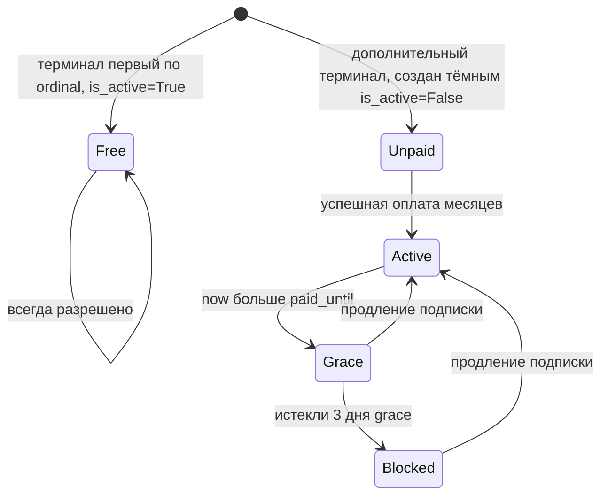

# План: переход биллинга L4Desk на модель «подписка на терминал» (Вариант A, ревизия 2)

Дата: 2026-10-03. Статус: на согласовании.

## 0. Ревизия концепта — что изменилось против ревизии 1

Перепроверка кода выявила рудименты и уточнила решения:

1. **Три параллельных платёжных контура в проекте** (не путать):
   - Легаси-лицензии меню киосков: `MenuBuilder/backend/app/services/billing.py` +
     `app/routers/billing.py` + таблица `licenses` + `app/services/payment_provider.py`
     (**только MockPaymentProvider**, реальной оплаты нет). Это другой продукт
     (лицензирование меню киосков). **Не трогаем, не мигрируем.**
   - `financial_core` (L4D-12): предоплаченный баланс + метринг + циклы. **Заменяется
     настоящим планом.**
   - ProcessingBackend `/api/licensebilling` — терминальный API лицензий меню. **Не трогаем.**
   - Реальный клиент YooKassa существует только в `financial_core/yookassa.py` — он
     переиспользуется.
2. **Механизм блокировки терминала** (ответ на вопрос «is_active=false или новый флаг
   leo4proxy/policy?»): см. раздел 3 — ни то, ни другое в v1; коммерческий гейт — на уровне
   сессий (entitlement), `Terminal.is_active` остаётся административным kill-switch.
3. **Миграций на удаление не делаем** — рудименты замораживаются маркерами в коде.
4. **Саморегистрация включается**: `l4desk_registration_enabled=true`.
5. **Лимит терминалов без оплаты: 3** (1 бесплатный + 2 демо).
6. Существующие платежи/балансы — тестовые, конвертация не выполняется.
7. Миграции l4desk/fin-таблиц выполняются в
   `ProcessingBackend/backend/alembic/versions/` (владелец Alembic — ProcessingBackend,
   образец: `027_add_l4desk_and_fin_ledger.py`).

## 1. Целевая бизнес-модель

| Правило | Семантика |
|---|---|
| Бесплатная зона | Первый по `ordinal` среди неудалённых терминал тенанта бесплатен навсегда, без лимитов времени |
| Лимит без оплаты | Максимум 3 неудалённых терминала у тенанта без активных платных подписок (1 free + 2 демо) |
| Демо-терминалы 2–3 | Создаются сразу «тёмными»: `runtime_terminal.is_active=False` + `transport_blocked_by_subscription=True` — в online не выходят до включения YooKassa и оплаты; серверный onboarding-флоу (запись, provisioning в IoT, выдача PIN) выполняется полностью |
| Платная зона | Каждый дополнительный терминал: цена/мес из конфигурации, покупка пакетами 1/3/6/12 мес; `paid_until = max(now, paid_until) + M мес` |
| Grace | 3 календарных дня после `paid_until` (терминальный, не цикловой) |
| Блокировка | После grace: новые сессии запрещены, активные гасятся через stop_outbox |
| Баланс/квоты | Упраздняются; сессия типа video/console больше не различается финансово |

Тенант с хотя бы одной активной платной подпиской может создавать терминалы сверх 3;
каждый новый сверх бесплатного стартует неоплаченным (заблокирован до оплаты).

## 2. Модель данных

- **ADD-миграция** (без drop): колонки `paid_until` (DateTime UTC, nullable) и
  `transport_blocked_by_subscription` (Boolean, default false) в `l4desk_terminals` +
  колонка `meta` (JSONB, nullable) в `fin_payments` и `fin_manual_payments`
  (назначение платежа: `{purpose: "subscription", items: [{terminal_id, months}]}`).
- Модель `L4DeskTerminal` в `MenuBuilder/backend/app/models_l4desk.py` получает `paid_until`.
- Все `fin_*` таблицы старой модели (profiles, cycles, usage_daily, monthly_charges,
  ledger, accounts, projections) **остаются без изменений** — заморожены.

## 3. Механизм блокировки (решение, скорректировано пользователем)

**Двухуровневая блокировка: сессии мгновенно + транспорт по истечении grace.**

1. **Entitlement (level 1, мгновенно)**: `evaluate_session_request` отказывает в новой
   видео/консоль-сессии с reason `subscription_required` (неоплачен) /
   `subscription_expired` (истёк grace). Активные сессии гасятся существующим
   `stop_outbox`.
2. **Транспорт (level 2, воркером)**: при переходе терминала в состояние blocked
   (истёк grace) subscription-воркер устанавливает `runtime_terminal.is_active = False`.
   Существующая цепочка делает остальное без изменений кода в ProcessingBackend:
   leo4proxy опрашивает `GET /api/leo4proxy/policy` каждые 10 минут и гасит
   MQTT/RTP (`stop_facts: ["terminal_inactive"]`), сохраняя поллинг, входящий HTTPS
   и служебные API. При продлении подписки воркер возвращает `is_active = True`.
3. **Защита от конфликта с административным отключением**: воркер отличает своё
   отключение от административного через флаг `transport_blocked_by_subscription`
   (ADD-колонка в `l4desk_terminals`). Правила:
   - Воркер выключает `is_active` только при переходе подписки в blocked и ставит флаг.
   - Воркер включает `is_active` обратно только если флаг установлен (т.е. отключение
     было подписочным), после чего сбрасывает флаг.
   - Терминал, деактивированный админом вручную (существующие deactivate/reactivate в
     `app/routers/billing.py`), никогда не авто-включается воркером.
   - Каждое переключение фиксируется audit-событием с correlation_id.
4. **Новый флаг/stop_fact leo4proxy** — не вводится: переиспользуется существующий
   `terminal_inactive`. Точка расширения `stop_facts` (код `subscription_blocked` для
   раздельной диагностики) остаётся задокументированной на будущее.
5. **Демо-терминалы 2–3 создаются «тёмными»**: `is_active=False` +
   `transport_blocked_by_subscription=True` сразу при создании. Терминал проходит
   серверный onboarding (запись, IoT-provisioning, PIN, выпуск сертификата —
   `get_current_terminal` не проверяет активность), но leo4proxy получает
   `mqtt_rtp_allowed=false` и терминал не выходит в online до оплаты.
   Пути активации `is_active=True` (все — только при установленном флаге, с очисткой
   флага и audit-событием):
   - успешная оплата подписки этого терминала (webhook/poll платежа или manual-выдача);
   - передача бесплатной льготы: если удалён terminal #1, новый первый по `ordinal`
     терминал становится бесплатным и активируется, даже если был создан «тёмным»;
   - административная активация суперюзером (штатный reactivate).

## 4. Изменения по модулям

### MenuBuilder/backend

| Модуль | Действие |
|---|---|
| `services/financial_core/entitlement.py` | Переписать: решение по терминалу из `paid_until` (free/active/grace/blocked); убрать квоты, циклы, таймзонную арифметику суток, `resolve_as_of`-хаки |
| `services/terminal_onboarding_service.py` | Лимит: не более 3 неудалённых терминалов для тенанта без активных подписок (409 `terminal_limit_reached`); вторичные терминалы создаются «тёмными» (`is_active=False` + флаг); `delete_terminal`: передача бесплатной льготы новому первому по `ordinal` терминалу с его активацией; логика передачи квоты удаляется |
| `services/financial_core/payments.py` | Переписать: из top-up в покупку месяцев (create order → YooKassa с metadata → webhook/poll → `paid_until += M мес` каждому терминалу + активация «тёмных» терминалов); идемпотентность и webhook-безопасность сохраняются |
| `services/financial_core/manual_payments.py` | Переориентировать: суперюзер выдаёт месяцы терминалам; storno отзывает выданные месяцы |
| `services/financial_core/worker.py` | Эволюция в subscription-воркер: sweep истечений (переходы в blocked → stop_outbox + `runtime_terminal.is_active=False` с флагом `transport_blocked_by_subscription`; продление → авто-возврат `is_active=True`), reminder-уведомления за 7/3/1 день до `paid_until` |
| `services/financial_core/notifications.py` | Переориентировать с циклов на напоминания об истечении подписки |
| `services/financial_core/stop_outbox.py` | Сохранить как есть (движок гашения сессий) |
| `services/remote_session_policy.py` | Включить enforcement по умолчанию, удалить shadow-mode ветку |
| `routers/finance.py` | Статус — по терминалам; новые эндпоинты корзины подписок; балансные эндпоинты пометить deprecated/frozen |
| `config.py` | `l4desk_registration_enabled=True`; `l4desk_billing_enabled` — гейт покупки (пока false: кнопки оплаты скрыты, вторичные терминалы blocked с `subscription_required`); цена терминал-месяца — настройка |
| **Заморозка** (`# FROZEN: legacy L4D-12 prepaid model, kept for history` в docstring): | `metering.py`, `metering_close_worker.py`, `cycles.py`, `posting.py`, `projection.py`, `reversal.py`, `reconciliation.py`, `accounts.py`, `tariffs.py`, `archive_service.py`, `hub_service.py` (финансовые части), `yookassa.py` — НЕ замораживается (переиспользуется) |

Легаси `services/billing.py` + `routers/billing.py` (лицензии меню) — не трогать вообще.

### ProcessingBackend/backend

- Только ADD-миграция Alembic (колонки из раздела 2). Код не меняется.

### MenuBuilder/frontend

- Корзина: «терминал × месяцы» (UX-паттерны из `docs/menu_bill-cart-ux-requirements.md`,
  но отдельный l4desk-subscription контур).
- Карточка терминала: `Бесплатный / Оплачен до D / Grace до D / Требует оплаты / Заблокирован`.
- Пока `l4desk_billing_enabled=false`: у вторичных терминалов бейдж «Демо: активация после
  включения оплат», кнопки покупки скрыты.
- Экран саморегистрации активируется (флаг уже поддержан в `routers/registration.py`).

## 5. Порядок реализации

1. ADD-миграция (ProcessingBackend alembic) + модели MenuBuilder.
2. Entitlement v2 (терминальный, без квот) + policy seam (enforcement on, shadow удалён).
3. Лимит 3 терминалов в onboarding + упрощение delete.
4. Платежи v2: покупка месяцев (YooKassa + manual), webhook → `paid_until`.
5. Subscription-воркер + переориентация notifications + stop_outbox wiring.
6. Заморозка рудиментов маркерами (без drop-миграций).
7. Фронтенд: корзина подписок, статусы терминалов, активация саморегистрации.
8. Тесты: переписать `tests/test_l4d_12_entitlement_grace_and_notifications.py` (без
   clock-hacks: paid_until задаётся данными); E2E корзины через playwright;
   `ruff check --fix`, `ruff format`, `pyright` по регламенту.
9. Документация: `docs/menu_bill-terminal-subscription.md` + регистрация в
   `docs/README.md`; CHANGELOG MenuBuilder.
10. Конфигурация production: `l4desk_registration_enabled=true` (через стандартный
    деплой-флоу, .env на сервере), `l4desk_billing_enabled` остаётся false до решения
    о включении YooKassa.

## 6. Принятые допущения и риски

- Все существующие платежи/балансы — тестовые: миграция данных не выполняется.
- Анти-абьюз саморегистрации: rate-limit и anti-enumeration уже реализованы в
  `services/registration_service.py`; лимит 3 терминала ограничивает ценность
  фейковых орг. Остаточный риск (много орг × 1 free-терминал) принят продуктово.
- Grace 3 дня сохранён из утверждённой ревизии 1.
- Цена терминал-месяца — в конфигурации (одна величина), `tariffs.py` заморожен.
