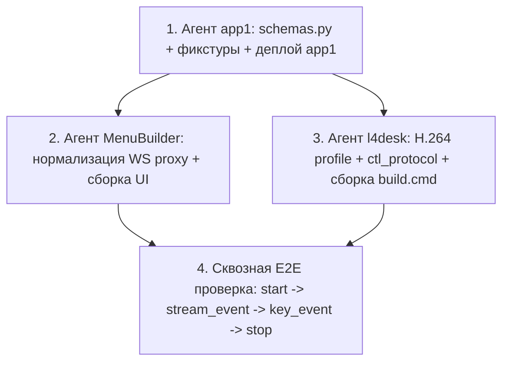

# Обзор и координация промптов разработки по стекам (E2E Remote Input & Video)

Данный документ описывает разделение задач первого этапа улучшений (синхронизация контрактов `ctl v1`, нормализация DTO ввода, согласование H.264-профиля кодирования) между независимыми агентами разработки по технологическим стекам.

> **Статус:** Этап 1 успешно выполнен во всех трех звеньях.
> **Шаг 2 (Route-before-Start & Autonomous Recovery):** Этапы 1, 2, 3 реализованы и задеплоены. См. [Обзор и координация промптов шага 2](prompt_step2_stacks_overview.md). Ожидает выполнения сквозная E2E-верификация (Этап 4).

---

## 1. Состав стеков и изолированные промпты

| Стек / Репозиторий | Роль и технология | Документ промпта | Ключевая ответственность |
|---|---|---|---|
| **`iot-rpc-rest-app` (`app1`)**<br>`D:\work\iot.leo4.ru\iot-rpc-rest-app` | Senior Python Backend<br>(Python 3.14, FastAPI, RabbitMQ, MQTT) | [`prompt_agent_iot_rpc_rest_app.md`](prompt_agent_iot_rpc_rest_app.md) | Источник контракта: расширение `CtlStreamEvent` (поддержка `sn`), поддержка `key_event`/`key`, контрактные фикстуры `pytest`, деплой `app1`. |
| **`MenuBuilder` (BFF + UI)**<br>`D:\repo\platerra\Public\etranprocessing` | Senior Full-Stack<br>(Python 3.14 FastAPI + React 19 / TS) | [`prompt_agent_menubuilder.md`](prompt_agent_menubuilder.md) | BFF WS-прокси: нормализация `key` → `key_event`, обогащение `desktop_id`/`stream_instance_id`, передача координат мыши `0..65535`, сборка UI и деплой. |
| **`tools/l4desk`**<br>`D:\repo\platerra\Public\etranprocessing` | Senior Windows / C Systems<br>(C / Win32, MSVC `/MT`, x86 + x64) | [`prompt_agent_tools_l4desk.md`](prompt_agent_tools_l4desk.md) | Терминальный агент: фиксация `-profile:v baseline -level 3.1` в FFmpeg, валидация `key_event` и `stream_event`, локальная сборка `build.cmd` **без перепаковки suite**. |

---

## 2. Ограничения и границы ответственности

1. **Безопасность на данном этапе не рассматривается**:
   Криптографическая привязка сертификата к SN в медиатуннеле, fail-closed ревокация viewer в Janus и ужесточение ACL вынесены в последующие этапы.
2. **Tools suite не перепаковывается**:
   По прямому указанию пользователя агент `tools/l4desk` не запускает `pack_zip.cmd`, не модифицирует `tools/dist`, `tools.zip` и инсталлятор `l4install`. Выполняется только сборка конкретного бинарника `l4desk` через `build.cmd all`.
3. **Медиаконтур `l4media` не требует изменений**:
   Медиавход Nginx, `l4media-ingress` и `l4media-janus` работают по протоколу L4RTP/1 и WebRTC. Команды управления и события `ctl v1` идут через отдельный контур RabbitMQ / MQTT, поэтому изменений в `l4media` на данном этапе не требуется.

---

## 3. Рекомендуемый порядок выполнения работ



1. **Этап 1: `iot-rpc-rest-app` (`app1`)**
   Разрешает прием `sn` в `CtlStreamEvent` и делает серверную валидацию толерантной к форматам входящих сообщений. Добавляет фикстуры и деплоит обновленный `app1`.
2. **Этап 2: `MenuBuilder` (Backend + Frontend)**
   Приводит WS-прокси к контракту `key_event`, обогащает сообщения контекстом активной lease, проверяет UI и обновляет сборку фронтенда.
3. **Этап 3: `tools/l4desk`**
   Явно закрепляет профиль H.264 Baseline 3.1 в вызове FFmpeg, собирает чистые бинарники `l4desk.exe` под x86 и x64.
4. **Этап 4: Верификация**
   Проверка сквозного прохождения команд мыши/клавиатуры и обновления статусов без 422 ошибок Pydantic.

---

## 4. Эталонные фикстуры контракта `ctl v1`

### 4.1 Terminal → Server (`dev/<SN>/ctl`)

- **`stream_event`**:
  ```json
  {
    "v": 1,
    "type": "stream_event",
    "sn": "170200000001",
    "stream_instance_id": "a1b2c3d4-e5f6-7a8b-9c0d-1e2f3a4b5c6d",
    "state": "running",
    "reason": "Process started successfully",
    "timestamp": "2026-09-11T12:00:00Z"
  }
  ```

- **`ack` (успешный запуск)**:
  ```json
  {
    "v": 1,
    "type": "ack",
    "command_id": "c1d2e3f4-5a6b-7c8d-9e0f-1a2b3c4d5e6f",
    "sn": "170200000001",
    "result": "started",
    "stream_instance_id": "a1b2c3d4-e5f6-7a8b-9c0d-1e2f3a4b5c6d",
    "state": "running"
  }
  ```

- **`nack`**:
  ```json
  {
    "v": 1,
    "type": "nack",
    "command_id": "c1d2e3f4-5a6b-7c8d-9e0f-1a2b3c4d5e6f",
    "sn": "170200000001",
    "code": "desktop_mismatch",
    "message": "Target desktop is not active in current stream"
  }
  ```

### 4.2 Server → Terminal (`srv/<SN>/ctl`)

- **`stream_start`**:
  ```json
  {
    "v": 1,
    "type": "stream_start",
    "command_id": "c1d2e3f4-5a6b-7c8d-9e0f-1a2b3c4d5e6f",
    "lease_id": "b2c3d4e5-f6a7-8b9c-0d1e-2f3a4b5c6d7e",
    "sn": "170200000001",
    "mode": "desktop",
    "source_id": "disp:3f8a12bc",
    "profile": "default",
    "stream_instance_id": "a1b2c3d4-e5f6-7a8b-9c0d-1e2f3a4b5c6d",
    "issued_at_ms": 1789128000000,
    "expires_at_ms": 1789128015000
  }
  ```

- **`key_event`**:
  ```json
  {
    "v": 1,
    "type": "key_event",
    "command_id": "d2e3f4a5-6b7c-8d9e-0f1a-2b3c4d5e6f7a",
    "lease_id": "b2c3d4e5-f6a7-8b9c-0d1e-2f3a4b5c6d7e",
    "sn": "170200000001",
    "desktop_id": "disp:3f8a12bc",
    "stream_instance_id": "a1b2c3d4-e5f6-7a8b-9c0d-1e2f3a4b5c6d",
    "kind": "press",
    "vk": 13,
    "text": "\r",
    "issued_at_ms": 1789128000000,
    "expires_at_ms": 1789128005000
  }
  ```

- **`pointer_move`**:
  ```json
  {
    "v": 1,
    "type": "pointer_move",
    "command_id": "e3f4a5b6-7c8d-9e0f-1a2b-3c4d5e6f7a8b",
    "lease_id": "b2c3d4e5-f6a7-8b9c-0d1e-2f3a4b5c6d7e",
    "sn": "170200000001",
    "desktop_id": "disp:3f8a12bc",
    "stream_instance_id": "a1b2c3d4-e5f6-7a8b-9c0d-1e2f3a4b5c6d",
    "x": 32768,
    "y": 16384,
    "issued_at_ms": 1789128000000,
    "expires_at_ms": 1789128005000
  }
  ```
