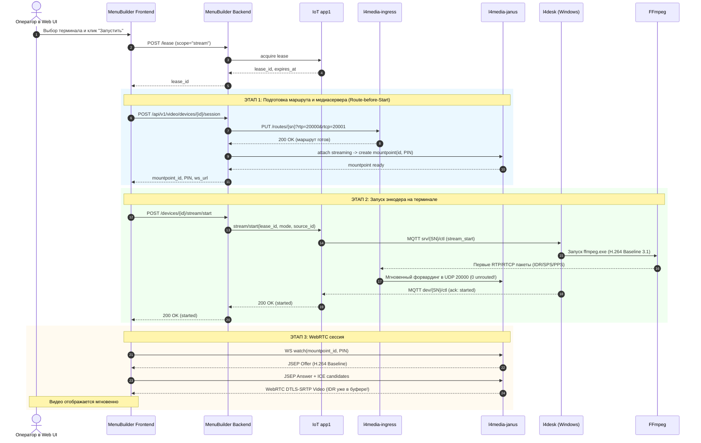
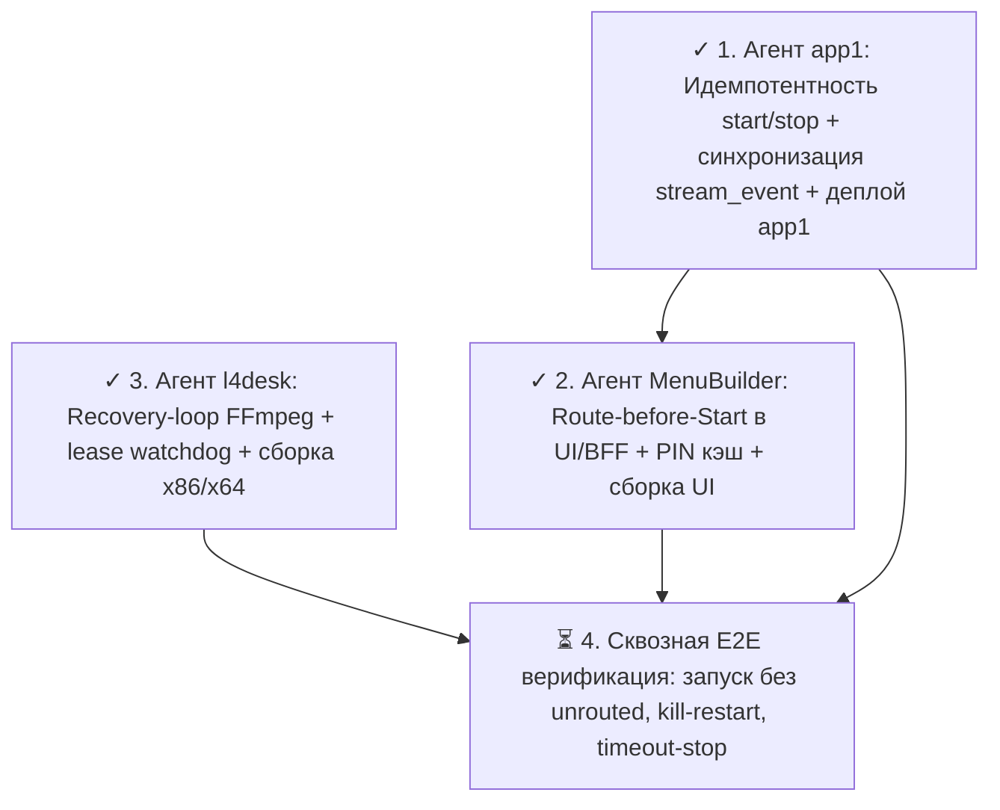

# Обзор и координация промптов шага 2 (Route-before-Start & Autonomous Recovery)

Данный документ описывает координацию задач **второго этапа улучшений** архитектуры видеонаблюдения и удаленного управления (Video & Remote Desktop E2E).

Цель этапа — устранить задержку старта WebRTC-видео (до 2 с ожидания ключевого кадра из-за дропа первых пакетов в `unrouted`), замкнуть локальный цикл самовосстановления супервизора FFmpeg на терминале и обеспечить идемпотентность управления потоком на бэкенде.

> 📌 **Текущий статус выполнения Шага 2:**
> - ✓ **Этап 1 (`iot-rpc-rest-app` / `app1`): ВЫПОЛНЕНО И ЗАДЕПЛОЕНО.** Идемпотентность `stream_start`/`stream_stop`, синхронизация `stream_event` с lease и presence, деплой `app1` на прод-сервер `87.242.100.34`.
> - ✓ **Этап 2 (`MenuBuilder` BFF + UI): ВЫПОЛНЕНО И ЗАДЕПЛОЕНО.** Паттерн Route-before-Start, привязка PIN mountpoint к `lease_id`/`stream_instance_id`, идемпотентность mountpoint, безопасный откат при сбоях, сборка и доставка UI, перезапуск `menubuilder-backend` на `87.242.100.34`.
> - ✓ **Этап 3 (`tools/l4desk`): ВЫПОЛНЕНО В КОДЕ.** Замкнутый recovery-loop супервизора FFmpeg с backoff/jitter и лимитом 5/10 мин, локальный fail-closed watchdog аренды с 5 с grace и `input_release_all()`, чистая сборка бинарников x86 и x64.
> - ⏳ **Этап 4 (Сквозная E2E-верификация): ПОКА НЕ ВЫПОЛНЕН** (ожидает стендовой проверки на прод-сервере и терминале).

---

## 1. Состав стеков и изолированные промпты шага 2

| Стек / Репозиторий | Роль и технология | Документ промпта | Ключевая ответственность |
|---|---|---|---|
| **`MenuBuilder` (BFF + UI)**<br>`D:\repo\platerra\Public\etranprocessing` | Senior Full-Stack<br>(Python 3.14 FastAPI + React 19 / TS) | [`prompt_step2_agent_menubuilder.md`](prompt_step2_agent_menubuilder.md) | **Route-before-Start:** подготовка `createVideoSession` (настройка `PUT /routes/{sn}` и Janus mountpoint) **до** вызова `startDeviceStream`. Привязка PIN mountpoint к `lease_id`, исключение пересоздания PIN, обработка отката ошибок, сборка и деплой. |
| **`tools/l4desk`**<br>`D:\repo\platerra\Public\etranprocessing` | Senior Windows / C Systems<br>(C / Win32, MSVC `/MT`, x86 + x64) | [`prompt_step2_agent_tools_l4desk.md`](prompt_step2_agent_tools_l4desk.md) | **Recovery-Loop & Fail-Closed:** замкнутый цикл автоперезапуска FFmpeg при сбоях/stall (лимит 5 попыток за 10 мин, backoff + jitter), локальный watchdog аренды (fail-closed через 5 с grace, сброс зажатых клавиш). Сборка `build.cmd all` **без перепаковки suite**. |
| **`iot-rpc-rest-app` (`app1`)**<br>`D:\work\iot.leo4.ru\iot-rpc-rest-app` | Senior Python Backend<br>(Python 3.14, FastAPI, RabbitMQ, MQTT) | [`prompt_step2_agent_iot_rpc_rest_app.md`](prompt_step2_agent_iot_rpc_rest_app.md) | **Idempotency & Lifecycle:** идемпотентный `stream_start` (`already_running`) и `stream_stop` (`already_stopped`), очистка `stream_instance_id` в lease при терминальных `stream_event(failed/stopped)`, тесты и деплой `app1`. |

---

## 2. Архитектурная диаграмма: Порядок Route-before-Start

### 2.1 Сравнение старого и нового порядка

```
СТАРЫЙ ПОРЯДОК (Потеря первых кадров):
UI: startDeviceStream ──────> app1 ───> l4desk ───> FFmpeg запущен
                                                        │ (RTP over L4RTP/1)
                                                        ▼
l4media-ingress: маршрута нет! ──> [DROP: unrouted_packets++]
                                                        │
UI (спустя 200..800 мс): createVideoSession ────────────┼──> Ingress route & Janus MP созданы
                                                        │
Janus: ждет следующего IDR-кадра (до 2 секунд!) ◄───────┘
Результат: задержка 1.5–2 с, черный экран при первом открытии.

НОВЫЙ ПОРЯДОК: Route-before-Start (Мгновенный старт):
1. UI: createVideoSession ──> Ingress route PUT /routes/{sn} + Janus Mountpoint созданы!
2. UI: startDeviceStream ───> app1 ───> l4desk ───> FFmpeg запущен
                                                        │ (RTP over L4RTP/1)
                                                        ▼
l4media-ingress: маршрут уже готов! ─────────────────> Janus Mountpoint принимает 1-й пакет!
                                                        │
Janus: сразу отдает первый IDR/SPS/PPS в WebRTC ──────> Браузер немедленно начинает показ!
Результат: мгновенный старт (sub-second glass-to-glass), 0 unrouted пакетов.
```

### 2.2 Детальный Sequence Diagram



---

## 3. Порядок выполнения работ и актуальный статус



1. **✓ Этап 1: `iot-rpc-rest-app` (`app1`) [ВЫПОЛНЕНО И ЗАДЕПЛОЕНО]**
   Реализована идемпотентность `stream_start` (`already_running`) и `stream_stop` (`already_stopped`). Обеспечена очистка `stream_instance_id` в active lease при терминальных `stream_event(failed/stopped)` и рассылка `WsStreamState`. Выполнены тесты и деплой на прод-сервер `87.242.100.34`.
2. **✓ Этап 2: `MenuBuilder` (Backend + Frontend) [ВЫПОЛНЕНО И ЗАДЕПЛОЕНО]**
   Реализован порядок Route-before-Start (`createVideoSession` вызывается до `startDeviceStream`). PIN mountpoint привязан к `lease_id`/`stream_instance_id`, Janus mountpoint переиспользуется идемпотентно, реализован безопасный откат при ошибках старта. Фронтенд собран и доставлен в `/home/user1/MenuBuilder/frontend/dist/`, бэкенд перезапущен на `87.242.100.34`.
3. **✓ Этап 3: `tools/l4desk` [ВЫПОЛНЕНО В КОДЕ]**
   В `ffmpeg_supervisor.c` замкнут recovery-loop (перезапуск упавшего FFmpeg с экспоненциальным backoff, jitter и лимитом 5 попыток за 10 мин, отмена при stop) и локальный fail-closed watchdog аренды (принудительный останов при отсутствии продления аренды > 5 с, сброс всех зажатых клавиш и кнопок мыши через `input_release_all()`). Собраны чистые бинарники `l4desk.exe` под x86 и x64.
4. **⏳ Этап 4: Сквозная верификация [ПОКА НЕ ВЫПОЛНЕН]**
   - Проверка старта видео: в статистике `l4media-ingress` (`GET /stats`) `unrouted_packets` равен 0.
   - Проверка задержки: видео начинает воспроизводиться менее чем за 1 секунду после клика "Запустить".
   - Проверка устойчивости: принудительное завершение `ffmpeg.exe` в диспетчере задач терминала приводит к автоматическому перезапуску агентом `l4desk` с сохранением WebRTC-потока.
   - Проверка безопасности: при закрытии вкладки браузера через 5 секунд терминал автоматически глушит FFmpeg и освобождает клавиши.

---

## 4. Ограничения и правила развертывания

1. **Tools suite не перепаковывать**:
   - Никаких вызовов `pack_zip.cmd` и изменений `tools/dist/`.
   - Только сборка `tools/l4desk/build.cmd all`.
2. **Безопасность среды развертывания**:
   - Деплой сервисов `app1` и `menubuilder-backend` выполняется на прод-сервер `87.242.100.34` (пользователь `user1`, ключ `d:\.ssh\id_ed25519`).
   - Все удаленные SSH-команды из Windows PowerShell выполняются с флагом `-n`.
   - Сервер `176.108.247.249` удален и не используется.
